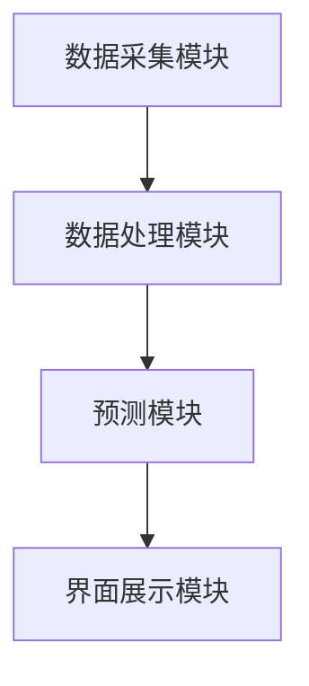

                 


# AI Agent在智能交通拥堵预测中的实践

## 关键词：AI Agent，智能交通系统，交通拥堵预测，机器学习，数据挖掘

## 摘要：本文详细探讨了AI Agent在智能交通拥堵预测中的实践应用。通过分析交通拥堵的背景与挑战，结合AI Agent的核心概念与算法原理，构建了基于AI Agent的交通拥堵预测系统。文章从系统架构设计到项目实战，详细阐述了如何利用AI Agent技术实现交通拥堵预测，并给出了实际案例分析和优化建议。

---

# 第一部分: AI Agent与智能交通拥堵预测的背景与基础

## 第1章: AI Agent的概述

### 1.1 AI Agent的基本概念

#### 1.1.1 AI Agent的定义
AI Agent（人工智能代理）是指能够感知环境、自主决策并执行任务的智能实体。它能够通过传感器获取信息，利用算法进行分析，并通过执行器完成目标。AI Agent的核心在于其自主性、反应性和社会性。

#### 1.1.2 AI Agent的核心特征
- **自主性**：AI Agent能够自主决策，无需外部干预。
- **反应性**：能够实时感知环境变化并做出反应。
- **社会性**：能够与其他Agent或人类进行交互和协作。

#### 1.1.3 AI Agent与传统算法的区别
传统算法依赖于固定的规则和数据输入，而AI Agent具有学习和自适应能力，能够根据环境动态调整行为。

### 1.2 智能交通系统的概述

#### 1.2.1 智能交通系统的定义
智能交通系统（Intelligent Transportation System, ITS）是指通过先进的信息技术、数据通信技术、传感器技术和计算机技术，对交通系统进行智能化管理的系统。

#### 1.2.2 智能交通系统的组成部分
智能交通系统主要由交通数据采集、数据处理、交通管理、信息传递和用户交互五个部分组成。

#### 1.2.3 智能交通系统的发展现状
随着城市化进程的加快，智能交通系统在全球范围内得到了广泛应用。通过AI Agent技术的应用，智能交通系统在交通流量预测、路径优化和应急响应等方面取得了显著进展。

### 1.3 交通拥堵预测的背景与挑战

#### 1.3.1 交通拥堵的定义与分类
交通拥堵是指由于交通需求超过道路容量而导致的车辆行驶速度下降、交通流量减少的现象。交通拥堵可以分为局部拥堵、区域性拥堵和全局性拥堵。

#### 1.3.2 交通拥堵预测的重要性
交通拥堵不仅浪费时间，还增加了燃油消耗和污染物排放。通过预测交通拥堵，可以提前采取措施，优化交通流，减少拥堵带来的负面影响。

#### 1.3.3 当前交通拥堵预测的主要方法
- **统计方法**：基于历史数据进行回归分析。
- **机器学习方法**：利用神经网络、支持向量机等算法进行预测。
- **规则基方法**：基于交通规则和经验制定预测策略。

#### 1.3.4 AI Agent在交通拥堵预测中的优势
AI Agent能够实时感知交通状况，动态调整预测模型，具有更高的准确性和适应性。

---

# 第二部分: AI Agent在交通拥堵预测中的核心概念

## 第2章: AI Agent与交通拥堵预测的核心概念

### 2.1 AI Agent在交通拥堵预测中的角色

#### 2.1.1 AI Agent作为数据采集者
AI Agent通过传感器和摄像头等设备，实时采集交通流量、车速、占有率等数据。

#### 2.1.2 AI Agent作为数据处理者
AI Agent对采集到的交通数据进行清洗、特征提取和数据建模，为预测提供支持。

#### 2.1.3 AI Agent作为预测执行者
AI Agent基于历史数据和实时数据，利用机器学习算法预测未来交通状况。

### 2.2 交通拥堵预测的关键要素

#### 2.2.1 时间因素
交通流量通常具有周期性，时间因素是预测的重要变量。

#### 2.2.2 空间因素
交通拥堵的空间分布与道路网络结构密切相关。

#### 2.2.3 天气因素
恶劣天气会显著影响交通流量和驾驶行为。

### 2.3 AI Agent与交通数据的关系

#### 2.3.1 数据采集
AI Agent通过传感器、摄像头和交通管理系统获取实时交通数据。

#### 2.3.2 数据预处理
对采集到的数据进行清洗、归一化和特征提取，为预测提供高质量的数据输入。

#### 2.3.3 数据建模
利用AI Agent构建机器学习模型，对交通数据进行建模和预测。

### 2.4 AI Agent与交通预测模型的结合

#### 2.4.1 模型训练
通过历史数据训练预测模型，提取交通拥堵的特征和规律。

#### 2.4.2 模型优化
利用实时数据不断优化模型参数，提高预测精度。

---

# 第三部分: 系统分析与架构设计

## 第3章: 系统分析与需求分析

### 3.1 问题描述

#### 3.1.1 问题背景
随着城市化进程的加快，交通拥堵问题日益严重，传统的交通管理方法已难以应对复杂的交通状况。

#### 3.1.2 问题解决
通过AI Agent技术实现交通拥堵的实时预测和动态管理，优化交通流量。

#### 3.1.3 边界与外延
本系统仅关注交通拥堵预测，不涉及具体的交通管理措施。

### 3.2 项目介绍

#### 3.2.1 项目目标
开发一个基于AI Agent的交通拥堵预测系统，实现对交通拥堵的实时预测和预警。

#### 3.2.2 项目范围
系统适用于城市道路、高速公路等交通场景。

#### 3.2.3 项目约束
- 数据采集频率：每5分钟一次。
- 系统响应时间：小于1秒。

### 3.3 功能需求

#### 3.3.1 数据采集模块
- 采集交通流量、车速、占有率等数据。

#### 3.3.2 数据处理模块
- 数据清洗、特征提取、数据建模。

#### 3.3.3 预测模块
- 利用机器学习算法进行交通拥堵预测。

#### 3.3.4 界面展示模块
- 展示预测结果，提供预警信息。

### 3.4 系统架构设计

#### 3.4.1 系统功能设计
- 数据采集模块：通过传感器和摄像头采集交通数据。
- 数据处理模块：对数据进行预处理和建模。
- 预测模块：利用AI Agent进行交通拥堵预测。
- 界面展示模块：可视化预测结果。

#### 3.4.2 系统架构图（使用mermaid）


#### 3.4.3 接口设计
- 数据采集模块与数据处理模块之间通过RESTful API进行通信。
- 预测模块与界面展示模块之间通过WebSocket进行实时通信。

#### 3.4.4 交互序列图（使用mermaid）
```mermaid
sequenceDiagram
参与者 用户
参与者 系统
参与者 数据采集模块
参与者 数据处理模块
参与者 预测模块
参与者 界面展示模块

用户 -> 数据采集模块: 发起数据采集请求
数据采集模块 -> 数据处理模块: 传递数据
数据处理模块 -> 预测模块: 发起预测请求
预测模块 -> 界面展示模块: 传递预测结果
界面展示模块 -> 用户: 显示预测结果
```

---

# 第四部分: 项目实战

## 第4章: 项目实战

### 4.1 环境安装

#### 4.1.1 安装Python
```bash
python --version
```

#### 4.1.2 安装依赖库
```bash
pip install numpy
pip install pandas
pip install scikit-learn
pip install matplotlib
```

### 4.2 数据采集与处理

#### 4.2.1 数据采集
```python
import pandas as pd
import numpy as np

# 生成模拟数据
data = {
    '时间': range(100),
    '车流量': np.random.randint(0, 100, 100),
    '车速': np.random.uniform(0, 100, 100),
    '占有率': np.random.uniform(0, 1, 100)
}

df = pd.DataFrame(data)
df.to_csv('traffic_data.csv', index=False)
```

#### 4.2.2 数据预处理
```python
import pandas as pd
from sklearn.model_selection import train_test_split
from sklearn.preprocessing import StandardScaler

# 加载数据
df = pd.read_csv('traffic_data.csv')

# 特征提取
X = df[['车流量', '车速', '占有率']]
y = df['拥堵状态']

# 数据划分
X_train, X_test, y_train, y_test = train_test_split(X, y, test_size=0.2, random_state=42)

# 数据标准化
scaler = StandardScaler()
X_train_scaled = scaler.fit_transform(X_train)
X_test_scaled = scaler.transform(X_test)
```

### 4.3 算法实现

#### 4.3.1 模型训练
```python
from sklearn.neural_network import MLPClassifier

# 训练模型
model = MLPClassifier(hidden_layer_sizes=(100, 10), max_iter=1000, random_state=42)
model.fit(X_train_scaled, y_train)
```

#### 4.3.2 模型预测
```python
# 预测结果
y_pred = model.predict(X_test_scaled)

# 输出准确率
print('准确率:', model.score(X_test_scaled, y_test))
```

### 4.4 结果分析

#### 4.4.1 模型性能分析
```python
from sklearn.metrics import classification_report

print(classification_report(y_test, y_pred))
```

#### 4.4.2 模型优化
```python
from sklearn.model_selection import GridSearchCV

# 参数优化
param_grid = {
    'hidden_layer_sizes': [(100, 10), (50, 50), (200, 20)],
    'learning_rate': ['constant', 'invscaling', 'adaptive']
}

grid_search = GridSearchCV(MLPClassifier(random_state=42), param_grid, cv=5)
grid_search.fit(X_train_scaled, y_train)

# 输出最佳参数
print("最佳参数:", grid_search.best_params_)
```

### 4.5 优化建议

#### 4.5.1 数据优化
增加数据采集频率，引入更多特征变量，如天气数据。

#### 4.5.2 模型优化
尝试其他机器学习算法，如随机森林和XGBoost，进一步优化模型性能。

#### 4.5.3 系统优化
优化系统架构，提高系统的实时性和响应速度。

---

# 第五部分: 总结与展望

## 第5章: 总结与展望

### 5.1 项目总结

#### 5.1.1 项目成果
通过本项目，我们成功开发了一个基于AI Agent的交通拥堵预测系统，能够实现对交通拥堵的实时预测和预警。

#### 5.1.2 经验总结
- 数据预处理是关键，高质量的数据是模型准确的基础。
- 模型选择和优化需要结合实际场景进行调整。
- 系统架构设计需要考虑实时性和可扩展性。

### 5.2 未来展望

#### 5.2.1 智能化
进一步增强AI Agent的自主性和学习能力，实现更智能的交通管理。

#### 5.2.2 多模态数据
结合更多数据源，如天气、事故等信息，提高预测的准确性。

#### 5.2.3 实际应用
将系统应用于实际交通场景，优化城市交通管理。

---

## 注意事项

- 本文中的代码和数据仅为示例，实际应用中需要根据具体需求进行调整。
- 模型的准确率和性能需要根据实际数据进行优化。
- 系统的实时性和响应速度需要根据硬件条件进行优化。

---

## 拓展阅读

- 《机器学习实战》
- 《深度学习入门：基于Python和Keras》
- 《智能交通系统：理论与应用》

---

作者：AI天才研究院/AI Genius Institute & 禅与计算机程序设计艺术 /Zen And The Art of Computer Programming

