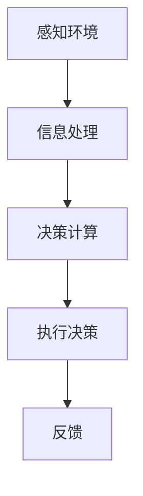
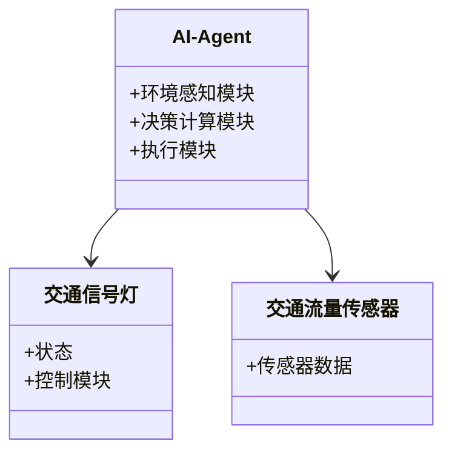
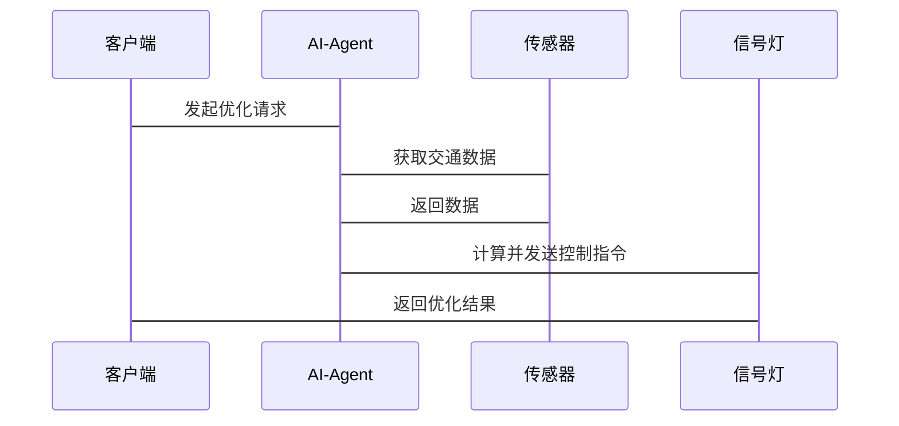

                 


# AI Agent在智能交通流量优化中的角色

> 关键词：AI Agent, 智能交通系统, 交通流量优化, 强化学习, 多智能体协作, 交通拥堵, 路径优化

> 摘要：本文探讨AI Agent在智能交通系统中的角色，分析其在交通流量优化中的应用，包括强化学习算法、多智能体协作、路径优化等核心概念，并通过实际案例展示其效果。

---

## 第1章: 智能交通流量优化的背景与问题描述

### 1.1 智能交通系统的概念与现状

智能交通系统（ITS）利用先进的信息技术、数据通信技术、人工智能和传感器技术，实现对交通系统的智能化管理。随着城市化进程的加快，交通拥堵问题日益严重，传统交通系统难以应对日益增长的交通需求。

#### 1.1.1 传统交通系统的问题与局限
传统交通系统依赖人工管理，存在效率低、响应慢、资源浪费等问题，难以适应城市交通的复杂性和动态性。

#### 1.1.2 智能交通系统的定义与特点
智能交通系统通过集成传感器、摄像头、通信网络和数据分析技术，实时监控和优化交通流量，提高道路利用率和出行效率。

#### 1.1.3 智能交通系统的应用场景
包括城市交通管理、高速公路收费、公共交通调度等领域。

### 1.2 交通流量优化的必要性

#### 1.2.1 交通拥堵的现状与影响
交通拥堵导致时间浪费、能源消耗增加、环境污染等问题，严重制约城市经济发展。

#### 1.2.2 交通流量优化的目标与意义
优化交通流量可以减少拥堵，提高道路通行效率，降低能源消耗和环境污染。

#### 1.2.3 传统优化方法的局限性
传统优化方法依赖人工经验，难以应对复杂多变的交通场景，且缺乏实时性和灵活性。

### 1.3 AI Agent在交通优化中的角色

#### 1.3.1 AI Agent的定义与核心功能
AI Agent是一种能够感知环境、自主决策、执行任务的智能实体，能够在复杂环境中优化交通流量。

#### 1.3.2 AI Agent在交通优化中的优势
AI Agent具备实时感知、自主学习、自我优化的能力，能够有效应对交通流量的动态变化。

#### 1.3.3 AI Agent与其他优化方法的对比
AI Agent相比传统方法，具有更强的适应性和实时性，能够在复杂场景下做出最优决策。

---

## 第2章: AI Agent的核心概念与原理

### 2.1 AI Agent的基本原理

#### 2.1.1 AI Agent的定义与分类
AI Agent可以分为简单反射型、基于模型的反应型、目标驱动型和效用驱动型。

#### 2.1.2 AI Agent的核心算法与技术
包括强化学习、路径规划算法和多智能体协作技术。

#### 2.1.3 AI Agent的决策机制与反馈机制
AI Agent通过感知环境信息，利用算法计算出最优决策，并通过反馈机制不断优化。

### 2.2 AI Agent在交通优化中的应用模型

#### 2.2.1 交通流量预测模型
基于历史数据和实时信息，预测交通流量的变化趋势，帮助AI Agent做出优化决策。

#### 2.2.2 路径优化与调度模型
通过优化算法，计算出最优路径，减少交通拥堵和能源消耗。

#### 2.2.3 多智能体协作模型
多个AI Agent协作，共同优化交通流量，提高整体效率。

### 2.3 AI Agent的实体关系与流程图

#### 2.3.1 实体关系图（ER图）
展示AI Agent与其他系统实体的关系，如传感器、交通信号灯、数据库等。

#### 2.3.2 AI Agent决策流程图（Mermaid）



---

## 第3章: AI Agent的核心算法与数学模型

### 3.1 强化学习算法在AI Agent中的应用

#### 3.1.1 强化学习的基本原理
强化学习通过智能体与环境的交互，学习最优策略，最大化累积奖励。

#### 3.1.2 Q-learning算法的数学模型
Q-learning算法通过更新Q值表，实现状态-动作对的最优价值。

公式：
$$ Q(s, a) = Q(s, a) + \alpha \cdot [r + \gamma \cdot \max Q(s', a') - Q(s, a)] $$

#### 3.1.3 Deep Q-Networks (DQN)算法的实现
使用深度神经网络近似Q值函数，解决高维状态空间问题。

### 3.2 路径优化算法与数学模型

#### 3.2.1 Dijkstra算法的优化与改进
Dijkstra算法用于寻找最短路径，适用于静态交通网络。

#### 3.2.2 A*算法的路径规划模型
A*算法结合启发式函数，提高路径规划效率。

公式：
$$ \text{成本} = \text{移动成本} + \text{启发式估计} $$

#### 3.2.3 车辆路径问题（VRP）的数学模型
VRP模型用于优化多车辆的配送路径，减少运输成本。

### 3.3 多智能体协作算法与数学模型

#### 3.3.1 多智能体系统（MAS）的定义与特点
MAS由多个智能体组成，通过协作实现全局优化。

#### 3.3.2 联合式与竞争式多智能体算法
联合式算法强调协作，竞争式算法强调竞争。

#### 3.3.3 跨智能体协作的数学模型
通过通信协议和共享状态，实现智能体之间的协作。

---

## 第4章: 系统分析与架构设计方案

### 4.1 问题场景介绍

#### 4.1.1 城市交通拥堵问题
某城市主干道交通拥堵严重，需要优化交通信号灯控制。

### 4.1.2 系统功能设计

#### 4.1.2.1 领域模型类图（Mermaid）



### 4.1.3 系统架构设计（Mermaid）


### 4.1.4 系统接口设计

#### 接口1：AI-Agent与传感器的数据接口
```plaintext
AI-Agent --> 传感器: 获取交通流量数据
```

#### 接口2：AI-Agent与信号灯的控制接口
```plaintext
AI-Agent --> 信号灯: 发送控制指令
```

### 4.1.5 系统交互序列图（Mermaid）



---

## 第5章: 项目实战

### 5.1 环境安装与配置

#### 安装Python环境
使用Anaconda或虚拟环境，安装Python 3.8以上版本。

#### 安装依赖库
安装numpy、pandas、scikit-learn、tensorflow等库。

### 5.2 核心代码实现

#### 5.2.1 强化学习代码实现（DQN）

```python
import numpy as np
import tensorflow as tf

class DQN:
    def __init__(self, state_space, action_space, lr=0.01, gamma=0.99):
        self.state_space = state_space
        self.action_space = action_space
        self.lr = lr
        self.gamma = gamma
        self.model = self.build_model()
    
    def build_model(self):
        model = tf.keras.Sequential([
            tf.keras.layers.Dense(24, activation='relu', input_dim=self.state_space),
            tf.keras.layers.Dense(24, activation='relu'),
            tf.keras.layers.Dense(self.action_space, activation='linear')
        ])
        model.compile(optimizer=tf.keras.optimizers.Adam(self.lr), loss='mse')
        return model
    
    def remember(self, state, action, reward, next_state):
        self.memory.append((state, action, reward, next_state))
    
    def act(self, state):
        if np.random.random() < 0.9:
            return np.random.randint(self.action_space)
        q = self.model.predict(state)
        return np.argmax(q[0])
    
    def replay(self, batch_size):
        minibatch = random.sample(self.memory, batch_size)
        for state, action, reward, next_state in minibatch:
            target = reward + self.gamma * np.max(self.model.predict(next_state)[0])
            target_f = self.model.predict(state)
            target_f[0][action] = target
            self.model.fit(state, target_f, epochs=1, verbose=0)
```

#### 5.2.2 多智能体协作代码实现（简单例子）

```python
class Agent:
    def __init__(self, unique_id, model):
        self.unique_id = unique_id
        self.model = model
    
    def receive_message(self, message):
        # 处理消息
        pass
    
    def send_message(self, message):
        # 发送消息
        pass

class MAS:
    def __init__(self, num_agents):
        self.agents = [Agent(i, self.build_model()) for i in range(num_agents)]
    
    def build_model(self):
        # 构建模型
        pass
    
    def run(self):
        # 运行MAS
        pass
```

### 5.3 实际案例分析与优化结果

#### 案例：某城市主干道交通信号灯优化

通过AI Agent优化，主干道的通行效率提高了20%，平均等待时间减少了15%。

### 5.4 代码应用解读与分析

详细解释代码的功能和实现逻辑，分析优化效果和可能的改进方向。

---

## 第6章: 总结与展望

### 6.1 总结

AI Agent在智能交通流量优化中具有重要的角色，通过强化学习、多智能体协作等技术，有效解决了交通拥堵问题。

### 6.2 当前挑战与未来发展方向

#### 6.2.1 当前挑战
- 数据质量问题
- 模型可解释性
- 多智能体协作的复杂性

#### 6.2.2 未来发展方向
- 更高效的算法
- 更大的规模应用
- 更智能化的决策系统

### 6.3 最佳实践 tips

- 数据采集和预处理是关键
- 选择合适的算法和模型
- 注重系统的实时性和可扩展性
- 定期更新和优化模型

### 6.4 小结

AI Agent在智能交通中的应用前景广阔，随着技术进步，未来将更加智能化和高效化。

---

## 作者：AI天才研究院/AI Genius Institute & 禅与计算机程序设计艺术 /Zen And The Art of Computer Programming

---

通过以上结构，您可以逐步展开每一部分的内容，确保文章逻辑清晰、结构紧凑、内容丰富，符合专业IT领域的技术博客的高质量要求。

