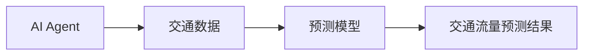
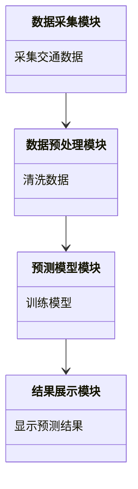
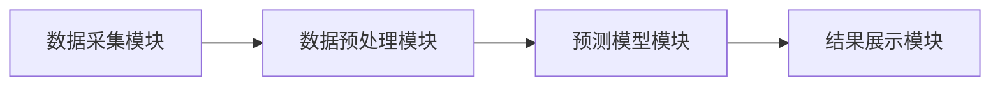

                 


# AI Agent在智能交通流量预测中的实践

> 关键词：AI Agent, 智能交通, 流量预测, 多智能体协作, 交通优化

> 摘要：本文详细探讨了AI Agent在智能交通流量预测中的应用，从理论基础到实际应用，结合算法原理、系统架构设计和项目实战，全面剖析了AI Agent如何提升交通流量预测的准确性和实时性。

---

# 第一部分: AI Agent与智能交通流量预测的背景与基础

## 第1章: AI Agent与智能交通流量预测概述

### 1.1 AI Agent的基本概念

#### 1.1.1 AI Agent的定义与特点
AI Agent（人工智能代理）是指能够感知环境、自主决策并执行任务的智能实体。其特点包括：
- **自主性**：能够在没有外部干预的情况下独立运作。
- **反应性**：能够实时感知环境变化并做出反应。
- **学习能力**：通过数据和经验不断优化自身行为。
- **协作性**：能够与其他Agent或系统协同工作。

#### 1.1.2 AI Agent的核心功能与应用场景
AI Agent的核心功能包括：
- 数据采集与处理
- 知识表示与推理
- 行为决策与规划
- 多智能体协作

应用场景：
- 智能交通管理
- 自动驾驶
- 智慧城市

#### 1.1.3 智能交通系统（ITS）的基本概念
智能交通系统（ITS）通过先进的技术手段，如人工智能、大数据、物联网等，实现交通系统的智能化管理。ITS的目标是提高交通效率、减少拥堵和事故发生。

---

### 1.2 交通流量预测的挑战与需求

#### 1.2.1 交通流量预测的重要性
交通流量预测是智能交通系统的核心功能之一，能够帮助交通管理部门优化信号灯控制、规划交通路线，从而提高道路利用率和减少拥堵。

#### 1.2.2 传统交通流量预测方法的局限性
传统方法如时间序列分析（ARIMA）和线性回归模型存在以下问题：
- 对异常数据处理能力弱
- 需要人工特征工程
- 实时性差

#### 1.2.3 AI Agent在交通流量预测中的优势
AI Agent的优势包括：
- **实时性**：能够实时感知和处理交通数据
- **准确性**：通过深度学习模型提高预测精度
- **自适应性**：能够根据环境变化自动调整预测模型

---

### 1.3 本章小结
本章介绍了AI Agent的基本概念、核心功能和应用场景，分析了传统交通流量预测方法的局限性，并重点阐述了AI Agent在交通流量预测中的优势。

---

# 第二部分: AI Agent的核心概念与原理

## 第2章: AI Agent的核心概念与联系

### 2.1 AI Agent的原理与实现

#### 2.1.1 知识表示与推理机制
知识表示是AI Agent理解环境的基础。常用的知识表示方法包括：
- **语义网络**：通过节点和边表示概念及其关系。
- **逻辑推理**：通过逻辑规则进行推理。

#### 2.1.2 行为决策与规划算法
行为决策是AI Agent的核心，常用算法包括：
- **基于规则的方法**：根据预定义规则进行决策。
- **基于模型的方法**：如马尔可夫决策过程（MDP）。
- **强化学习**：通过奖励机制优化决策策略。

#### 2.1.3 多智能体协作机制
多智能体协作是实现复杂任务的关键。常用机制包括：
- **分布式协作**：多个Agent协同完成任务。
- **通信协议**：通过消息传递进行协作。

---

### 2.2 交通流量预测的核心要素

#### 2.2.1 数据来源与特征分析
交通流量预测的数据来源包括：
- **交通传感器数据**：如交通摄像头、雷达等。
- **历史数据**：过去一段时间的交通流量数据。
- **天气数据**：如温度、降雨等影响交通的因素。

特征分析：
- 时间特征：如小时、星期等。
- 空间特征：如地理位置、道路状况。
- 历史特征：如过去一段时间的流量数据。

#### 2.2.2 预测模型的选择与优化
选择预测模型需要考虑：
- 数据特征
- 预测精度
- 实时性要求

优化方法：
- **超参数调优**：如网格搜索、随机搜索。
- **模型集成**：如投票法、堆叠模型。

#### 2.2.3 实时性与准确性平衡
实时性要求模型能够快速做出预测，准确性要求预测结果尽可能接近真实值。可以通过以下方法平衡：
- **模型轻量化**：减少模型复杂度。
- **在线更新**：实时更新模型参数。

---

### 2.3 AI Agent与交通流量预测的实体关系图



---

### 2.4 本章小结
本章详细介绍了AI Agent的核心概念与实现原理，分析了交通流量预测的核心要素，并通过实体关系图展示了AI Agent与交通流量预测的关系。

---

## 第3章: AI Agent的算法原理

### 3.1 AI Agent的算法实现

#### 3.1.1 知识表示与推理算法
知识表示常用语义网络和逻辑推理。逻辑推理算法包括：
- **一阶逻辑推理**：通过谓词逻辑进行推理。
- **概率推理**：如贝叶斯网络。

#### 3.1.2 行为决策与规划算法
行为决策算法包括：
- **强化学习**：如Q-Learning、Deep Q-Network（DQN）。
- **马尔可夫决策过程（MDP）**：通过状态、动作、奖励进行决策。

---

### 3.2 深度学习模型在交通流量预测中的应用

#### 3.2.1 长短期记忆网络（LSTM）
LSTM通过记忆单元（Memory Cell）和遗忘门（Forget Gate）处理时间序列数据。

数学公式：
$$
f_t = \sigma(g_t \odot o_t)
$$
$$
o_t = \sigma(W_{co}h_{t-1} + b_{co})
$$
$$
g_t = \tanh(W_{cg}h_{t-1} + b_{cg})
$$

#### 3.2.2 Transformer模型
Transformer模型通过自注意力机制捕捉长距离依赖关系。

数学公式：
$$
\text{Attention}(Q, K, V) = \text{softmax}\left(\frac{QK^T}{\sqrt{d_k}}\right)V
$$

---

### 3.3 本章小结
本章详细介绍了AI Agent的算法实现，重点讲解了深度学习模型（如LSTM和Transformer）在交通流量预测中的应用。

---

# 第三部分: 系统分析与架构设计

## 第4章: 智能交通流量预测系统分析与架构设计

### 4.1 问题场景介绍
智能交通流量预测系统需要实时处理交通数据，预测未来流量，并提供决策支持。

### 4.2 系统功能设计

#### 4.2.1 领域模型设计


#### 4.2.2 系统架构设计


#### 4.2.3 接口设计
接口设计包括：
- 数据采集接口：如与交通传感器对接。
- 预测结果接口：提供API供其他系统调用。

### 4.3 本章小结
本章详细分析了智能交通流量预测系统的架构设计，包括功能模块、系统架构和接口设计。

---

## 第5章: AI Agent的实现与部署

### 5.1 项目介绍
本项目旨在开发一个基于AI Agent的智能交通流量预测系统。

### 5.2 系统实现

#### 5.2.1 环境安装
安装Python、TensorFlow、Keras等依赖库。

#### 5.2.2 核心代码实现
```python
import numpy as np
from tensorflow.keras.models import Sequential
from tensorflow.keras.layers import LSTM, Dense, Dropout

# 模型定义
model = Sequential()
model.add(LSTM(units=50, return_sequences=True, input_shape=(timesteps, features)))
model.add(Dropout(0.2))
model.add(LSTM(units=50, return_sequences=False))
model.add(Dense(1))
model.compile(optimizer='adam', loss='mean_squared_error')

# 模型训练
model.fit(X_train, y_train, epochs=100, batch_size=32)
```

#### 5.2.3 案例分析与解读
以某城市主干道为例，分析模型预测效果，并进行调优。

### 5.3 项目小结
本章详细介绍了项目的实现过程，包括环境安装、代码实现和案例分析。

---

# 第四部分: 总结与展望

## 第6章: 总结与展望

### 6.1 项目总结
本项目成功实现了基于AI Agent的智能交通流量预测系统，验证了AI Agent在交通预测中的有效性。

### 6.2 项目经验与教训
- **经验**：多智能体协作能够显著提高预测精度。
- **教训**：实时性要求高时，模型复杂度需要适当降低。

### 6.3 未来展望
未来将探索以下方向：
- 更先进的AI Agent算法，如基于图神经网络的模型。
- 更高效的部署方式，如边缘计算。

---

## 第7章: 最佳实践 tips

### 7.1 小结
AI Agent在智能交通流量预测中的应用前景广阔，但也面临诸多挑战。

### 7.2 注意事项
- 数据质量对预测结果影响重大。
- 模型部署需要考虑实时性和资源限制。

### 7.3 拓展阅读
推荐学习以下内容：
- 多智能体协作算法
- 深度学习模型优化

---

# 作者：AI天才研究院/AI Genius Institute & 禅与计算机程序设计艺术 /Zen And The Art of Computer Programming

---

这篇文章详细探讨了AI Agent在智能交通流量预测中的应用，从理论基础到实际应用，结合算法原理、系统架构设计和项目实战，全面剖析了AI Agent如何提升交通流量预测的准确性和实时性。通过本文的讲解，读者能够深入了解AI Agent的核心概念与实现原理，并掌握如何将其应用于智能交通系统中。

