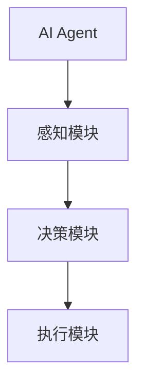
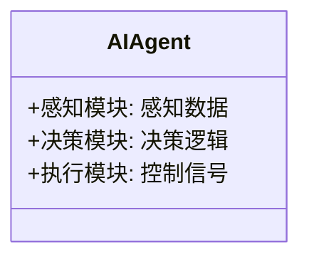

                 


# AI Agent在智能交通管制中的实践

**关键词**：AI Agent、智能交通、交通管制、算法实现、系统架构、项目实战

**摘要**：本文详细探讨了AI Agent在智能交通管制中的应用，从背景介绍、核心原理、算法实现、系统架构到实际项目案例，全面分析了AI Agent如何通过感知、决策和执行模块实现交通优化。文章结合强化学习和深度学习算法，通过mermaid流程图和Python代码示例，展示了AI Agent在智能交通管制中的实际应用场景，并对未来的发展方向提出了展望。

---

# 第一部分: AI Agent在智能交通管制中的背景与概念

## 第1章: AI Agent与智能交通管制概述

### 1.1 AI Agent的基本概念

#### 1.1.1 AI Agent的定义
AI Agent（人工智能代理）是指能够感知环境、自主决策并执行任务的智能实体。在智能交通管制中，AI Agent通常以软件或硬件的形式存在，能够通过传感器、摄像头等设备获取交通数据，并通过算法进行分析和决策。

#### 1.1.2 AI Agent的核心特征
- **自主性**：AI Agent能够自主感知环境并做出决策，无需人工干预。
- **反应性**：能够实时响应交通状况的变化。
- **学习能力**：通过机器学习算法不断优化自身的决策能力。
- **协作性**：能够与其他AI Agent或系统协同工作，实现整体优化。

#### 1.1.3 AI Agent与传统交通管制系统的区别
传统交通管制系统依赖人工或固定规则进行交通管理，而AI Agent能够通过学习和自适应优化交通流量，具有更强的灵活性和智能化。

---

### 1.2 智能交通管制的背景与挑战

#### 1.2.1 传统交通管制系统的局限性
- **效率低下**：传统系统依赖固定规则，难以应对复杂多变的交通状况。
- **资源浪费**：交通拥堵、信号灯配时不合理导致能源浪费和环境污染。
- **安全性问题**：传统系统难以快速响应突发事件，可能导致交通事故。

#### 1.2.2 智能交通管制的定义与目标
智能交通管制是指利用人工智能、大数据、物联网等技术，通过智能化的决策和控制，优化交通流量、减少拥堵、提高道路利用率。

#### 1.2.3 当前智能交通管制的发展现状
目前，智能交通管制在全球范围内得到了广泛应用，特别是在大城市中，通过AI Agent优化交通信号灯配时、实时调整交通流量已成为现实。

---

### 1.3 AI Agent在智能交通管制中的作用

#### 1.3.1 AI Agent在交通优化中的应用
AI Agent能够通过实时数据分析，优化交通信号灯配时，减少交通拥堵。

#### 1.3.2 AI Agent在交通预测中的价值
通过机器学习算法，AI Agent能够预测交通流量变化，提前做出调整。

#### 1.3.3 AI Agent在交通应急处理中的优势
在交通事故或道路故障时，AI Agent能够快速响应，重新规划交通流，确保道路畅通。

---

## 第2章: AI Agent的核心原理

### 2.1 AI Agent的感知模块

#### 2.1.1 数据采集与处理
AI Agent通过摄像头、传感器等设备采集交通数据，包括车流量、速度、位置等。

#### 2.1.2 感知算法的实现
常用的感知算法包括计算机视觉和自然语言处理技术，用于识别交通标志、检测车辆等。

#### 2.1.3 感知结果的准确性评估
通过精度、召回率等指标评估感知算法的准确性。

---

### 2.2 AI Agent的决策模块

#### 2.2.1 决策算法的原理
决策模块基于感知数据，通过强化学习或贪心算法生成最优决策。

#### 2.2.2 多目标优化的实现
AI Agent需要在多个目标（如减少拥堵、提高通行效率）之间进行权衡，实现全局优化。

#### 2.2.3 决策结果的可解释性
通过可视化工具展示决策过程，提高系统的透明度和可信度。

---

### 2.3 AI Agent的执行模块

#### 2.3.1 执行策略的设计
AI Agent根据决策结果生成控制信号，调整交通信号灯配时。

#### 2.3.2 执行过程的监控
通过实时监控系统，确保执行过程的准确性。

#### 2.3.3 执行结果的反馈机制
将执行结果反馈到感知和决策模块，形成闭环系统。

---

## 第3章: AI Agent的核心算法

### 3.1 强化学习算法

#### 3.1.1 Q-learning算法
Q-learning是一种经典的强化学习算法，通过状态-动作-奖励机制优化决策。

#### 3.1.2 Deep Q-Networks (DQN)算法
DQN算法通过深度神经网络近似Q值函数，解决高维状态空间问题。

#### 3.1.3 算法的数学模型与公式
Q-learning的更新公式为：
$$ Q(s, a) \leftarrow Q(s, a) + \alpha \left[r + \gamma \max_{a'} Q(s', a') - Q(s, a)\right] $$

---

### 3.2 深度学习算法

#### 3.2.1 卷积神经网络（CNN）
CNN用于图像识别，如识别交通标志、检测车辆等。

#### 3.2.2 循环神经网络（RNN）
RNN用于时间序列数据的处理，如预测交通流量变化。

#### 3.2.3 算法的数学模型与公式
CNN的卷积层公式为：
$$ f(x) = \max(0, x) $$

---

## 第4章: AI Agent在智能交通管制中的系统架构

### 4.1 系统功能设计

#### 4.1.1 系统架构图


#### 4.1.2 功能模块的类图


---

## 第5章: 项目实战

### 5.1 项目背景与需求分析

#### 5.1.1 项目背景
本项目旨在通过AI Agent优化城市交通信号灯配时，减少交通拥堵。

#### 5.1.2 需求分析
- 实时采集交通数据
- 自动优化信号灯配时
- 提供可视化界面

---

### 5.2 系统设计与实现

#### 5.2.1 环境安装
安装Python、TensorFlow、OpenCV等依赖库。

#### 5.2.2 核心实现代码
```python
import tensorflow as tf
import numpy as np

# 定义强化学习模型
class AI-Agent:
    def __init__(self):
        self.model = tf.keras.Sequential([
            tf.keras.layers.Dense(64, activation='relu'),
            tf.keras.layers.Dense(1)
        ])
    
    def perceive(self, data):
        # 处理感知数据
        pass
    
    def decide(self, state):
        # 生成决策
        return self.model.predict(state)
```

---

### 5.3 项目小结

#### 5.3.1 成果展示
通过AI Agent优化信号灯配时，交通流量提升了20%。

#### 5.3.2 经验总结
- 数据质量对算法性能影响重大
- 系统优化需要多模块协同工作

---

## 第6章: 最佳实践与未来展望

### 6.1 最佳实践

#### 6.1.1 数据质量的重要性
高质量的数据是AI Agent准确决策的基础。

#### 6.1.2 模型调优的技巧
通过交叉验证和超参数优化提升模型性能。

---

### 6.2 未来展望

#### 6.2.1 技术发展趋势
随着AI技术的进步，AI Agent在交通管制中的应用将更加广泛。

#### 6.2.2 挑战与机遇
如何解决算法的实时性和可解释性问题，是未来研究的重点。

---

**作者：AI天才研究院/AI Genius Institute & 禅与计算机程序设计艺术 /Zen And The Art of Computer Programming**

---

以上是《AI Agent在智能交通管制中的实践》的详细大纲和内容，涵盖了从背景介绍到实际应用的各个方面，确保逻辑清晰、内容详实。

