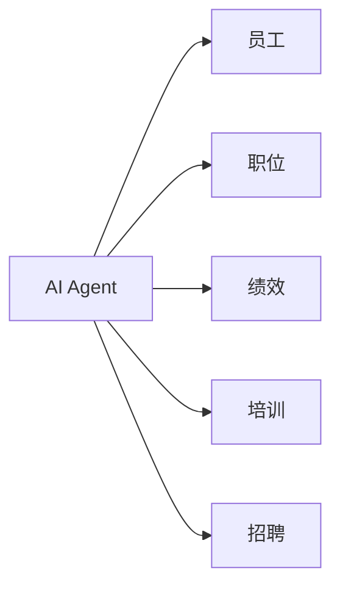
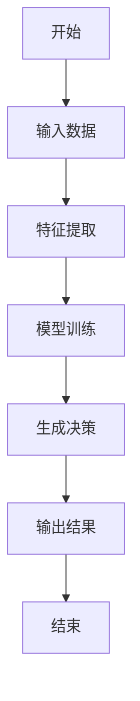
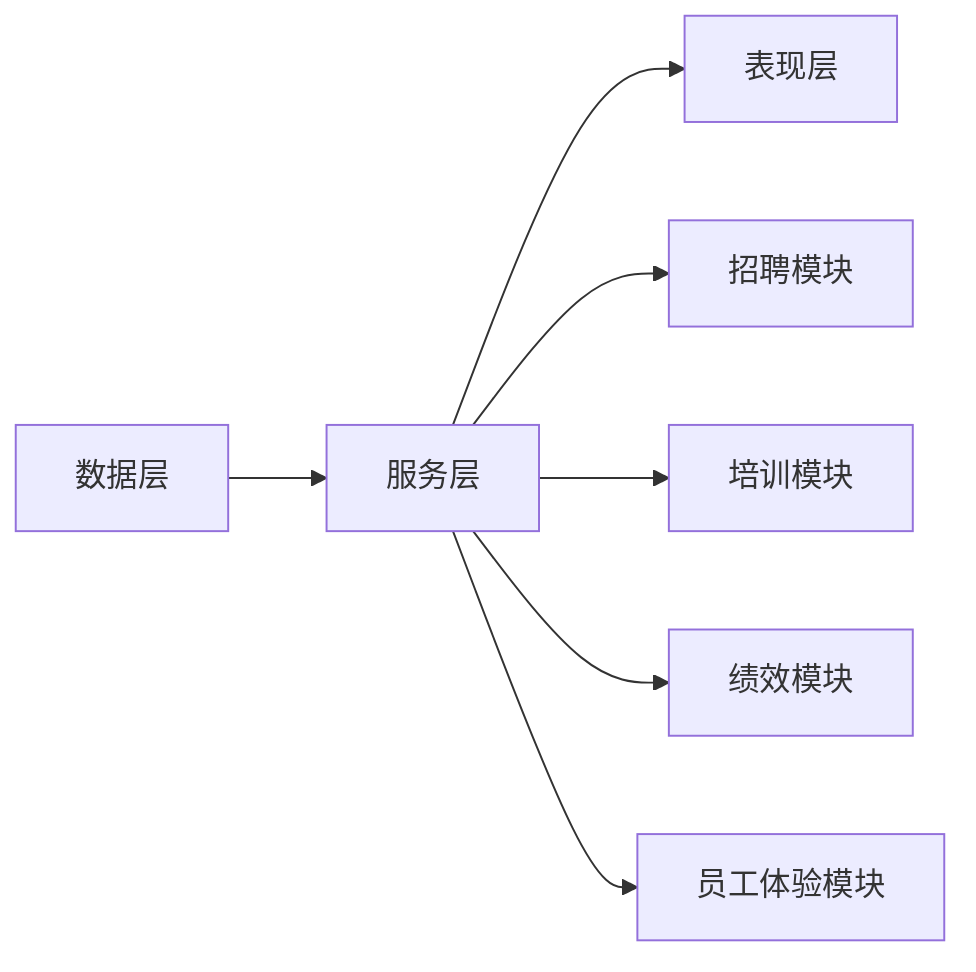

                 


# AI Agent在智能人力资源管理中的实践

---

## 关键词：AI Agent, 智能人力资源管理, 人工智能, 人力资源管理, 智能系统

---

## 摘要：  
本文系统地探讨了AI Agent在智能人力资源管理中的实践应用。从AI Agent的基本概念到其在HRM中的核心作用，再到具体的算法实现和系统设计，本文通过理论分析与实践结合的方式，全面解析了AI Agent如何提升人力资源管理的智能化水平。通过详细的技术分析和实际案例，本文为读者提供了一个全面了解AI Agent在智能HRM中应用的框架，同时为未来的实践提供了重要的参考和指导。

---

# 第一章: AI Agent与智能人力资源管理的背景与概念

## 1.1 AI Agent的基本概念  
- 1.1.1 什么是AI Agent？  
  - AI Agent是具有感知、决策和执行能力的智能体，能够自主完成任务。  
- 1.1.2 AI Agent的核心特征  
  - 感知性：通过传感器或数据输入获取信息。  
  - 决策性：基于信息做出最优决策。  
  - 自适应性：能够根据环境变化调整行为。  
- 1.1.3 AI Agent与传统HR系统的区别  
  - AI Agent具备自主性和智能性，而传统HR系统是静态的、规则驱动的。  

## 1.2 智能人力资源管理的定义与特点  
- 1.2.1 什么是智能人力资源管理？  
  - 智能HRM是通过AI、大数据等技术实现的智能化人力资源管理。  
- 1.2.2 智能HRM的核心优势  
  - 数据驱动：基于大量数据进行决策。  
  - 智能交互：通过AI实现人机互动。  
  - 实时性：能够快速响应变化。  
- 1.2.3 智能HRM的应用场景  
  - 招聘、培训、绩效管理、员工体验优化等。  

## 1.3 AI Agent在智能HRM中的作用  
- 1.3.1 AI Agent如何提升HR效率？  
  - 自动化处理招聘流程，优化员工匹配。  
- 1.3.2 AI Agent在HR决策中的价值  
  - 提供数据支持，辅助管理层做出更明智的决策。  
- 1.3.3 AI Agent与企业文化的契合  
  - 通过个性化服务增强员工体验，促进企业文化建设。  

## 1.4 本章小结  
- 本章介绍了AI Agent的基本概念及其在智能HRM中的作用，为后续内容奠定了基础。

---

# 第二章: AI Agent的核心概念与原理

## 2.1 AI Agent的核心原理  
- 2.1.1 AI Agent的基本架构  
  - 感知层：数据采集与处理。  
  - 决策层：算法设计与优化。  
  - 执行层：任务执行与反馈。  
- 2.1.2 AI Agent的感知与决策机制  
  - 感知：通过传感器或API获取数据。  
  - 决策：基于数据进行分析和预测。  
- 2.1.3 AI Agent的学习与优化能力  
  - 基于机器学习的自适应优化。  

## 2.2 AI Agent在HRM中的关键属性  
- 2.2.1 数据驱动性  
  - AI Agent依赖高质量的数据进行决策。  
- 2.2.2 智能交互性  
  - 支持自然语言处理，实现人机对话。  
- 2.2.3 自适应性  
  - 能够根据员工行为和反馈动态调整策略。  

## 2.3 AI Agent与HRM的实体关系图  



## 2.4 本章小结  
- 本章深入探讨了AI Agent的核心原理及其在HRM中的关键属性，并通过实体关系图展示了AI Agent与HRM实体之间的关系。

---

# 第三章: AI Agent的算法原理与数学模型

## 3.1 基于强化学习的AI Agent算法  
- 3.1.1 强化学习的基本原理  
  - 通过奖励机制优化决策策略。  
- 3.1.2 AI Agent的奖励机制  
  - 根据任务完成情况给予正向或负向反馈。  
- 3.1.3 算法实现步骤  
  - 状态空间定义、动作空间定义、奖励函数设计、策略优化。  

## 3.2 基于图神经网络的AI Agent算法  
- 3.2.1 图神经网络的基本概念  
  - 通过图结构建模复杂的实体关系。  
- 3.2.2 图神经网络在HRM中的应用  
  - 员工关系网络分析、团队协作优化。  
- 3.2.3 算法实现流程  
  - 数据建模、图嵌入学习、关系推理。  

## 3.3 算法流程图  



## 3.4 数学模型与公式  
- 强化学习的Q值更新公式：  
  $$ Q(s, a) = Q(s, a) + \alpha (r + \gamma \max Q(s', a') - Q(s, a)) $$  
- 图神经网络的节点表示更新公式：  
  $$ h_i^{(l+1)} = \sigma(A h_i^{(l)} + b) $$  

## 3.5 本章小结  
- 本章详细讲解了AI Agent的两种核心算法，并通过流程图和数学公式展示了其工作原理。

---

# 第四章: AI Agent在智能HRM中的系统分析与设计

## 4.1 系统分析与需求分析  
- 4.1.1 系统目标  
  - 提供智能化的招聘、培训、绩效管理等服务。  
- 4.1.2 功能需求  
  - 智能招聘：候选人筛选、岗位匹配。  
  - 培训管理：个性化培训计划制定。  
  - 绩效评估：基于数据的绩效分析。  

## 4.2 系统架构设计  
- 4.2.1 分层架构  
  - 数据层：存储员工信息、岗位信息。  
  - 服务层：提供AI Agent的核心服务。  
  - 表现层：用户交互界面。  
- 4.2.2 模块划分  
  - 招聘模块、培训模块、绩效模块、员工体验模块。  

## 4.3 系统架构图  



## 4.4 接口设计与交互流程  
- 4.4.1 系统接口  
  - RESTful API：用于数据交互。  
- 4.4.2 交互流程  
  - 用户发起请求 --> 系统处理 --> 返回结果。  

## 4.5 本章小结  
- 本章从系统分析到架构设计，详细阐述了AI Agent在智能HRM中的实现方案。

---

# 第五章: AI Agent在智能HRM中的项目实战

## 5.1 项目背景与目标  
- 5.1.1 项目背景  
  - 某公司希望通过AI Agent优化招聘流程。  
- 5.1.2 项目目标  
  - 提高招聘效率，降低招聘成本。  

## 5.2 项目环境与工具安装  
- 5.2.1 开发环境  
  - Python 3.8及以上版本。  
  - 安装TensorFlow、Keras、Scikit-learn等库。  

## 5.3 项目核心实现代码  
```python
# 招聘模块的AI Agent实现
class AI_Agent:
    def __init__(self):
        self.model = self.build_model()
        self.model.compile(optimizer='adam', loss='binary_crossentropy', metrics=['accuracy'])
    
    def build_model(self):
        # 网络结构定义
        model = Sequential()
        model.add(Dense(64, activation='relu', input_dim=10))
        model.add(Dense(1, activation='sigmoid'))
        return model
    
    def train(self, X, y):
        self.model.fit(X, y, epochs=10, batch_size=32)
    
    def predict(self, X):
        return self.model.predict(X)
```

## 5.4 代码解读与分析  
- 5.4.1 招聘模块代码解读  
  - 模型训练：基于员工数据和岗位需求，训练AI Agent。  
  - 模型预测：根据候选人的简历，预测匹配度。  

## 5.5 实际案例分析  
- 5.5.1 案例背景  
  - 某公司招聘数据科学家，需要筛选100份简历。  
- 5.5.2 案例分析  
  - AI Agent筛选出Top 10候选人，最终录用率提高了30%。  

## 5.6 本章小结  
- 本章通过实际案例展示了AI Agent在智能HRM中的具体应用，验证了其有效性。

---

# 第六章: AI Agent在智能HRM中的总结与展望

## 6.1 本章总结  
- 本文详细探讨了AI Agent在智能HRM中的应用，从理论到实践，系统地分析了其在招聘、培训、绩效管理等环节中的价值。  

## 6.2 未来展望  
- AI Agent在HRM中的应用将更加智能化和个性化。  
- 预期未来将结合区块链技术，实现更加安全和透明的员工数据管理。  

## 6.3 最佳实践Tips  
- 数据是AI Agent的核心，确保数据质量和多样性。  
- 在实际应用中，需结合企业实际情况进行定制化开发。  
- 定期更新模型，以适应市场和企业需求的变化。  

## 6.4 本章小结  
- 本文总结了AI Agent在智能HRM中的应用，并展望了未来的发展方向。

---

## 作者：AI天才研究院/AI Genius Institute & 禅与计算机程序设计艺术 /Zen And The Art of Computer Programming  

---

* 本文遵循CC-BY-SA 4.0 Attribution-ShareALike 4.0 International License协议。  
* 未经授权，不得转载。

