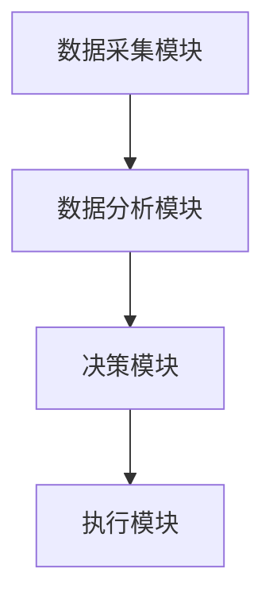
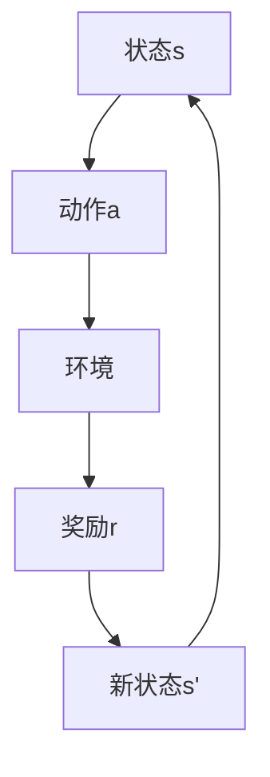
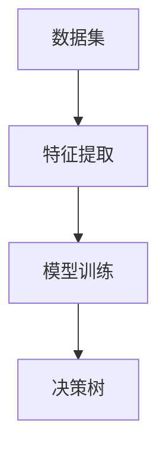

                 


# AI Agent在智能体育训练中的实践

> 关键词：AI Agent，智能体育训练，人工智能，体育科技，机器学习，算法优化，体育数据

> 摘要：随着人工智能技术的快速发展，AI Agent在智能体育训练中的应用越来越广泛。本文将从AI Agent的基本概念出发，详细探讨其在体育训练中的应用场景、核心算法、系统架构以及实际案例。通过理论与实践相结合的方式，深入分析AI Agent如何提升体育训练的效率和效果，为体育科技的发展提供新的思路和解决方案。

---

# 第一部分: AI Agent在智能体育训练中的背景与概念

## 第1章: AI Agent与智能体育训练概述

### 1.1 AI Agent的基本概念
#### 1.1.1 什么是AI Agent
AI Agent（人工智能代理）是一种能够感知环境、做出决策并执行动作的智能实体。它能够通过传感器获取数据，利用算法进行分析，并根据结果采取相应的行动。

$$
\text{AI Agent} = \text{感知} \times \text{决策} \times \text{执行}
$$

#### 1.1.2 AI Agent的核心特征
- **自主性**：能够在没有外部干预的情况下自主运行。
- **反应性**：能够实时感知环境变化并做出反应。
- **目标导向**：基于目标驱动行为，优化决策过程。
- **学习能力**：能够通过数据和经验不断优化自身性能。

#### 1.1.3 AI Agent与传统AI的区别
| 特性 | 传统AI | AI Agent |
|------|--------|----------|
| 输入 | 固定数据 | 实时数据 |
| 输出 | 预测或分类 | 行动或决策 |
| 应用 | 静态场景 | 动态场景 |

### 1.2 智能体育训练的定义与特点
#### 1.2.1 智能体育训练的定义
智能体育训练是指利用人工智能、大数据、物联网等技术，通过实时采集和分析运动数据，优化训练计划和提升训练效果的过程。

#### 1.2.2 智能体育训练的核心特点
- **数据驱动**：依赖于传感器和设备采集的实时数据。
- **个性化**：根据个体特点制定个性化训练计划。
- **实时反馈**：能够实时提供训练反馈和建议。
- **智能优化**：通过算法优化训练效果。

#### 1.2.3 智能体育训练与传统体育训练的区别
| 特性 | 传统体育训练 | 智能体育训练 |
|------|--------------|--------------|
| 数据来源 | 主观经验 | 实时传感器数据 |
| 训练计划 | 固定 | 动态优化 |
| 反馈机制 | 延时 | 实时 |

### 1.3 AI Agent在智能体育训练中的作用
#### 1.3.1 AI Agent如何提升体育训练效率
通过实时分析运动数据，AI Agent能够快速识别训练中的问题并提出优化建议，从而提升训练效率。

#### 1.3.2 AI Agent在个性化训练中的应用
AI Agent可以根据运动员的个体特点（如体能、技术、心理状态）制定个性化的训练计划。

#### 1.3.3 AI Agent在团队协作中的作用
AI Agent可以分析团队配合中的问题，提出战术优化建议，帮助团队提升整体表现。

---

## 第2章: AI Agent在体育训练中的应用场景

### 2.1 个性化训练计划的制定
#### 2.1.1 数据采集与分析
AI Agent通过传感器采集运动员的生理数据（如心率、体位、动作姿态）和运动数据（如速度、加速度），利用机器学习算法进行分析。

#### 2.1.2 训练计划的生成与优化
基于分析结果，AI Agent可以生成个性化的训练计划，并根据训练效果动态调整计划。

#### 2.1.3 训练效果的实时反馈
AI Agent可以实时监测训练效果，及时提供反馈和建议，帮助运动员快速改进技术动作。

### 2.2 实时运动分析与反馈
#### 2.2.1 运动姿态的实时监测
AI Agent可以通过计算机视觉技术实时监测运动员的姿态，识别动作中的问题。

#### 2.2.2 技术动作的智能分析
通过深度学习算法，AI Agent可以分析技术动作的细节，识别潜在的伤病风险。

#### 2.2.3 实时反馈与纠正建议
AI Agent可以实时提供纠正建议，帮助运动员调整动作，避免受伤。

### 2.3 团队协作与战术优化
#### 2.3.1 团队配合的智能分析
AI Agent可以通过分析团队成员的位置和动作，识别配合中的问题。

#### 2.3.2 战术方案的优化建议
基于分析结果，AI Agent可以提出战术优化建议，帮助团队提升竞技表现。

#### 2.3.3 竞技表现的预测与提升
AI Agent可以预测比赛结果，提出针对性的训练方案，帮助团队在比赛中取得更好的成绩。

---

## 第3章: AI Agent的核心概念与原理

### 3.1 AI Agent的感知与决策机制
#### 3.1.1 数据采集与特征提取
AI Agent通过传感器和摄像头等设备采集数据，并利用特征提取算法提取有用的信息。

#### 3.1.2 知识表示与推理
通过知识图谱和逻辑推理，AI Agent可以理解数据之间的关系，并做出合理的决策。

#### 3.1.3 决策模型的构建与优化
利用强化学习、监督学习等算法，AI Agent可以构建决策模型，并通过不断优化提升决策的准确性。

### 3.2 AI Agent的执行与反馈机制
#### 3.2.1 动作规划与执行
AI Agent可以根据决策结果规划动作，并通过执行模块实现。

#### 3.2.2 反馈机制的设计
通过实时监测执行效果，AI Agent可以调整决策策略，形成闭环控制系统。

#### 3.2.3 系统自适应优化
通过自适应算法，AI Agent可以不断优化自身性能，提升系统的整体表现。

---

## 第4章: AI Agent在体育训练中的系统架构

### 4.1 系统整体架构设计
#### 4.1.1 系统功能模块
- **数据采集模块**：负责采集运动员的生理和运动数据。
- **数据分析模块**：对数据进行处理和分析，提取有用信息。
- **决策模块**：根据分析结果制定决策。
- **执行模块**：根据决策结果执行动作。

#### 4.1.2 系统架构图


### 4.2 系统功能设计
#### 4.2.1 数据采集与处理
- **传感器数据采集**：如心率、加速度、姿态等。
- **数据预处理**：去除噪声，提取特征。

#### 4.2.2 决策模块设计
- **强化学习算法**：用于制定训练计划和优化策略。
- **监督学习算法**：用于分类和预测。

#### 4.2.3 执行模块设计
- **动作规划**：根据决策结果规划具体动作。
- **反馈机制**：实时监测执行效果，调整决策。

---

## 第5章: AI Agent在体育训练中的算法原理

### 5.1 强化学习算法
#### 5.1.1 Q-Learning算法
$$
Q(s, a) = Q(s, a) + \alpha \left[r + \max_{a'} Q(s', a') - Q(s, a)\right]
$$

#### 5.1.2 算法流程图


### 5.2 监督学习算法
#### 5.2.1 决策树算法
通过构建决策树，AI Agent可以对运动员的动作进行分类和预测。

#### 5.2.2 算法流程图


---

## 第6章: 项目实战——AI Agent在足球训练中的应用

### 6.1 环境配置
- **硬件设备**：安装传感器、摄像头和计算机。
- **软件工具**：安装Python、TensorFlow、OpenCV等工具。

### 6.2 核心代码实现
```python
import tensorflow as tf
from tensorflow.keras import layers

model = tf.keras.Sequential([
    layers.Dense(64, activation='relu', input_shape=(input_dim,)),
    layers.Dense(1, activation='sigmoid')
])

model.compile(optimizer='adam', loss='binary_crossentropy', metrics=['accuracy'])
```

### 6.3 代码功能解读
- **数据预处理**：对传感器数据进行标准化处理。
- **模型训练**：利用训练数据训练AI Agent的决策模型。
- **模型预测**：根据实时数据预测最佳动作。

### 6.4 实际案例分析
- **案例背景**：一名足球运动员的技术动作分析。
- **数据分析**：利用AI Agent分析其动作中的问题。
- **优化建议**：提出针对性的训练建议。

---

## 第7章: 总结与展望

### 7.1 总结
本文详细探讨了AI Agent在智能体育训练中的应用场景、算法原理和系统架构。通过实际案例分析，展示了AI Agent如何提升体育训练的效率和效果。

### 7.2 展望
未来，随着人工智能技术的不断发展，AI Agent在体育训练中的应用将更加广泛和深入。可以通过多模态数据的融合、边缘计算的应用等技术进一步提升系统的性能。

---

作者：AI天才研究院/AI Genius Institute & 禅与计算机程序设计艺术 /Zen And The Art of Computer Programming

