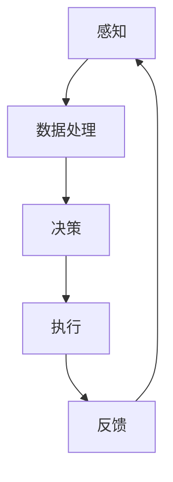
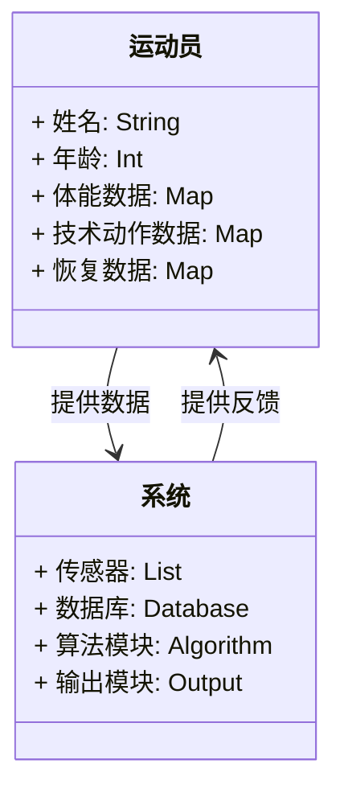
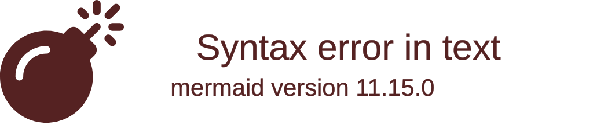

                 


# AI Agent在智能体育训练中的应用

## 关键词：AI Agent，智能体育训练，个性化训练计划，运动分析，机器学习，数据优化

## 摘要：  
随着人工智能技术的快速发展，AI Agent（人工智能代理）在体育训练中的应用越来越广泛。本文将探讨AI Agent在智能体育训练中的核心概念、算法原理、系统架构以及实际应用场景。通过结合AI Agent的感知、决策和优化能力，本文将详细分析其在个性化训练计划、实时运动分析和数据驱动优化中的应用，并通过实际案例和系统设计展示其在体育训练中的巨大潜力。

---

## 第一部分: AI Agent与智能体育训练的背景介绍

## 第1章: AI Agent与智能体育训练概述

### 1.1 AI Agent的基本概念
#### 1.1.1 什么是AI Agent  
AI Agent（人工智能代理）是指能够感知环境、自主决策并执行任务的智能实体。它可以是一个软件程序，也可以是一个物理设备，其核心目标是通过与环境的交互来实现特定目标。  

#### 1.1.2 AI Agent的核心特征  
AI Agent具有以下核心特征：  
1. **自主性**：能够自主决策，无需外部干预。  
2. **反应性**：能够实时感知环境并做出反应。  
3. **目标导向性**：以实现特定目标为导向。  
4. **学习能力**：能够通过数据和经验不断优化性能。  

#### 1.1.3 AI Agent与传统计算机程序的区别  
AI Agent与传统程序的主要区别在于其自主性和适应性。传统程序通常遵循固定的逻辑执行任务，而AI Agent能够通过学习和优化动态调整行为，以适应不同的环境和需求。

---

### 1.2 智能体育训练的定义与特点  
#### 1.2.1 智能体育训练的定义  
智能体育训练是指利用人工智能、大数据、物联网等技术，结合运动员的生理数据、运动表现和环境条件，提供智能化的训练方案和实时反馈的训练方式。  

#### 1.2.2 智能体育训练的核心技术  
智能体育训练的核心技术包括：  
1. **数据采集**：通过传感器获取运动员的生理数据和运动数据。  
2. **数据分析**：利用机器学习算法对数据进行分析和建模。  
3. **个性化推荐**：基于数据分析结果，制定个性化的训练计划。  
4. **实时反馈**：通过AI Agent实时监控运动员的训练状态并提供反馈。  

#### 1.2.3 智能体育训练的应用场景  
智能体育训练的应用场景包括：  
1. **运动员日常训练**：个性化训练计划的制定和执行。  
2. **运动损伤预防**：通过数据分析和实时监测，降低运动损伤的风险。  
3. **比赛策略优化**：基于对手数据分析和战术模拟，优化比赛策略。  

---

### 1.3 AI Agent在智能体育训练中的应用背景  
#### 1.3.1 体育训练的智能化需求  
随着体育竞技的日益激烈，运动员的训练需求也日益多样化和个性化。传统的训练方法难以满足运动员在技术、体能和战术上的全面提升需求。  

#### 1.3.2 AI技术在体育领域的应用现状  
目前，AI技术已经在体育领域得到广泛应用，例如：  
- **运动数据分析**：通过机器学习算法分析运动员的表现数据，提供优化建议。  
- **运动损伤预测**：通过传感器数据预测运动员的运动损伤风险。  
- **虚拟教练**：通过AI技术模拟教练的指导，为运动员提供实时反馈。  

#### 1.3.3 AI Agent在体育训练中的优势  
AI Agent在体育训练中的优势体现在以下几个方面：  
1. **个性化**：能够根据运动员的个体特征制定个性化的训练计划。  
2. **实时性**：能够实时监控运动员的训练状态并提供即时反馈。  
3. **高效性**：通过优化算法提高训练效率，缩短训练周期。  

---

## 第2章: AI Agent与智能体育训练的核心概念与联系

### 2.1 AI Agent的核心原理  
#### 2.1.1 AI Agent的感知与决策机制  
AI Agent的感知与决策机制包括以下步骤：  
1. **感知环境**：通过传感器或数据接口获取环境信息。  
2. **信息处理**：对获取的信息进行分析和建模。  
3. **决策制定**：基于分析结果制定行动方案。  
4. **执行行动**：根据决策结果执行具体动作。  

#### 2.1.2 AI Agent的学习与优化算法  
AI Agent的学习与优化算法主要包括：  
1. **监督学习**：基于标注数据进行模型训练。  
2. **强化学习**：通过奖励机制优化决策策略。  
3. **无监督学习**：对无标注数据进行聚类和异常检测。  

#### 2.1.3 AI Agent的通信与协作能力  
AI Agent的通信与协作能力包括：  
1. **多Agent协作**：多个AI Agent协同工作，共同完成复杂任务。  
2. **人机交互**：通过自然语言处理技术与人类进行有效沟通。  

---

### 2.2 智能体育训练中的核心概念  
#### 2.2.1 个性化训练计划  
个性化训练计划是基于运动员的个体特征（如体能、技术、心理状态等）制定的训练方案。AI Agent可以通过分析历史数据和实时监测，动态调整训练计划，以达到最佳效果。  

#### 2.2.2 实时运动分析  
实时运动分析是指通过传感器和AI技术实时监测运动员的运动状态，并提供实时反馈。这有助于教练和运动员及时发现问题并进行调整。  

#### 2.2.3 数据驱动的训练优化  
数据驱动的训练优化是指通过收集和分析大量数据，利用机器学习算法优化训练计划和策略。这包括对运动员的技术动作、体能水平和恢复状态的全面分析。  

---

### 2.3 AI Agent与智能体育训练的联系  
#### 2.3.1 AI Agent在个性化训练中的应用  
AI Agent可以通过分析运动员的历史训练数据和生理数据，制定个性化的训练计划，并根据实时反馈动态调整训练强度和内容。  

#### 2.3.2 AI Agent在运动分析中的作用  
AI Agent可以通过实时监测运动员的运动数据，分析其技术动作的规范性和运动效率，并提供实时反馈和改进建议。  

#### 2.3.3 AI Agent在数据优化中的价值  
AI Agent可以通过机器学习算法优化训练数据的处理和分析，提高训练计划的科学性和有效性。  

---

## 第3章: AI Agent在智能体育训练中的算法原理

### 3.1 算法原理概述  
AI Agent的核心算法包括感知、决策和优化三个部分。感知部分负责数据的采集和处理，决策部分基于感知结果制定行动方案，优化部分通过反馈机制不断改进算法性能。

### 3.2 算法流程图  


### 3.3 算法的数学模型与公式  
#### 3.3.1 损失函数的定义  
$$L = \frac{1}{2} (y - \hat{y})^2$$  

#### 3.3.2 优化器的实现  
$$\theta = \theta - \eta \cdot \frac{\partial L}{\partial \theta}$$  

---

## 第4章: 系统分析与架构设计方案

### 4.1 问题场景介绍  
智能体育训练系统需要实时监测运动员的生理数据和运动数据，并根据数据制定个性化的训练计划。

### 4.2 系统功能设计  
#### 4.2.1 领域模型（Mermaid类图）  


### 4.3 系统架构设计  
#### 4.3.1 系统架构图  


---

## 第5章: 项目实战

### 5.1 环境安装  
安装所需的开发环境包括Python、TensorFlow、传感器接口库等。

### 5.2 核心代码实现  
```python
import numpy as np
from tensorflow.keras import models, layers

# 数据预处理
def preprocess(data):
    # 数据标准化处理
    return (data - np.mean(data)) / np.std(data)

# 模型定义
def create_model(input_dim):
    model = models.Sequential()
    model.add(layers.Dense(64, activation='relu', input_dim=input_dim))
    model.add(layers.Dense(1, activation='linear'))
    model.compile(optimizer='adam', loss='mean_squared_error')
    return model

# 训练过程
def train_model(model, x_train, y_train, epochs=100):
    model.fit(x_train, y_train, epochs=epochs, verbose=0)

# 预测与评估
def evaluate_model(model, x_test, y_test):
    loss = model.evaluate(x_test, y_test, verbose=0)
    print(f"损失: {loss}")
```

### 5.3 实际案例分析  
以一名篮球运动员为例，通过AI Agent分析其技术动作和体能数据，制定个性化的训练计划，并实时监测其训练效果。

---

## 第6章: 最佳实践 tips、小结、注意事项、拓展阅读

### 6.1 小结  
本文详细介绍了AI Agent在智能体育训练中的应用，包括核心概念、算法原理、系统架构和实际案例。AI Agent通过个性化训练计划、实时运动分析和数据优化，为体育训练提供了新的可能性。

### 6.2 注意事项  
在实际应用中，需要注意数据的隐私保护和模型的实时性优化。

### 6.3 拓展阅读  
建议进一步学习强化学习和分布式计算在智能体育训练中的应用。

---

作者：AI天才研究院/AI Genius Institute & 禅与计算机程序设计艺术 /Zen And The Art of Computer Programming

