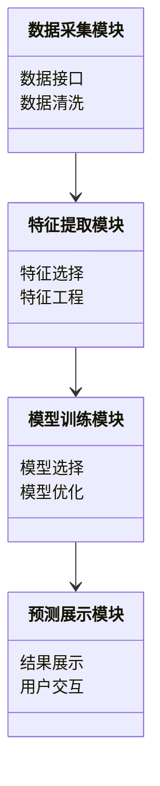
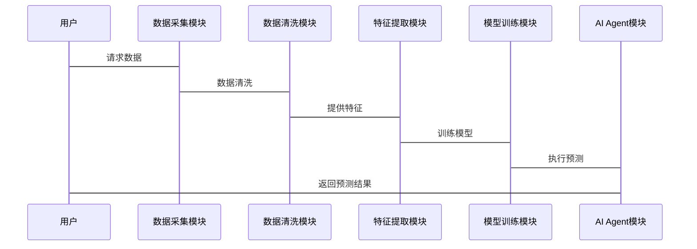

                 


# AI Agent在智能体育赛事预测中的应用

**关键词：** AI Agent, 体育赛事预测, 机器学习, 深度学习, 强化学习, 数据分析

**摘要：**  
本文探讨了AI Agent在智能体育赛事预测中的应用，分析了AI Agent的基本概念、工作原理及其在体育赛事预测中的价值。通过详细介绍机器学习、深度学习和强化学习算法，结合系统架构设计和项目实战，展示了如何利用AI Agent技术提高体育赛事预测的准确性和个性化服务。最后，本文总结了AI Agent在体育赛事预测中的应用现状，并展望了未来的发展趋势。

---

## 第一部分: AI Agent与智能体育赛事预测的背景与基础

### 第1章: AI Agent与智能体育赛事预测概述

#### 1.1 AI Agent的基本概念
##### 1.1.1 什么是AI Agent
AI Agent（人工智能代理）是一种能够感知环境、自主决策并执行任务的智能实体。它通过传感器获取信息，利用算法处理数据，并通过执行器采取行动以实现目标。

##### 1.1.2 AI Agent的核心特征
- **自主性**：能够自主决策和行动，无需人工干预。
- **反应性**：能够实时感知环境变化并做出反应。
- **学习能力**：通过数据和经验不断优化自身的预测和决策能力。
- **协作性**：能够与其他AI Agent或人类协同工作。

##### 1.1.3 AI Agent与传统AI的区别
传统AI主要依赖预设规则和模式进行任务处理，而AI Agent具有更强的自主性和适应性，能够在动态环境中灵活应对各种挑战。

#### 1.2 智能体育赛事预测的背景
##### 1.2.1 体育赛事预测的发展历程
体育赛事预测从早期的主观判断逐渐发展到基于统计学的分析，再到如今的AI驱动预测。AI技术的引入显著提升了预测的准确性和深度。

##### 1.2.2 当前体育赛事预测的痛点
- 数据量庞大且复杂，难以高效处理。
- 预测结果缺乏个性化，难以满足不同用户的需求。
- 预测模型的实时性和动态适应性不足。

##### 1.2.3 AI技术在体育赛事预测中的应用前景
AI技术，尤其是AI Agent，能够通过实时数据处理和动态决策，为体育赛事预测提供更准确和个性化的服务。

#### 1.3 AI Agent在体育赛事预测中的应用价值
##### 1.3.1 提高预测准确性
AI Agent能够处理海量数据，发现人类难以察觉的规律，从而提高预测的准确性。

##### 1.3.2 实现个性化预测服务
通过分析用户的偏好和历史行为，AI Agent可以为用户提供个性化的赛事预测服务。

##### 1.3.3 提升用户体验
AI Agent能够快速响应用户需求，提供实时更新的预测结果，显著提升用户体验。

### 第2章: AI Agent的核心概念与原理

#### 2.1 AI Agent的构成要素
##### 2.1.1 感知层
感知层负责从环境中获取数据，包括比赛数据、天气状况、球员状态等。

##### 2.1.2 决策层
决策层基于感知层获取的数据，利用算法进行分析和预测，制定最优决策。

##### 2.1.3 执行层
执行层负责根据决策层的指令采取行动，例如更新预测结果或向用户推送通知。

#### 2.2 AI Agent的工作原理
##### 2.2.1 数据采集与处理
AI Agent通过传感器或API接口采集比赛数据，包括历史战绩、球员表现、天气条件等，并对数据进行清洗和特征提取。

##### 2.2.2 模型构建与训练
利用机器学习算法（如线性回归、支持向量机、随机森林等）构建预测模型，并通过历史数据进行训练，优化模型参数。

##### 2.2.3 预测与决策
基于当前数据和训练好的模型，AI Agent实时预测比赛结果，并根据预测结果制定决策策略。

#### 2.3 AI Agent与体育赛事预测的结合
##### 2.3.1 数据来源与特征提取
数据来源包括比赛历史数据、球员统计数据、天气状况等。特征提取是将这些数据转化为模型可识别的特征向量。

##### 2.3.2 模型选择与优化
根据具体预测任务选择合适的模型，并通过交叉验证和网格搜索等方法优化模型性能。

##### 2.3.3 预测结果的解释与应用
将预测结果转化为用户友好的形式，并应用于实际场景，如投注建议、比赛策略制定等。

---

## 第二部分: AI Agent在体育赛事预测中的算法原理

### 第3章: 基于机器学习的AI Agent算法

#### 3.1 机器学习基础
##### 3.1.1 监督学习
监督学习是一种通过标注数据训练模型的方法，常用算法包括线性回归、支持向量机、随机森林等。

##### 3.1.2 非监督学习
非监督学习适用于无标注数据，通过聚类分析等方法发现数据中的潜在结构。

##### 3.1.3 强化学习
强化学习是一种通过与环境交互来学习策略的方法，适用于动态环境下的预测任务。

#### 3.2 常见机器学习算法在体育赛事预测中的应用
##### 3.2.1 线性回归
线性回归适用于预测连续型变量，例如比赛得分。

##### 3.2.2 支持向量机
支持向量机适用于分类任务，例如预测比赛胜负。

##### 3.2.3 随机森林
随机森林是一种集成学习方法，适用于处理高维数据，适合复杂预测任务。

##### 3.2.4 神经网络
神经网络能够处理非线性关系，适用于复杂模式识别任务。

#### 3.3 基于深度学习的AI Agent算法
##### 3.3.1 卷积神经网络
卷积神经网络适用于图像识别任务，可以应用于视频帧分析。

##### 3.3.2 循环神经网络
循环神经网络适用于时间序列分析，适合处理比赛过程中的动态数据。

##### 3.3.3 图神经网络
图神经网络适用于复杂关系网络分析，可以应用于球队间战术关系建模。

### 第4章: 基于强化学习的AI Agent算法

#### 4.1 强化学习的基本原理
强化学习通过智能体与环境的交互，通过试错学习策略，最大化累积奖励。

##### 4.1.1 状态空间
状态空间是智能体所处环境的所有可能状态的集合。

##### 4.1.2 动作空间
动作空间是智能体在每个状态下可以执行的所有可能动作。

##### 4.1.3 奖励机制
奖励机制定义了智能体在执行动作后获得的奖励，用于指导学习过程。

#### 4.2 强化学习在体育赛事预测中的应用
##### 4.2.1 策略网络
策略网络直接输出最优动作，适用于离散动作空间。

##### 4.2.2 值函数网络
值函数网络估计当前状态的值，适用于连续动作空间。

##### 4.2.3 多智能体强化学习
多智能体强化学习适用于复杂的多人博弈场景，例如足球比赛中的团队协作。

#### 4.3 实例分析: 基于强化学习的足球比赛预测

---

## 第三部分: AI Agent在体育赛事预测中的系统分析与架构设计

### 第5章: 系统分析与架构设计方案

#### 5.1 问题场景介绍
体育赛事预测系统需要处理海量数据，包括历史比赛数据、球员状态、天气条件等，同时需要实时更新预测结果。

#### 5.2 项目介绍
设计一个基于AI Agent的体育赛事预测系统，实现对足球比赛结果的实时预测。

#### 5.3 系统功能设计
##### 5.3.1 领域模型（Mermaid类图）


##### 5.3.2 系统架构设计（Mermaid架构图）


##### 5.3.3 系统接口设计
- 数据接口：用于与外部数据源交互。
- API接口：用于客户端调用预测结果。

##### 5.3.4 系统交互（Mermaid序列图）


---

## 第四部分: AI Agent在体育赛事预测中的项目实战

### 第6章: 项目实战

#### 6.1 环境安装
需要安装Python、机器学习库（如Scikit-learn、TensorFlow）和可视化工具（如Matplotlib）。

#### 6.2 系统核心实现源代码
以下是一个简单的AI Agent体育预测系统的Python代码示例：

```python
# 数据采集模块
import requests

def fetch_data(team1, team2):
    url = f"https://api.example.com/football?team1={team1}&team2={team2}"
    response = requests.get(url)
    return response.json()

# 特征提取模块
from sklearn.feature_selection import SelectKBest
from sklearn.feature_engineering import FeatureEngineer

def extract_features(data):
    features = SelectKBest(k=10).fit_transform(data)
    return FeatureEngineer().process(features)

# 模型训练模块
from sklearn.ensemble import RandomForestClassifier

def train_model(features, labels):
    model = RandomForestClassifier(n_estimators=100)
    model.fit(features, labels)
    return model

# AI Agent模块
class AIAgent:
    def __init__(self, model):
        self.model = model

    def predict_match(self, features):
        return self.model.predict(features)

# 预测展示模块
import matplotlib.pyplot as plt

def plot_prediction(prediction, actual):
    plt.bar(['Prediction', 'Actual'], [prediction[0], actual])
    plt.show()

# 主程序
if __name__ == "__main__":
    data = fetch_data("team1", "team2")
    features = extract_features(data)
    labels = data['labels']
    model = train_model(features, labels)
    agent = AIAgent(model)
    prediction = agent.predict_match(features)
    plot_prediction(prediction, labels)
```

#### 6.3 案例分析
以一场足球比赛为例，通过上述代码，我们可以预测比赛结果并进行可视化展示。

---

## 第五部分: 总结与展望

### 第7章: 总结与展望

#### 7.1 全文总结
本文详细介绍了AI Agent在智能体育赛事预测中的应用，包括AI Agent的基本概念、算法原理、系统架构设计和项目实战。通过这些内容，读者可以全面了解AI Agent在体育赛事预测中的价值和实现方法。

#### 7.2 未来展望
随着AI技术的不断发展，AI Agent在体育赛事预测中的应用将更加广泛和深入。未来的研究方向包括优化算法性能、提升预测的实时性和准确性，以及探索AI Agent在体育赛事中的更多应用场景。

---

**作者：AI天才研究院/AI Genius Institute & 禅与计算机程序设计艺术 /Zen And The Art of Computer Programming**

