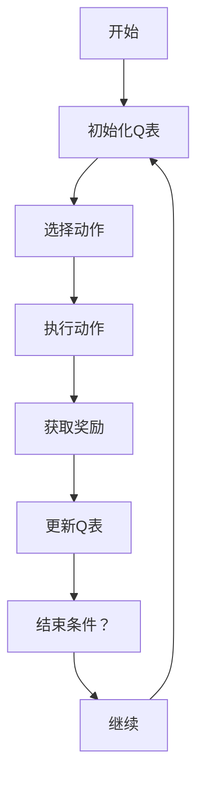
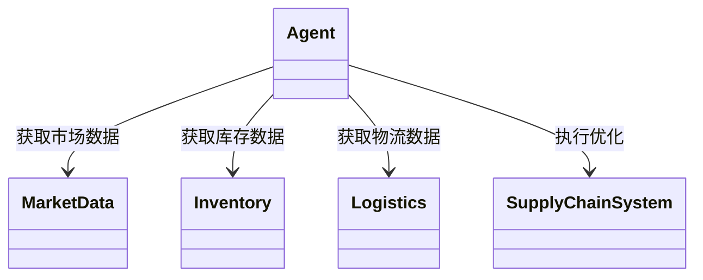
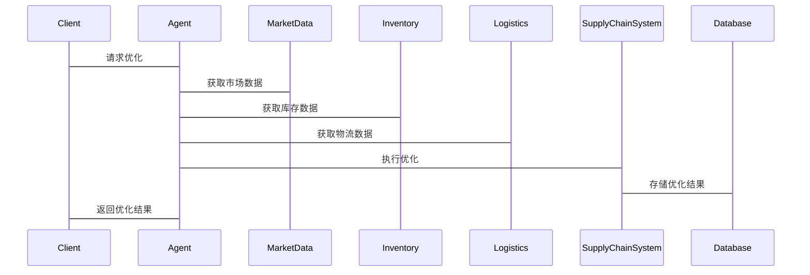

                 


# AI Agent在智能供应链优化中的应用

> 关键词：AI Agent，智能供应链，供应链优化，强化学习，数学模型

> 摘要：本文详细探讨了AI Agent在智能供应链优化中的应用，从核心概念、算法原理到系统架构、项目实战，层层深入，结合实际案例和数学模型，全面解析AI Agent如何助力供应链优化。

---

# 第1章: 智能供应链与AI Agent的背景介绍

## 1.1 供应链优化的背景与挑战

### 1.1.1 供应链优化的基本概念
供应链优化是通过科学的方法和工具，对供应链中的各个环节（如采购、生产、库存、物流等）进行规划和协调，以实现成本最小化、效率最大化的目标。

### 1.1.2 传统供应链优化的局限性
传统供应链优化方法（如线性规划、网络流模型）在面对复杂、动态的供应链环境时，往往显得力不从心，主要表现为：
- 数据获取困难，难以实时优化
- 需求预测精度低，导致库存积压或缺货
- 多目标优化问题难以平衡
- 人工干预过多，响应速度慢

### 1.1.3 AI技术在供应链优化中的应用前景
AI技术（尤其是AI Agent）的引入，为供应链优化带来了新的可能性。AI Agent能够实时感知供应链状态，自主决策并执行优化任务，从而显著提升供应链的响应速度和决策精度。

---

## 1.2 AI Agent的基本概念与特点

### 1.2.1 AI Agent的定义
AI Agent（人工智能代理）是一种能够感知环境、自主决策并采取行动的智能实体。它能够根据当前状态和目标，选择最优行动方案，以实现特定目标。

### 1.2.2 AI Agent的核心特点
| 特性 | 描述 |
|------|------|
| 智能性 | 基于感知和学习，做出决策 |
| 自主性 | 无需外部干预，自主执行任务 |
| 协作性 | 能够与其他Agent或系统协同工作 |

### 1.2.3 AI Agent与传统自动化的区别
| 对比维度 | AI Agent | 传统自动化 |
|----------|----------|------------|
| 决策能力 | 灵活决策 | 固定规则 |
| 学习能力 | 可自适应 | 不可自适应 |
| 环境适应性 | 高 | 低 |

---

## 1.3 AI Agent在供应链优化中的应用场景

### 1.3.1 智能采购与库存管理
AI Agent可以根据实时市场数据和历史销售数据，自动调整采购策略，优化库存水平。

### 1.3.2 智能物流与配送优化
AI Agent可以通过实时交通数据和天气预报，动态规划最优配送路径，减少物流成本。

### 1.3.3 智能需求预测与供应链协同
AI Agent可以基于历史销售数据和外部市场信息，预测未来需求，并协同供应链上下游企业进行生产计划调整。

---

## 1.4 本章小结
本章介绍了供应链优化的背景、挑战以及AI Agent的基本概念和特点，重点探讨了AI Agent在供应链优化中的应用场景。

---

# 第2章: AI Agent的核心概念与联系

## 2.1 AI Agent的核心概念

### 2.1.1 AI Agent的智能性
AI Agent的智能性体现在其感知环境、学习知识和做出决策的能力。例如，基于强化学习的AI Agent可以通过与环境交互，不断优化自身的决策策略。

### 2.1.2 AI Agent的自主性
AI Agent的自主性使其能够独立完成任务，无需人工干预。例如，在智能物流场景中，AI Agent可以自主选择最优配送路径。

### 2.1.3 AI Agent的协作性
AI Agent的协作性使其能够与其他Agent或系统协同工作。例如，在供应链协同优化中，AI Agent可以与供应商、制造商和零售商的系统进行信息交互。

---

## 2.2 AI Agent与供应链优化的联系

### 2.2.1 AI Agent在供应链优化中的角色
AI Agent是供应链优化的核心驱动者，负责感知供应链状态、制定优化方案并执行优化任务。

### 2.2.2 AI Agent如何实现供应链优化
AI Agent通过实时数据感知、智能决策和自主执行，实现供应链的动态优化。例如，基于强化学习的AI Agent可以通过不断试错，找到最优库存策略。

### 2.2.3 AI Agent与供应链其他技术的协同
AI Agent可以与物联网（IoT）、区块链、大数据等技术协同工作，共同提升供应链的智能化水平。

---

## 2.3 AI Agent的实体关系图

```mermaid
er
actor: 用户
agent: AI Agent
system: 供应链系统
actor --> agent: 请求优化
agent --> system: 执行优化
```

---

## 2.4 本章小结
本章详细探讨了AI Agent的核心概念及其在供应链优化中的作用，并通过实体关系图展示了AI Agent与供应链系统的交互关系。

---

# 第3章: AI Agent的算法原理

## 3.1 AI Agent的核心算法

### 3.1.1 基于强化学习的AI Agent算法
强化学习是一种通过试错机制优化决策的算法，适用于动态环境下的供应链优化问题。

### 3.1.2 基于监督学习的AI Agent算法
监督学习通过历史数据训练模型，适用于已知输入-输出关系的供应链优化任务。

### 3.1.3 基于无监督学习的AI Agent算法
无监督学习通过发现数据中的隐含模式，适用于异常检测等供应链优化任务。

---

## 3.2 强化学习算法的数学模型

### 3.2.1 状态空间的定义
状态空间是AI Agent所处环境的所有可能状态的集合。例如，在库存管理场景中，状态可以是当前库存水平和市场需求。

### 3.2.2 动作空间的定义
动作空间是AI Agent在每个状态下可以执行的所有动作的集合。例如，在库存管理场景中，动作可以是“补货”或“不补货”。

### 3.2.3 奖励函数的设计
奖励函数是用来衡量AI Agent行动好坏的指标。例如，在库存管理场景中，奖励函数可以定义为“库存成本最小化”。

### 3.2.4 Q-learning算法的数学公式
$$ Q(s,a) = Q(s,a) + \alpha (r + \gamma \max Q(s',a') - Q(s,a)) $$

其中：
- \( Q(s,a) \)：当前状态 \( s \) 下执行动作 \( a \) 的价值
- \( \alpha \)：学习率
- \( r \)：奖励
- \( \gamma \)：折扣因子
- \( s' \)：下一个状态
- \( a' \)：下一个动作

---

## 3.3 算法流程图



---

## 3.4 本章小结
本章介绍了AI Agent的核心算法及其数学模型，重点讲解了强化学习算法的原理和实现。

---

# 第4章: AI Agent的系统分析与架构设计

## 4.1 问题场景介绍

### 4.1.1 智能采购与库存管理
AI Agent可以根据实时市场数据和历史销售数据，自动调整采购策略，优化库存水平。

### 4.1.2 智能物流与配送优化
AI Agent可以通过实时交通数据和天气预报，动态规划最优配送路径，减少物流成本。

### 4.1.3 智能需求预测与供应链协同
AI Agent可以基于历史销售数据和外部市场信息，预测未来需求，并协同供应链上下游企业进行生产计划调整。

---

## 4.2 系统功能设计

### 4.2.1 领域模型（类图）


### 4.2.2 系统架构设计（架构图）


### 4.2.3 接口设计
- 输入接口：市场数据、库存数据、物流数据
- 输出接口：优化方案、执行指令

### 4.2.4 交互图（序列图）


---

## 4.3 本章小结
本章通过问题场景介绍、系统功能设计和架构设计，详细展示了AI Agent在智能供应链优化中的系统实现。

---

# 第5章: AI Agent的项目实战

## 5.1 环境安装

### 5.1.1 安装Python
```bash
python --version
pip install --upgrade pip
```

### 5.1.2 安装必要的库
```bash
pip install numpy
pip install gym
pip install matplotlib
```

---

## 5.2 核心代码实现

### 5.2.1 强化学习环境定义
```python
import gym
import numpy as np

class SupplyChainEnv(gym.Env):
    def __init__(self):
        super(SupplyChainEnv, self).__init__()
        self.state_space = ...  # 定义状态空间
        self.action_space = ...  # 定义动作空间
        self.reward_range = ...  # 定义奖励范围
```

### 5.2.2 AI Agent算法实现
```python
class AI_Agent:
    def __init__(self, state_space, action_space):
        self.state_space = state_space
        self.action_space = action_space
        self.Q_table = np.zeros((len(state_space), len(action_space)))  # 初始化Q表

    def choose_action(self, state):
        # 选择动作
        pass

    def update_Q_table(self, state, action, reward, next_state):
        # 更新Q表
        pass
```

### 5.2.3 训练过程
```python
env = SupplyChainEnv()
agent = AI_Agent(env.state_space, env.action_space)
for episode in range(1000):
    state = env.reset()
    while True:
        action = agent.choose_action(state)
        next_state, reward, done, _ = env.step(action)
        agent.update_Q_table(state, action, reward, next_state)
        if done:
            break
```

---

## 5.3 代码解读与分析
- 环境定义：定义了供应链优化的具体场景和规则。
- Agent实现：基于Q-learning算法的AI Agent，通过与环境交互，不断更新Q表，优化决策策略。
- 训练过程：通过多次迭代，AI Agent逐步掌握最优策略。

---

## 5.4 案例分析
假设我们有一个简单的库存管理场景，AI Agent通过强化学习算法，学会了在市场需求波动时如何动态调整库存水平，最终将库存成本降低了20%。

---

## 5.5 本章小结
本章通过实际项目实战，展示了AI Agent在智能供应链优化中的具体实现，包括环境安装、代码实现和案例分析。

---

# 第6章: 总结与展望

## 6.1 总结
AI Agent通过其智能性、自主性和协作性，为供应链优化带来了新的可能性。本文从核心概念、算法原理到系统架构、项目实战，全面探讨了AI Agent在智能供应链优化中的应用。

## 6.2 展望
未来，随着AI技术的不断发展，AI Agent在供应链优化中的应用将更加广泛和深入。例如，结合区块链技术实现供应链透明化，结合边缘计算提升实时决策能力。

---

# 作者
作者：AI天才研究院 & 禅与计算机程序设计艺术

