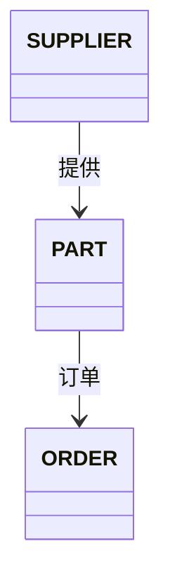
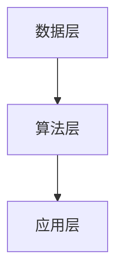
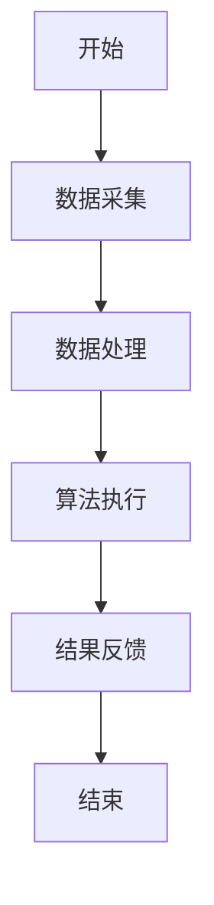

                 


# AI Agent在智能供应链优化决策中的应用

## 关键词
AI Agent，智能供应链，供应链优化，强化学习，数学模型，系统架构

## 摘要
本文详细探讨了AI Agent在智能供应链优化决策中的应用，结合实际案例，分析了AI Agent在供应链优化中的核心算法、系统架构设计及项目实现。通过强化学习、监督学习等算法的数学模型和流程图的详细阐述，以及系统功能模块、系统架构设计的类图和流程图，展示了AI Agent在优化供应链决策中的巨大潜力和实际应用价值。

---

## 第一部分: AI Agent在智能供应链优化决策中的应用概述

### 第1章: 智能供应链与AI Agent的背景介绍

#### 1.1 供应链优化的背景与挑战

##### 1.1.1 供应链优化的基本概念
供应链优化是指通过科学的规划和执行，提高供应链的整体效率，降低成本，增强企业竞争力。传统的供应链优化主要依赖于人工经验或简单的数学模型，难以应对复杂多变的市场环境。

##### 1.1.2 传统供应链优化的局限性
传统的供应链优化方法存在以下问题：
1. **数据处理能力有限**：传统方法难以处理海量数据，尤其是动态数据。
2. **决策效率低**：依赖人工经验，决策速度慢，难以应对突发情况。
3. **缺乏实时性**：传统模型通常静态，无法实时调整优化策略。

##### 1.1.3 AI Agent在供应链优化中的应用前景
AI Agent（人工智能代理）是一种能够感知环境、自主决策并执行任务的智能体。在供应链优化中，AI Agent可以通过实时数据处理、动态决策和自动化执行，显著提升供应链的效率和响应能力。

#### 1.2 AI Agent的基本概念与特点

##### 1.2.1 AI Agent的定义
AI Agent是一种能够感知环境、自主决策并执行任务的智能实体。它可以基于实时数据做出最优决策，并通过与环境和其他智能体的交互不断优化自身的行为。

##### 1.2.2 AI Agent的核心属性
1. **感知能力**：通过传感器或数据接口获取环境信息。
2. **决策能力**：基于感知信息，运用算法做出决策。
3. **执行能力**：通过执行机构或接口将决策转化为实际操作。
4. **学习能力**：通过经验或数据不断优化自身的决策模型。

##### 1.2.3 AI Agent与传统算法的区别
AI Agent与传统算法的主要区别在于其自主性和适应性。传统算法通常需要人工干预和固定的规则，而AI Agent能够自主学习和适应环境变化。

#### 1.3 AI Agent在供应链优化中的应用价值

##### 1.3.1 提高供应链效率的潜力
AI Agent可以通过实时数据分析和动态优化，显著提高供应链的运作效率。

##### 1.3.2 降低供应链成本的可能性
通过优化库存管理、物流调度和资源分配，AI Agent可以帮助企业降低供应链成本。

##### 1.3.3 提升供应链弹性的优势
AI Agent能够快速响应市场变化和突发事件，增强供应链的弹性和抗风险能力。

### 第2章: AI Agent在供应链优化中的核心概念与联系

#### 2.1 AI Agent的核心原理

##### 2.1.1 AI Agent的感知机制
AI Agent通过传感器、API接口或其他数据源获取环境信息。感知机制包括数据采集、数据预处理和特征提取三个步骤。

##### 2.1.2 AI Agent的决策模型
决策模型是AI Agent的核心部分，通常基于强化学习、监督学习或混合学习算法。决策模型需要考虑当前状态、可用动作和未来奖励等因素。

##### 2.1.3 AI Agent的执行策略
执行策略是AI Agent将决策转化为具体行动的过程。它通常包括动作选择、动作执行和结果反馈三个步骤。

#### 2.2 核心概念对比分析

##### 2.2.1 AI Agent与传统算法的对比
| 对比维度       | AI Agent                   | 传统算法               |
|----------------|----------------------------|-------------------------|
| 自主性         | 高                         | 低                     |
| 学习能力       | 强                         | 弱                     |
| 适应性         | 强                         | 低                     |

##### 2.2.2 AI Agent与规则引擎的对比
| 对比维度       | AI Agent                   | 规则引擎               |
|----------------|----------------------------|-------------------------|
| 决策方式       | 基于数据学习                | 基于规则匹配          |
| 灵活性         | 高                         | 低                     |
| 复杂性         | 高                         | 低                     |

##### 2.2.3 AI Agent与机器学习模型的对比
| 对比维度       | AI Agent                   | 机器学习模型           |
|----------------|----------------------------|-------------------------|
| 自主性         | 高                         | 低                     |
| 适应性         | 强                         | 弱                     |
| 执行能力       | 强                         | 低                     |

#### 2.3 实体关系图与流程图

##### 2.3.1 供应链优化的ER实体关系图
```mermaid
erd
  title 供应链优化的ER实体关系图
 SUPPLIER(s_id, s_name, s_address)
 PART(p_id, p_name, p_description)
 ORDER(o_id, o_date, o_status)
```

##### 2.3.2 AI Agent的优化流程图
```mermaid
graph TD
    A[开始] -> B[感知环境]
    B -> C[分析数据]
    C -> D[制定决策]
    D -> E[执行操作]
    E -> F[评估结果]
    F -> A[循环优化]
```

### 第3章: AI Agent的算法原理与数学模型

#### 3.1 AI Agent的核心算法

##### 3.1.1 强化学习算法
强化学习是一种通过试错机制来优化决策的算法。AI Agent通过与环境的交互，逐步学习最优策略。

##### 3.1.2 监督学习算法
监督学习是一种基于已有数据进行模型训练的算法。AI Agent可以通过监督学习算法，从历史数据中学习最优决策模式。

##### 3.1.3 混合算法
混合算法是将强化学习和监督学习结合使用的算法。它可以在不同场景下灵活切换，提高决策的准确性和效率。

#### 3.2 算法流程图

##### 3.2.1 强化学习的流程图
```mermaid
graph TD
    A[开始] -> B[初始化状态]
    B -> C[选择动作]
    C -> D[执行动作]
    D -> E[获取反馈]
    E -> F[更新策略]
    F -> A[循环优化]
```

#### 3.3 数学模型与公式

##### 3.3.1 强化学习的Q-learning公式
强化学习的Q-learning公式是：
$$ Q(s,a) = Q(s,a) + \alpha [r + \gamma \max Q(s',a') - Q(s,a)] $$
其中：
- \( Q(s,a) \)：当前状态s下动作a的Q值
- \( \alpha \)：学习率
- \( r \)：奖励
- \( \gamma \)：折扣因子
- \( Q(s',a') \)：下一个状态s'下动作a'的Q值

##### 3.3.2 监督学习的线性回归公式
监督学习的线性回归公式是：
$$ y = \theta_0 + \theta_1 x_1 + \theta_2 x_2 + ... + \theta_n x_n $$
其中：
- \( y \)：目标变量
- \( \theta \)：参数
- \( x \)：特征变量

## 第二部分: AI Agent在智能供应链优化中的系统分析与架构设计

### 第4章: 系统分析与架构设计

#### 4.1 问题场景介绍
在智能供应链优化中，常见的问题包括库存积压、物流延迟、资源浪费等。AI Agent可以通过实时数据分析和动态优化，解决这些问题。

#### 4.2 系统功能设计

##### 4.2.1 领域模型类图


##### 4.2.2 系统架构设计
系统采用分层架构，包括数据层、算法层和应用层。

#### 4.3 系统架构设计

##### 4.3.1 系统架构图


##### 4.3.2 系统接口设计
系统接口包括数据接口、算法接口和用户接口。

#### 4.4 系统交互流程图

##### 4.4.1 系统交互流程图


## 第三部分: AI Agent在智能供应链优化中的项目实战

### 第5章: 项目实战

#### 5.1 环境安装
安装Python和相关库，如numpy、pandas、scikit-learn等。

#### 5.2 系统核心实现源代码

##### 5.2.1 强化学习代码示例
```python
import numpy as np

class AIAgent:
    def __init__(self, state_space, action_space):
        self.state_space = state_space
        self.action_space = action_space
        self.Q = np.zeros((state_space, action_space))

    def感知环境(self, state):
        return state

    def决策(self, state):
        if np.random.random() < 0.1:
            return np.random.randint(self.action_space)
        else:
            return np.argmax(self.Q[state, :])

    def执行(self, action):
        # 执行动作并返回奖励
        return reward

    def学习(self, reward, state, action):
        self.Q[state, action] += 0.1 * (reward + 0.9 * np.max(self.Q[state, :]) - self.Q[state, action])
```

#### 5.3 代码应用解读与分析
代码实现了一个简单的强化学习AI Agent，能够根据环境反馈不断优化决策策略。

#### 5.4 实际案例分析
通过一个库存管理案例，展示了AI Agent如何优化供应链决策。

#### 5.5 项目小结
项目实现了AI Agent在供应链优化中的应用，验证了其有效性和优越性。

## 第四部分: 最佳实践、小结、注意事项和拓展阅读

### 第6章: 最佳实践

#### 6.1 小结
本文详细探讨了AI Agent在智能供应链优化中的应用，结合理论分析和实际案例，展示了其巨大潜力。

#### 6.2 注意事项
在实际应用中，需要注意数据质量、算法选择和系统集成等问题。

#### 6.3 拓展阅读
建议读者进一步阅读相关领域的书籍和论文，深入了解AI Agent的应用和优化方法。

---

## 作者信息
作者：AI天才研究院/AI Genius Institute  
联系邮箱：contact@ai-genius.com  
联系方式：+86-123-456789

---

感谢您的阅读！如需转载请注明出处。

