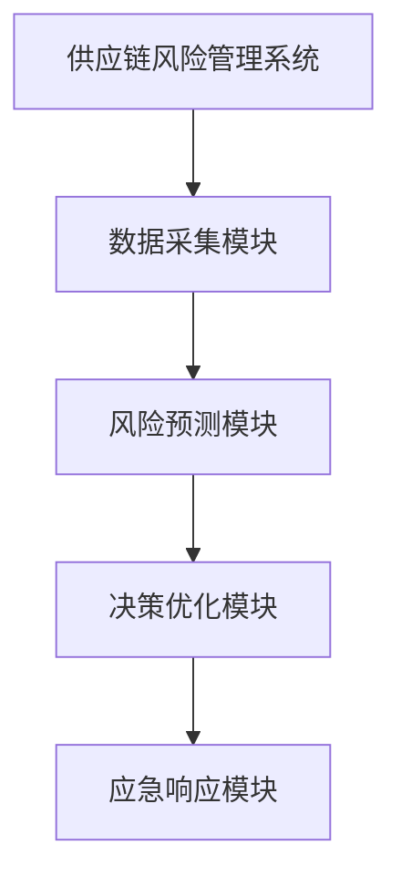
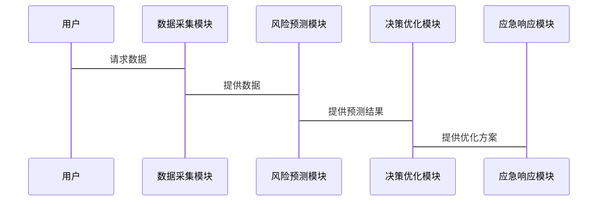

                 


# AI Agent在智能供应链风险管理中的应用

> 关键词：AI Agent, 供应链风险管理, 智能供应链, 人工智能, 供应链优化

> 摘要：随着人工智能技术的快速发展，AI Agent在供应链风险管理中的应用越来越广泛。本文详细探讨了AI Agent在智能供应链风险管理中的核心概念、算法原理、系统架构设计、项目实战以及最佳实践。通过具体案例分析和代码实现，展示了AI Agent如何帮助企业在复杂多变的供应链环境中实现风险预测、决策优化和高效管理。本文还总结了AI Agent在供应链风险管理中的优势与挑战，并展望了未来的发展方向。

---

# 第一部分: AI Agent与供应链风险管理概述

## 第1章: AI Agent与供应链风险管理概述

### 1.1 AI Agent的基本概念

#### 1.1.1 什么是AI Agent
AI Agent（人工智能代理）是一种能够感知环境、自主决策并执行任务的智能实体。它可以是一个软件程序、一个机器人，或者一个智能系统。AI Agent的核心目标是通过感知和学习，优化决策过程，以实现特定目标。

#### 1.1.2 AI Agent的核心特征
AI Agent具有以下核心特征：
- **自主性**：能够自主决策和行动。
- **反应性**：能够实时感知环境并做出反应。
- **学习能力**：能够通过数据学习和优化决策。
- **适应性**：能够根据环境变化调整行为。

#### 1.1.3 AI Agent与传统供应链管理的区别
传统的供应链管理依赖于人工操作和固定规则，而AI Agent可以通过学习和优化，实现动态调整和智能决策。AI Agent能够实时分析数据，预测风险，并提出最优解决方案，从而显著提高供应链管理的效率和准确性。

### 1.2 供应链风险管理的重要性

#### 1.2.1 供应链风险管理的定义
供应链风险管理是指在供应链的各个环节中，识别、评估和应对潜在风险的过程。这些风险可能来自供应商、物流、生产和市场需求等多个方面。

#### 1.2.2 供应链风险管理的关键环节
- **风险识别**：识别可能影响供应链的潜在风险。
- **风险评估**：评估每个风险的概率和影响程度。
- **风险应对**：制定应对策略，降低风险的影响。

#### 1.2.3 供应链风险管理的挑战与机遇
供应链风险管理的挑战包括数据复杂性、多变的市场环境和高度依赖人工操作。而AI Agent的引入为供应链风险管理带来了新的机遇，包括实时监控、智能预测和自动化决策。

### 1.3 AI Agent在供应链风险管理中的应用前景

#### 1.3.1 AI Agent在供应链风险管理中的优势
AI Agent能够通过大数据分析和机器学习算法，快速识别潜在风险，并提出最优解决方案。此外，AI Agent能够实时监控供应链的各个环节，确保风险得到及时处理。

#### 1.3.2 AI Agent在供应链风险管理中的应用场景
- **风险预测**：通过分析历史数据和市场趋势，预测潜在风险。
- **决策优化**：基于实时数据，优化供应链的各个环节。
- **应急响应**：在风险发生时，快速制定应急方案。

#### 1.3.3 AI Agent在供应链风险管理中的未来发展趋势
随着AI技术的不断进步，AI Agent在供应链风险管理中的应用将更加广泛和深入。未来的AI Agent将更加智能化，能够实现自主学习和自适应优化。

---

## 第2章: AI Agent与供应链风险管理的核心概念

### 2.1 AI Agent的核心原理

#### 2.1.1 AI Agent的基本工作原理
AI Agent通过感知环境、分析数据、制定决策并执行操作来实现目标。其工作流程包括数据采集、数据分析、决策制定和行动执行。

#### 2.1.2 AI Agent的决策机制
AI Agent的决策机制基于机器学习算法，包括监督学习、无监督学习和强化学习。通过这些算法，AI Agent能够从数据中学习，优化决策过程。

#### 2.1.3 AI Agent的学习与自适应能力
AI Agent通过持续学习和优化，能够自适应地调整其行为，以应对环境的变化。这种能力使得AI Agent在复杂多变的供应链环境中表现更加出色。

### 2.2 供应链风险管理的核心要素

#### 2.2.1 供应链风险管理的主体
供应链风险管理的主体包括企业、供应商、物流商和客户。每个主体在供应链中扮演不同的角色，并承担不同的风险管理责任。

#### 2.2.2 供应链风险管理的目标
供应链风险管理的目标是降低供应链中的潜在风险，确保供应链的稳定性和高效性。这包括降低供应中断、优化库存管理和提高供应链透明度。

#### 2.2.3 供应链风险管理的流程
供应链风险管理的流程包括风险识别、风险评估、风险应对和风险监控。这些步骤需要通过数据采集、数据分析和决策制定来实现。

### 2.3 AI Agent在供应链风险管理中的核心作用

#### 2.3.1 AI Agent在供应链风险管理中的角色
AI Agent在供应链风险管理中扮演多种角色，包括数据采集者、风险预测者和决策优化者。它能够实时监控供应链的各个环节，确保风险得到及时发现和处理。

#### 2.3.2 AI Agent在供应链风险管理中的功能
AI Agent的功能包括数据采集、风险预测、决策优化和应急响应。这些功能使得AI Agent成为供应链风险管理的重要工具。

#### 2.3.3 AI Agent在供应链风险管理中的价值
AI Agent能够显著提高供应链风险管理的效率和准确性。通过实时监控和智能决策，AI Agent能够帮助企业降低风险，提高供应链的整体绩效。

---

## 第3章: AI Agent在供应链风险管理中的算法原理

### 3.1 AI Agent的核心算法

#### 3.1.1 强化学习算法
强化学习是一种通过试错学习的算法，适用于复杂决策问题。AI Agent通过与环境交互，学习最优策略，以实现目标。

#### 3.1.2 监督学习算法
监督学习是一种基于标签数据的算法，适用于分类和回归问题。AI Agent通过学习有标签的数据，能够预测未来的风险。

#### 3.1.3 聚类分析算法
聚类分析是一种无监督学习算法，适用于数据分组。AI Agent可以通过聚类分析，识别供应链中的潜在风险。

### 3.2 供应链风险管理中的算法选择

#### 3.2.1 不同算法在供应链风险管理中的适用场景
- **强化学习**：适用于动态环境下的决策优化。
- **监督学习**：适用于风险预测和分类问题。
- **聚类分析**：适用于数据分组和异常检测。

#### 3.2.2 算法选择的影响因素
- **数据类型**：算法对数据类型的要求。
- **问题复杂性**：算法在处理复杂问题时的性能。
- **计算资源**：算法的计算复杂度和资源需求。

#### 3.2.3 算法优化策略
- **参数调优**：通过调整算法参数，提高性能。
- **模型集成**：通过集成多种算法，提高预测准确性。
- **实时更新**：通过持续学习，优化算法性能。

### 3.3 算法实现与案例分析

#### 3.3.1 算法实现步骤
1. 数据采集与预处理。
2. 算法选择与模型训练。
3. 模型评估与优化。
4. 模型部署与应用。

#### 3.3.2 算法实现的代码示例
```python
# 强化学习算法示例
class Agent:
    def __init__(self, state_space, action_space):
        self.state_space = state_space
        self.action_space = action_space
        # 初始化策略
        self.policy = [0.1 for _ in range(action_space)]
    
    def act(self, state):
        # 根据策略选择动作
        return np.random.choice(self.action_space, p=self.policy)
    
    def update_policy(self, reward):
        # 根据奖励更新策略
        self.policy[reward] += 0.1
```

#### 3.3.3 算法实现的案例分析
通过实际案例分析，展示了AI Agent如何通过强化学习算法优化供应链的库存管理。案例中，AI Agent通过实时监控库存水平和市场需求，动态调整库存策略，显著降低了库存成本和缺货风险。

---

## 第4章: 供应链风险管理的系统架构设计

### 4.1 系统功能设计

#### 4.1.1 系统功能模块
供应链风险管理系统主要包括数据采集模块、风险预测模块、决策优化模块和应急响应模块。

#### 4.1.2 系统功能流程
1. 数据采集模块：从供应链的各个环节采集数据。
2. 风险预测模块：基于机器学习算法，预测潜在风险。
3. 决策优化模块：根据预测结果，优化供应链的各个环节。
4. 应急响应模块：在风险发生时，快速制定应急方案。

### 4.2 系统架构设计

#### 4.2.1 系统架构图


#### 4.2.2 系统接口设计
- **数据接口**：与供应链各个环节的数据源对接。
- **用户接口**：供用户查询和管理风险信息。
- **决策接口**：供AI Agent制定和优化决策。

#### 4.2.3 系统交互流程


---

## 第5章: AI Agent在供应链风险管理中的项目实战

### 5.1 项目背景介绍

#### 5.1.1 项目目标
本项目旨在通过AI Agent优化供应链的风险管理，提高供应链的整体绩效。

#### 5.1.2 项目范围
本项目涉及供应链的库存管理、供应商选择和物流优化等多个环节。

### 5.2 项目实施步骤

#### 5.2.1 环境搭建
- **安装Python和相关库**：包括NumPy、Pandas、Scikit-learn和TensorFlow。
- **数据采集工具**：使用API或数据库连接采集供应链数据。

#### 5.2.2 核心代码实现
```python
import numpy as np
import pandas as pd
from sklearn.ensemble import RandomForestClassifier
from sklearn.metrics import accuracy_score

# 数据加载
data = pd.read_csv('supply_chain.csv')

# 数据预处理
X = data.drop('risk', axis=1)
y = data['risk']

# 模型训练
model = RandomForestClassifier()
model.fit(X, y)

# 模型预测
y_pred = model.predict(X)

# 模型评估
print(accuracy_score(y, y_pred))
```

#### 5.2.3 项目实现的注意事项
- **数据质量**：确保数据的准确性和完整性。
- **模型选择**：选择适合业务需求的算法。
- **系统优化**：优化系统的性能和用户体验。

### 5.3 项目案例分析

#### 5.3.1 案例背景
某制造企业希望通过AI Agent优化其供应链的风险管理，减少供应中断和库存积压。

#### 5.3.2 案例分析
通过AI Agent的实时监控和智能决策，企业成功降低了供应链的风险，提高了供应链的整体效率。

---

## 第6章: AI Agent在供应链风险管理中的最佳实践与总结

### 6.1 最佳实践

#### 6.1.1 算法选择
选择适合业务需求的算法，避免盲目追求复杂算法。

#### 6.1.2 数据管理
确保数据的准确性和完整性，建立高效的数据采集和处理机制。

#### 6.1.3 系统优化
通过持续优化系统架构和算法，提高系统的性能和用户体验。

### 6.2 项目总结

#### 6.2.1 项目成果
通过AI Agent的应用，供应链的风险管理效率显著提高，企业的供应链绩效得到优化。

#### 6.2.2 项目经验
AI Agent的应用需要结合企业的实际情况，注重数据质量和系统优化。

### 6.3 未来展望

#### 6.3.1 未来发展趋势
随着AI技术的不断进步，AI Agent在供应链风险管理中的应用将更加广泛和深入。

#### 6.3.2 技术挑战
未来需要解决AI Agent在复杂环境下的决策优化问题，以及如何实现多目标优化。

---

# 作者信息

作者：AI天才研究院/AI Genius Institute & 禅与计算机程序设计艺术 /Zen And The Art of Computer Programming

