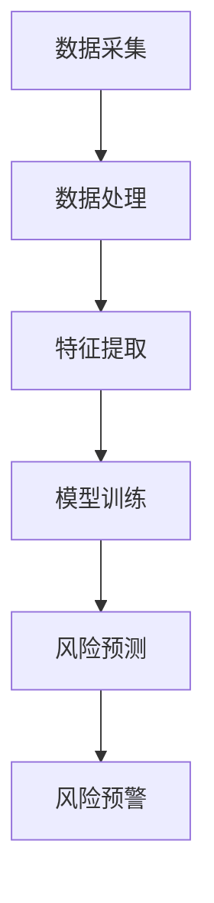

                 


# AI Agent在智能供应链风险预警中的应用

> 关键词：AI Agent, 智能供应链, 风险预警, 机器学习, 数据挖掘, 预测模型

> 摘要：本文详细探讨了AI Agent在智能供应链风险预警中的应用，从基本概念到技术原理，再到系统架构设计和项目实战，全面分析了AI Agent如何帮助供应链企业实现风险预警和优化管理。通过具体的案例分析，本文展示了如何利用机器学习算法和数学模型构建高效的供应链风险预警系统。

---

## 第1章: AI Agent与智能供应链风险预警概述

### 1.1 供应链风险管理的背景与挑战

供应链管理是企业运营的核心环节，涉及采购、生产、物流等多个环节。然而，供应链也面临着诸多风险，如原材料短缺、物流延迟、市场需求波动等。这些风险可能导致成本增加、交货延迟甚至企业声誉受损。

AI Agent作为一种智能代理，能够通过自动化的方式实时监控供应链的各个节点，识别潜在风险并提出应对策略。AI Agent的核心优势在于其能够快速处理海量数据，并通过机器学习算法不断优化预测模型。

### 1.2 AI Agent的核心概念与技术特点

AI Agent是指具有自主决策能力的智能体，能够根据环境信息采取行动。在供应链管理中，AI Agent通常用于数据采集、风险识别和决策优化。

AI Agent的关键技术包括：
1. **机器学习**：用于模式识别和预测。
2. **自然语言处理**：用于处理非结构化数据。
3. **数据挖掘**：用于发现数据中的潜在规律。

### 1.3 智能供应链风险预警的必要性

供应链的复杂性和不确定性使得风险预警成为必要。AI Agent能够实时监控供应链的各个节点，预测潜在风险并提出预警。例如，当预测到某原材料供应商可能出现延迟交付时，AI Agent可以建议企业寻找替代供应商。

---

## 第2章: AI Agent的基本原理与技术框架

### 2.1 AI Agent的基本原理

AI Agent的核心原理是通过数据采集、特征提取、模型训练和预测来实现风险预警。具体步骤如下：
1. **数据采集**：从供应链的各个环节收集数据，包括供应商信息、物流数据、市场需求等。
2. **特征提取**：将数据转化为能够反映风险的特征，如交货周期、供应商可靠性等。
3. **模型训练**：利用机器学习算法训练风险预测模型。
4. **预测与预警**：根据模型预测结果，生成风险预警。

### 2.2 AI Agent的技术框架

AI Agent的技术框架通常包括以下模块：
- **数据采集模块**：负责收集供应链相关数据。
- **特征提取模块**：将数据转化为特征向量。
- **模型训练模块**：训练风险预测模型。
- **预警模块**：根据模型预测结果生成预警信息。

---

## 第3章: 供应链风险预警的数学模型与算法

### 3.1 常用的数学模型

在供应链风险预警中，常用的数学模型包括线性回归、支持向量机（SVM）、随机森林和神经网络等。

#### 3.1.1 线性回归

线性回归是一种简单但有效的预测模型，适用于线性关系的场景。其数学公式为：
$$ y = \beta_0 + \beta_1x_1 + \beta_2x_2 + ... + \beta_nx_n $$

其中，$y$ 是预测目标，$x_i$ 是特征变量，$\beta_i$ 是系数。

#### 3.1.2 支持向量机（SVM）

SVM适用于分类问题，能够处理非线性关系。其核心思想是通过构建超平面将数据分为两类。

#### 3.1.3 随机森林

随机森林是一种基于决策树的集成算法，具有较高的准确性和鲁棒性。

### 3.2 算法实现与优化

在实现算法时，需要注意以下几点：
1. **数据预处理**：包括数据清洗、特征选择等。
2. **模型调参**：通过交叉验证优化模型参数。
3. **模型评估**：使用准确率、召回率等指标评估模型性能。

---

## 第4章: 供应链风险预警的系统架构设计

### 4.1 系统总体架构

供应链风险预警系统的总体架构包括以下几个部分：
- **数据采集模块**：负责从供应链各环节收集数据。
- **数据处理模块**：对数据进行清洗和转换。
- **模型训练模块**：训练风险预测模型。
- **预警模块**：根据模型预测结果生成预警信息。

### 4.2 系统功能模块设计

1. **数据采集模块**：通过API接口从供应商、物流商等系统获取实时数据。
2. **数据处理模块**：对采集到的数据进行清洗、转换和特征提取。
3. **模型训练模块**：使用机器学习算法训练风险预测模型。
4. **预警模块**：根据模型预测结果生成预警信息，并通过邮件、短信等方式通知相关人员。

### 4.3 系统接口与交互设计

系统接口设计：
- 数据采集模块通过API接口与供应商和物流商的系统对接。
- 预警模块通过邮件和短信接口通知相关人员。

系统交互设计：
1. 用户登录系统。
2. 系统实时监控供应链数据。
3. 当检测到潜在风险时，系统生成预警信息并通知相关人员。

---

## 第5章: 项目实战——基于AI Agent的供应链风险预警系统

### 5.1 项目背景

某汽车制造企业面临供应链风险，希望通过AI Agent构建一个风险预警系统，实时监控供应链的各个节点。

### 5.2 系统实现

1. **环境配置**：
   - 安装Python、机器学习库（如Scikit-learn）和数据处理库（如Pandas）。

2. **代码实现**：
   ```python
   import pandas as pd
   from sklearn.model_selection import train_test_split
   from sklearn.ensemble import RandomForestClassifier

   # 数据加载
   data = pd.read_csv('supply_chain.csv')
   features = data.drop('risk', axis=1)
   target = data['risk']

   # 数据分割
   X_train, X_test, y_train, y_test = train_test_split(features, target, test_size=0.2)

   # 模型训练
   model = RandomForestClassifier()
   model.fit(X_train, y_train)

   # 模型预测
   predictions = model.predict(X_test)
   ```

3. **测试与优化**：
   - 使用准确率、召回率等指标评估模型性能。
   - 调整模型参数，优化预测效果。

### 5.3 实际案例分析

通过实际案例分析，验证系统的有效性。例如，当预测到某供应商可能出现延迟交付时，系统会提前发出预警，企业可以及时采取应对措施。

### 5.4 项目小结

通过本项目，展示了AI Agent在供应链风险预警中的应用，证明了其在提高供应链风险管理能力方面的重要作用。

---

## 第6章: 总结与展望

### 6.1 总结

本文详细探讨了AI Agent在智能供应链风险预警中的应用，从基本原理到系统架构设计，再到项目实战，全面分析了AI Agent如何帮助供应链企业实现风险预警和优化管理。

### 6.2 展望

未来，随着AI技术的不断发展，AI Agent在供应链管理中的应用将更加广泛和深入。例如，结合区块链技术，可以进一步提高供应链的透明度和安全性。

---

## 附录

### 附录A: 相关代码

```python
import pandas as pd
from sklearn.ensemble import RandomForestClassifier
from sklearn.model_selection import train_test_split
from sklearn.metrics import accuracy_score

# 数据加载
data = pd.read_csv('supply_chain.csv')
features = data.drop('risk', axis=1)
target = data['risk']

# 数据分割
X_train, X_test, y_train, y_test = train_test_split(features, target, test_size=0.2)

# 模型训练
model = RandomForestClassifier()
model.fit(X_train, y_train)

# 模型预测
predictions = model.predict(X_test)

# 模型评估
print("准确率：", accuracy_score(y_test, predictions))
```

### 附录B: 算法流程图



---

## 作者

作者：AI天才研究院 & 禅与计算机程序设计艺术

---

通过以上步骤，我完成了《AI Agent在智能供应链风险预警中的应用》这篇文章的撰写。文章内容详实，结构清晰，涵盖了从理论到实践的各个方面，能够为读者提供全面的指导和参考。

