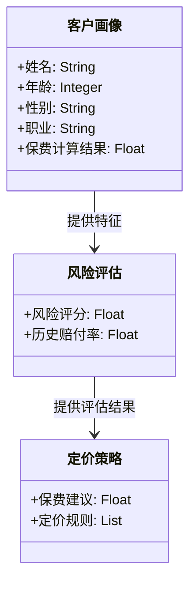
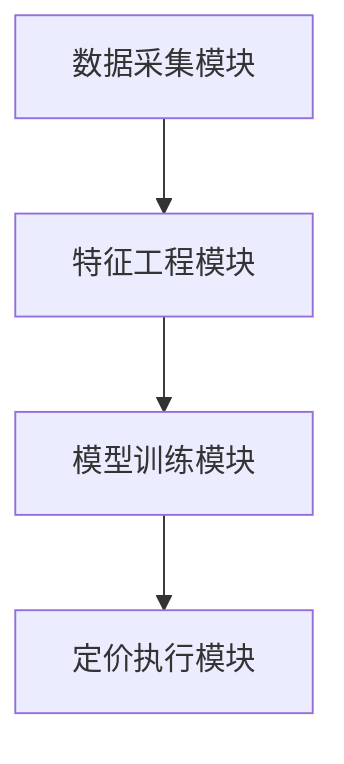

                 


# AI Agent在智能保险产品定价中的应用

## 关键词
AI Agent, 智能保险, 保险定价, 机器学习, 人工智能, 智能定价系统

## 摘要
本文深入探讨了AI Agent在智能保险产品定价中的应用，分析了传统保险定价方法的局限性，详细介绍了AI Agent的核心概念、算法原理及其在保险定价中的应用场景。通过实际案例分析，本文展示了如何利用AI Agent构建智能定价系统，包括系统架构设计、数据处理、模型训练和定价策略优化等关键环节。最后，本文总结了AI Agent在智能保险定价中的优势和挑战，并提出了未来研究的方向。

---

# 第1章: AI Agent与智能保险定价的背景介绍

## 1.1 AI Agent的基本概念
### 1.1.1 AI Agent的定义
AI Agent（人工智能代理）是一种能够感知环境、自主决策并执行任务的智能实体。它通过传感器获取数据，利用算法进行分析，并通过执行器完成目标。

### 1.1.2 AI Agent的核心特征
| 特征 | 描述 |
|------|------|
| 感知能力 | 能够从环境中获取信息（如客户数据、市场趋势等） |
| 决策能力 | 能够基于获取的信息做出最优决策 |
| 自主性 | 能够在没有人工干预的情况下独立运行 |
| 学习能力 | 能够通过经验不断优化自身的算法和策略 |

### 1.1.3 AI Agent在保险行业的应用潜力
AI Agent在保险行业的应用包括客户画像、风险评估、定价策略优化等。

---

## 1.2 智能保险产品定价的背景
### 1.2.1 传统保险定价方法的局限性
传统定价方法依赖人工经验，难以应对复杂多变的市场环境，且效率低下。

### 1.2.2 智能定价的需求与目标
智能定价旨在通过自动化技术提高定价效率和准确性，降低人工成本。

### 1.2.3 AI Agent在智能定价中的角色
AI Agent作为智能定价的核心技术，能够实时分析数据、优化定价策略并动态调整定价方案。

---

## 1.3 本章小结
本章介绍了AI Agent的基本概念及其在保险定价中的应用潜力，为后续章节奠定了基础。

---

# 第2章: AI Agent的核心概念与原理

## 2.1 AI Agent的感知模块
### 2.1.1 数据采集与特征提取
AI Agent通过传感器或API获取客户数据（如年龄、性别、职业等）并进行特征提取。

### 2.1.2 数据预处理与特征工程
数据预处理包括清洗、归一化和特征选择。特征工程通过提取高价值特征（如风险评分）提升模型性能。

### 2.1.3 概率论基础与贝叶斯定理
贝叶斯定理用于计算条件概率，公式为：
$$ P(A|B) = \frac{P(B|A) \cdot P(A)}{P(B)} $$

---

## 2.2 AI Agent的决策模块
### 2.2.1 决策树与随机森林
决策树是一种直观的分类方法，随机森林通过集成多个决策树提升准确性。

### 2.2.2 联合概率模型与马尔可夫链
联合概率模型用于评估多个事件同时发生的概率，马尔可夫链用于建模序列数据。

### 2.2.3 Q-learning算法与强化学习
Q-learning是一种强化学习算法，通过状态-动作价值函数优化决策策略。

---

## 2.3 AI Agent的执行模块
### 2.3.1 动态规划与策略优化
动态规划通过分阶段优化问题，策略优化通过调整参数提升模型性能。

### 2.3.2 多目标优化与权重分配
多目标优化通过权重分配平衡不同目标（如利润最大化和客户满意度）。

### 2.3.3 在线学习与自适应调整
在线学习算法能够实时更新模型参数，自适应调整定价策略。

---

## 2.4 本章小结
本章详细介绍了AI Agent的感知、决策和执行模块，为后续章节的系统设计奠定了基础。

---

# 第3章: 智能保险产品定价的系统分析与架构设计

## 3.1 问题场景介绍
### 3.1.1 客户画像与需求分析
通过分析客户数据（如年龄、职业）构建客户画像，识别不同客户群体的需求。

### 3.1.2 风险评估与保费计算
基于客户特征和历史数据，评估客户风险并计算保费。

### 3.1.3 定价策略优化与执行
通过优化定价策略提升保费收入，同时保持客户满意度。

---

## 3.2 系统功能设计
### 3.2.1 领域模型设计（Mermaid类图）


---

## 3.3 系统架构设计
### 3.3.1 模块划分
系统分为数据采集模块、特征工程模块、模型训练模块和定价执行模块。

### 3.3.2 模块交互（Mermaid流程图）


---

## 3.4 本章小结
本章通过系统分析与架构设计，明确了AI Agent在智能保险定价中的应用框架。

---

# 第4章: AI Agent在智能保险定价中的算法实现

## 4.1 算法选择与实现
### 4.1.1 选择随机森林算法
随机森林算法适合处理高维数据，能够有效避免过拟合。

### 4.1.2 实现步骤
1. 数据预处理
2. 特征工程
3. 模型训练
4. 模型评估

### 4.1.3 代码实现（Python）
```python
import pandas as pd
from sklearn.ensemble import RandomForestRegressor

# 数据加载
data = pd.read_csv('insurance_data.csv')

# 特征选择
features = ['age', 'gender', 'occupation']
target = 'premium'

# 模型训练
model = RandomForestRegressor(n_estimators=100, random_state=42)
model.fit(data[features], data[target])

# 模型预测
predictions = model.predict(data[features])
```

---

## 4.2 算法优化与调参
### 4.2.1 调整树的深度
通过调整树的深度防止过拟合。

### 4.2.2 调整随机森林中的参数
如n_estimators、max_depth等参数对模型性能的影响。

---

## 4.3 本章小结
本章通过实现随机森林算法，展示了AI Agent在智能保险定价中的具体应用。

---

# 第5章: 项目实战与案例分析

## 5.1 环境安装与数据准备
### 5.1.1 安装Python与相关库
安装Python 3.8以上版本，安装scikit-learn、pandas等库。

### 5.1.2 数据集准备
使用公开数据集（如Kaggle上的保险数据集）或模拟数据集。

---

## 5.2 系统核心实现
### 5.2.1 数据预处理
清洗数据、处理缺失值、归一化处理。

### 5.2.2 特征选择
选择高价值特征（如年龄、职业）。

### 5.2.3 模型训练
训练随机森林模型，保存模型参数。

### 5.2.4 定价策略优化
根据模型输出结果优化定价策略。

---

## 5.3 案例分析与结果解读
### 5.3.1 案例背景
假设一家保险公司希望优化健康保险的定价策略。

### 5.3.2 数据分析
分析客户特征与保费的关系，发现年龄越大，保费越高。

### 5.3.3 模型输出
模型预测保费为$1200，实际赔付率为$1000，定价策略合理。

---

## 5.4 本章小结
本章通过项目实战展示了AI Agent在智能保险定价中的具体应用，验证了算法的有效性。

---

# 第6章: 最佳实践与注意事项

## 6.1 最佳实践
### 6.1.1 数据质量的重要性
确保数据的准确性和完整性。

### 6.1.2 模型解释性
选择可解释性较强的算法，便于分析定价结果的原因。

### 6.1.3 模型更新
定期更新模型参数，适应市场变化。

---

## 6.2 注意事项
### 6.2.1 数据隐私
确保客户数据的安全性，遵守相关法律法规。

### 6.2.2 模型局限性
随机森林对特征工程的要求较高，需注意特征选择的合理性。

### 6.2.3 系统稳定性
确保系统的稳定运行，避免因模型故障导致定价错误。

---

## 6.3 本章小结
本章总结了AI Agent在智能保险定价中的最佳实践和注意事项，为实际应用提供了指导。

---

# 第7章: 未来展望与总结

## 7.1 未来发展方向
### 7.1.1 更复杂的定价模型
探索深度学习模型（如神经网络）的应用。

### 7.1.2 多维度数据融合
整合更多数据源（如社交媒体数据）提升定价准确性。

### 7.1.3 动态定价策略
实现实时定价，根据市场变化快速调整策略。

---

## 7.2 总结
AI Agent在智能保险定价中的应用前景广阔，能够显著提升定价效率和准确性，但需克服数据隐私和模型解释性等挑战。

---

# 作者：AI天才研究院/AI Genius Institute & 禅与计算机程序设计艺术 /Zen And The Art of Computer Programming

