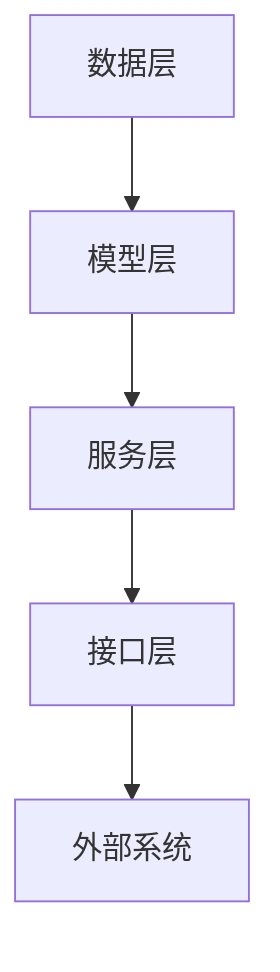

                 


# AI Agent在智能保险定价中的应用

---

## 关键词
AI Agent, 智能保险定价, 强化学习, 保险定价模型, 数据驱动定价

---

## 摘要
随着人工智能技术的快速发展，AI Agent（人工智能代理）在保险行业的应用逐渐成为焦点。本文探讨了AI Agent在智能保险定价中的应用，从理论基础到技术实现，再到实际应用，详细分析了AI Agent如何通过强化学习、神经网络等技术优化保险定价流程。文章还结合实际案例，展示了AI Agent在保险定价中的优势，并展望了未来的发展方向。

---

# 第一部分: AI Agent与保险定价的核心概念

## 第1章: AI Agent与保险定价的背景介绍

### 1.1 AI Agent的基本概念
AI Agent是一种能够感知环境、自主决策并执行任务的智能体。它通过接收输入信息，分析问题，制定策略，并采取行动来实现目标。

#### 1.1.1 AI Agent的定义
AI Agent是一种智能系统，能够根据环境信息做出决策并执行操作。它可以分为**反应式Agent**和**认知式Agent**两类：
- **反应式Agent**：基于当前感知做出反应，适用于实时任务。
- **认知式Agent**：具备推理、规划能力，适用于复杂场景。

#### 1.1.2 AI Agent的核心属性
- **感知能力**：通过传感器或数据输入获取信息。
- **决策能力**：基于感知信息做出最优决策。
- **执行能力**：通过执行器或接口将决策转化为行动。
- **学习能力**：通过经验优化自身行为。

#### 1.1.3 AI Agent与传统算法的区别
传统的机器学习算法（如线性回归、随机森林）依赖于固定的训练数据和模型结构，而AI Agent具备自主决策和适应环境的能力，能够动态优化策略。

### 1.2 保险定价的基本原理
保险定价是根据风险评估、市场需求和成本等因素，确定保险产品的价格。

#### 1.2.1 保险定价的定义
保险定价是保险公司根据风险评估和市场情况，确定保险产品的价格的过程。

#### 1.2.2 保险定价的关键因素
- **风险评估**：评估投保人的风险程度。
- **市场需求**：分析市场对保险产品的需求。
- **成本结构**：考虑保险公司的运营成本。

#### 1.2.3 保险定价的流程与挑战
保险定价的流程包括数据收集、模型选择、参数估计和定价策略制定。然而，传统定价方法面临数据不足、模型复杂和实时性差等挑战。

### 1.3 AI Agent在保险定价中的应用背景
随着大数据和AI技术的发展，保险行业正在向数字化和智能化转型。AI Agent通过实时数据处理和动态决策，为保险定价提供了新的解决方案。

#### 1.3.1 保险行业的数字化转型
保险公司通过数字化技术提升运营效率和客户体验。

#### 1.3.2 AI技术在保险行业的应用现状
AI技术在保险行业的应用包括风险评估、欺诈检测和客户画像等领域。

#### 1.3.3 AI Agent在保险定价中的独特优势
AI Agent能够实时分析市场变化和客户行为，动态调整定价策略，提升定价的精准性和响应速度。

### 1.4 本章小结
本章介绍了AI Agent的基本概念和保险定价的核心原理，分析了AI Agent在保险定价中的应用背景及其优势。

---

## 第2章: AI Agent与保险定价的核心概念

### 2.1 AI Agent的核心原理
AI Agent通过感知环境、决策和行动实现目标。

#### 2.1.1 状态表示
状态表示是AI Agent感知环境的关键，常用的表示方法包括特征向量和状态空间。

#### 2.1.2 行动选择
AI Agent根据当前状态选择最优行动，常用的方法包括贪心算法和策略优化。

#### 2.1.3 奖励机制
奖励机制是AI Agent学习的重要驱动力，通过奖励函数定义行动的好坏。

### 2.2 保险定价的核心要素
保险定价的核心要素包括风险评估、定价模型和定价策略。

#### 2.2.1 风险评估
风险评估是保险定价的基础，通过分析投保人的风险特征确定保费。

#### 2.2.2 定价模型
定价模型是保险定价的核心工具，常用的模型包括线性回归、决策树和神经网络。

#### 2.2.3 定价策略
定价策略是保险公司根据市场情况制定的定价方案，包括动态定价和差异化定价。

### 2.3 AI Agent与保险定价的结合点
AI Agent在保险定价中的应用点包括数据驱动的定价优化、智能决策和个性化定价。

#### 2.3.1 数据驱动的定价优化
通过大数据分析优化定价模型，提升定价的准确性和效率。

#### 2.3.2 智能决策的实现路径
AI Agent通过强化学习优化定价策略，实现动态定价和实时调整。

#### 2.3.3 个性化定价的潜力
AI Agent能够根据客户特征制定个性化定价策略，提升客户满意度和市场竞争力。

### 2.4 本章小结
本章详细阐述了AI Agent的核心原理和保险定价的核心要素，分析了AI Agent在保险定价中的应用点。

---

## 第3章: AI Agent在保险定价中的技术实现

### 3.1 AI Agent的算法原理
AI Agent的核心算法包括强化学习和神经网络。

#### 3.1.1 强化学习的基本原理
强化学习通过试错机制优化决策策略，常用的算法包括Q-learning和策略梯度。

#### 3.1.2 Q-learning算法
Q-learning是一种经典的强化学习算法，通过更新Q值函数优化决策策略。

#### 3.1.3 策略梯度算法
策略梯度算法直接优化策略，通过梯度下降更新参数。

### 3.2 保险定价的数学模型
保险定价的数学模型包括线性回归、决策树和神经网络。

#### 3.2.1 线性回归模型
线性回归模型通过最小二乘法拟合数据，适用于简单的线性关系。

#### 3.2.2 决策树模型
决策树模型通过树状结构进行分类和回归，适用于复杂的非线性关系。

#### 3.2.3 神经网络模型
神经网络模型通过多层神经元模拟人脑的神经网络，适用于复杂的模式识别。

### 3.3 AI Agent与定价模型的结合
AI Agent通过强化学习优化定价模型，提升定价的准确性和实时性。

#### 3.3.1 基于强化学习的定价优化
通过强化学习优化定价策略，实现动态定价和实时调整。

#### 3.3.2 基于神经网络的定价预测
通过神经网络模型预测客户行为，优化定价策略。

#### 3.3.3 基于树模型的定价策略
通过决策树模型分析客户特征，制定个性化定价策略。

### 3.4 本章小结
本章详细介绍了AI Agent的算法原理和保险定价的数学模型，分析了AI Agent与定价模型的结合方式。

---

## 第4章: 系统架构与数据流分析

### 4.1 系统架构设计
AI Agent在保险定价中的系统架构包括数据层、模型层、服务层和接口层。

#### 4.1.1 数据层
数据层负责存储和管理保险定价所需的数据，包括客户信息、历史数据和市场数据。

#### 4.1.2 模型层
模型层包括定价模型和强化学习模型，负责数据分析和决策优化。

#### 4.1.3 服务层
服务层负责接收请求、调用模型并返回结果，包括API接口和Web服务。

#### 4.1.4 接口层
接口层负责与外部系统的交互，包括数据输入和结果输出。

### 4.2 数据流分析
数据流分析包括数据输入、数据处理、模型计算和结果输出。

#### 4.2.1 数据输入
数据输入包括客户信息、历史数据和市场数据，通过API接口传入系统。

#### 4.2.2 数据处理
数据处理包括数据清洗、特征提取和数据转换，为模型计算提供输入。

#### 4.2.3 模型计算
模型计算包括强化学习算法优化定价策略，通过神经网络模型预测客户行为。

#### 4.2.4 结果输出
结果输出包括优化后的定价策略和实时调整建议，通过API接口返回给用户。

### 4.3 系统架构图


### 4.4 本章小结
本章详细描述了AI Agent在保险定价中的系统架构和数据流分析，展示了系统的整体结构和各部分的功能。

---

## 第5章: 项目实战与代码实现

### 5.1 项目环境配置
项目环境配置包括安装Python、TensorFlow和Scikit-learn等依赖库。

#### 5.1.1 安装Python
```bash
python --version
pip install --upgrade pip
```

#### 5.1.2 安装TensorFlow
```bash
pip install tensorflow
```

#### 5.1.3 安装Scikit-learn
```bash
pip install scikit-learn
```

### 5.2 数据准备与特征工程
数据准备包括数据清洗和特征提取，特征工程包括特征选择和特征变换。

#### 5.2.1 数据清洗
```python
import pandas as pd
data = pd.read_csv('insurance.csv')
data = data.dropna()
```

#### 5.2.2 特征工程
```python
from sklearn.preprocessing import StandardScaler
scaler = StandardScaler()
data_scaled = scaler.fit_transform(data)
```

### 5.3 强化学习模型实现
强化学习模型实现包括定义状态空间、动作空间和奖励函数。

#### 5.3.1 定义状态空间
```python
state_space = ['age', 'gender', 'income']
```

#### 5.3.2 定义动作空间
```python
action_space = ['low', 'medium', 'high']
```

#### 5.3.3 定义奖励函数
```python
def reward_function(current_price, target_price):
    return (target_price - current_price) ** 2
```

### 5.4 模型训练与优化
模型训练包括初始化Q值函数、更新Q值函数和保存模型参数。

#### 5.4.1 初始化Q值函数
```python
import numpy as np
q_values = np.zeros((len(state_space), len(action_space)))
```

#### 5.4.2 更新Q值函数
```python
alpha = 0.1
gamma = 0.9
q_values[state][action] = (1 - alpha) * q_values[state][action] + alpha * (reward + gamma * np.max(q_values[next_state]))
```

### 5.5 模型评估与部署
模型评估包括测试集验证和性能指标分析，模型部署包括API接口和Web服务。

#### 5.5.1 模型评估
```python
from sklearn.metrics import mean_squared_error
y_pred = model.predict(X_test)
rmse = mean_squared_error(y_true, y_pred)
```

#### 5.5.2 模型部署
```python
from flask import Flask
app = Flask(__name__)
@app.route('/price', methods=['POST'])
def predict_price():
    data = request.json
    price = model.predict(data)
    return jsonify({'price': price.tolist()})
```

### 5.6 本章小结
本章通过实际案例展示了AI Agent在保险定价中的应用，详细讲解了项目的环境配置、数据准备、模型实现和部署流程。

---

## 第6章: 总结与展望

### 6.1 总结
本文详细探讨了AI Agent在智能保险定价中的应用，从理论基础到技术实现，再到实际应用，全面分析了AI Agent的优势和潜力。

### 6.2 未来展望
未来，随着AI技术的不断发展，AI Agent在保险定价中的应用将更加广泛和深入。强化学习和神经网络等技术将进一步优化定价策略，个性化定价和动态定价将成为主流。

### 6.3 注意事项
在实际应用中，需要注意数据隐私、模型解释性和算法稳定性等问题。

### 6.4 小结
AI Agent在保险定价中的应用前景广阔，未来将为保险行业带来更大的变革和创新。

---

## 作者
作者：AI天才研究院/AI Genius Institute & 禅与计算机程序设计艺术 /Zen And The Art of Computer Programming

