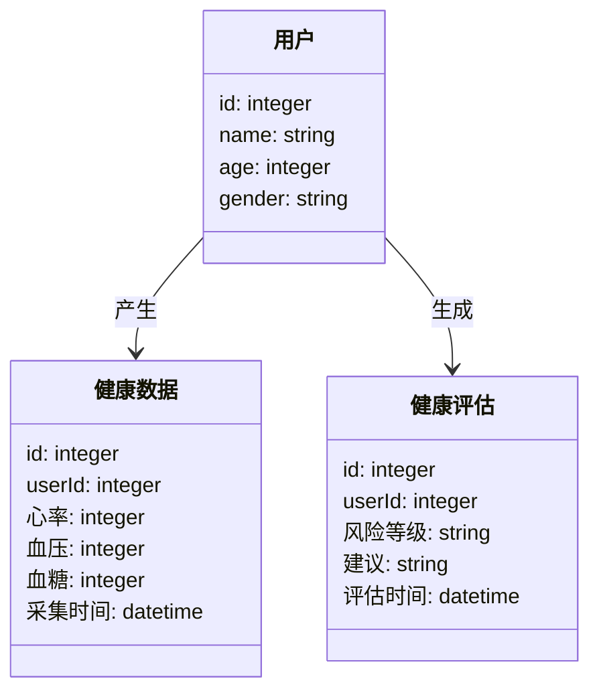
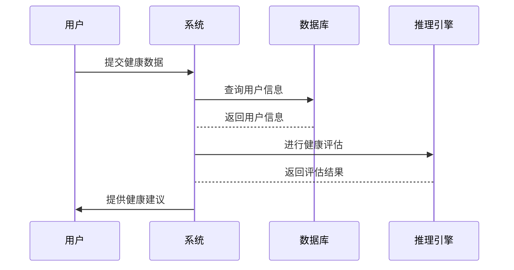

                 


# AI Agent在智能健康管理系统中的角色

---

## 关键词：AI Agent、智能健康管理系统、健康数据分析、行为决策支持、人工智能、健康风险评估

---

## 摘要

AI Agent（人工智能代理）作为一种智能实体，能够感知环境、自主决策并执行任务，在智能健康管理系统中扮演着越来越重要的角色。本文从AI Agent的核心概念出发，深入分析其在智能健康管理系统中的应用场景、技术原理及实际价值。通过对健康数据分析、行为决策支持、健康风险评估等关键环节的详细探讨，揭示AI Agent如何助力智能健康管理系统的智能化升级。文章最后展望了AI Agent在智能健康管理系统中的未来发展方向，为相关领域的研究和实践提供了参考。

---

# 第一部分：AI Agent 在智能健康管理系统中的背景与概念

## 第1章：AI Agent 的基本概念与背景介绍

### 1.1 AI Agent 的定义与核心概念

AI Agent（人工智能代理）是指能够感知环境、自主决策并执行任务的智能实体。它能够通过传感器或数据接口获取信息，并基于内置的算法和知识库进行分析、推理和决策，从而实现特定的目标。AI Agent的核心属性包括自主性、反应性、目标导向性和社会性。

#### AI Agent 的分类与应用场景

AI Agent可以分为以下几类：

- **基于规则的AI Agent**：通过预定义的规则进行决策，适用于简单且规则明确的任务。
- **基于模型的AI Agent**：依赖于数学模型和概率推理，适用于复杂且不确定性的场景。
- **基于学习的AI Agent**：通过机器学习算法不断优化自身行为，适用于需要动态适应的任务。

在智能健康管理系统中，AI Agent主要应用于健康数据监测、风险评估、行为引导和决策支持等领域。

---

### 1.2 智能健康管理系统的发展背景

#### 1.2.1 传统健康管理系统的局限性

传统的健康管理系统主要依赖人工操作和简单的数据记录，存在以下问题：

- 数据采集不全面，难以覆盖多维度的健康指标。
- 数据分析能力有限，难以提供个性化的健康建议。
- 缺乏智能化的决策支持，无法实现主动干预。

#### 1.2.2 AI 技术在健康管理系统中的引入

随着AI技术的快速发展，AI Agent被引入健康管理系统，通过智能化的数据分析、行为决策和个性化服务，弥补了传统系统的能力不足。

#### 1.2.3 AI Agent 在智能健康管理中的角色定位

AI Agent在智能健康管理系统中扮演着以下几个角色：

- **数据采集与分析**：实时采集用户的健康数据，并通过算法进行分析和处理。
- **风险评估与预警**：基于分析结果，评估用户的健康风险，并提供预警信息。
- **行为引导与决策支持**：根据用户的健康状况，提供个性化的健康建议和行为决策支持。

---

### 1.3 AI Agent 与智能健康管理系统的关系

#### 1.3.1 AI Agent 在智能健康管理系统中的功能定位

AI Agent是智能健康管理系统的核心组件之一，负责实现系统的智能化功能。它通过与用户交互、数据采集和系统集成，推动健康管理系统从被动响应向主动服务转变。

#### 1.3.2 AI Agent 与智能健康管理系统的交互机制

AI Agent与智能健康管理系统的交互机制主要包括以下几个方面：

- **数据输入**：通过传感器、 wearable devices 等设备获取用户的健康数据。
- **信息处理**：利用AI算法对数据进行分析、推理和决策。
- **结果输出**：通过用户界面或外部系统输出分析结果和决策建议。

#### 1.3.3 AI Agent 在智能健康管理系统中的价值体现

AI Agent的价值主要体现在以下几个方面：

- 提高系统的智能化水平，实现个性化的健康管理。
- 提升系统的响应速度和决策准确性，优化用户体验。
- 降低管理成本，提高健康管理的效率。

---

## 第2章：AI Agent 的核心概念与原理

### 2.1 AI Agent 的核心概念

#### 2.1.1 AI Agent 的核心属性与特征

- **自主性**：AI Agent能够自主决策和执行任务，无需人工干预。
- **反应性**：AI Agent能够实时感知环境变化，并做出相应的反应。
- **目标导向性**：AI Agent的行为以实现特定目标为导向。
- **社会性**：AI Agent能够与其他系统或用户进行交互和协作。

#### 2.1.2 AI Agent 的知识表示与推理方法

AI Agent的知识表示通常采用符号逻辑、概率模型或语义网络等方法。常见的推理方法包括逻辑推理、概率推理和案例推理。

---

### 2.2 AI Agent 的技术原理

#### 2.2.1 AI Agent 的行为决策机制

AI Agent的行为决策机制主要包括以下几个步骤：

1. **感知环境**：通过传感器或数据接口获取环境信息。
2. **知识表示与推理**：将获取的信息转化为知识，并通过推理算法进行分析。
3. **决策制定**：基于推理结果，选择最优的行为方案。
4. **执行任务**：根据决策结果执行相应的操作。

#### 2.2.2 AI Agent 的算法实现

AI Agent的算法实现主要依赖于机器学习和自然语言处理技术。常用的算法包括：

- **基于规则的算法**：如决策树、规则引擎。
- **基于模型的算法**：如马尔可夫决策过程（MDP）、强化学习（RL）。
- **基于学习的算法**：如支持向量机（SVM）、随机森林（RF）、神经网络（NN）。

---

### 2.3 AI Agent 的核心算法与实现

#### 2.3.1 基于规则的 AI Agent 实现

基于规则的AI Agent通过预定义的规则进行决策，适用于规则明确且变化较小的场景。其实现步骤如下：

1. **规则定义**：根据业务需求定义规则。
2. **规则匹配**：将输入的数据与规则进行匹配。
3. **规则执行**：根据匹配结果执行相应的操作。

#### 2.3.2 基于模型的 AI Agent 实现

基于模型的AI Agent通过构建数学模型进行推理和决策。常用的模型包括：

- **马尔可夫决策过程（MDP）**：用于处理具有状态转移的决策问题。
- **贝叶斯网络（BN）**：用于处理不确定性问题。

#### 2.3.3 基于强化学习的 AI Agent 实现

基于强化学习的AI Agent通过与环境的交互不断优化自身的决策策略。其实现步骤如下：

1. **环境建模**：构建环境模型，定义状态、动作和奖励。
2. **策略选择**：选择一个初始策略。
3. **动作执行**：根据当前策略执行动作。
4. **奖励反馈**：根据环境反馈获得奖励。
5. **策略优化**：根据奖励更新策略。

---

## 第3章：AI Agent 在智能健康管理系统中的应用场景

### 3.1 健康数据监测与管理

AI Agent可以通过传感器和智能设备实时采集用户的健康数据，如心率、血压、血糖等。通过数据融合和分析，AI Agent能够识别异常数据并发出预警。

#### 3.1.1 数据采集与融合

AI Agent通过多种传感器（如心率传感器、温度传感器）采集数据，并利用数据融合技术（如加权平均、卡尔曼滤波）进行数据处理。

#### 3.1.2 数据分析与异常检测

AI Agent利用统计分析和机器学习算法（如支持向量机、随机森林）对健康数据进行分析，并识别异常值。

### 3.2 健康风险评估与预测

AI Agent可以通过分析用户的健康数据和生活习惯，评估用户的健康风险，并预测未来可能出现的健康问题。

#### 3.2.1 健康风险评估模型

AI Agent可以构建健康风险评估模型，如基于逻辑回归的糖尿病风险评估模型。

#### 3.2.2 健康风险预测

AI Agent可以利用时间序列分析（如ARIMA、LSTM）预测用户的健康风险。

### 3.3 健康行为引导与决策支持

AI Agent可以根据用户的健康状况和生活习惯，提供个性化的健康建议和行为决策支持。

#### 3.3.1 个性化健康建议

AI Agent可以根据用户的健康数据和生活习惯，推荐个性化的饮食、运动和用药方案。

#### 3.3.2 行为决策支持

AI Agent可以通过分析用户的行为数据，提供行为决策支持，如提醒用户按时服药、建议用户避免高风险活动。

---

## 第4章：系统分析与架构设计

### 4.1 问题场景介绍

智能健康管理系统需要实现以下功能：

- 实时采集用户的健康数据。
- 分析用户的健康数据并评估健康风险。
- 提供个性化的健康建议和行为决策支持。

### 4.2 系统功能设计

#### 4.2.1 领域模型设计

领域模型设计如下：



#### 4.2.2 系统架构设计

系统架构设计如下：


### 4.3 系统接口设计

系统接口设计如下：



---

## 第5章：项目实战

### 5.1 环境安装与配置

项目需要以下环境：

- Python 3.8+
- pip
- TensorFlow 2.0+
- scikit-learn
- matplotlib

安装命令：

```bash
pip install numpy
pip install scikit-learn
pip install matplotlib
pip install tensorflow
```

### 5.2 核心代码实现

#### 5.2.1 数据预处理

```python
import numpy as np
import pandas as pd
from sklearn.model_selection import train_test_split
from sklearn.preprocessing import StandardScaler

# 加载数据
data = pd.read_csv('health_data.csv')

# 分割特征与标签
X = data.drop(columns=['健康风险'])
y = data['健康风险']

# 数据标准化
scaler = StandardScaler()
X_scaled = scaler.fit_transform(X)

# 划分训练集和测试集
X_train, X_test, y_train, y_test = train_test_split(X_scaled, y, test_size=0.2, random_state=42)
```

#### 5.2.2 模型训练

```python
from sklearn.ensemble import RandomForestClassifier

# 初始化模型
model = RandomForestClassifier(n_estimators=100, random_state=42)

# 训练模型
model.fit(X_train, y_train)

# 预测标签
y_pred = model.predict(X_test)

# 输出准确率
print(f'准确率: {model.score(X_test, y_test)}')
```

### 5.3 案例分析

通过上述代码实现的健康风险评估模型，可以对用户的数据进行预测，并提供个性化的健康建议。

---

## 第6章：最佳实践与注意事项

### 6.1 最佳实践

- **数据隐私保护**：在处理用户数据时，必须遵守数据隐私保护法规，确保用户数据的安全性。
- **模型优化**：定期更新模型，以应对数据分布的变化和用户需求的演变。
- **用户体验优化**：设计友好的用户界面，提升用户体验。

### 6.2 小结

AI Agent在智能健康管理系统中的应用前景广阔。通过实时数据采集、智能分析和个性化服务，AI Agent能够显著提升健康管理的效率和效果。

---

## 第7章：未来展望

随着AI技术的不断发展，AI Agent在智能健康管理系统中的角色将更加重要。未来的智能健康管理系统将更加智能化、个性化和人性化，为用户提供更加全面和精准的健康服务。

---

## 作者

作者：AI天才研究院（AI Genius Institute） & 禅与计算机程序设计艺术（Zen And The Art of Computer Programming）

---

以上是《AI Agent在智能健康管理系统中的角色》的完整目录和内容框架。如需进一步修改或补充，请随时告知！

