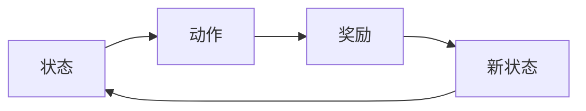
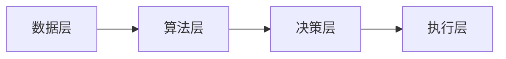

                 


# AI Agent在智能公共卫生应急中的角色

> 关键词：AI Agent, 公共卫生应急, 强化学习, 图神经网络, 系统架构

> 摘要：  
本文探讨了AI Agent在智能公共卫生应急中的角色与应用。通过分析AI Agent的核心原理、算法模型及系统架构，结合实际应用场景，揭示了AI Agent在疾病传播预测、资源优化配置和应急响应中的重要作用。文章还详细介绍了强化学习和图神经网络等算法在公共卫生应急中的应用，并通过实际案例展示了AI Agent的实现过程。最后，本文总结了AI Agent的优势与挑战，并展望了其未来发展方向。

---

## 第一章: AI Agent与公共卫生应急的背景

### 1.1 AI Agent的基本概念

AI Agent（人工智能代理）是指能够感知环境、自主决策并执行任务的智能实体。它通过传感器获取信息，利用算法进行分析，并通过执行器采取行动以实现目标。AI Agent具有以下特点：

1. **自主性**：能够在没有外部干预的情况下独立运行。
2. **反应性**：能够实时感知环境变化并做出响应。
3. **学习性**：能够通过经验改进自身的决策能力。
4. **协作性**：能够与其他AI Agent或人类协同工作。

在公共卫生应急中，AI Agent可以用于疫情预测、资源调度、应急响应等任务，帮助人类更高效地应对突发事件。

### 1.2 公共卫生应急的背景与挑战

公共卫生应急是指对突发公共卫生事件（如传染病爆发、自然灾害等）进行预防、控制和救援的过程。公共卫生应急的核心挑战包括：

1. **信息不透明**：突发事件往往具有不确定性，信息收集和处理效率低下。
2. **资源分配困难**：医疗资源的分配需要高效协调，否则可能导致资源浪费或短缺。
3. **决策时间紧迫**：突发事件往往需要快速决策，传统的被动响应方式难以满足需求。

AI Agent的引入为解决这些问题提供了新的可能性。通过实时数据分析和智能决策，AI Agent能够显著提升公共卫生应急的响应效率和准确性。

### 1.3 AI Agent在公共卫生应急中的作用

AI Agent在公共卫生应急中的作用主要体现在以下几个方面：

1. **实时监测与预警**：通过整合多种数据源（如病例报告、社交媒体信息等），AI Agent能够快速识别潜在的公共卫生事件并发出预警。
2. **资源优化配置**：AI Agent可以根据实时数据动态调整医疗资源的分配，确保资源的高效利用。
3. **应急响应与协调**：在突发事件发生后，AI Agent可以协助制定应急响应计划，协调各部门的行动，提高整体应对能力。

通过AI Agent的应用，公共卫生应急的响应效率和决策质量得到了显著提升。

---

## 第二章: AI Agent的核心原理

### 2.1 AI Agent的感知模块

AI Agent的感知模块负责从环境中获取信息。在公共卫生应急中，信息来源包括：

- **病例数据**：医院、诊所等医疗机构上报的病例信息。
- **社交媒体数据**：社交媒体上的用户言论、图片等。
- **新闻报道**：新闻媒体发布的公共卫生事件相关信息。

感知模块需要对这些信息进行清洗、整合和分析，提取有价值的数据用于后续决策。

### 2.2 AI Agent的决策模块

AI Agent的决策模块是其核心部分，负责根据感知到的信息制定行动方案。常用的决策算法包括强化学习和基于规则的推理。

#### 2.2.1 强化学习算法

强化学习是一种通过试错方式优化决策的算法。AI Agent通过与环境的交互获得奖励或惩罚，逐步优化自身的决策策略。

##### 强化学习算法流程图（使用mermaid）



#### 2.2.2 基于规则的推理

基于规则的推理是一种通过预设规则进行决策的方法。这种方法适用于规则明确、场景简单的公共卫生应急场景。

### 2.3 AI Agent的执行模块

AI Agent的执行模块负责根据决策模块的指令采取行动。在公共卫生应急中，行动可能包括：

- **发布预警信息**：通过短信、邮件等方式通知相关人员。
- **调配医疗资源**：协调医院、救护车等资源进行快速响应。
- **制定隔离方案**：根据疫情传播情况制定隔离措施。

---

## 第三章: AI Agent在公共卫生应急中的应用场景

### 3.1 疾病传播预测与防控

AI Agent可以通过分析历史病例数据和实时信息，预测疾病传播趋势并制定防控策略。

#### 3.1.1 疾病传播模型的构建

疾病传播模型通常包括以下步骤：

1. **数据收集**：收集病例数据、人口流动数据等。
2. **模型选择**：选择适合的模型（如SIR模型）。
3. **参数优化**：通过历史数据优化模型参数。
4. **预测与分析**：根据模型预测未来病例数。

#### 3.1.2 AI Agent在疫情预测中的应用

AI Agent可以通过实时更新模型参数，动态预测疫情发展趋势，为决策者提供科学依据。

### 3.2 公共卫生资源的优化配置

AI Agent可以通过优化算法，实现医疗资源的高效分配。

#### 3.2.1 资源分配的数学模型

资源分配问题可以转化为一个优化问题，目标是最小化资源浪费或最大化资源利用率。

#### 3.2.2 AI Agent在资源调度中的应用

AI Agent可以根据实时需求动态调整资源分配方案，确保资源的高效利用。

### 3.3 应急响应与协调

AI Agent可以通过协调各部门的行动，提高应急响应效率。

#### 3.3.1 应急响应流程的优化

AI Agent可以通过优化算法，制定最优的应急响应流程。

#### 3.3.2 AI Agent在多部门协作中的作用

AI Agent可以作为协调者，帮助各部门之间实现高效协作。

---

## 第四章: AI Agent的核心算法与数学模型

### 4.1 强化学习算法

强化学习是一种通过试错方式优化决策的算法。在公共卫生应急中，强化学习可以应用于资源分配、应急响应等场景。

#### 4.1.1 强化学习的基本原理

强化学习的核心是通过与环境的交互获得奖励或惩罚，逐步优化决策策略。

#### 4.1.2 Q-Learning算法的实现

Q-Learning是一种常用的强化学习算法，其核心思想是通过更新Q表来优化决策。

##### Q-Learning算法流程图（使用mermaid）


### 4.2 图神经网络算法

图神经网络是一种适用于处理图结构数据的深度学习算法。在公共卫生应急中，图神经网络可以用于建模人际关系、地理位置等复杂关系。

#### 4.2.1 图神经网络的基本原理

图神经网络通过将数据建模为图结构，利用节点之间的关系进行信息传播和特征提取。

#### 4.2.2 图神经网络在公共卫生应急中的应用

图神经网络可以应用于疾病传播预测、资源分配优化等场景。

---

## 第五章: AI Agent的系统架构设计

### 5.1 系统功能设计

公共卫生应急AI Agent系统的主要功能包括：

1. **数据采集与处理**：整合多源数据，清洗、转换和存储。
2. **智能决策**：基于算法模型进行决策，生成行动方案。
3. **行动执行**：通过接口与外部系统交互，执行决策方案。
4. **反馈与优化**：根据执行结果反馈优化决策策略。

### 5.2 系统架构设计

公共卫生应急AI Agent系统的架构设计如下：

1. **数据层**：存储病例数据、资源信息等。
2. **算法层**：实现强化学习、图神经网络等算法。
3. **决策层**：根据算法结果生成决策指令。
4. **执行层**：通过接口与外部系统交互，执行决策指令。

#### 系统架构图（使用mermaid）



---

## 第六章: AI Agent的项目实战

### 6.1 项目背景

本项目旨在开发一个基于AI Agent的公共卫生应急响应系统，用于疫情预测与防控。

### 6.2 环境配置

项目所需环境包括：

- **Python**：3.8+
- **TensorFlow**：2.4+
- **NetworkX**：用于图数据处理

### 6.3 核心代码实现

以下是项目的核心代码实现：

#### 6.3.1 数据处理

```python
import pandas as pd

# 加载数据
data = pd.read_csv('cases.csv')

# 数据清洗
data = data.dropna()
```

#### 6.3.2 疾病传播模型

```python
from sklearn.model_selection import train_test_split

# 划分训练集和测试集
X_train, X_test, y_train, y_test = train_test_split(data.drop('cases', axis=1), data['cases'], test_size=0.2)
```

#### 6.3.3 强化学习算法实现

```python
import numpy as np

# Q-Learning算法实现
class QLearning:
    def __init__(self, state_space, action_space):
        self.state_space = state_space
        self.action_space = action_space
        self.Q = np.zeros((state_space, action_space))
    
    def choose_action(self, state, epsilon):
        if np.random.random() < epsilon:
            return np.random.randint(self.action_space)
        else:
            return np.argmax(self.Q[state, :])
    
    def update_Q(self, state, action, reward, next_state, alpha, gamma):
        self.Q[state, action] = (1 - alpha) * self.Q[state, action] + alpha * (reward + gamma * np.max(self.Q[next_state, :]))
```

---

## 第七章: 总结与展望

### 7.1 本章小结

本文详细探讨了AI Agent在公共卫生应急中的角色与应用。通过分析AI Agent的核心原理、算法模型及系统架构，结合实际应用场景，揭示了AI Agent在疾病传播预测、资源优化配置和应急响应中的重要作用。

### 7.2 最佳实践与注意事项

1. **数据质量**：确保数据的准确性和完整性。
2. **算法选择**：根据具体场景选择合适的算法。
3. **系统安全性**：确保系统的稳定性和安全性。

### 7.3 未来展望

随着AI技术的不断发展，AI Agent在公共卫生应急中的应用前景广阔。未来，可以通过以下方向进一步优化：

1. **多模态数据融合**：整合文本、图像等多种数据源。
2. **强化学习的优化**：进一步提升强化学习算法的效率和效果。
3. **人机协作**：实现AI Agent与人类专家的高效协作。

---

作者：AI天才研究院/AI Genius Institute & 禅与计算机程序设计艺术 /Zen And The Art of Computer Programming

