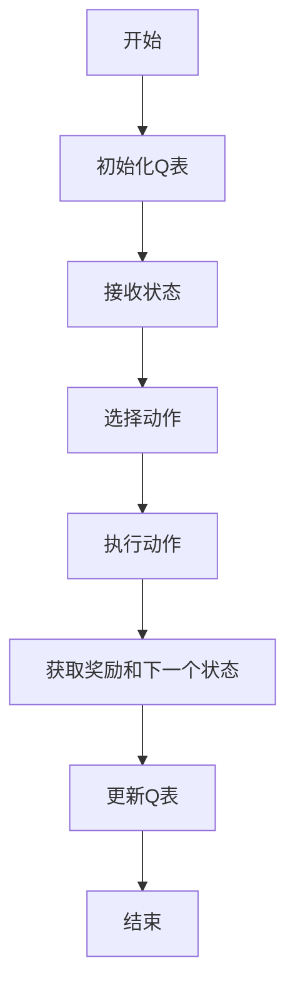
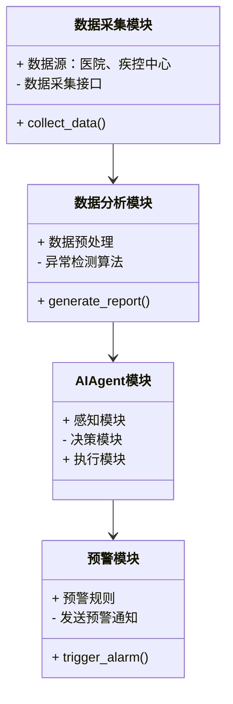
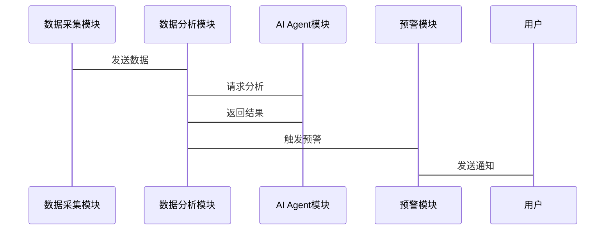

                 


# AI Agent在智能公共卫生监测中的角色

> 关键词：AI Agent, 公共卫生监测, 强化学习, 系统架构设计, 项目实战

> 摘要：本文探讨AI Agent在公共卫生监测中的角色，从核心概念、算法原理到系统架构设计，再到项目实战和最佳实践，全面分析其应用和实现。

---

## 第一部分：背景介绍

### 第1章：公共卫生监测与AI Agent概述

#### 1.1 公共卫生监测的基本概念

公共卫生监测是通过收集、分析和解释健康相关数据，以识别和评估健康问题的过程。其目的是早期发现疾病暴发、评估健康风险，并采取预防措施。传统方法依赖人工收集和分析数据，效率低下且容易出错。

#### 1.2 AI Agent的定义与作用

AI Agent是一种智能代理，能够感知环境、自主决策并执行任务。在公共卫生监测中，AI Agent用于实时数据处理、异常检测和决策支持，显著提高监测效率和准确性。

#### 1.3 公共卫生监测中AI Agent的应用场景

- **疾病传播监测**：实时跟踪疾病传播路径，预测疫情发展趋势。
- **疫情预警**：通过分析数据，提前发现潜在疫情。
- **数据收集与分析**：整合多源数据，提供全面的健康状况分析。

---

## 第二部分：核心概念与联系

### 第2章：AI Agent的核心概念与原理

#### 2.1 AI Agent的核心原理

AI Agent的工作流程包括感知、决策和执行三个环节。感知模块通过传感器或数据源获取信息，决策模块基于感知结果做出判断，执行模块根据决策执行任务。

#### 2.2 AI Agent的属性特征对比

| 特性             | 基于规则的AI Agent | 基于模型的AI Agent |
|------------------|--------------------|---------------------|
| 决策方式         | 预定义规则         | 基于模型预测       |
| 复杂性           | 低                 | 高                 |
| 适应性           | 低                 | 高                 |

#### 2.3 实体关系图（ER图）

```mermaid
erd
  entity 数据源 [ description = 数据来源，如医院、疾控中心 ] {
    [id]
    [数据类型]
  }
  entity AI Agent [ description = 智能代理，负责数据处理和决策 ] {
    [id]
    [处理逻辑]
  }
  entity 公共卫生监测系统 [ description = 监测平台，整合数据和AI Agent结果 ] {
    [id]
    [功能模块]
  }
  数据源 --> AI Agent
  AI Agent --> 公共卫生监测系统
```

---

## 第三部分：算法原理讲解

### 第3章：AI Agent的算法原理

#### 3.1 强化学习算法

强化学习通过试错机制优化决策策略。AI Agent在环境中通过与环境互动，学习最优策略。以下是Q-learning算法的实现：

```python
import numpy as np

class QLearningAgent:
    def __init__(self, state_space, action_space):
        self.state_space = state_space
        self.action_space = action_space
        self.Q = np.zeros((state_space, action_space))
        self.lr = 0.1
        self.gamma = 0.9

    def choose_action(self, state):
        return np.argmax(self.Q[state, :])

    def update_Q(self, state, action, reward, next_state):
        self.Q[state, action] += self.lr * (reward + self.gamma * np.max(self.Q[next_state, :]))
```

#### 3.2 算法流程图



---

## 第四部分：系统分析与架构设计

### 第4章：系统分析与架构设计

#### 4.1 问题场景介绍

设计一个疫情监测系统，实时收集和分析数据，识别异常情况并发出预警。

#### 4.2 系统功能设计

领域模型：



#### 4.3 系统架构设计

系统架构：

```mermaid
archi
    component 数据采集模块
    component 数据分析模块
    component AI Agent模块
    component 预警模块
    数据采集模块 --> 数据分析模块
    数据分析模块 --> AI Agent模块
    AI Agent模块 --> 预警模块
```

#### 4.4 接口设计与交互流程图

序列图：



---

## 第五部分：项目实战

### 第5章：项目实战

#### 5.1 环境安装

安装必要的库：

```bash
pip install numpy pandas scikit-learn flask
```

#### 5.2 核心代码实现

AI Agent接口：

```python
from flask import Flask, jsonify

app = Flask(__name__)

@app.route('/analyze', methods=['POST'])
def analyze():
    data = request.json
    result = ai_agent.process(data)
    return jsonify(result)

if __name__ == '__main__':
    app.run()
```

#### 5.3 代码解读与案例分析

案例分析：某次疫情的数据处理，AI Agent如何识别异常并触发预警。

---

## 第六部分：最佳实践

### 第6章：最佳实践

#### 6.1 小结

AI Agent在公共卫生监测中的应用显著提高了效率和准确性。

#### 6.2 注意事项

- 数据隐私和安全
- 算法的可解释性
- 系统的鲁棒性

#### 6.3 未来展望

- 多模态数据的应用
- 更智能的决策算法
- 更广泛的领域应用

---

作者：AI天才研究院/AI Genius Institute & 禅与计算机程序设计艺术 /Zen And The Art of Computer Programming

