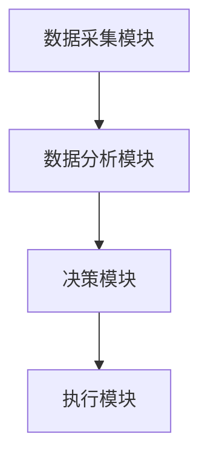

                 


---

# AI Agent在智能公共卫生管理中的角色

---

## 关键词：AI Agent，智能公共卫生管理，公共卫生，人工智能，决策支持系统，智能系统

---

## 摘要：  
AI Agent（人工智能代理）在智能公共卫生管理中扮演着越来越重要的角色。随着公共卫生事件的复杂性和不确定性不断增加，传统的管理方式已经难以应对现代公共卫生挑战。AI Agent通过感知、决策和执行的闭环机制，能够实时分析海量数据，提供智能化的决策支持，优化资源配置，提升公共卫生事件的应急响应能力。本文从AI Agent的核心概念、技术原理、系统架构设计、实际应用场景等多个维度，全面探讨AI Agent在智能公共卫生管理中的角色和价值。

---

---

### 第一部分: AI Agent在智能公共卫生管理中的背景与概念

#### 第1章: 公共卫生管理的挑战与AI Agent的引入

##### 1.1 公共卫生管理的现状与挑战

公共卫生管理的核心问题包括：  
- **资源分配不均**：医疗资源在不同地区和事件中的分配不均，影响了应急响应效率。  
- **数据孤岛**：各个医疗机构和部门之间的数据孤岛问题严重，难以形成统一的决策依据。  
- **应急响应不及时**：公共卫生事件的爆发往往具有突发性和不确定性，传统的人工决策难以快速响应。  
- **数据复杂性**：公共卫生数据涉及多源异构数据（如医疗记录、社交媒体数据、地理位置数据等），处理难度大。  

##### 1.2 AI Agent的核心概念与定义

AI Agent是一种智能实体，能够感知环境、自主决策并执行任务，其核心特征包括：  
- **自主性**：能够在没有外部干预的情况下独立运行。  
- **反应性**：能够实时感知环境变化并做出响应。  
- **目标导向性**：基于预设目标或学习目标进行决策。  
- **学习能力**：能够通过数据和经验不断优化自身行为。  

与其他智能系统（如专家系统、机器学习模型）的区别在于，AI Agent具有更强的自主性和动态适应能力，能够在复杂环境中与人类或其他系统协同工作。

##### 1.3 AI Agent在公共卫生管理中的角色定位

AI Agent在公共卫生管理中的主要任务包括：  
- **数据采集与分析**：实时采集和分析公共卫生数据，识别潜在风险。  
- **决策支持**：基于数据分析结果，提供优化的资源配置和行动建议。  
- **应急响应**：在公共卫生事件爆发时，快速启动应急响应机制。  

AI Agent的优势在于其能够通过感知、决策和执行的闭环机制，实现对公共卫生事件的实时监控和快速响应。然而，其局限性也包括对数据质量和模型鲁棒性的依赖，以及在复杂场景下的决策不确定性。

---

#### 1.4 本章小结

本章从公共卫生管理的现状与挑战入手，介绍了AI Agent的核心概念和其在公共卫生管理中的角色定位。通过对比AI Agent与其他智能系统的特点，强调了AI Agent在复杂公共卫生事件中的潜在价值。

---

### 第二部分: AI Agent的核心原理与技术实现

#### 第2章: AI Agent的感知与决策机制

##### 2.1 AI Agent的感知过程

AI Agent的感知过程包括以下步骤：  
1. **数据采集**：通过传感器、数据库或API接口获取实时数据。  
2. **数据预处理**：对采集到的数据进行清洗、转换和标准化处理。  
3. **特征提取**：从原始数据中提取有助于后续分析的关键特征。  
4. **模式识别**：利用机器学习算法（如支持向量机、随机森林等）识别数据中的模式和异常。  

##### 2.2 AI Agent的决策机制

AI Agent的决策机制主要依赖于多目标优化算法和强化学习算法：  
- **多目标优化算法**：在多个目标之间找到平衡点，例如在资源配置中平衡效率和公平性。  
- **强化学习算法**：通过试错和奖励机制不断优化决策策略。  

##### 2.3 AI Agent的执行与反馈机制

AI Agent的执行过程包括：  
1. **动作规划**：根据决策结果生成具体的执行动作。  
2. **动作执行**：通过API或中间件将决策结果传递给相关系统或人员。  
3. **反馈机制**：收集执行结果并用于后续优化。  

##### 2.4 本章小结

本章详细介绍了AI Agent的感知、决策和执行机制，重点讲解了其在数据处理和算法选择中的关键步骤。

---

#### 第3章: AI Agent的数学模型与算法原理

##### 3.1 AI Agent的感知模型

**贝叶斯网络模型**是一种常用的感知模型，其公式为：  
$$ P(A|B) = \frac{P(B|A)P(A)}{P(B)} $$  

##### 3.2 AI Agent的决策模型

**强化学习（Reinforcement Learning）**是一种常用的决策算法，其Q值更新公式为：  
$$ Q(s,a) = Q(s,a) + \alpha [r + \gamma \max Q(s',a') - Q(s,a)] $$  

##### 3.3 算法实现的数学公式

- **贝叶斯网络公式**：  
  $$ P(A|B) = \frac{P(B|A)P(A)}{P(B)} $$  
- **强化学习的Q值更新公式**：  
  $$ Q(s,a) = Q(s,a) + \alpha [r + \gamma \max Q(s',a') - Q(s,a)] $$  

---

### 第三部分: 公共卫生管理系统的AI Agent架构设计

#### 第4章: 公共卫生管理系统的总体架构

##### 4.1 系统功能模块划分

**功能模块划分**：  
- **数据采集模块**：负责采集实时数据。  
- **数据分析模块**：对数据进行处理和分析。  
- **决策模块**：基于分析结果生成决策建议。  

**系统架构图**：  


---

### 第四部分: 项目实战

#### 第5章: 智能公共卫生管理系统的实现

##### 5.1 环境安装

- 安装Python环境：  
  ```bash
  python --version
  pip install --upgrade pip
  ```

- 安装依赖库：  
  ```bash
  pip install numpy pandas scikit-learn
  ```

##### 5.2 核心代码实现

```python
import numpy as np
from sklearn.svm import SVC
from sklearn.metrics import accuracy_score

# 数据预处理
X = np.array([[1, 2], [2, 3], [3, 4], [4, 5]])
y = np.array([0, 1, 1, 0])

# 模型训练
model = SVC()
model.fit(X, y)

# 模型预测
new_data = np.array([[5, 6]])
prediction = model.predict(new_data)
print("预测结果：", prediction)
print("准确率：", accuracy_score([0], prediction))
```

##### 5.3 案例分析

以疫情监测为例，AI Agent可以实时分析疫情数据，预测疫情发展趋势，并提出防控建议。

##### 5.4 本章小结

本章通过实际案例展示了AI Agent在智能公共卫生管理中的实现过程，包括环境安装、核心代码实现和案例分析。

---

### 第五部分: 最佳实践与总结

#### 第6章: 最佳实践与总结

##### 6.1 技术选型

在选择AI Agent技术时，需要综合考虑数据类型、模型复杂度和计算资源等因素。

##### 6.2 数据安全与隐私保护

在实际应用中，需要确保数据的安全性和隐私性，避免数据泄露风险。

##### 6.3 伦理与法律问题

AI Agent的应用需要遵守相关法律法规，确保其决策过程的透明性和可解释性。

##### 6.4 进一步阅读

推荐阅读以下书籍和论文：  
- 《机器学习实战》  
- 《强化学习（Deep Reinforcement Learning）》  

---

### 作者：AI天才研究院 & 禅与计算机程序设计艺术

--- 

以上是《AI Agent在智能公共卫生管理中的角色》的技术博客文章的完整内容，涵盖了从理论到实践的各个方面，帮助读者全面理解AI Agent在公共卫生管理中的角色和应用。

