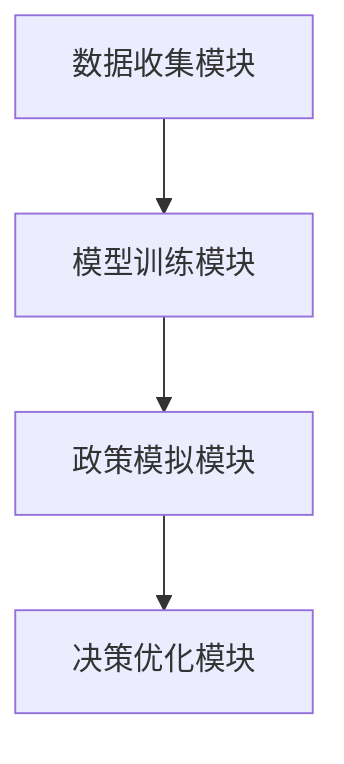

                 


# AI Agent在智能公共政策制定中的应用

> 关键词：AI Agent, 公共政策, 智能决策, 强化学习, 多智能体系统, 政策模拟

> 摘要：  
本文探讨了AI Agent在智能公共政策制定中的应用，详细分析了AI Agent的基本概念、核心算法、系统架构以及实际应用场景。通过结合强化学习、多智能体系统等技术，AI Agent能够显著提升政策制定的效率和科学性。文章还通过实际案例展示了AI Agent在公共政策制定中的优势，并提出了未来研究的方向。

---

# 第一部分: 引言

## 第1章: AI Agent与公共政策制定的背景

### 1.1 AI Agent的基本概念

AI Agent（人工智能代理）是指能够感知环境、自主决策并采取行动以实现目标的智能实体。与传统程序不同，AI Agent具备以下核心特征：
1. **自主性**：能够在没有外部干预的情况下独立运行。
2. **反应性**：能够实时感知环境并做出反应。
3. **目标导向**：所有行为均以实现特定目标为导向。
4. **学习能力**：能够通过经验改进自身的决策能力。

AI Agent可以分为**简单反射型**、**基于模型的反应型**、**目标驱动型**和**效用驱动型**四种类型，每种类型在政策制定中的应用场景也有所不同。

### 1.2 公共政策制定的背景与挑战

公共政策制定是一个复杂的过程，涉及经济、社会、环境等多个领域。传统的政策制定方法依赖于专家经验和数据分析，但存在以下问题：
1. **效率低下**：政策制定过程耗时较长，且容易受到主观因素的影响。
2. **数据孤岛**：各部门之间的数据往往分散，难以形成统一的决策依据。
3. **不可预测性**：政策实施后的效果难以准确预测，导致调整成本较高。

### 1.3 AI Agent在公共政策中的应用前景

AI Agent的引入为公共政策制定带来了新的可能性。通过实时数据分析和模拟，AI Agent能够帮助决策者更快速、更准确地制定政策。例如，在交通管理领域，AI Agent可以通过实时监控交通流量，动态调整信号灯配时，从而缓解拥堵问题。

---

## 第2章: AI Agent的核心概念与原理

### 2.1 AI Agent的结构与工作原理

AI Agent的内部结构可以分为四个主要模块：
1. **知识库模块**：存储与政策制定相关的知识和数据。
2. **感知模块**：通过传感器或数据接口获取环境信息。
3. **决策模块**：基于感知信息和知识库进行分析，生成决策方案。
4. **执行模块**：将决策方案转化为具体行动。

AI Agent的工作流程如下：
1. **感知环境**：通过传感器或数据接口获取环境信息。
2. **分析数据**：结合知识库中的数据，分析当前状态。
3. **生成决策**：基于分析结果，生成决策方案。
4. **执行决策**：将决策方案转化为具体行动。

### 2.2 AI Agent的核心算法

AI Agent的核心算法主要包括强化学习（Reinforcement Learning）、监督学习（Supervised Learning）和非监督学习（Unsupervised Learning）。

- **强化学习**：通过试错机制不断优化决策策略。例如，Q-learning算法是一种经典的强化学习算法，其核心思想是通过不断更新Q值来优化决策。
- **监督学习**：基于标注数据进行训练，适用于有监督的决策任务。例如，决策树算法可以通过分类数据来辅助政策选择。
- **非监督学习**：通过聚类分析等方法发现数据中的潜在模式。例如，K-means算法可以用于将相似的政策效果进行分组。

---

## 第3章: AI Agent在公共政策制定中的数学模型与算法

### 3.1 AI Agent的数学模型

AI Agent的数学模型通常包括状态空间、动作空间、奖励函数和目标函数等核心部分。

1. **状态空间（State Space）**：表示环境中的所有可能状态。例如，在交通管理中，状态可以是“交通流量”、“信号灯状态”等。
2. **动作空间（Action Space）**：表示AI Agent可以采取的所有动作。例如，在交通管理中，动作可以是“调整信号灯配时”、“发布交通提示”等。
3. **奖励函数（Reward Function）**：定义AI Agent在每个状态下采取动作后获得的奖励。例如，减少交通拥堵可以带来正向奖励。
4. **目标函数（Objective Function）**：定义AI Agent的最终目标。例如，最小化交通拥堵时间。

### 3.2 强化学习算法的数学表达

以Q-learning算法为例，其核心思想是通过不断更新Q值来优化决策策略。Q值的更新公式如下：

$$ Q(s, a) = Q(s, a) + \alpha \left( r + \gamma \max Q(s', a') - Q(s, a) \right) $$

其中：
- \( Q(s, a) \) 表示在状态 \( s \) 下采取动作 \( a \) 的期望奖励。
- \( \alpha \) 表示学习率。
- \( r \) 表示即时奖励。
- \( \gamma \) 表示折扣因子。
- \( Q(s', a') \) 表示在下一个状态 \( s' \) 下采取动作 \( a' \) 的期望奖励。

---

## 第4章: AI Agent在公共政策制定中的系统架构

### 4.1 系统架构设计

AI Agent在公共政策制定中的系统架构通常包括以下模块：

1. **数据收集模块**：通过传感器、数据库等获取实时数据。
2. **模型训练模块**：基于收集的数据，训练AI Agent的决策模型。
3. **政策模拟模块**：模拟不同政策的实施效果。
4. **决策优化模块**：根据模拟结果优化决策策略。

### 4.2 系统架构图

以下是系统架构的Mermaid图：



---

## 第5章: 项目实战——智能交通管理中的AI Agent应用

### 5.1 项目背景

以智能交通管理为例，AI Agent可以通过实时监控交通流量，动态调整信号灯配时，从而缓解交通拥堵问题。

### 5.2 系统实现

1. **环境配置**：安装必要的依赖库，例如Python、TensorFlow、Mermaid等。
2. **代码实现**：以下是基于强化学习的信号灯控制代码示例：

```python
import random
import numpy as np

class AI_Agent:
    def __init__(self, state_space, action_space):
        self.state_space = state_space
        self.action_space = action_space
        self.Q_table = np.zeros((state_space, action_space))

    def perceive(self, state):
        # 返回当前状态下的最佳动作
        return np.argmax(self.Q_table[state])

    def learn(self, state, action, reward):
        # Q-learning算法更新Q表
        self.Q_table[state][action] += 0.1 * (reward + 0.9 * np.max(self.Q_table[state]) - self.Q_table[state][action])

# 初始化环境
state_space = 10  # 状态空间大小
action_space = 4   # 动作空间大小
agent = AI_Agent(state_space, action_space)

# 模拟过程
for episode in range(100):
    state = random.randint(0, state_space-1)
    action = agent.perceive(state)
    reward = 1 if action == 2 else 0  # 假设动作2带来正向奖励
    agent.learn(state, action, reward)
```

---

## 第6章: 最佳实践与展望

### 6.1 小结

AI Agent在智能公共政策制定中的应用前景广阔。通过强化学习、多智能体系统等技术，AI Agent能够显著提升政策制定的效率和科学性。

### 6.2 注意事项

在实际应用中，需要注意以下问题：
1. **数据质量**：数据的准确性和完整性直接影响AI Agent的决策效果。
2. **伦理问题**：AI Agent的决策可能对社会产生重大影响，需要考虑伦理问题。
3. **人机协同**：AI Agent应作为辅助工具，而非完全替代人类决策。

### 6.3 拓展阅读

- Russell, S., & Norvig, P. (2010). *Artificial Intelligence: A Modern Approach*.
- Sutton, R. S., & Barto, A. G. (2018). *Reinforcement Learning: An Introduction*.

---

# 作者：AI天才研究院 & 禅与计算机程序设计艺术

---

通过本文的详细讲解，我们可以看到，AI Agent在智能公共政策制定中的应用具有巨大的潜力。随着技术的不断发展，AI Agent将更加智能化、协同化，为公共政策制定提供更加强大的支持。

