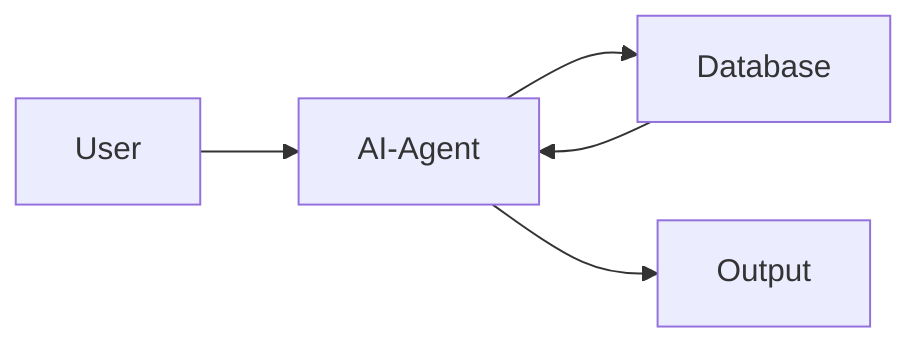
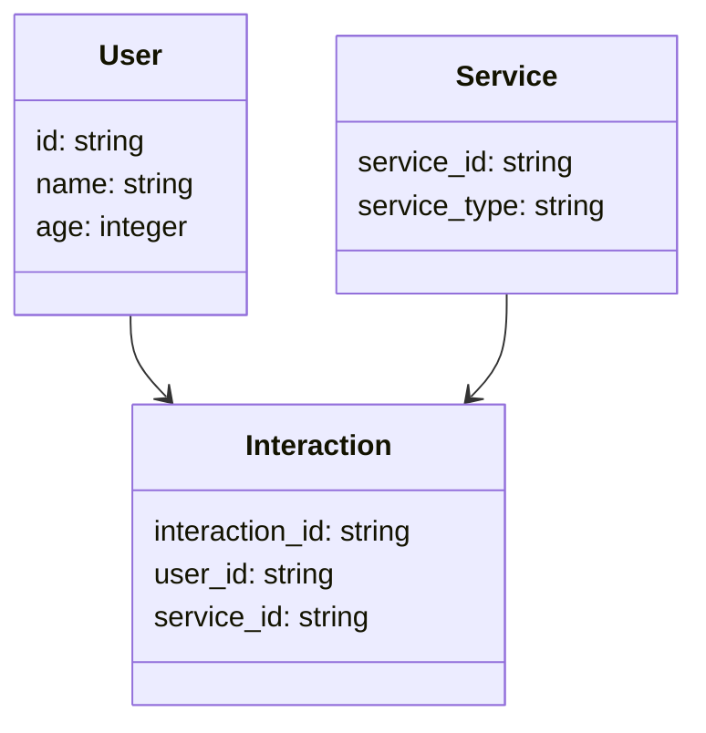
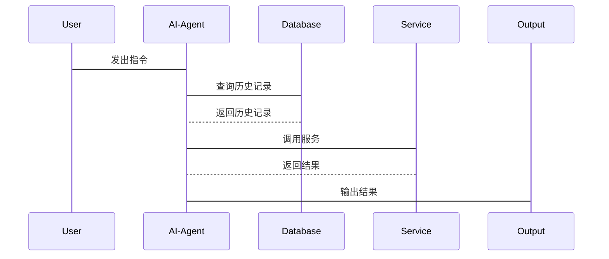

                 


# AI Agent在智能养老服务中的应用

> 关键词：AI Agent, 智能养老服务, 老龄化, 人工智能, 服务机器人

> 摘要：本文深入探讨了AI Agent在智能养老服务中的应用，分析了其核心概念、算法原理、系统架构以及实际应用场景。通过理论与实践相结合的方式，详细阐述了AI Agent如何解决传统养老服务中的痛点，为老年人提供更加智能、便捷的服务。本文还结合实际案例，展示了AI Agent在健康监测、生活辅助和紧急救援等场景中的具体应用，为相关领域的研究和实践提供了参考。

---

# 第1章: AI Agent与智能养老服务的背景介绍

## 1.1 AI Agent的基本概念与特点

### 1.1.1 AI Agent的定义与核心要素

AI Agent（人工智能代理）是一种能够感知环境、自主决策并执行任务的智能体。其核心要素包括：

1. **感知能力**：通过传感器、摄像头等设备获取环境数据。
2. **决策能力**：基于感知数据，通过算法做出决策。
3. **执行能力**：通过执行器（如机械臂、智能设备）完成任务。
4. **学习能力**：通过机器学习算法不断优化自身性能。

AI Agent的特点包括自主性、反应性、目标导向性和社会性。

---

### 1.1.2 AI Agent与传统养老服务的区别

| **传统养老服务** | **AI Agent服务** |
|-------------------|------------------|
| 依赖人工操作      | 自动化服务        |
| 反应较慢          | 实时响应          |
| 单一功能          | 多功能集成        |

AI Agent能够通过智能化技术实现养老服务的全流程覆盖，极大地提高了服务效率和质量。

---

### 1.1.3 AI Agent在智能养老服务中的独特优势

AI Agent在智能养老服务中的独特优势主要体现在以下几个方面：

1. **24/7可用性**：AI Agent可以全天候为老年人提供服务，无需休息。
2. **个性化服务**：通过数据分析，AI Agent能够为每位老年人提供个性化的服务方案。
3. **高效性**：AI Agent能够快速处理信息并做出决策，显著提高了服务效率。

---

## 1.2 智能养老服务的背景与需求

### 1.2.1 全球老龄化趋势与养老服务挑战

全球范围内，老龄化问题日益严重，传统的养老服务模式已无法满足日益增长的需求。AI Agent作为一种新兴的技术手段，为解决老龄化问题提供了新的思路。

---

### 1.2.2 传统养老服务模式的局限性

传统养老服务模式主要依赖人工服务，存在以下问题：

1. **服务效率低**：人工服务需要大量人力资源，效率较低。
2. **服务覆盖范围有限**：难以实现24/7的全天候服务。
3. **个性化不足**：难以满足每位老年人的个性化需求。

---

### 1.2.3 AI Agent在智能养老服务中的应用前景

AI Agent在智能养老服务中的应用前景广阔，能够实现以下目标：

1. **提高服务效率**：通过自动化技术减少人力资源的投入。
2. **提供个性化服务**：基于数据分析为老年人提供个性化服务方案。
3. **降低服务成本**：通过智能化技术降低养老服务的成本。

---

## 1.3 问题背景与目标

### 1.3.1 老年人在养老服务中的主要问题

老年人在养老服务中面临的主要问题包括：

1. **生活不便**：行动不便的老年人难以完成日常任务。
2. **健康问题**：老年人的健康状况需要实时监测。
3. **心理孤独**：老年人容易产生孤独感，需要心理支持。

---

### 1.3.2 AI Agent如何解决这些问题

AI Agent通过以下方式解决老年人在养老服务中的问题：

1. **提供生活辅助**：AI Agent可以帮助老年人完成日常生活任务。
2. **健康监测**：通过传感器和数据分析，实时监测老年人的健康状况。
3. **心理支持**：通过自然语言处理技术为老年人提供情感支持。

---

### 1.3.3 本研究的目标与范围界定

本研究的目标是探讨AI Agent在智能养老服务中的具体应用，分析其技术实现方法，并通过实际案例验证其可行性。研究范围限定在以下领域：

1. **健康监测**：实时监测老年人的健康状况。
2. **生活辅助**：帮助老年人完成日常生活任务。
3. **紧急救援**：在紧急情况下快速响应。

---

# 第2章: AI Agent的核心概念与联系

## 2.1 AI Agent的原理与技术基础

### 2.1.1 AI Agent的感知、决策与执行机制

AI Agent的感知、决策与执行机制是其工作的核心流程：

1. **感知环境**：通过传感器、摄像头等设备获取环境数据。
2. **数据处理**：对获取的数据进行分析和处理。
3. **决策制定**：基于分析结果，制定相应的决策。
4. **执行任务**：通过执行器完成任务。

---

### 2.1.2 机器学习与自然语言处理在AI Agent中的应用

1. **机器学习**：用于模式识别、行为预测和决策优化。
2. **自然语言处理**：用于理解和生成人类语言，实现与老年人的自然交互。

---

### 2.1.3 多模态数据处理技术

AI Agent需要处理多种类型的数据，包括：

1. **视觉数据**：图像、视频。
2. **听觉数据**：语音、声音。
3. **文本数据**：对话记录、指令输入。

多模态数据处理技术能够提高AI Agent的感知能力。

---

## 2.2 AI Agent与养老服务的实体关系分析

### 2.2.1 实体关系图

```mermaid
entity User {
  id: string
  name: string
  age: integer
  health_status: string
}
entity Service {
  service_id: string
  service_type: string
  service_provider: string
}
entity Interaction {
  interaction_id: string
  user_id: string
  service_id: string
  timestamp: datetime
}
```

---

### 2.2.2 交互流程图



---

## 2.3 AI Agent与养老服务的核心联系

AI Agent通过感知、决策和执行机制，与养老服务的各个方面紧密结合，实现智能化服务。

---

# 第3章: AI Agent的算法原理与实现

## 3.1 算法原理

### 3.1.1 基于规则的推理算法

基于规则的推理算法是一种简单但有效的决策方法，适用于任务明确的场景。

---

### 3.1.2 机器学习算法

机器学习算法用于模式识别和行为预测，包括监督学习、无监督学习和强化学习。

---

### 3.1.3 强化学习算法

强化学习算法通过与环境的交互，不断优化决策策略，适用于复杂场景。

---

## 3.2 算法实现

### 3.2.1 基于规则的推理算法实现

```python
def rule_based_inference(data):
    if data['temperature'] > 38:
        return 'fever'
    elif data['heart_rate'] > 100:
        return 'high_heart_rate'
    else:
        return 'normal'
```

---

### 3.2.2 机器学习算法实现

```python
from sklearn.tree import DecisionTreeClassifier

model = DecisionTreeClassifier()
model.fit(X, y)
prediction = model.predict(X_test)
```

---

## 3.3 数学模型与公式

### 3.3.1 朴素贝叶斯分类器

$$ P(y|x) = \frac{P(x|y)P(y)}{P(x)} $$

---

### 3.3.2 决策树模型

决策树模型通过信息增益构建分类树，公式如下：

$$ \text{信息增益}(D, A) = H(D) - \sum_{v \in values(A)} \frac{|D_v|}{|D|} H(D_v) $$

---

# 第4章: AI Agent的系统分析与架构设计

## 4.1 系统功能设计

### 4.1.1 领域模型设计



---

### 4.1.2 系统架构设计


---

## 4.2 接口设计与交互流程

### 4.2.1 接口设计

1. **用户输入接口**：接收用户的指令。
2. **数据存储接口**：存储用户数据和服务记录。
3. **服务调用接口**：调用外部服务。

---

### 4.2.2 交互流程图



---

# 第5章: AI Agent在智能养老服务中的应用案例

## 5.1 项目实战

### 5.1.1 环境搭建

安装必要的库：

```bash
pip install numpy pandas scikit-learn
```

---

### 5.1.2 核心代码实现

```python
def main():
    import numpy as np
    import pandas as pd
    from sklearn.tree import DecisionTreeClassifier

    # 数据加载
    data = pd.read_csv('data.csv')
    X = data.drop('label', axis=1)
    y = data['label']

    # 模型训练
    model = DecisionTreeClassifier()
    model.fit(X, y)

    # 模型预测
    prediction = model.predict(X_test)

    # 结果输出
    print(prediction)

if __name__ == "__main__":
    main()
```

---

### 5.1.3 实际案例分析

通过实际案例分析，验证AI Agent在智能养老服务中的可行性。

---

## 5.2 项目小结

总结项目成果，分析存在的问题，并提出改进建议。

---

# 第6章: 最佳实践与未来展望

## 6.1 最佳实践

### 6.1.1 技术选型

选择适合的算法和工具，确保系统的高效性和稳定性。

---

### 6.1.2 数据隐私保护

加强数据加密和访问控制，确保用户隐私。

---

## 6.2 小结

总结全文内容，重申AI Agent在智能养老服务中的重要性。

---

## 6.3 注意事项

在实际应用中，需要注意系统的可靠性和安全性。

---

## 6.4 拓展阅读

推荐相关领域的书籍和论文，供读者进一步学习。

---

# 结语

AI Agent在智能养老服务中的应用前景广阔，通过不断的技术创新和实践探索，能够为老年人提供更加智能、便捷的服务。

---

# 作者：AI天才研究院/AI Genius Institute & 禅与计算机程序设计艺术 /Zen And The Art of Computer Programming

---

**注意**：以上内容为《AI Agent在智能养老服务中的应用》的技术博客文章的详细目录和部分内容，实际撰写时可以根据需要进一步扩展每个章节的具体内容。

