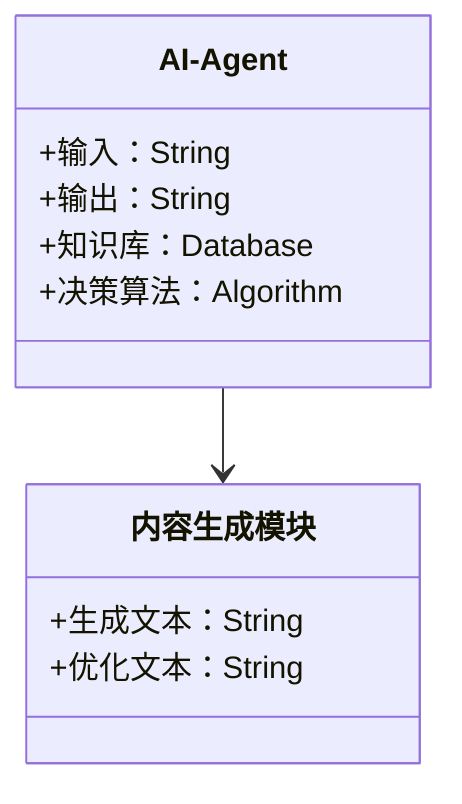

                 


# AI Agent在智能内容创作中的应用

> 关键词：AI Agent, 智能内容创作, 自然语言处理, 生成式AI, 内容生成

> 摘要：本文探讨AI Agent在智能内容创作中的应用，分析其核心概念、算法原理、系统架构及实际案例。通过详细的技术分析和实战演示，揭示AI Agent如何赋能内容创作，提升创作效率和质量。

---

## 第1章: AI Agent与智能内容创作概述

### 1.1 AI Agent的基本概念

#### 1.1.1 什么是AI Agent
AI Agent（人工智能代理）是指能够感知环境、做出决策并执行任务的智能实体。它通过与环境交互，利用传感器获取信息，并通过执行器采取行动，以实现特定目标。

#### 1.1.2 AI Agent的核心特点
- **自主性**：能够在没有外部干预的情况下独立运作。
- **反应性**：能够实时感知环境并做出反应。
- **目标导向性**：所有行为都围绕实现特定目标展开。
- **学习能力**：通过数据和经验不断优化自身性能。

#### 1.1.3 AI Agent的分类与应用场景
AI Agent可以分为以下几类：
1. **基于规则的AI Agent**：根据预定义的规则执行任务，适用于简单场景。
2. **基于模型的AI Agent**：利用机器学习模型进行决策，适用于复杂场景。
3. **基于强化学习的AI Agent**：通过与环境互动不断优化策略，适用于动态场景。

---

### 1.2 智能内容创作的定义与特点

#### 1.2.1 内容创作的基本概念
内容创作是指通过文字、图像、视频等形式，将信息转化为可供阅读或消费的产品。传统内容创作依赖人工，效率低且成本高。

#### 1.2.2 智能内容创作的定义
智能内容创作是利用人工智能技术，通过自动化工具生成、优化和管理内容的过程。它结合了自然语言处理、机器学习和大数据分析等技术，以提高创作效率和质量。

#### 1.2.3 智能内容创作的优势与挑战
- **优势**：
  - **高效性**：AI Agent可以快速生成大量内容。
  - **多样性**：能够创作出不同风格和类型的内容。
  - **精准性**：通过数据分析，内容更贴近目标受众的需求。
- **挑战**：
  - **内容质量**：生成的内容可能缺乏创意或逻辑性。
  - **技术限制**：AI Agent的性能受限于算法和数据质量。
  - **伦理问题**：生成的内容可能涉及版权或虚假信息。

---

### 1.3 AI Agent在智能内容创作中的作用

#### 1.3.1 AI Agent如何辅助内容创作
AI Agent可以通过以下方式辅助内容创作：
1. **内容生成**：根据输入的关键词或主题，生成初稿。
2. **内容优化**：对生成的内容进行润色和改写，提升可读性。
3. **内容推荐**：根据用户需求推荐相关内容或灵感。
4. **数据驱动创作**：通过分析用户数据，生成符合需求的内容。

#### 1.3.2 AI Agent在内容创作中的优势
- **高效性**：AI Agent可以在短时间内生成大量内容。
- **个性化**：能够根据用户需求生成定制化内容。
- **持续性**：可以24/7不间断地进行创作。

#### 1.3.3 AI Agent在内容创作中的局限性
- **创意不足**：AI Agent生成的内容可能缺乏独特性和创新性。
- **理解深度有限**：无法完全理解复杂的语境和情感。

---

## 第2章: AI Agent的核心概念与原理

### 2.1 AI Agent的核心概念

#### 2.1.1 AI Agent的感知层
AI Agent的感知层负责接收外部环境的信息，通常通过自然语言处理技术实现。例如，从文本中提取关键词、情感倾向或主题。

#### 2.1.2 AI Agent的决策层
决策层是AI Agent的核心，负责根据感知到的信息做出决策。常用的决策方法包括规则引擎和机器学习模型。

#### 2.1.3 AI Agent的执行层
执行层负责将决策层的指令转化为具体行动，例如生成文本、发送邮件或调整参数。

---

### 2.2 AI Agent的原理与流程

#### 2.2.1 AI Agent的感知过程
1. **信息输入**：接收用户的输入，如关键词或主题。
2. **信息解析**：通过自然语言处理技术解析输入内容。
3. **需求分析**：识别用户的真实需求和意图。

#### 2.2.2 AI Agent的决策过程
1. **数据检索**：从知识库或大数据中检索相关数据。
2. **生成候选方案**：根据检索到的数据生成多个候选方案。
3. **方案优化**：通过算法优化候选方案，选择最优解。

#### 2.2.3 AI Agent的执行过程
1. **输出结果**：将最终结果以文本、图像或其他形式输出。
2. **反馈收集**：收集用户的反馈，用于优化后续决策。

---

### 2.3 AI Agent的核心算法

#### 2.3.1 基于规则的AI Agent
基于规则的AI Agent通过预定义的规则进行决策。例如，根据关键词生成特定格式的文本。

#### 2.3.2 基于模型的AI Agent
基于模型的AI Agent利用机器学习模型进行决策。例如，使用生成式模型（如GPT）生成文本。

#### 2.3.3 基于强化学习的AI Agent
基于强化学习的AI Agent通过与环境互动不断优化策略。例如，通过不断尝试生成更符合用户需求的内容。

---

### 2.4 AI Agent的数学模型与公式

#### 2.4.1 AI Agent的感知模型
感知模型通常基于概率论，例如：
$$ P(\text{关键词} | \text{输入}) $$

#### 2.4.2 AI Agent的决策模型
决策模型可以基于生成式模型，例如：
$$ P(\text{输出} | \text{输入}) $$

#### 2.4.3 AI Agent的执行模型
执行模型通常基于强化学习，例如：
$$ R(\text{动作}) $$

---

### 2.5 本章小结

---

## 第3章: AI Agent在智能内容创作中的应用

### 3.1 内容生成

#### 3.1.1 基于生成式AI的内容生成
生成式AI（如GPT）可以生成高质量的文本内容。例如，根据输入的关键词生成一篇新闻稿。

#### 3.1.2 内容生成的流程
1. **输入关键词**：用户输入关键词，如“人工智能”。
2. **生成初稿**：AI Agent根据关键词生成初稿。
3. **优化内容**：对生成的内容进行润色和调整。

---

### 3.2 内容优化

#### 3.2.1 文本优化算法
文本优化算法通常基于自然语言处理技术，例如：
1. **关键词提取**：提取文本中的关键词。
2. **语义分析**：分析文本的语义结构。

#### 3.2.2 内容优化的实现
通过优化算法，AI Agent可以生成更流畅、更符合用户需求的内容。

---

### 3.3 内容推荐

#### 3.3.1 内容推荐算法
内容推荐算法通常基于协同过滤或基于内容的推荐。例如，根据用户的阅读历史推荐相关内容。

#### 3.3.2 内容推荐的实现
AI Agent可以根据用户的偏好生成推荐内容。

---

## 第4章: AI Agent的算法实现

### 4.1 基于GPT的生成式模型

#### 4.1.1 GPT模型简介
GPT（Generative Pre-trained Transformer）是一种基于Transformer的生成式模型，广泛应用于文本生成。

#### 4.1.2 GPT的实现流程
1. **输入处理**：将输入文本转化为模型可处理的格式。
2. **模型生成**：模型生成候选文本。
3. **结果优化**：对生成的文本进行优化。

---

### 4.2 AI Agent的Python实现

#### 4.2.1 环境安装
```bash
pip install numpy
pip install transformers
pip install torch
```

#### 4.2.2 核心代码实现
```python
from transformers import GPT2LMHeadModel, GPT2Tokenizer

model_name = "gpt2"
tokenizer = GPT2Tokenizer.from_pretrained(model_name)
model = GPT2LMHeadModel.from_pretrained(model_name)

def generate_text(prompt):
    inputs = tokenizer.encode(prompt, return_tensors="pt")
    outputs = model.generate(inputs, max_length=50, do_sample=True)
    text = tokenizer.decode(outputs[0], skip_special_tokens=True)
    return text

print(generate_text("写一篇关于人工智能的文章"))
```

---

## 第5章: AI Agent的系统架构设计

### 5.1 系统功能设计

#### 5.1.1 领域模型设计


---

### 5.2 系统架构设计

#### 5.2.1 分层架构设计


---

## 第6章: 项目实战

### 6.1 环境安装

```bash
pip install numpy
pip install transformers
pip install torch
```

---

### 6.2 核心代码实现

```python
from transformers import GPT2LMHeadModel, GPT2Tokenizer

model_name = "gpt2"
tokenizer = GPT2Tokenizer.from_pretrained(model_name)
model = GPT2LMHeadModel.from_pretrained(model_name)

def generate_text(prompt):
    inputs = tokenizer.encode(prompt, return_tensors="pt")
    outputs = model.generate(inputs, max_length=50, do_sample=True)
    text = tokenizer.decode(outputs[0], skip_special_tokens=True)
    return text

print(generate_text("写一篇关于人工智能的文章"))
```

---

### 6.3 项目小结

---

## 第7章: 最佳实践

### 7.1 小结
AI Agent在智能内容创作中的应用前景广阔，但仍需克服创意不足和技术限制等挑战。

### 7.2 注意事项
- **数据质量**：确保输入数据的准确性和完整性。
- **模型优化**：定期优化模型以提升生成内容的质量。
- **用户反馈**：收集用户反馈，用于改进AI Agent的性能。

### 7.3 拓展阅读
- 《生成式AI：原理与应用》
- 《自然语言处理：技术与实践》

---

## 作者
作者：AI天才研究院/AI Genius Institute  
作者：禅与计算机程序设计艺术/Zen And The Art of Computer Programming

---

**注：由于文章篇幅限制，以上仅为部分内容的展示。完整文章可根据上述大纲进行扩展和补充。**

