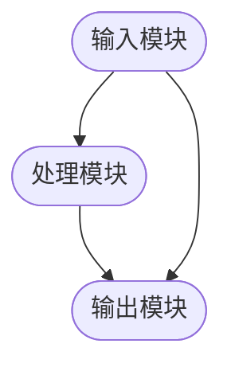

                 


# AI Agent在智能内容生成中的应用

## 关键词：AI Agent, 智能内容生成, 自然语言处理, 生成模型, 人工智能

## 摘要：  
AI Agent（人工智能代理）作为一类能够自主决策和执行任务的智能体，正在逐渐改变内容生成的方式。本文将深入探讨AI Agent在智能内容生成中的应用，从基础概念到数学模型，再到系统架构和实际案例，全面解析其工作原理和应用场景。通过本文的分析，读者将能够理解AI Agent如何通过自然语言处理和生成模型实现智能内容生成，并掌握其在实际项目中的设计与实现方法。

---

## 第一部分：AI Agent与智能内容生成的背景与基础

### 第1章：AI Agent与智能内容生成概述

#### 1.1 AI Agent的基本概念
- **1.1.1 AI Agent的定义与特点**
  - AI Agent是一种能够感知环境、自主决策并执行任务的智能体。
  - 具备智能性、适应性和学习能力。

- **1.1.2 智能内容生成的定义与分类**
  - 智能内容生成指通过AI技术自动生成文本、代码、图像等内容。
  - 分类：文本生成、代码生成、艺术创作、对话生成。

- **1.1.3 AI Agent在内容生成中的作用**
  - 作为内容生成的核心驱动力，AI Agent能够实现从输入到输出的端到端生成。

#### 1.2 AI Agent的核心技术
- **1.2.1 自然语言处理（NLP）基础**
  - NLP是AI Agent理解输入的关键技术。
  - 常见NLP任务：分词、句法分析、实体识别。

- **1.2.2 生成模型（如GPT系列）**
  - 基于Transformer的生成模型能够生成高质量的文本。
  - GPT模型的工作原理：自回归、上下文理解。

- **1.2.3 检索与生成结合的机制**
  - 混合型AI Agent结合检索和生成，提升内容的相关性和准确性。

#### 1.3 智能内容生成的应用场景
- **1.3.1 文章生成**
  - 自动生成新闻、博客等文本内容。
- **1.3.2 代码生成**
  - 基于需求生成代码片段或完整的程序。
- **1.3.3 艺术创作**
  - 生成音乐、绘画等艺术作品。
- **1.3.4 聊天机器人**
  - 基于AI Agent实现智能对话。

#### 1.4 本章小结
- 本章介绍了AI Agent的基本概念、核心技术及其在智能内容生成中的应用场景。

---

### 第2章：AI Agent的核心概念与原理

#### 2.1 AI Agent的组成与结构
- **2.1.1 输入模块**
  - 负责接收用户的输入，如文本、语音等。
- **2.1.2 处理模块**
  - 包含自然语言理解（NLU）和生成模型。
- **2.1.3 输出模块**
  - 生成最终的内容输出，如文本、图像等。

#### 2.2 AI Agent的工作流程
- **2.2.1 输入处理**
  - 解析用户的输入，提取关键信息。
- **2.2.2 内部推理**
  - 基于模型进行上下文理解和关联推理。
- **2.2.3 输出生成**
  - 根据推理结果生成最终内容。

#### 2.3 AI Agent与传统自动化工具的区别
- **2.3.1 智能性对比**
  - AI Agent具备学习和推理能力，而传统工具仅能执行固定任务。
- **2.3.2 适应性对比**
  - AI Agent能够根据输入动态调整输出，适应不同的场景。
- **2.3.3 学习能力对比**
  - AI Agent能够通过数据优化性能，而传统工具不具备学习能力。

#### 2.4 本章小结
- 本章详细讲解了AI Agent的组成、工作流程及其与传统工具的区别。

---

### 第3章：AI Agent的数学模型与算法原理

#### 3.1 生成模型的数学基础
- **3.1.1 概率论基础**
  - 生成模型基于概率分布生成内容。
- **3.1.2 神经网络基础**
  - Transformer模型的结构和原理。
- **3.1.3 变压器（Transformer）模型**
  - 注意力机制（Attention）是生成模型的核心。

#### 3.2 常见生成模型的算法流程
- **3.2.1 GPT模型的算法流程**
  - 自回归生成，基于上下文预测下一个词。
- **3.2.2 BERT模型的算法流程**
  - 基于Transformer的编码器，主要用于理解上下文。
- **3.2.3 深度强化学习（Deep RL）的应用**
  - 强化学习用于生成模型的优化。

#### 3.3 算法原理的数学公式
- **3.3.1 变压器模型的注意力机制公式**
  $$\text{Attention}(Q,K,V) = \text{softmax}\left(\frac{QK^T}{\sqrt{d_k}}\right)V$$
- **3.3.2 深度强化学习的损失函数**
  $$\mathcal{L} = -\sum_{i} \log p(i) \cdot r(i)$$

#### 3.4 本章小结
- 本章详细介绍了生成模型的数学基础和算法原理，重点讲解了Transformer模型和深度强化学习的应用。

---

### 第4章：AI Agent的系统架构与设计

#### 4.1 系统架构概述
- **4.1.1 分层架构**
  - 分为输入层、处理层和输出层。
- **4.1.2 微服务架构**
  - 各模块独立运行，便于扩展和维护。
- **4.1.3 混合架构**
  - 结合分层和微服务的特点，灵活应对复杂场景。

#### 4.2 系统功能设计
- **4.2.1 输入处理模块**
  - 解析用户输入，提取关键信息。
- **4.2.2 内部推理模块**
  - 基于模型进行上下文理解和关联推理。
- **4.2.3 输出生成模块**
  - 生成最终内容，并反馈给用户。

#### 4.3 系统架构的Mermaid图


#### 4.4 本章小结
- 本章详细介绍了AI Agent的系统架构设计，包括分层架构、微服务架构和混合架构的特点。

---

## 第二部分：AI Agent在智能内容生成中的应用实践

### 第5章：AI Agent的项目实战

#### 5.1 环境安装与配置
- **5.1.1 安装Python和相关库**
  - 安装Python 3.8及以上版本。
  - 安装库：TensorFlow、Keras、Transformers。
- **5.1.2 安装AI Agent框架**
  - 推荐使用Hugging Face的Transformers库。

#### 5.2 核心代码实现
- **5.2.1 输入处理模块**
  ```python
  def process_input(input_text):
      # 输入预处理
      return input_text
  ```
- **5.2.2 内部推理模块**
  ```python
  from transformers import GPT2LMHeadModel, GPT2Tokenizer

  model = GPT2LMHeadModel.from_pretrained('gpt2')
  tokenizer = GPT2Tokenizer.from_pretrained('gpt2')

  def generate_output(input_text):
      inputs = tokenizer(input_text, return_tensors='np')
      outputs = model.generate(inputs.input_ids, max_length=50)
      return tokenizer.decode(outputs[0], skip_special_tokens=True)
  ```

- **5.2.3 输出生成模块**
  ```python
  def output_result(output_text):
      print(output_text)
  ```

#### 5.3 案例分析与详细解读
- **5.3.1 文章生成案例**
  - 输入：用户需求描述。
  - 输出：自动生成新闻文章。
- **5.3.2 代码生成案例**
  - 输入：功能需求描述。
  - 输出：生成Python代码片段。

#### 5.4 项目小结
- 本章通过实际案例展示了AI Agent在智能内容生成中的应用，详细解读了核心代码的实现。

---

### 第6章：总结与展望

#### 6.1 本章总结
- AI Agent通过自然语言处理和生成模型实现了智能内容生成，具备广泛的应用场景。

#### 6.2 未来展望
- 更强大的生成模型（如GPT-4）将推动内容生成的智能化。
- 多模态AI Agent将实现跨媒介的内容生成。

#### 6.3 最佳实践 tips
- 在实际应用中，建议结合领域知识优化AI Agent的性能。
- 定期更新模型和数据，保持AI Agent的先进性。

#### 6.4 本章小结
- 本章总结了全文内容，并展望了AI Agent在智能内容生成中的未来发展方向。

---

## 附录

### A. AI Agent相关术语表
- **AI Agent**：人工智能代理。
- **Transformer**：基于注意力机制的神经网络模型。
- **GPT**：生成式预训练模型。

### B. 工具推荐
- **Hugging Face**：提供丰富的AI模型和工具。
- **Keras**：深度学习框架。

### C. 参考文献
- 1. Vaswani, A., et al. "Attention Is All You Need."  
- 2. Radford, A., et al. "Language Models are Few-Shot Learners."

---

## 作者：AI天才研究院/AI Genius Institute & 禅与计算机程序设计艺术 /Zen And The Art of Computer Programming

