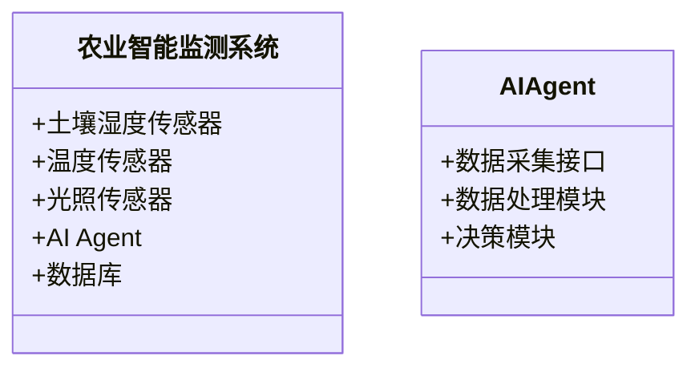

                 


# AI Agent在智能农业中的应用

> 关键词：AI Agent, 智能农业, 人工智能, 机器学习, 物联网, 精准农业

> 摘要：AI Agent作为人工智能领域的重要技术，在智能农业中发挥着越来越重要的作用。本文将详细介绍AI Agent在智能农业中的应用背景、核心概念、算法原理、系统架构、项目实战以及实际案例分析。通过本文的学习，读者将能够全面理解AI Agent在智能农业中的应用及其带来的变革。

---

## 第一部分: AI Agent与智能农业的背景与概念

### 第1章: AI Agent的定义与特点

#### 1.1 AI Agent的基本概念
AI Agent，即人工智能代理，是指能够感知环境、自主决策并执行任务的智能体。它具备以下特点：
- **自主性**：能够在没有外部干预的情况下自主运行。
- **反应性**：能够实时感知环境并做出反应。
- **目标导向**：基于预设目标或学习目标进行决策。
- **学习能力**：通过数据和经验不断优化自身性能。

#### 1.2 AI Agent与传统自动化的区别
| 特性       | 传统自动化                | AI Agent                   |
|------------|--------------------------|----------------------------|
| 决策方式   | 预设规则                 | 学习优化                    |
| 环境适应   | 固定场景                 | 多样化场景                  |
| 智能水平   | 低智能                   | 高智能                     |

### 第2章: 智能农业的发展现状

#### 2.1 智能农业的定义与范围
智能农业是指利用信息技术、人工智能、物联网等技术，实现农业生产、管理、销售等环节的智能化和高效化。其主要领域包括：
- **农业生产**：精准种植、智能监测。
- **农业管理**：资源优化、病虫害防治。
- **农业销售**：市场预测、供应链管理。

#### 2.2 智能农业的关键技术
- **物联网技术**：通过传感器和通信技术，实现农业环境的实时监测。
- **大数据分析**：通过对海量数据的处理和分析，支持决策制定。
- **人工智能技术**：利用AI Agent实现自主决策和优化。

### 第3章: AI Agent在智能农业中的应用

#### 3.1 AI Agent在农业中的核心作用
AI Agent在智能农业中的作用主要体现在：
- **提高农业生产效率**：通过自动化决策减少资源浪费。
- **优化资源配置**：基于数据和模型，合理分配土地、水源等资源。
- **支持决策制定**：利用数据分析和预测模型，帮助农民做出科学决策。

#### 3.2 AI Agent的具体应用场景
- **农业智能监测系统**：实时监测土壤湿度、温度、光照等参数，并通过AI Agent进行数据分析，提出优化建议。
- **精准种植与管理**：根据作物生长周期和环境条件，制定个性化种植方案。
- **病虫害识别与防治**：通过图像识别技术，快速识别病虫害，并推荐防治措施。

---

## 第二部分: AI Agent的核心算法与技术实现

### 第4章: AI Agent的核心算法原理

#### 4.1 机器学习算法
机器学习是AI Agent的核心技术之一，常用的算法包括：
- **监督学习**：通过标记数据训练模型，例如线性回归和随机森林。
- **无监督学习**：通过数据聚类发现潜在模式，例如K-means和主题模型。
- **强化学习**：通过奖励机制优化决策策略，例如Q-learning和深度强化学习。

#### 4.2 深度学习算法
深度学习通过多层神经网络提取数据特征，常用于图像识别和自然语言处理。常用的模型包括：
- **卷积神经网络（CNN）**：用于图像识别，如病虫害检测。
- **循环神经网络（RNN）**：用于时间序列数据处理，如气象预测。
- **图神经网络（GNN）**：用于复杂关系数据的建模，如农业知识图谱。

#### 4.3 算法选择与优化
- **算法选择**：根据具体问题选择合适的算法，例如分类问题选择随机森林，图像识别选择CNN。
- **算法优化**：通过超参数调优和模型融合提升性能。
- **评估指标**：准确率、召回率、F1分数等。

#### 4.4 算法实现的数学公式
##### 4.4.1 线性回归公式
$$
y = \beta_0 + \beta_1x + \epsilon
$$

##### 4.4.2 逻辑回归公式
$$
P(y=1|x) = \frac{e^{\beta_0 + \beta_1x}}{1 + e^{\beta_0 + \beta_1x}}
$$

---

## 第三部分: 系统分析与架构设计方案

### 第5章: 系统功能设计
- **问题场景**：某农场需要实现精准种植和病虫害监测。
- **领域模型**：通过类图展示系统的各个模块及其关系。


### 第6章: 系统架构设计
- **系统架构图**：


---

## 第四部分: 项目实战

### 第7章: 项目实施步骤

#### 7.1 环境安装
- **Python环境**：安装Python 3.8及以上版本。
- **依赖库安装**：`pip install numpy pandas scikit-learn tensorflow`

#### 7.2 核心代码实现
##### 7.2.1 数据采集与预处理
```python
import pandas as pd
data = pd.read_csv('agriculture_data.csv')
# 数据清洗与特征工程
data.dropna(inplace=True)
```

##### 7.2.2 模型训练与评估
```python
from sklearn.model import LinearSVC
model = LinearSVC()
model.fit(data_features, labels)
print("准确率：", model.score(data_features, labels))
```

##### 7.2.3 系统集成与部署
- 将模型部署为API服务，供前端或第三方系统调用。

#### 7.3 案例分析
- **案例背景**：某农场采用AI Agent进行病虫害监测，减少农药使用量30%。
- **数据分析**：通过模型预测病虫害的发生概率，提前采取防治措施。
- **效果评估**：与传统方法相比，AI Agent系统提高了20%的产量。

---

## 第五部分: 总结与展望

### 第8章: 总结与最佳实践

#### 8.1 总结
AI Agent在智能农业中的应用极大地提高了农业生产的效率和精准度。通过机器学习、深度学习等技术，AI Agent能够实时监测环境、优化资源分配并支持决策制定。

#### 8.2 最佳实践
- **数据质量**：确保数据的准确性和完整性。
- **模型优化**：定期更新模型，保持其预测能力。
- **系统维护**：定期检查和维护系统，确保其稳定运行。

#### 8.3 注意事项
- **数据隐私**：保护农业数据的隐私和安全。
- **系统兼容性**：确保系统能够兼容不同的设备和平台。
- **用户培训**：对农民进行培训，使其能够熟练使用AI Agent系统。

#### 8.4 拓展阅读
- 推荐阅读《机器学习实战》和《深度学习入门：基于Python》。

---

## 作者信息

作者：AI天才研究院/AI Genius Institute & 禅与计算机程序设计艺术 /Zen And The Art of Computer Programming

---

本文通过详细阐述AI Agent在智能农业中的应用，从背景、算法、系统架构到项目实战，全面介绍了AI Agent在农业中的重要作用和具体实现方法。希望本文能够为读者提供有价值的参考，帮助他们更好地理解和应用AI Agent技术。

