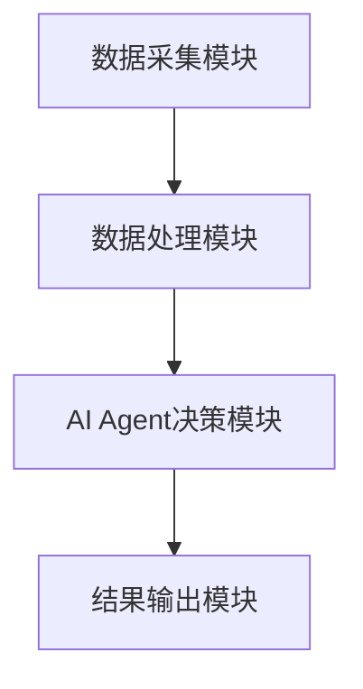

                 


# AI Agent在智能农业病虫害防控中的实践

> 关键词：AI Agent，智能农业，病虫害防控，算法原理，系统架构

> 摘要：本文详细探讨了AI Agent在智能农业病虫害防控中的应用，从背景介绍到系统架构设计，再到项目实战，全面分析了AI Agent在农业中的潜力与实现方案。

---

## 第一部分: AI Agent在智能农业病虫害防控中的背景与概念

### 第1章: AI Agent与智能农业概述

#### 1.1 AI Agent的基本概念

##### 1.1.1 什么是AI Agent

AI Agent（人工智能代理）是指能够感知环境并采取行动以实现目标的智能实体。它具备自主性、反应性、目标导向性和社会性等特征。

##### 1.1.2 AI Agent的核心特征

- **自主性**：能够独立决策和行动。
- **反应性**：能实时感知环境并做出反应。
- **目标导向性**：所有行动均以实现特定目标为导向。
- **社会性**：能够与其他AI Agent或人类进行交互与协作。

##### 1.1.3 AI Agent与传统算法的区别

| 特性        | AI Agent                     | 传统算法                     |
|-------------|------------------------------|------------------------------|
| 决策方式     | 基于环境反馈动态调整         | 预先设定固定的规则或流程       |
| 学习能力     | 能通过经验学习和优化         | 无法自主学习，依赖人工调整       |
| 应用场景     | 复杂、动态环境                | 简单、静态环境                |

#### 1.2 农业病虫害防控的现状与挑战

##### 1.2.1 病虫害对农业的影响

病虫害会造成农作物减产、品质下降，严重时可导致粮食危机。

##### 1.2.2 传统病虫害防控的局限性

- 依赖人工经验，效率低。
- 防控手段单一，难以应对复杂情况。
- 信息处理能力有限，无法实现精准防控。

##### 1.2.3 智能化防控的需求

随着农业现代化的推进，精准、高效的病虫害防控需求日益迫切。

#### 1.3 AI Agent在农业中的应用潜力

##### 1.3.1 AI Agent在农业中的应用场景

- **病虫害识别与分类**：利用图像识别技术快速识别病虫害类型。
- **病虫害传播预测**：通过数据分析预测病虫害的扩散路径。
- **精准防控策略**：根据实时数据制定最优防控方案。

##### 1.3.2 AI Agent的优势与价值

- 提高防控效率，减少资源浪费。
- 实现精准施药，降低环境污染。
- 优化种植结构，提升产量和质量。

##### 1.3.3 未来发展趋势

AI Agent将与物联网、大数据等技术深度融合，推动农业智能化发展。

### 第2章: AI Agent在病虫害防控中的核心概念

#### 2.1 病虫害防控的核心要素

##### 2.1.1 病虫害的识别与分类

AI Agent通过图像识别和数据挖掘技术，准确识别病虫害类型。

##### 2.1.2 病虫害的传播与预测

基于历史数据和环境因素，AI Agent能预测病虫害的扩散趋势。

##### 2.1.3 病虫害的防控策略

根据预测结果，AI Agent制定最优的防控措施，如选择性施药等。

#### 2.2 AI Agent的系统架构

##### 2.2.1 系统整体架构

系统包括数据采集、数据处理、AI Agent决策和结果输出四个模块。

##### 2.2.2 各模块的功能与交互

- **数据采集模块**：负责收集环境数据和病虫害信息。
- **数据处理模块**：对数据进行清洗和预处理。
- **AI Agent决策模块**：根据数据生成决策。
- **结果输出模块**：输出防控建议或执行指令。

##### 2.2.3 系统的灵活性与可扩展性

系统采用模块化设计，便于根据需求扩展功能。

#### 2.3 病虫害防控的数学模型

##### 2.3.1 基本模型介绍

常用模型包括决策树、随机森林和神经网络等。

##### 2.3.2 模型的输入与输出

- **输入**：环境数据、病虫害症状图像。
- **输出**：病虫害类型、防控建议。

##### 2.3.3 模型的训练与优化

通过大量数据训练模型，调整参数以提高准确率。

---

## 第二部分: AI Agent的算法原理与实现

### 第3章: AI Agent的算法原理与实现

#### 3.1 病虫害识别的算法选择

##### 3.1.1 常见算法对比

| 算法类型   | 优点                           | 缺点                           |
|------------|--------------------------------|--------------------------------|
| 决策树     | 易于解释，适合分类问题         | 易受噪声影响，准确率有限       |
| 神经网络   | 高准确率，适合复杂问题         | 需大量数据，难解释             |

##### 3.1.2 选择合适的算法

根据具体场景选择，如决策树适合小数据集，神经网络适合大数据集。

##### 3.1.3 算法的优缺点分析

- **决策树**：易于理解，但准确率可能不如神经网络。
- **神经网络**：高准确率，但需要大量数据和计算资源。

#### 3.2 病虫害预测的数学模型

##### 3.2.1 数据预处理

包括数据清洗、特征提取和归一化处理。

##### 3.2.2 模型训练

使用训练数据训练模型，调整参数以优化性能。

##### 3.2.3 模型评估与优化

通过交叉验证评估模型性能，调整超参数提升准确率。

#### 3.3 算法实现与代码解析

##### 3.3.1 环境配置

安装必要的库，如Python的scikit-learn和TensorFlow。

##### 3.3.2 代码实现

使用决策树实现病虫害分类的示例代码：

```python
from sklearn.tree import DecisionTreeClassifier
from sklearn.model_selection import train_test_split
from sklearn.metrics import accuracy_score

# 数据准备
X = ...  # 特征数据
y = ...  # 标签

# 数据分割
X_train, X_test, y_train, y_test = train_test_split(X, y, test_size=0.2)

# 模型训练
model = DecisionTreeClassifier()
model.fit(X_train, y_train)

# 模型预测
y_pred = model.predict(X_test)

# 准确率计算
print("Accuracy:", accuracy_score(y_test, y_pred))
```

##### 3.3.3 代码解读与优化建议

- 数据预处理：确保数据质量，提取有效特征。
- 模型选择：根据数据量和复杂度选择合适的算法。
- 参数调优：通过网格搜索优化模型性能。

---

## 第三部分: 系统架构设计与实现

### 第4章: 系统架构设计与实现

#### 4.1 系统功能模块划分

##### 4.1.1 数据采集模块

负责采集农田环境数据和病虫害图像。

##### 4.1.2 数据处理模块

对数据进行清洗和预处理，提取特征。

##### 4.1.3 AI Agent决策模块

基于处理后的数据生成决策。

##### 4.1.4 结果输出模块

输出防控建议或执行指令。

#### 4.2 系统架构设计

##### 4.2.1 模块间的交互关系

数据流从采集模块流向处理模块，处理后的数据供决策模块使用，决策结果由输出模块处理。

##### 4.2.2 系统的整体架构图



##### 4.2.3 系统的灵活性与扩展性

采用模块化设计，便于功能扩展和升级。

#### 4.3 接口设计与实现

##### 4.3.1 数据接口的设计

定义数据格式和接口规范，确保模块间数据顺利传输。

##### 4.3.2 AI Agent接口的设计

设计统一的API，方便与其他系统集成。

##### 4.3.3 用户接口的设计

提供友好的人机交互界面，方便用户操作。

---

## 第四部分: 项目实战与案例分析

### 第5章: 项目实战与案例分析

#### 5.1 项目背景与目标

##### 5.1.1 项目背景

某农业示范区面临严重的病虫害问题，希望通过AI Agent实现智能化防控。

##### 5.1.2 项目目标

建立AI Agent系统，实现病虫害的实时监测和精准防控。

##### 5.1.3 项目范围

涵盖数据采集、模型训练、系统集成和效果评估。

#### 5.2 项目实施过程

##### 5.2.1 数据采集与处理

使用传感器和摄像头采集环境数据和病虫害图像。

##### 5.2.2 模型训练与优化

训练决策树模型，并通过网格搜索优化参数。

##### 5.2.3 系统集成与测试

集成各模块，进行功能测试和性能调优。

#### 5.3 案例分析与经验总结

##### 5.3.1 典型案例分析

分析某次病虫害的监测和防控过程，展示系统的有效性。

##### 5.3.2 项目实施中的问题与解决方案

- **问题**：数据不足导致模型准确率低。
- **解决方案**：引入更多数据，采用数据增强技术。

##### 5.3.3 经验总结与未来展望

总结项目经验，提出未来改进方向，如引入更复杂的模型和优化数据采集方式。

---

## 第五部分: 最佳实践与注意事项

### 第6章: 最佳实践与注意事项

#### 6.1 最佳实践

##### 6.1.1 数据质量管理

确保数据的准确性和完整性，避免噪声干扰。

##### 6.1.2 算法选择

根据具体场景选择合适的算法，避免盲目追求高复杂度。

##### 6.1.3 系统集成

注重模块间的协同工作，确保系统整体性能。

#### 6.2 小结

AI Agent在农业病虫害防控中具有广阔的应用前景，通过合理设计和优化，能够显著提升防控效率和效果。

#### 6.3 注意事项

- **数据隐私**：确保数据的安全和隐私保护。
- **系统维护**：定期更新模型和维护系统，确保长期稳定运行。
- **人员培训**：对相关人员进行培训，确保系统正确使用和管理。

#### 6.4 拓展阅读

推荐相关书籍和论文，帮助读者深入学习AI Agent和农业智能化的相关知识。

---

## 作者

作者：AI天才研究院/AI Genius Institute & 禅与计算机程序设计艺术 /Zen And The Art of Computer Programming

---

以上是《AI Agent在智能农业病虫害防控中的实践》的完整目录大纲，涵盖了从背景介绍到系统实现的各个方面，确保读者能够全面理解AI Agent在农业中的应用。

