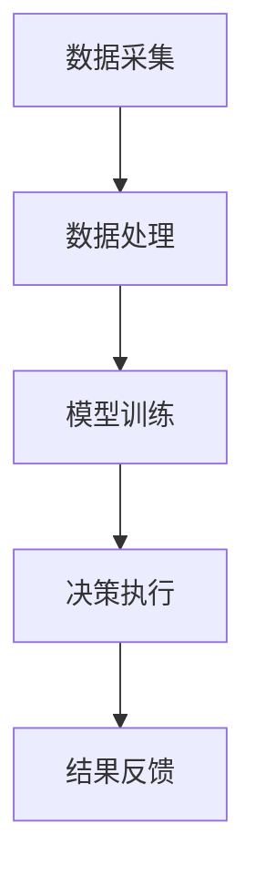
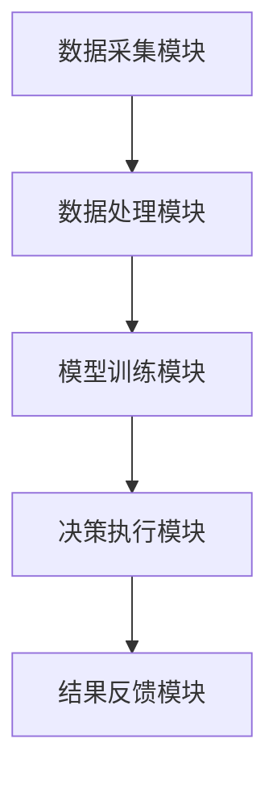
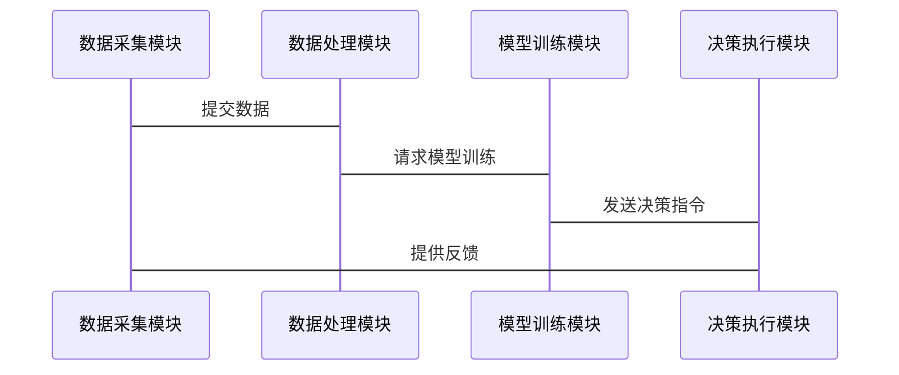

                 


```markdown
# AI Agent在智能农业病虫害防控中的应用

> 关键词：AI Agent，智能农业，病虫害防控，深度学习，算法实现

> 摘要：本文系统地探讨了AI Agent在智能农业病虫害防控中的应用，详细分析了AI Agent的核心概念、算法原理、系统架构及实际案例。通过结合深度学习技术和农业病虫害防控的实际需求，本文提出了基于AI Agent的智能防控解决方案，并对未来的发展方向进行了展望。

---

## 第1章: 背景介绍

### 1.1 AI Agent与智能农业概述
#### 1.1.1 AI Agent的定义与特点
AI Agent（人工智能代理）是指能够感知环境、自主决策并执行任务的智能体。其核心特点包括：
- **自主性**：能够在没有外部干预的情况下独立运行。
- **反应性**：能够实时感知环境变化并做出响应。
- **学习能力**：通过数据和经验不断优化自身的决策能力。
- **协作性**：能够与其他AI Agent或人类进行有效协作。

#### 1.1.2 智能农业的基本概念
智能农业是利用现代信息技术（如物联网、大数据、人工智能等）提升农业生产的效率和可持续性。通过智能化管理，实现对作物生长环境、病虫害等关键因素的实时监控和精准控制。

#### 1.1.3 病虫害防控的重要性
病虫害是影响农业产量和质量的主要因素之一。传统的病虫害防控方法存在效率低、成本高、精准性差等问题。AI Agent的引入为病虫害的智能化防控提供了新的解决方案。

### 1.2 病虫害防控的现状与挑战
#### 1.2.1 传统病虫害防控方法的局限性
传统方法主要依赖人工观察和化学防治，存在以下问题：
- **效率低**：依赖人工巡查，耗时耗力。
- **成本高**：化学防治不仅成本高，还可能对环境和作物造成二次污染。
- **精准性差**：难以实现精准识别和防治。

#### 1.2.2 智能化防控的需求与趋势
随着AI技术的快速发展，基于AI的病虫害防控逐渐成为研究热点。通过AI Agent实现病虫害的实时监测、精准识别和智能决策，能够显著提高防控效率和效果。

#### 1.2.3 AI Agent在农业中的应用前景
AI Agent在农业病虫害防控中的应用前景广阔，尤其是在大规模种植和精准农业领域。通过AI Agent，可以实现病虫害的早期预警、精准施药和智能化管理，从而降低生产成本，提高产量和质量。

---

## 第2章: AI Agent的核心概念与原理

### 2.1 AI Agent的定义与分类
#### 2.1.1 AI Agent的定义
AI Agent是一种能够感知环境、自主决策并执行任务的智能体。它能够通过传感器获取环境信息，利用算法进行分析和决策，并通过执行机构完成任务。

#### 2.1.2 AI Agent的分类
AI Agent可以根据功能和应用场景分为以下几类：
1. **感知型AI Agent**：主要用于数据采集和环境感知。
2. **决策型AI Agent**：主要用于数据分析和决策制定。
3. **执行型AI Agent**：主要用于任务执行和结果反馈。

#### 2.1.3 AI Agent与传统自动化的区别
AI Agent的核心区别在于其具备自主决策和学习能力，能够根据环境变化动态调整行为，而传统自动化设备仅能按照预设程序执行任务。

### 2.2 AI Agent的工作原理
#### 2.2.1 数据采集与处理
AI Agent通过传感器、摄像头等设备采集环境数据，并对数据进行预处理和特征提取。
- **数据采集**：包括图像、温度、湿度、光照等多模态数据。
- **数据处理**：通过数据清洗、归一化等技术，将原始数据转化为可分析的特征向量。

#### 2.2.2 智能决策机制
AI Agent基于处理后的数据，利用机器学习模型进行分析和决策。
- **决策模型**：包括分类模型、回归模型、强化学习模型等。
- **决策优化**：通过不断学习和优化模型参数，提升决策的准确性和效率。

#### 2.2.3 行为执行与反馈
AI Agent根据决策结果执行相应的动作，并将反馈信息用于模型优化。
- **行为执行**：通过执行机构（如无人机、喷洒设备等）完成任务。
- **反馈机制**：将执行结果反馈给模型，用于后续优化和调整。

---

## 第3章: 病虫害防控的基本原理

### 3.1 病虫害的识别与分类
#### 3.1.1 病虫害的特征分析
病虫害的特征包括颜色、形状、纹理等图像特征，以及温度、湿度等环境特征。
- **图像特征**：如病斑形状、颜色变化等。
- **环境特征**：如温度、湿度、光照等。

#### 3.1.2 基于图像识别的病虫害检测
通过深度学习模型（如CNN）对病虫害图像进行分类和检测。
- **模型选择**：常用ResNet、VGG等网络架构。
- **数据增强**：通过旋转、翻转、缩放等技术增加训练数据量。

#### 3.1.3 基于传感器数据的病虫害监测
利用物联网设备（如温湿度传感器、光照传感器等）实时监测环境数据，结合AI模型进行病虫害预测。

### 3.2 病虫害防控的传统方法
#### 3.2.1 化学防治
通过喷洒农药等方式控制病虫害，但存在成本高、污染环境等问题。
#### 3.2.2 生物防治
利用天敌或寄生菌等生物手段控制病虫害，但效果不稳定。
#### 3.2.3 物理防治
通过物理隔离或机械手段防治病虫害，但效率较低。

---

## 第4章: AI Agent在病虫害防控中的关键技术

### 4.1 数据采集与处理技术
#### 4.1.1 图像采集与预处理
- **图像采集**：使用摄像头采集病虫害图像。
- **图像预处理**：包括去噪、二值化、边缘检测等技术。

#### 4.1.2 数据清洗与特征提取
- **数据清洗**：去除噪声数据，确保数据质量。
- **特征提取**：通过主成分分析（PCA）等方法提取关键特征。

#### 4.1.3 数据标注与管理
- **数据标注**：对病虫害图像进行手动或半自动标注。
- **数据管理**：建立结构化数据集，便于模型训练和管理。

### 4.2 病虫害识别的算法原理
#### 4.2.1 基于深度学习的图像识别
- **模型选择**：如ResNet50、EfficientNet等。
- **训练流程**：包括数据预处理、模型训练、模型评估等步骤。

#### 4.2.2 基于卷积神经网络的分类模型
- **网络架构**：如卷积层、池化层、全连接层等。
- **训练目标**：最小化分类损失函数（如交叉熵损失）。

#### 4.2.3 模型训练与优化
- **训练策略**：如学习率调整、批量归一化等。
- **模型优化**：通过交叉验证和网格搜索优化模型参数。

---

## 第5章: AI Agent的算法实现

### 5.1 病虫害识别的算法实现
#### 5.1.1 数据预处理与增强
- **数据增强**：如随机裁剪、旋转、翻转等。
- **数据标准化**：将图像像素值归一化到[0,1]范围。

#### 5.1.2 模型训练与调参
- **训练框架**：如TensorFlow、PyTorch等。
- **超参数优化**：如学习率、批量大小、 epochs等。

#### 5.1.3 模型评估与优化
- **评估指标**：如准确率、召回率、F1分数等。
- **模型优化**：通过迁移学习、数据增强等技术提升模型性能。

### 5.2 基于AI Agent的决策算法
#### 5.2.1 基于强化学习的决策模型
- **强化学习框架**：如Q-Learning、Deep Q-Network（DQN）等。
- **奖励机制**：定义合理的奖励函数，引导模型做出最优决策。

#### 5.2.2 基于规则的决策系统
- **规则定义**：如“如果温度高于阈值且湿度低于阈值，则启动喷洒系统”。
- **规则优化**：通过数据挖掘和机器学习技术优化规则集。

#### 5.2.3 多目标优化算法
- **优化目标**：如最大化产量、最小化成本、减少环境污染等。
- **算法选择**：如遗传算法、粒子群优化（PSO）等。

---

## 第6章: 系统架构与设计

### 6.1 系统架构设计
#### 6.1.1 系统模块划分
- **数据采集模块**：负责采集环境数据和病虫害图像。
- **数据处理模块**：负责数据清洗、特征提取和标注。
- **模型训练模块**：负责训练和优化AI Agent模型。
- **决策执行模块**：根据模型决策结果执行相应的操作。

#### 6.1.2 系统功能设计
- **功能模块**：包括数据采集、模型训练、决策执行、结果反馈等。
- **功能流程**：如图1所示。



### 6.2 系统架构图


### 6.3 系统接口设计
- **数据接口**：如REST API，用于数据的上传和下载。
- **模型接口**：如gRPC，用于模型的调用和管理。

### 6.4 系统交互流程


---

## 第7章: 项目实战

### 7.1 环境搭建
- **硬件环境**：如摄像头、传感器、计算机等。
- **软件环境**：如Python、TensorFlow、OpenCV等。

### 7.2 核心代码实现
#### 7.2.1 数据采集与处理
```python
import cv2
import numpy as np

# 读取图像
image = cv2.imread("infected_leaf.jpg")
# 图像预处理
gray = cv2.cvtColor(image, cv2.COLOR_BGR2GRAY)
# 边缘检测
edges = cv2.Canny(gray, 50, 150)
cv2.imwrite("edges.jpg", edges)
```

#### 7.2.2 模型训练与优化
```python
import tensorflow as tf
from tensorflow.keras import layers

model = tf.keras.Sequential([
    layers.Conv2D(32, (3,3), activation='relu', input_shape=(224, 224, 3)),
    layers.MaxPooling2D((2,2)),
    layers.Conv2D(64, (3,3), activation='relu'),
    layers.MaxPooling2D((2,2)),
    layers.Flatten(),
    layers.Dense(128, activation='relu'),
    layers.Dense(2, activation='softmax')
])

model.compile(optimizer='adam', loss='sparse_categorical_crossentropy', metrics=['accuracy'])
model.fit(train_dataset, epochs=10, validation_data=validation_dataset)
```

#### 7.2.3 决策执行与反馈
```python
# 决策逻辑
def decide_action(model, image):
    prediction = model.predict(image)
    if prediction[0][1] > 0.5:
        return "喷洒农药"
    else:
        return "继续监测"

# 执行操作
action = decide_action(model, image)
print(action)
```

### 7.3 案例分析
通过实际案例分析，展示AI Agent在病虫害防控中的应用效果。例如，通过AI Agent实现病虫害的早期预警和精准施药，显著提高了防控效率和效果。

---

## 第8章: 最佳实践与小结

### 8.1 最佳实践
- **数据质量**：确保数据的多样性和代表性。
- **模型优化**：通过数据增强、迁移学习等技术提升模型性能。
- **系统集成**：实现多模块的高效协同工作。

### 8.2 小结
本文详细探讨了AI Agent在智能农业病虫害防控中的应用，从核心概念到算法实现，再到系统设计和项目实战，全面展示了AI Agent的优势和潜力。

### 8.3 注意事项
- **数据隐私**：确保数据的安全性和隐私性。
- **环境适应性**：AI Agent需要具备良好的环境适应性。
- **成本控制**：在保证效果的前提下，合理控制系统成本。

### 8.4 未来展望
随着AI技术的不断发展，AI Agent在农业病虫害防控中的应用将更加广泛和深入。未来的研究方向包括：
- 更高效的算法优化。
- 更智能的决策系统。
- 更广泛的应用场景。

---

## 作者信息

作者：AI天才研究院/AI Genius Institute & 禅与计算机程序设计艺术 /Zen And The Art of Computer Programming
```

