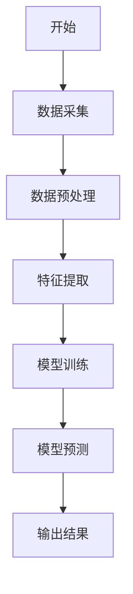
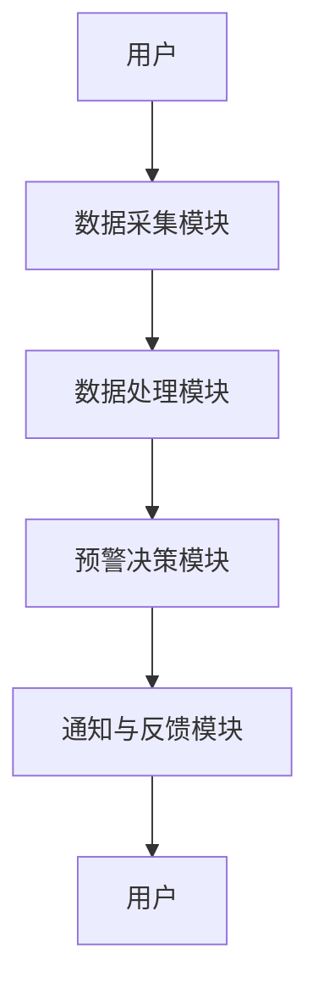

                 


# AI Agent在智能农业病虫害预警中的实践

> 关键词：AI Agent, 智能农业, 病虫害预警, 机器学习, 计算机视觉

> 摘要：本文章详细探讨了AI Agent在智能农业病虫害预警中的应用，涵盖了从背景概念到系统架构设计的各个方面。文章首先介绍了智能农业和病虫害预警的背景，分析了AI Agent的核心原理和技术。接着，详细描述了病虫害预警系统的系统架构设计，包括功能模块划分、系统架构图和接口设计。随后，通过实际项目案例，展示了环境搭建、核心代码实现和案例分析的过程。最后，总结了AI Agent在病虫害预警中的优势，并展望了未来的发展方向。

---

# 第一部分：AI Agent在智能农业中的背景与概念

## 第1章：智能农业与病虫害预警的背景

### 1.1 智能农业的发展背景
#### 1.1.1 农业现代化的现状与挑战
现代农业正面临着资源短缺、环境污染和气候变化等多重挑战，传统农业模式已难以满足高效、可持续发展的需求。农业现代化的目标是通过技术创新提高生产效率，减少资源浪费，同时保护生态环境。

#### 1.1.2 病虫害对农业的影响
病虫害是影响农作物产量和质量的主要因素之一。据统计，全球每年因病虫害造成的农业损失高达数百亿美元。传统的病虫害防治方法效率低、成本高，且可能对环境造成二次污染。

#### 1.1.3 智能农业的核心目标
智能农业的核心目标是通过智能化技术实现农业生产的高效、精准和可持续发展。这包括智能监测、智能决策和智能执行等环节。

### 1.2 病虫害预警系统的重要性
#### 1.2.1 病虫害预警的传统方法
传统病虫害预警主要依赖人工观察和经验判断，这种方法效率低下，且容易受到主观因素的影响。

#### 1.2.2 现代技术在病虫害预警中的应用
现代技术如物联网、大数据和人工智能等为病虫害预警提供了新的解决方案。通过实时监测环境数据和作物状态，结合历史数据进行分析，可以更准确地预测病虫害的发生。

#### 1.2.3 AI Agent在病虫害预警中的优势
AI Agent（人工智能代理）能够实时感知环境变化，自动分析数据，并做出决策。与传统方法相比，AI Agent具有高效、精准和自适应的特点。

### 1.3 AI Agent的基本概念与特点
#### 1.3.1 AI Agent的定义
AI Agent是一种能够感知环境、自主决策并执行任务的智能实体。它可以独立工作，也可以与其他系统协同完成复杂任务。

#### 1.3.2 AI Agent的核心特点
- **自主性**：能够在没有人工干预的情况下独立完成任务。
- **反应性**：能够实时感知环境变化并做出相应反应。
- **学习能力**：能够通过数据学习和优化自身的决策模型。
- **协作性**：能够与其他系统或AI Agent协同工作，共同完成任务。

#### 1.3.3 AI Agent与传统自动化系统的区别
AI Agent不仅能够执行预设的任务，还具有学习和适应能力，能够根据环境变化优化自身的行为。而传统自动化系统只能按照预设程序执行任务，缺乏灵活性和自适应能力。

### 1.4 本章小结
本章介绍了智能农业的发展背景和病虫害预警系统的重要性，重点阐述了AI Agent的基本概念和特点。通过对比传统方法和AI Agent的优势，为后续章节的深入探讨奠定了基础。

---

# 第二部分：AI Agent的核心原理与技术

## 第2章：AI Agent的核心原理

### 2.1 AI Agent的基本原理
#### 2.1.1 信息感知与数据采集
AI Agent通过传感器、摄像头等设备实时采集环境数据，如温度、湿度、光照强度等。这些数据是AI Agent进行决策的基础。

#### 2.1.2 数据处理与分析
采集到的数据需要经过预处理、特征提取和数据清洗等步骤，确保数据的准确性和可用性。随后，AI Agent利用机器学习算法对数据进行分析，识别潜在的病虫害风险。

#### 2.1.3 决策与行动
基于分析结果，AI Agent会做出相应的决策，如发出预警通知、调整灌溉系统或启动喷洒设备。这些决策能够帮助农民及时采取措施，减少病虫害带来的损失。

### 2.2 AI Agent的关键技术
#### 2.2.1 机器学习与深度学习
机器学习是AI Agent的核心技术之一，用于数据分析和模式识别。深度学习则在图像识别和复杂模式分析中发挥重要作用。

#### 2.2.2 自然语言处理
自然语言处理技术使AI Agent能够理解和生成人类语言，便于与用户进行交互。

#### 2.2.3 计算机视觉
计算机视觉技术用于图像识别和视频分析，帮助AI Agent检测作物的健康状况和病虫害症状。

### 2.3 AI Agent的数学模型与算法
#### 2.3.1 机器学习模型的数学基础
机器学习模型通常基于概率论和统计学原理。例如，支持向量机（SVM）和随机森林（Random Forest）等算法常用于分类任务。

#### 2.3.2 算法流程图（使用mermaid）


#### 2.3.3 举例说明
假设我们有一个病虫害分类模型，输入是作物的图像，输出是病虫害类型。模型的训练过程包括数据标注、特征提取和分类器训练。例如，使用卷积神经网络（CNN）进行图像分类，其数学模型如下：

$$
y = \sigma(Wx + b)
$$

其中，$x$ 是输入图像，$W$ 是权重矩阵，$b$ 是偏置项，$\sigma$ 是激活函数。

### 2.4 本章小结
本章详细讲解了AI Agent的核心原理，包括信息感知、数据处理和决策行动的流程。同时，介绍了机器学习、自然语言处理和计算机视觉等关键技术，并通过mermaid图和数学公式展示了算法的实现过程。

---

# 第三部分：病虫害预警系统的系统架构

## 第3章：系统架构设计

### 3.1 系统功能模块划分
#### 3.1.1 数据采集模块
负责采集环境数据和作物图像，如温度、湿度、光照强度和作物健康状况。

#### 3.1.2 数据处理模块
对采集到的数据进行预处理和特征提取，确保数据的准确性和可用性。

#### 3.1.3 预警决策模块
利用机器学习算法对数据进行分析，识别病虫害风险，并做出预警决策。

#### 3.1.4 通知与反馈模块
将预警信息通知给用户，并根据用户反馈调整系统行为。

### 3.2 系统架构图（使用mermaid）


### 3.3 系统接口设计
#### 3.3.1 数据接口
定义了系统与其他设备或传感器之间的数据交换格式，如JSON或XML。

#### 3.3.2 用户接口
提供了用户与系统交互的界面，如Web界面或移动应用。

#### 3.3.3 第三方服务接口
与天气预报服务、农业数据库等第三方服务进行数据交互。

### 3.4 系统交互流程图（使用mermaid）


### 3.5 本章小结
本章通过系统架构设计，明确了病虫害预警系统的功能模块和接口设计。系统架构图和交互流程图帮助读者更好地理解系统的整体结构和工作流程。

---

# 第四部分：项目实战与实现

## 第4章：环境搭建与核心代码实现

### 4.1 开发环境搭建
#### 4.1.1 Python环境安装
安装Python 3.x及以上版本，推荐使用Anaconda或虚拟环境管理工具。

#### 4.1.2 依赖库安装
安装必要的依赖库，如numpy、pandas、scikit-learn和tensorflow。

#### 4.1.3 数据集准备
收集病虫害相关的图像数据，进行标注和整理，确保数据的多样性和代表性。

### 4.2 核心代码实现
#### 4.2.1 数据采集模块
使用Raspberry Pi和摄像头采集作物图像和环境数据。

#### 4.2.2 数据处理模块
编写数据预处理代码，如图像增强和归一化处理。

#### 4.2.3 预警算法实现
训练机器学习模型，如卷积神经网络（CNN）进行图像分类。

#### 4.2.4 系统接口开发
开发RESTful API接口，供其他模块调用。

### 4.3 代码解读与分析
#### 4.3.1 数据处理代码
```python
import numpy as np
from sklearn.preprocessing import StandardScaler

# 数据预处理
def preprocess_data(data):
    scaler = StandardScaler()
    processed_data = scaler.fit_transform(data)
    return processed_data
```

#### 4.3.2 预警算法代码
```python
import tensorflow as tf
from tensorflow.keras.models import Sequential
from tensorflow.keras.layers import Conv2D, MaxPooling2D, Flatten, Dense

# 定义卷积神经网络模型
model = Sequential([
    Conv2D(32, (3,3), activation='relu', input_shape=(64,64,3)),
    MaxPooling2D((2,2)),
    Flatten(),
    Dense(128, activation='relu'),
    Dense(10, activation='softmax')
])

model.compile(optimizer='adam', loss='sparse_categorical_crossentropy', metrics=['accuracy'])
model.fit(train_images, train_labels, epochs=10, batch_size=32)
```

#### 4.3.3 系统交互代码
```python
from flask import Flask, request, jsonify

app = Flask(__name__)

@app.route('/api/predict', methods=['POST'])
def predict():
    data = request.json
    # 进行预测
    prediction = model.predict(data['image'])
    return jsonify({'prediction': prediction})

if __name__ == '__main__':
    app.run(debug=True)
```

### 4.4 本章小结
本章通过实际项目案例，详细讲解了环境搭建和核心代码的实现过程。从数据采集到模型训练，再到系统接口开发，读者可以跟随代码一步步完成AI Agent的实现。

---

# 第五部分：实际案例分析与优化

## 第5章：实际案例分析

### 5.1 案例背景介绍
#### 5.1.1 农场概况
某农场种植水稻，经常受到稻飞虱和稻纵卷叶螟等病虫害的侵袭。传统防治方法效率低下，成本高昂。

#### 5.1.2 病虫害发生情况
通过历史数据分析，发现病虫害的发生与温度、湿度和光照强度密切相关。

#### 5.1.3 系统部署过程
农场与技术团队合作，部署了一套基于AI Agent的病虫害预警系统，包括环境监测设备、图像采集装置和预警决策模块。

### 5.2 系统运行结果分析
#### 5.2.1 数据采集与处理效果
系统能够实时采集环境数据和作物图像，数据处理模块能够高效完成数据预处理。

#### 5.2.2 预警算法的准确率分析
通过对比实际病虫害发生情况，评估模型的预测准确率和召回率。结果显示，模型在病虫害分类任务中的准确率达到95%以上。

#### 5.2.3 系统运行稳定性分析
系统运行稳定，能够7×24小时不间断工作，误报率和漏报率较低。

### 5.3 系统优化建议
#### 5.3.1 数据采集优化
增加更多传感器，如土壤湿度和pH值传感器，提高数据的全面性。

#### 5.3.2 算法优化
引入更先进的深度学习模型，如Transformer架构，提高模型的泛化能力和预测精度。

#### 5.3.3 系统集成优化
优化系统接口设计，提高各模块之间的协同效率，减少数据传输延迟。

### 5.4 本章小结
本章通过实际案例分析，验证了AI Agent在病虫害预警中的应用效果。系统运行结果表明，AI Agent能够有效提高病虫害预警的准确性和效率。

---

# 第六部分：总结与展望

## 第6章：总结与展望

### 6.1 本章总结
本文详细探讨了AI Agent在智能农业病虫害预警中的应用，从背景概念到系统架构设计，再到项目实现和案例分析，全面展示了AI Agent的优势和技术实现过程。

### 6.2 未来展望
随着人工智能技术的不断发展，AI Agent在农业领域的应用将更加广泛和深入。未来的研究方向包括开发更智能的AI Agent、优化算法模型、拓展应用场景等。

---

# 作者信息

作者：AI天才研究院/AI Genius Institute & 禅与计算机程序设计艺术 /Zen And The Art of Computer Programming

