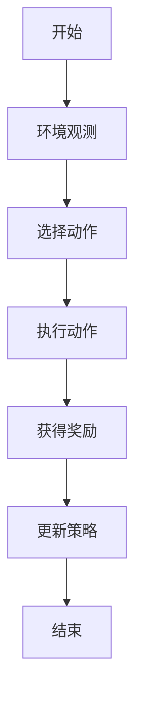
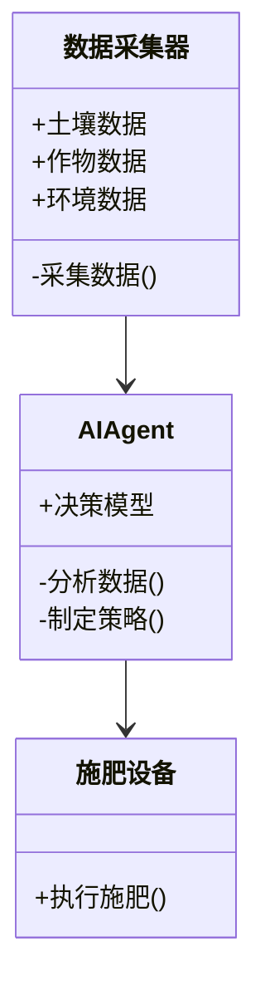
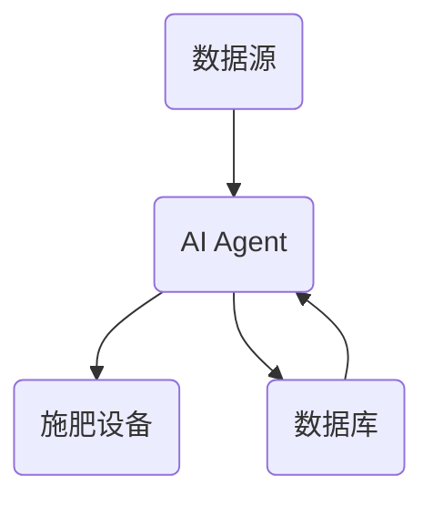

                 


---

# AI Agent在智能农业精准施肥中的实践

## 关键词：AI Agent，智能农业，精准施肥，算法原理，系统架构，项目实战

## 摘要：  
本文详细探讨了AI Agent在智能农业精准施肥中的应用，分析了其核心概念、算法原理、系统架构，并通过项目实战展示了AI Agent如何实现精准施肥。文章还总结了最佳实践和注意事项，为农业智能化提供了有价值的参考。

---

# 第一部分: AI Agent与智能农业精准施肥的背景介绍

## 第1章: AI Agent与智能农业精准施肥概述

### 1.1 AI Agent的背景与概念  
AI Agent（人工智能代理）是指能够感知环境并采取行动以实现目标的智能体。其核心特点包括自主性、反应性、目标导向和学习能力。AI Agent与传统农业技术的区别在于，前者能够动态调整策略，后者通常基于固定规则。

### 1.2 精准施肥的背景与问题  
精准施肥旨在根据土壤条件、作物需求和环境因素，科学施加肥料，以提高产量和减少浪费。当前面临的主要问题是传统方法依赖经验，效率低且环境影响大。

### 1.3 AI Agent在精准施肥中的应用  
AI Agent通过实时数据采集、分析和决策，优化施肥方案。其应用场景包括土壤检测、作物监测和环境预测。

## 1.4 本章小结  
本章介绍了AI Agent的基本概念和精准施肥的重要性，展示了AI Agent在农业中的潜力。

---

# 第二部分: AI Agent的核心概念与联系

## 第2章: AI Agent的核心原理  

### 2.1 AI Agent的原理与机制  
AI Agent通过感知环境、分析数据、制定决策和执行动作来实现目标。其感知与决策机制涉及数据采集、特征提取和决策模型。

### 2.2 AI Agent与精准施肥的关联  
AI Agent通过数据采集、分析和优化，实现精准施肥。其关联性体现在数据驱动决策和动态调整策略。

### 2.3 AI Agent的核心概念属性对比  
| 概念       | AI Agent | 精准施肥 | 传统施肥 |
|------------|----------|----------|----------|
| 数据依赖    | 高       | 高       | 低       |
| 自适应性    | 高       | 中       | 低       |
| 精度        | 高       | 中       | 低       |

### 2.4 AI Agent的ER实体关系图  
```mermaid
er
  actor(用户) -->
  agent(AI Agent) -->
  soil(S土壤数据)
  crop(作物数据)
  environment(环境数据)
  agent <--o 决策
  agent <--o 施肥方案
```

## 2.5 本章小结  
本章详细讲解了AI Agent的核心原理及其与精准施肥的关联，通过对比分析和实体关系图帮助读者理解其应用。

---

# 第三部分: AI Agent的算法原理与数学模型  

## 第3章: AI Agent的算法原理  

### 3.1 AI Agent的主要算法  
AI Agent常用的算法包括强化学习和监督学习。以下以强化学习为例，展示其流程图：



### 3.2 精准施肥中的算法选择  
选择强化学习的原因是其适合动态环境下的决策问题。其数学模型如下：

奖励函数：  
$$ R(s, a) = \begin{cases} 
1 & \text{如果施肥有效} \\
0 & \text{否则}
\end{cases} $$

### 3.3 本章小结  
本章通过算法流程图和数学公式，展示了AI Agent在精准施肥中的具体实现。

---

# 第四部分: 系统分析与架构设计  

## 第4章: 系统分析与架构设计  

### 4.1 问题场景介绍  
系统需实时监测土壤、作物和环境数据，动态调整施肥策略。

### 4.2 系统功能设计  
领域模型类图如下：



### 4.3 系统架构设计  
系统架构图如下：



### 4.4 本章小结  
本章通过类图和架构图，展示了系统的整体结构和各部分的协同工作。

---

# 第五部分: 项目实战  

## 第5章: 项目实战  

### 5.1 环境安装  
安装Python和相关库（如TensorFlow和Scikit-learn）。

### 5.2 核心代码实现  
```python
import numpy as np
from sklearn import linear_model

# 数据准备
X = np.array([[soil Moisture], [crop Growth]])
y = np.array([nitrogen dose])

# 训练模型
model = linear_model.LinearRegression()
model.fit(X, y)

# 预测施肥量
predicted_dose = model.predict(new_X)
```

### 5.3 案例分析  
通过实际案例展示AI Agent如何优化施肥方案，提高作物产量。

## 5.4 本章小结  
本章通过实战展示了AI Agent在精准施肥中的具体应用。

---

# 第六部分: 最佳实践  

## 第6章: 最佳实践  

### 6.1 经验与技巧  
数据质量是关键，确保数据的准确性和实时性。

### 6.2 注意事项  
避免过度依赖AI，定期人工检查和调整。

### 6.3 拓展阅读  
推荐阅读《机器学习实战》和《农业智能系统设计》。

## 6.4 本章小结  
本章总结了实施中的注意事项和经验，为读者提供了实用建议。

---

# 结语  

AI Agent在智能农业中的应用前景广阔，通过精准施肥，不仅提高了农业效率，还保护了环境。未来，随着技术进步，AI Agent将在农业智能化中发挥更大作用。

---

# 作者：AI天才研究院/AI Genius Institute & 禅与计算机程序设计艺术 /Zen And The Art of Computer Programming

