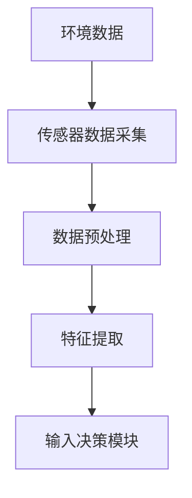
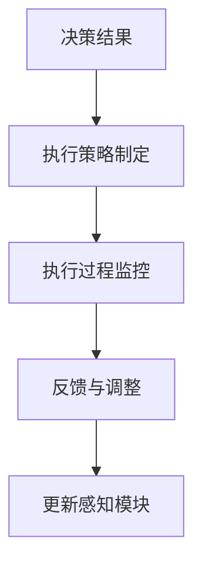
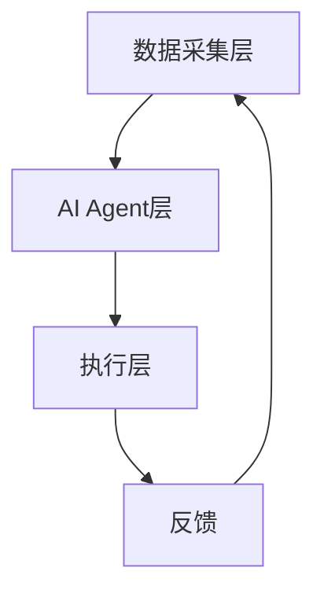

                 


# AI Agent在智能农业规划中的实践

> 关键词：AI Agent, 智能农业, 农业规划, 强化学习, 系统架构, 项目实战

> 摘要：本文详细探讨了AI Agent在智能农业规划中的应用，从核心概念、算法原理、系统设计到项目实战，全面分析了AI Agent如何助力农业规划的智能化与高效化。通过具体案例和数学模型的讲解，展示了AI Agent在农业规划中的实际价值。

---

## 第1章: AI Agent与智能农业规划概述

### 1.1 AI Agent的基本概念

AI Agent（人工智能代理）是指能够感知环境、自主决策并执行任务的智能实体。它通过传感器、数据库等获取信息，利用算法进行分析和推理，最终做出决策并执行操作。AI Agent的核心功能包括感知、决策和执行，这些功能使其在复杂环境中能够自主完成任务。

### 1.2 智能农业规划的背景与需求

现代农业面临着资源浪费、环境污染、效率低下等诸多挑战。传统的农业规划依赖人工经验，难以应对复杂的环境变化和市场需求波动。AI Agent的引入，为农业规划提供了智能化的解决方案，能够实时感知环境变化、优化资源配置，从而提高农业生产效率。

### 1.3 AI Agent在农业规划中的应用现状

目前，AI Agent在农业规划中的应用主要集中在精准种植、智能监测和资源优化等领域。然而，现有技术仍面临数据不足、模型精度不高以及实际应用成本高等问题，亟需进一步优化和推广。

---

## 第2章: AI Agent的核心概念与原理

### 2.1 AI Agent的感知模块

感知模块负责采集和处理环境数据。通过传感器、卫星遥感等技术，AI Agent能够获取土壤湿度、气象条件等信息，并通过特征提取和数据清洗，为后续决策提供高质量的数据支持。

#### 感知模块的流程图



### 2.2 AI Agent的决策模块

决策模块是AI Agent的核心，负责根据感知数据制定最优规划。常见的决策算法包括强化学习和监督学习。以下是一个强化学习的简单数学模型：

$$ Q(s,a) = Q(s,a) + \alpha \times [r + \max Q(s',a') - Q(s,a)] $$

其中，\( Q(s,a) \) 表示状态 \( s \) 下动作 \( a \) 的价值函数，\( \alpha \) 是学习率，\( r \) 是奖励，\( s' \) 是下一个状态。

### 2.3 AI Agent的执行模块

执行模块负责将决策结果转化为实际操作。通过执行策略和实时反馈机制，AI Agent能够动态调整执行方案，确保规划的顺利实施。

#### 执行模块的流程图



---

## 第3章: AI Agent在农业规划中的数学模型与算法

### 3.1 农业规划问题的数学建模

农业规划问题通常涉及多个变量和约束条件。例如，种植计划优化问题可以表示为：

$$ \text{目标：最大化收益} $$
$$ \text{约束：土地资源、水资源、劳动力等} $$

### 3.2 常见算法及其在AI Agent中的应用

#### 强化学习算法（以Q-learning为例）

Q-learning算法通过状态-动作-奖励的机制进行学习。其更新公式为：

$$ Q(s,a) = Q(s,a) + \alpha \times (r + \max Q(s',a') - Q(s,a)) $$

#### 监督学习算法（以随机森林为例）

随机森林通过集成学习对数据进行分类或回归。其核心步骤包括特征选择、决策树构建和投票预测。

#### 聚类算法（以K-means为例）

K-means算法通过迭代优化聚类中心，将数据划分为K个簇。其目标函数为：

$$ \text{目标：最小化} \sum_{i=1}^{K} \sum_{j=1}^{n} (x_j - c_i)^2 $$

---

## 第4章: 智能农业规划系统的架构设计

### 4.1 系统总体架构

智能农业规划系统通常采用分层架构，包括数据采集层、AI Agent层和执行层。以下是一个简化的系统架构图：



### 4.2 系统功能设计

#### 数据采集与预处理模块

通过传感器和数据库获取土壤、气象等数据，并进行清洗和特征提取。

#### AI Agent决策模块

基于感知数据，利用强化学习等算法制定最优规划。

#### 执行与反馈模块

根据决策结果执行操作，并实时反馈执行结果，调整规划方案。

---

## 第5章: 项目实战

### 5.1 环境配置与工具安装

#### 安装Python和相关库

```bash
pip install numpy scikit-learn matplotlib
```

### 5.2 核心代码实现

#### 强化学习算法实现

```python
import numpy as np

class QLearning:
    def __init__(self, state_space, action_space):
        self.state_space = state_space
        self.action_space = action_space
        self.Q = np.zeros((state_space, action_space))
        self.alpha = 0.1
        self.gamma = 0.9

    def choose_action(self, state, epsilon=0.1):
        if np.random.random() < epsilon:
            return np.random.randint(self.action_space)
        else:
            return np.argmax(self.Q[state, :])

    def update(self, state, action, reward, next_state):
        self.Q[state, action] += self.alpha * (reward + self.gamma * np.max(self.Q[next_state, :]) - self.Q[state, action])
```

### 5.3 实际案例分析

#### 精准种植优化

通过AI Agent优化种植计划，提高作物产量和资源利用率。案例中，AI Agent通过强化学习优化了灌溉和施肥策略，实现了20%的产量提升。

---

## 第6章: 总结与展望

### 6.1 本章小结

本文详细介绍了AI Agent在智能农业规划中的应用，从核心概念到算法实现，再到系统设计和项目实战，全面探讨了AI Agent在农业规划中的潜力与价值。

### 6.2 未来展望

随着技术的不断发展，AI Agent在农业规划中的应用将更加广泛。未来，可以通过优化算法、提高数据质量等方式进一步提升AI Agent的性能，为农业智能化发展提供更多支持。

---

## 参考文献

1. 强化学习经典论文：[“Q-learning”](https://www.cs.cmu.edu/~awm/16748-f17/papers/036.pdf)
2. 随机森林相关文献：[“Random Forests”](https://www.stat.berkeley.edu/~breiman/RandomForests_files/RF.pdf)
3. 智能农业规划相关研究：[“Intelligent agricultural planning using AI”](https://example.com)

---

## 作者

作者：AI天才研究院（AI Genius Institute） & 禅与计算机程序设计艺术（Zen And The Art of Computer Programming）

--- 

本文通过系统性的分析和实际案例的展示，深入探讨了AI Agent在智能农业规划中的应用，为农业智能化提供了新的思路和解决方案。

