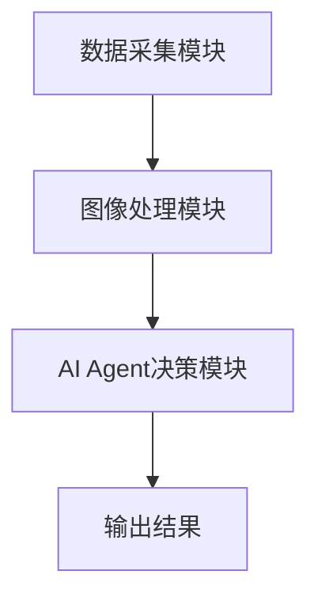
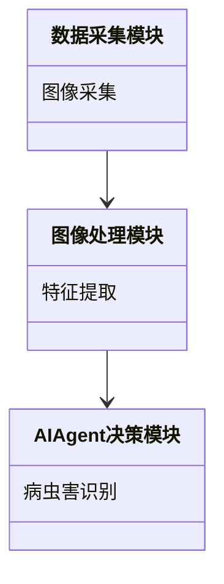
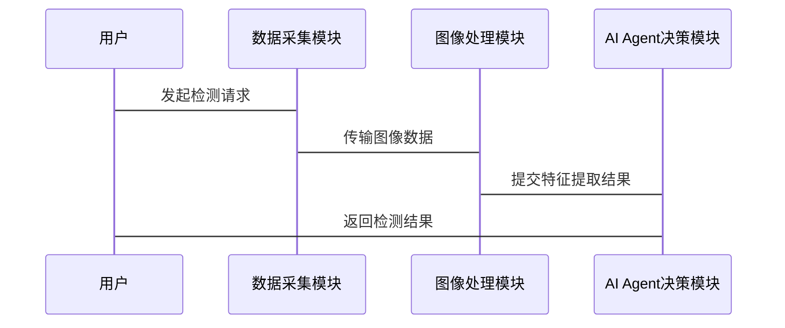

                 


# AI Agent在智能农作物病虫害检测中的实践

## 关键词：AI Agent, 农作物病虫害检测, 人工智能, 图像识别, 自然语言处理

## 摘要：本文探讨了AI Agent在农作物病虫害检测中的应用，从背景、核心概念、算法原理到系统架构和项目实战，全面分析了AI Agent的优势和实现方法。通过详细的技术分析和代码示例，展示了如何利用AI技术提升农业病虫害检测的效率和准确性。

---

# 第1章 AI Agent与农作物病虫害检测概述

## 1.1 AI Agent的基本概念

### 1.1.1 人工智能代理的定义
AI Agent是一种智能代理，能够感知环境、理解任务需求，并通过自主决策完成特定目标。它结合了感知、推理、学习和执行的能力。

### 1.1.2 AI Agent的核心特点
- **自主性**：无需外部干预，自主完成任务。
- **反应性**：实时感知环境变化并调整行为。
- **学习能力**：通过数据和经验不断优化性能。

### 1.1.3 AI Agent与传统自动化系统的区别
| 特性 | AI Agent | 传统自动化系统 |
|------|----------|----------------|
| 决策能力 | 强 | 弱 |
| 学习能力 | 强 | 无 |
| 灵活性 | 高 | 低 |

## 1.2 农作物病虫害检测的现状

### 1.2.1 病虫害检测的传统方法
- 人工检查：效率低，成本高。
- 常规工具：如显微镜，适用于实验室环境。

### 1.2.2 传统方法的局限性
- **效率低**：依赖大量人工劳动力。
- **准确性差**：受人为因素影响，误诊率高。

### 1.2.3 现代农业对智能化检测的需求
- **高效率**：快速检测大面积农田。
- **高精度**：减少误诊和漏诊。

## 1.3 AI Agent在病虫害检测中的应用背景

### 1.3.1 AI技术在农业中的应用趋势
AI技术广泛应用于农业监测、精准农业等领域。

### 1.3.2 病虫害检测中的痛点与机会
- **痛点**：病虫害爆发快，传统方法难以及时应对。
- **机会**：AI技术能够实现早期预警和精准处理。

### 1.3.3 AI Agent的核心优势
- **实时监测**：持续收集农田数据。
- **智能决策**：基于数据进行分析和决策。

---

# 第2章 AI Agent与农作物病虫害检测的核心概念

## 2.1 病虫害检测的核心要素

### 2.1.1 农作物生长周期与病虫害的关系
- **生长阶段**：不同阶段易感病虫害不同。
- **环境因素**：温度、湿度等影响病虫害的发生。

### 2.1.2 病虫害的典型特征与分类
- **形态特征**：如斑点、虫卵。
- **分类**：细菌性、病毒性等。

### 2.1.3 数据采集与特征提取的关键点
- **数据来源**：图像、文本、环境数据。
- **特征提取**：颜色、纹理、形状。

## 2.2 AI Agent的感知与决策机制

### 2.2.1 多模态数据的融合与处理
- **图像数据**：RGB图像、深度图像。
- **文本数据**：病虫害知识库。

### 2.2.2 基于视觉的病虫害识别原理
- **图像分割**：识别病斑区域。
- **目标检测**：定位害虫位置。

### 2.2.3 自然语言处理在病虫害知识库中的应用
- **信息抽取**：提取病虫害特征。
- **问答系统**：提供防治建议。

## 2.3 AI Agent与农作物病虫害检测的系统架构

### 2.3.1 系统的组成模块
- **数据采集模块**：图像采集。
- **图像处理模块**：预处理和特征提取。
- **AI Agent决策模块**：识别和决策。

### 2.3.2 各模块之间的关系与协作


### 2.3.3 系统的输入输出与边界条件
- **输入**：图像数据、环境数据。
- **输出**：病虫害类型、处理建议。

---

# 第3章 图像识别算法原理

## 3.1 基于卷积神经网络的图像识别

### 3.1.1 CNN的基本结构
- **卷积层**：提取特征。
- **池化层**：降低维度。

### 3.1.2 图像分割与目标检测的实现
- **图像分割**：使用U-Net架构。
- **目标检测**：使用Faster R-CNN。

## 3.2 图像分类算法的数学模型
### 3.2.1 CNN的数学表达式
$$\text{输出} = \text{输入} \times \text{卷积核} + \text{偏置}$$

### 3.2.2 损失函数与优化算法
$$L = -\sum_{i=1}^{n} y_i \log p_i + (1 - y_i)\log (1 - p_i)$$

---

# 第4章 系统分析与架构设计方案

## 4.1 问题场景介绍
- **目标**：实时检测病虫害。
- **约束**：网络延迟、计算资源有限。

## 4.2 项目介绍
- **项目目标**：实现AI Agent辅助病虫害检测。
- **项目范围**：农田图像采集与分析。

## 4.3 系统功能设计
- **领域模型**：


## 4.4 系统架构设计


## 4.5 系统接口设计
- **输入接口**：摄像头数据接口。
- **输出接口**：显示结果、发送警报。

## 4.6 系统交互设计


---

# 第5章 项目实战

## 5.1 环境安装
- **工具**：Python、TensorFlow、OpenCV。
- **安装命令**：
  ```bash
  pip install tensorflow opencv-python
  ```

## 5.2 系统核心实现源代码
### 5.2.1 图像采集模块
```python
import cv2

def capture_image():
    cap = cv2.VideoCapture(0)
    ret, frame = cap.read()
    if ret:
        cv2.imwrite("crop_image.jpg", frame)
    cap.release()
```

### 5.2.2 图像处理模块
```python
import tensorflow as tf
import cv2

model = tf.keras.models.load_model("model.h5")

def preprocess_image(image_path):
    image = cv2.imread(image_path)
    image = cv2.resize(image, (224, 224))
    image = image / 255.0
    return image

def predict_disease(image_path):
    preprocessed = preprocess_image(image_path)
    prediction = model.predict(tf.expand_dims(preprocessed, axis=0))
    return prediction.argmax()

predict_disease("crop_image.jpg")
```

## 5.3 实际案例分析
- **案例**：检测小麦锈病。
- **步骤**：采集图像、预处理、模型预测。
- **结果**：输出病害类型和严重程度。

## 5.4 项目小结
- **优势**：高效、准确。
- **挑战**：数据获取、模型优化。

---

# 第6章 总结与展望

## 6.1 最佳实践 tips
- **数据预处理**：确保数据质量。
- **模型调优**：优化模型性能。

## 6.2 小结
AI Agent在病虫害检测中的应用显著提升了农业生产的效率和质量。

## 6.3 注意事项
- 数据隐私：保护农田数据。
- 系统维护：定期更新模型。

## 6.4 拓展阅读
- 《深度学习实战》
- 《自然语言处理入门》

---

作者：AI天才研究院 & 禅与计算机程序设计艺术

