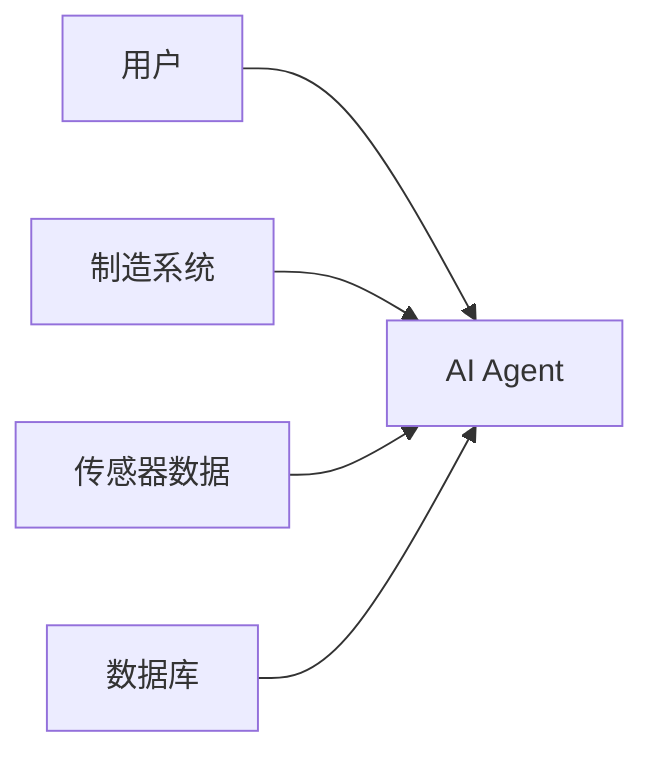
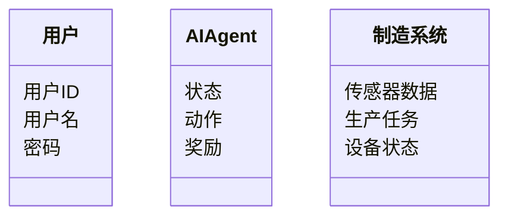

                 


# AI Agent在智能制造中的角色与实践

> 关键词：AI Agent, 智能制造, 强化学习, 系统架构, 数学模型

> 摘要：本文系统地探讨了AI Agent在智能制造中的角色与实践。首先，介绍了制造业智能化转型的背景与AI Agent的基本概念，分析了AI Agent的核心算法原理与数学模型。然后，详细讲解了智能制造系统中的AI Agent设计，包括系统架构设计、功能设计和接口设计。最后，通过实际案例分析了AI Agent在智能制造中的应用，并提出了未来研究方向与实践建议。

---

# 第1章: 制造业智能化转型与AI Agent的引入

## 1.1 制造业的数字化与智能化转型

制造业是国民经济的支柱产业，其数字化与智能化转型是第四次工业革命的核心。传统制造业通过引入物联网（IoT）、大数据、人工智能（AI）等技术，逐步向智能制造迈进。智能制造强调生产过程的智能化、网络化和协同化，旨在提高生产效率、降低成本、提升产品质量和增强企业竞争力。

### 1.1.1 制造业的历史演变与现状

制造业经历了机械化、电气化、自动化和数字化的演变阶段。当前，制造业正在向智能化方向发展，人工智能技术的引入为制造业带来了新的机遇与挑战。智能制造不仅仅是单一技术的应用，而是多种技术的深度融合。

### 1.1.2 数字化与智能化转型的驱动力

数字化与智能化转型的驱动力包括：

1. **技术进步**：AI、IoT、云计算等技术的快速发展为智能制造提供了技术基础。
2. **市场竞争**：企业为了在激烈的市场竞争中占据优势，必须提高生产效率和产品质量。
3. **成本压力**：通过智能化技术优化生产流程，降低生产成本。
4. **客户需求**：客户对个性化、定制化产品的需求增加，推动了智能制造的发展。

### 1.1.3 制造业智能化转型的目标与挑战

制造业智能化转型的目标是实现生产过程的智能化、网络化和协同化。然而，这一过程面临以下挑战：

1. **技术集成**：多种技术的融合需要复杂的系统集成能力。
2. **数据处理**：海量数据的采集、存储和分析对系统提出了更高的要求。
3. **安全性**：智能制造系统的安全性问题需要高度重视。
4. **人才短缺**：缺乏既懂制造又懂AI的复合型人才。

## 1.2 AI Agent的基本概念与特征

### 1.2.1 AI Agent的定义与核心要素

AI Agent（人工智能代理）是指能够感知环境、自主决策并执行任务的智能实体。其核心要素包括：

1. **感知能力**：通过传感器或数据源获取环境信息。
2. **决策能力**：基于感知信息进行推理和决策。
3. **执行能力**：通过执行机构或接口实现决策结果。
4. **学习能力**：通过经验优化自身行为。

### 1.2.2 AI Agent的分类与应用场景

AI Agent可以根据功能、智能水平和应用场景进行分类。例如：

- **简单反射型Agent**：基于规则的简单决策。
- **基于模型的反射型Agent**：通过内部模型进行推理和决策。
- **目标驱动型Agent**：以特定目标为导向进行决策。
- **实用驱动型Agent**：以效用最大化为目标进行决策。

### 1.2.3 AI Agent与传统自动化系统的区别

与传统自动化系统相比，AI Agent具有以下特点：

1. **自主性**：能够自主决策，无需人工干预。
2. **适应性**：能够适应环境变化并动态调整行为。
3. **学习能力**：能够通过经验优化自身行为。

## 1.3 制造业中的AI Agent应用前景

### 1.3.1 制造业智能化中的关键问题

智能制造中的关键问题包括：

1. **生产优化**：如何通过AI技术优化生产流程。
2. **质量控制**：如何实现高精度的质量检测。
3. **预测维护**：如何预测设备故障并进行预防性维护。

### 1.3.2 AI Agent在制造业中的潜在价值

AI Agent在制造业中的潜在价值包括：

1. **提高生产效率**：通过优化生产流程减少浪费。
2. **降低运营成本**：通过预测维护减少设备故障。
3. **提升产品质量**：通过实时检测提高产品质量。

### 1.3.3 典型应用场景分析

典型应用场景包括：

1. **智能调度**：通过AI Agent优化生产任务的调度。
2. **质量检测**：通过AI Agent实现高精度的质量检测。
3. **设备维护**：通过AI Agent进行设备的预测性维护。

## 1.4 本章小结

本章介绍了制造业智能化转型的背景与AI Agent的基本概念，分析了AI Agent的核心特征及其在制造业中的应用前景。

---

# 第2章: AI Agent的核心概念与系统架构

## 2.1 AI Agent的核心概念体系

### 2.1.1 AI Agent的组成要素

AI Agent的组成要素包括：

1. **感知模块**：负责获取环境信息。
2. **推理模块**：负责对感知信息进行推理。
3. **决策模块**：负责制定决策策略。
4. **执行模块**：负责执行决策结果。

### 2.1.2 AI Agent的决策机制

AI Agent的决策机制包括：

1. **基于规则的决策**：通过预设规则进行决策。
2. **基于模型的决策**：通过内部模型进行推理和决策。
3. **基于学习的决策**：通过机器学习算法进行决策。

### 2.1.3 AI Agent与人类交互的模式

AI Agent与人类交互的模式包括：

1. **命令式交互**：用户通过命令直接控制AI Agent。
2. **问答式交互**：用户通过提问与AI Agent进行交互。
3. **协作式交互**：用户与AI Agent协作完成任务。

## 2.2 AI Agent的属性特征对比

### 2.2.1 基于表格的核心概念属性对比

以下是AI Agent的核心概念属性对比表：

| 概念       | 描述                                         |
|------------|----------------------------------------------|
| 智能性     | 基于AI算法的自主决策能力                   |
| 反应性     | 对环境变化的实时响应能力                   |
| 学习性     | 通过数据优化自身行为的能力                 |
| 灵活性     | 适应不同场景的能力                         |

## 2.3 AI Agent的实体关系架构

以下是AI Agent的实体关系架构图：



## 2.4 本章小结

本章详细讲解了AI Agent的核心概念体系及其与人类交互的模式，并通过对比分析和实体关系图展示了AI Agent的属性特征。

---

# 第3章: AI Agent的算法原理与数学模型

## 3.1 AI Agent的核心算法原理

### 3.1.1 基于强化学习的决策算法

强化学习是一种通过试错机制优化决策策略的算法。其核心是通过与环境的交互，逐步优化策略以最大化累积奖励。

### 3.1.2 基于监督学习的分类算法

监督学习是一种通过标记数据训练模型的算法。其核心是通过训练数据，学习输入与输出之间的映射关系。

### 3.1.3 基于知识图谱的推理算法

知识图谱是一种结构化的知识表示方式。其核心是通过构建知识图谱，进行推理和关联分析。

## 3.2 强化学习算法的数学模型

### 3.2.1 Q-learning算法

Q-learning算法是一种经典的强化学习算法，其数学模型如下：

$$ Q(s, a) = r + \gamma \max_{a'} Q(s', a') $$

其中，\( Q(s, a) \) 表示当前状态 \( s \) 下采取动作 \( a \) 的价值，\( r \) 表示奖励，\( \gamma \) 表示折扣因子，\( s' \) 表示下一状态。

### 3.2.2 实际案例分析

以智能调度为例，假设我们有一个生产任务调度问题，可以通过Q-learning算法进行优化。状态 \( s \) 表示当前任务的优先级，动作 \( a \) 表示调度策略，奖励 \( r \) 表示调度效率的提升。

## 3.3 本章小结

本章详细讲解了AI Agent的核心算法原理，并通过Q-learning算法的数学模型和实际案例分析，展示了强化学习在智能制造中的应用。

---

# 第4章: 智能制造系统中的AI Agent设计

## 4.1 系统场景与功能需求

### 4.1.1 制造业智能化中的典型场景

典型场景包括：

1. **智能调度**：优化生产任务的调度。
2. **质量检测**：实现高精度的质量检测。
3. **设备维护**：进行设备的预测性维护。

### 4.1.2 系统功能需求分析

系统功能需求包括：

1. **数据采集**：采集生产过程中的各种数据。
2. **数据分析**：对数据进行分析和处理。
3. **决策优化**：基于分析结果优化决策。
4. **执行控制**：根据决策结果执行控制。

### 4.1.3 用户角色与权限管理

用户角色包括：

1. **系统管理员**：负责系统的配置和管理。
2. **生产经理**：负责生产任务的调度和监控。
3. **质量检测员**：负责质量检测和数据分析。

## 4.2 系统功能设计

### 4.2.1 领域模型设计

以下是领域模型设计图：



### 4.2.2 系统架构设计

以下是系统架构设计图：


## 4.3 本章小结

本章详细讲解了智能制造系统中的AI Agent设计，包括系统场景与功能需求、领域模型设计和系统架构设计。

---

# 第5章: 智能制造中的AI Agent系统实现

## 5.1 项目实战

### 5.1.1 环境安装

需要安装的环境包括：

1. **Python**：用于开发AI Agent。
2. **TensorFlow**：用于机器学习模型的训练。
3. **Flask**：用于Web接口的开发。

### 5.1.2 系统核心实现源代码

以下是AI Agent的核心实现代码：

```python
class AI-Agent:
    def __init__(self):
        self.states = []
        self.actions = []
        self.rewards = []
    
    def perceive(self):
        # 获取环境信息
        pass
    
    def decide(self):
        # 基于感知信息进行决策
        pass
    
    def execute(self):
        # 执行决策结果
        pass
```

### 5.1.3 代码应用解读与分析

以上代码定义了一个AI Agent类，包括感知、决策和执行三个主要方法。感知方法用于获取环境信息，决策方法基于感知信息进行决策，执行方法用于执行决策结果。

### 5.1.4 实际案例分析

以智能调度为例，AI Agent可以通过感知生产任务的优先级，决策最优的调度策略，并执行相应的调度操作。

## 5.2 本章小结

本章通过实际案例分析，详细讲解了AI Agent在智能制造中的系统实现。

---

# 第6章: 总结与展望

## 6.1 总结

本文系统地探讨了AI Agent在智能制造中的角色与实践。通过分析AI Agent的核心算法原理与系统架构设计，展示了AI Agent在智能制造中的广泛应用。

## 6.2 未来研究方向与实践建议

未来研究方向包括：

1. **多智能体协作**：研究多智能体协作机制。
2. **实时决策优化**：优化AI Agent的实时决策能力。
3. **安全性与隐私保护**：增强AI Agent的安全性与隐私保护能力。

---

# 作者：AI天才研究院/AI Genius Institute & 禅与计算机程序设计艺术 /Zen And The Art of Computer Programming

---

注意事项：
1. 本文是基于AI Agent在智能制造中的角色与实践的深度分析，旨在为相关领域的研究者和实践者提供参考。
2. 由于篇幅限制，本文未详细展开所有细节，具体内容可参考相关文献。
3. 本文中的代码和图表均为示例，实际应用中需要根据具体需求进行调整和优化。

