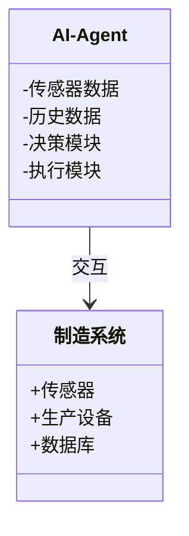
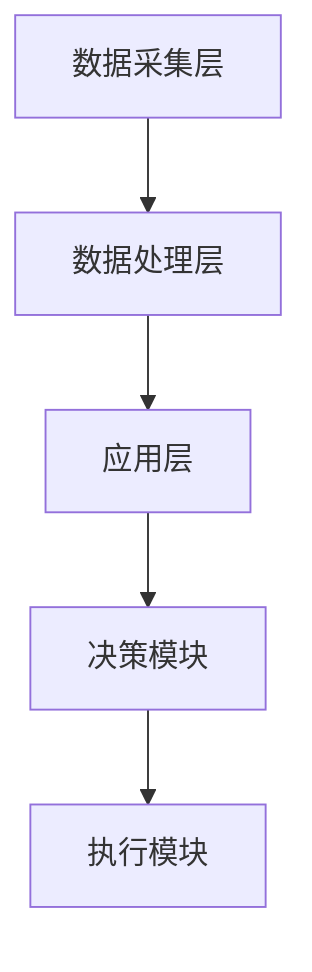
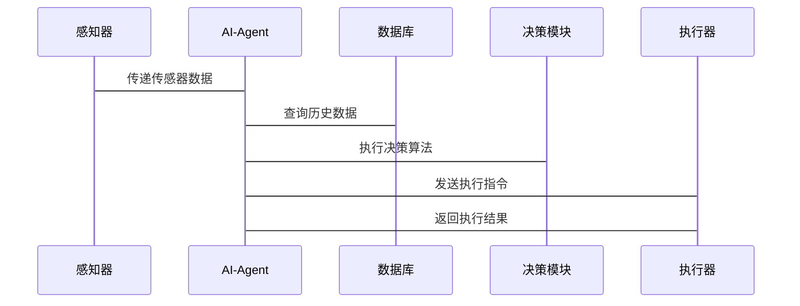

                 


# AI Agent在智能制造质量控制中的角色

## 关键词：AI Agent，智能制造，质量控制，算法原理，系统架构，项目实战

## 摘要：本文探讨AI Agent在智能制造质量控制中的应用，分析其核心算法、系统设计和实际案例，展示AI Agent如何提升制造业的质量控制效率和精度。

---

# 第1章: AI Agent与智能制造质量控制的背景与基础

## 1.1 制造业数字化与智能化转型

### 1.1.1 制造业的数字化革命

制造业正经历从传统生产模式向数字化、智能化转型的过程。数字化革命通过引入物联网、大数据和人工智能技术，显著提升了生产效率和产品质量。

### 1.1.2 智能制造的核心概念

智能制造是一种以数据驱动的生产模式，利用AI、物联网和云计算等技术，实现生产过程的智能化和自动化。

### 1.1.3 质量控制在智能制造中的重要性

质量控制是确保产品符合标准的关键环节，直接影响企业的声誉和市场竞争力。在智能制造中，质量控制需要实时、精准的检测和优化。

---

## 1.2 AI Agent的基本概念

### 1.2.1 什么是AI Agent

AI Agent（智能体）是能够感知环境、自主决策并采取行动的智能系统。它通过传感器获取信息，利用算法进行分析，并执行任务。

### 1.2.2 AI Agent的分类与特点

AI Agent可以分为简单反射型、基于模型的反应型、目标驱动型和效用驱动型。其特点是自主性、反应性、目标导向和学习能力。

### 1.2.3 AI Agent在制造业中的应用潜力

AI Agent在制造业中可用于质量检测、预测维护和生产优化，显著提升效率和降低成本。

---

## 1.3 制造业质量控制的挑战与需求

### 1.3.1 制造业质量控制的传统方法

传统方法依赖人工检查和统计分析，效率低且易出错。随着生产复杂度增加，传统方法已难以满足需求。

### 1.3.2 数字化与智能化转型中的质量控制需求

智能制造要求质量控制实时、精准，能够处理大量数据并快速做出决策。

### 1.3.3 AI Agent在质量控制中的角色定位

AI Agent通过实时数据处理、自主决策和持续优化，成为智能制造质量控制的核心工具。

---

## 1.4 本章小结

本章介绍了智能制造的背景、AI Agent的概念及其在质量控制中的重要性。接下来将深入探讨AI Agent的核心算法。

---

# 第2章: AI Agent的核心算法原理

## 2.1 监督学习算法

### 2.1.1 线性回归

线性回归用于预测连续型变量，例如预测产品的缺陷率。其数学模型为：

$$ y = \beta_0 + \beta_1x + \epsilon $$

### 2.1.2 支持向量机

支持向量机用于分类问题，通过构建超平面将数据点分为不同类别，适用于质量检测中的分类任务。

### 2.1.3 决策树与随机森林

决策树通过树状结构进行分类和回归，随机森林则通过多棵决策树的集成提高准确性。

---

## 2.2 无监督学习算法

### 2.2.1 K-means聚类

K-means用于将数据分为K个簇，适用于识别生产过程中的异常模式。

### 2.2.2 层次聚类

层次聚类通过构建树状结构将数据分成层次，适用于复杂的数据结构。

### 2.2.3 异常检测算法

异常检测用于识别异常数据点，适用于质量控制中的缺陷检测。

---

## 2.3 强化学习算法

### 2.3.1 Q-learning算法

Q-learning通过状态-动作-奖励机制进行学习，适用于动态环境中的决策问题。

### 2.3.2 Deep Q-Networks

深度Q网络结合深度学习和强化学习，用于复杂环境下的决策优化。

### 2.3.3 强化学习在质量控制中的应用

强化学习可用于优化质量控制策略，例如动态调整检测参数。

---

## 2.4 算法选择与优化

### 2.4.1 算法选择的考虑因素

数据类型、任务目标和计算资源是选择算法的关键因素。

### 2.4.2 算法优化方法

参数调优、模型集成和分布式计算是常用的优化方法。

### 2.4.3 算法评估指标

准确率、召回率和F1分数是常用的评估指标。

---

## 2.5 本章小结

本章详细介绍了AI Agent的核心算法，包括监督学习、无监督学习和强化学习。接下来将探讨这些算法的数学模型。

---

# 第3章: 数学模型与公式

## 3.1 线性回归模型

线性回归的数学表达式为：

$$ y = \beta_0 + \beta_1x + \epsilon $$

其中，$\beta_0$是截距，$\beta_1$是斜率，$\epsilon$是误差项。

---

## 3.2 支持向量机

支持向量机的目标是最小化经验风险和结构风险，其目标函数为：

$$ \min \frac{1}{2}||\omega||^2 + C\sum_{i=1}^n \xi_i $$

---

## 3.3 决策树与随机森林

决策树通过信息增益或基尼指数进行分裂，随机森林通过集成多个决策树提高准确性。

---

## 3.4 K-means聚类

K-means的目标是最小化簇内距离平方和，其目标函数为：

$$ \sum_{i=1}^K \sum_{j=1}^n (x_j - \mu_i)^2 $$

---

## 3.5 异常检测

异常检测算法如Isolation Forest通过树状结构识别异常点，其核心思想是通过随机抽取特征构建树结构。

---

## 3.6 Q-learning算法

Q-learning的目标是学习最优策略，其更新规则为：

$$ Q(s, a) = Q(s, a) + \alpha [r + \gamma \max Q(s', a')] $$

其中，$\alpha$是学习率，$\gamma$是折扣因子。

---

## 3.7 深度Q网络

深度Q网络通过神经网络近似Q值函数，其网络结构包括输入层、隐藏层和输出层。

---

## 3.8 本章小结

本章详细推导了AI Agent核心算法的数学模型，为后续系统设计和项目实施奠定了基础。

---

# 第4章: 系统分析与架构设计

## 4.1 系统功能设计

### 4.1.1 领域模型

领域模型的类图展示了系统的主要组件及其关系。



### 4.1.2 系统架构

系统架构分为数据采集层、数据处理层和应用层。



### 4.1.3 接口设计

系统接口包括数据接口、API接口和用户界面。

### 4.1.4 交互流程

交互流程包括数据采集、处理、分析和执行。



---

## 4.2 本章小结

本章通过系统分析和架构设计，展示了AI Agent在智能制造质量控制中的整体框架。

---

# 第5章: 项目实战

## 5.1 环境安装

安装Python、TensorFlow和Scikit-learn等库。

## 5.2 核心代码实现

以下是线性回归的实现代码：

```python
import numpy as np
from sklearn.linear_model import LinearRegression

# 示例数据
X = np.array([1, 2, 3, 4, 5])
y = np.array([2, 4, 5, 4, 5])

# 创建模型
model = LinearRegression()
model.fit(X.reshape(-1, 1), y)

# 预测
 predictions = model.predict(X.reshape(-1, 1))
 print("预测值:", predictions)
```

## 5.3 案例分析

以汽车制造为例，AI Agent用于检测车身缺陷，通过图像识别技术实现高精度检测。

## 5.4 本章小结

本章通过实际项目展示了AI Agent在智能制造质量控制中的应用。

---

# 第6章: 总结与展望

## 6.1 本章小结

本文详细探讨了AI Agent在智能制造质量控制中的应用，分析了核心算法和系统设计。

## 6.2 未来展望

未来，AI Agent将更加智能化，应用场景将更加广泛，算法也将更加高效。

---

作者：AI天才研究院 & 禅与计算机程序设计艺术

