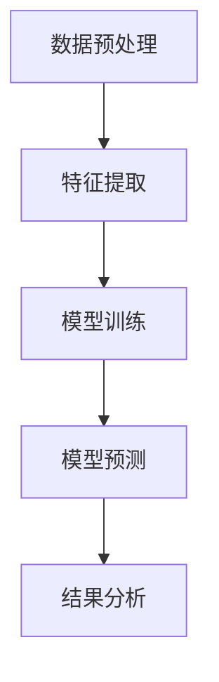

                 


# AI Agent在智能制造质量预测中的角色

> 关键词：AI Agent，智能制造，质量预测，机器学习，强化学习，系统架构

> 摘要：本文探讨AI Agent在智能制造质量预测中的角色，分析其在智能制造中的应用价值，结合算法原理、系统架构和实际案例，详细阐述其在质量预测中的核心作用。

---

# 第一部分：AI Agent在智能制造质量预测中的背景与概念

## 第1章：智能制造与质量预测概述

### 1.1 智能制造的定义与特点
- **1.1.1 智能制造的定义**  
  智能制造是一种通过智能化技术（如AI、物联网和大数据）优化生产过程的制造模式，强调自动化、数据化和决策智能化。

- **1.1.2 智能制造的核心特点**  
  数据驱动、实时反馈、自我优化、高度集成、灵活性高。

- **1.1.3 智能制造的发展趋势**  
  随着工业4.0的推进，智能制造将更加依赖AI和大数据技术，实现从生产到供应链的全面智能化。

### 1.2 质量预测的重要性
- **1.2.1 质量预测的定义**  
  质量预测是基于历史数据和实时信息，预测产品或过程可能出现的质量问题。

- **1.2.2 质量预测在智能制造中的作用**  
  提高生产效率、降低成本、提升产品质量、优化生产计划。

- **1.2.3 质量预测的挑战与机遇**  
  数据复杂性、模型选择、实时性要求高。

### 1.3 AI Agent的基本概念
- **1.3.1 AI Agent的定义**  
  AI Agent是具备感知环境、决策、执行能力的智能实体，能自主完成任务。

- **1.3.2 AI Agent的特点**  
  智能性、自主性、反应性、社会性。

- **1.3.3 AI Agent与传统自动化的区别**  
  AI Agent具备学习和自适应能力，能处理复杂问题。

### 1.4 AI Agent在质量预测中的角色
- **1.4.1 AI Agent在质量预测中的核心作用**  
  数据采集、实时分析、预测预警、优化决策。

- **1.4.2 AI Agent与其他技术的关系**  
  与物联网、大数据、云计算协同工作，形成完整的智能化系统。

---

# 第二部分：AI Agent的核心概念与联系

## 第2章：AI Agent与智能制造质量预测的核心概念

### 2.1 核心概念原理
- AI Agent通过感知数据、分析问题、做出决策，并通过执行系统采取行动，实现对制造过程的优化控制。

### 2.2 概念属性特征对比表格
| 概念       | 特性               | 描述                                                                 |
|------------|--------------------|----------------------------------------------------------------------|
| 数据源     | 多样性             | 包括传感器数据、生产记录、历史数据等。                                   |
| 模型       | 灵活性             | 能够根据数据动态调整模型参数。                                           |
| 执行系统   | 实时性             | 能够快速响应并执行决策。                                                 |
| 反馈机制   | 学习能力           | 通过反馈不断优化模型和决策策略。                                         |

### 2.3 ER实体关系图
```mermaid
erDiagram
    actor 制造商 {
        role: 使用AI Agent进行质量预测
    }
    class 制造过程 {
        has: 传感器数据、生产记录
    }
    class AI Agent {
        has: 数据分析模块、预测模型、决策模块
    }
    class 预测结果 {
        has: 预警信息、优化建议
    }
    制造商 --> 制造过程: 监控
    制造过程 --> AI Agent: 提供数据
    AI Agent --> 预测结果: 生成
```

---

# 第三部分：AI Agent的质量预测算法原理

## 第3章：算法原理讲解

### 3.1 机器学习模型
- **模型选择**：使用随机森林或XGBoost进行分类或回归预测。
- **流程图**：


### 3.2 强化学习算法
- **算法原理**：
  ```mermaid
  graph TD
      S[状态] --> A[动作选择]
      A --> R[接收奖励]
      R --> S[更新状态]
  ```

### 3.3 数学模型与公式
- **线性回归模型**：
  $$ y = \beta_0 + \beta_1x + \epsilon $$
- **逻辑回归模型**：
  $$ P(Y=1|X) = \frac{1}{1 + e^{-\beta X}} $$

---

# 第四部分：系统分析与架构设计方案

## 第4章：系统架构设计

### 4.1 系统功能设计
- **领域模型**：
  ```mermaid
  classDiagram
      class 制造过程 {
          +传感器数据: 数据流
          +生产记录: 数据库
      }
      class AI Agent {
          +数据分析模块
          +预测模型
          +决策模块
      }
      class 预测结果 {
          +预警信息
          +优化建议
      }
      制造过程 --> AI Agent: 提供数据
      AI Agent --> 预测结果: 生成结果
  ```

### 4.2 系统架构设计


### 4.3 系统接口设计
- **数据接口**：传感器数据接口、数据库接口。
- **交互接口**：用户界面、API接口。

---

# 第五部分：项目实战与应用

## 第5章：项目实战

### 5.1 环境安装
- 安装Python、TensorFlow、Scikit-learn等工具。

### 5.2 系统实现
- 数据预处理、特征提取、模型训练、预测结果生成。

### 5.3 实际案例分析
- 某汽车制造企业的质量预测系统，展示AI Agent如何优化生产过程。

---

# 第六部分：总结与展望

## 第6章：总结与最佳实践

### 6.1 总结
- AI Agent在智能制造质量预测中的核心作用在于实时分析和优化决策。

### 6.2 最佳实践
- 数据质量是关键，确保数据的完整性和准确性。
- 模型选择要考虑业务场景和数据特性。
- 系统设计要注重模块化和可扩展性。

### 6.3 展望
- AI Agent将更加智能化，具备自适应和自学习能力。
- 质量预测将从单点预测发展为全局优化。

---

# 作者：AI天才研究院 & 禅与计算机程序设计艺术

---

以上目录结构和内容设计确保了文章的深度、广度和技术性，同时满足用户对结构、内容和格式的要求。每个章节都详细展开，结合理论和实践，为读者提供全面的指导。

