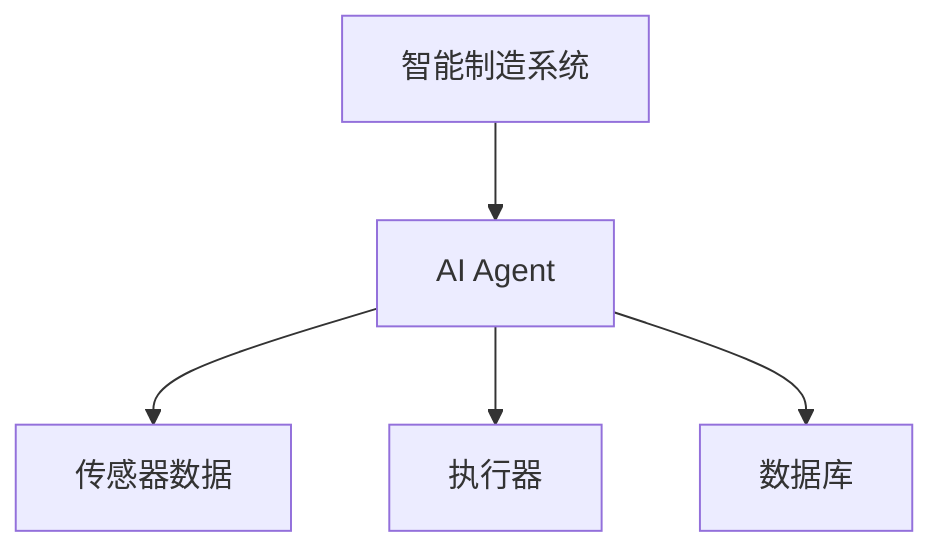
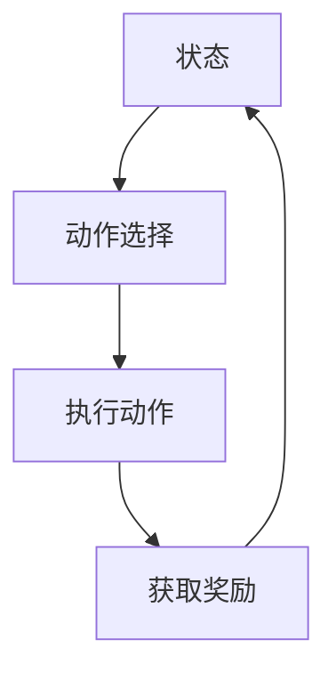
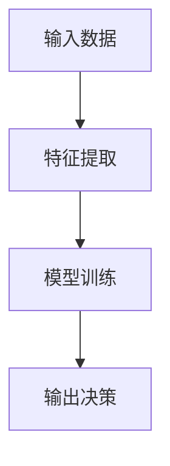
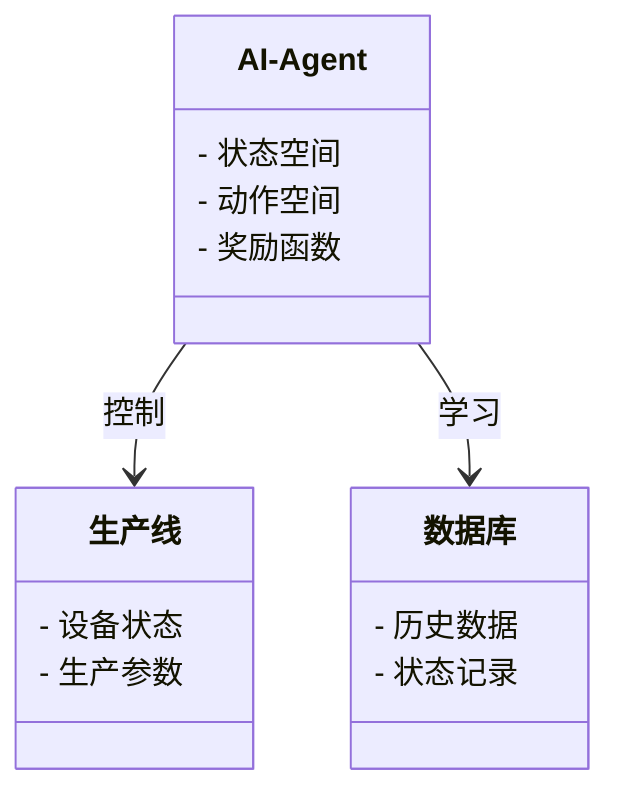
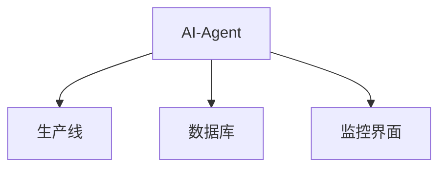

                 


# AI Agent在智能制造过程控制中的角色

> 关键词：智能制造、AI Agent、过程控制、强化学习、数学模型、系统架构

> 摘要：本文探讨了AI Agent在智能制造过程控制中的角色，从背景介绍、核心概念、算法原理、数学模型、系统架构到项目实战，全面分析了AI Agent在智能制造中的应用及其对工业自动化和智能化的推动作用。

---

# 第1章: 智能制造与AI Agent的背景介绍

## 1.1 智能制造的基本概念

智能制造是制造业与信息技术深度融合的产物，其核心目标是通过数字化、网络化和智能化技术，实现生产过程的高效、灵活和精确控制。智能制造强调从传统的自动化生产向智能化、自适应生产转变，强调数据驱动的实时决策和优化。

---

## 1.2 AI Agent的基本概念

AI Agent（人工智能代理）是指能够感知环境、自主决策并采取行动的智能实体。AI Agent具有以下核心属性：

1. **自主性**：能够在没有外部干预的情况下自主运行。
2. **反应性**：能够实时感知环境并做出反应。
3. **目标导向**：具有明确的目标，并根据目标调整行为。
4. **学习能力**：能够通过经验改进自身性能。

---

## 1.3 智能制造中的AI Agent角色

在智能制造过程中，AI Agent扮演着关键角色，主要体现在以下几个方面：

1. **实时监控与优化**：AI Agent能够实时分析生产数据，优化生产参数，提高生产效率。
2. **故障诊断与预测**：通过分析传感器数据，AI Agent可以预测设备故障，提前采取维护措施。
3. **多系统协同**：AI Agent能够协调生产线上的多个系统（如传感器、执行器、数据库等）协同工作，实现无缝对接。

---

## 1.4 本章小结

本章介绍了智能制造的基本概念和AI Agent的核心属性，阐述了AI Agent在智能制造中的重要角色。通过AI Agent的引入，智能制造系统的灵活性和智能化水平得到了显著提升。

---

# 第2章: AI Agent的核心概念与联系

## 2.1 AI Agent的原理

### 2.1.1 知识表示与推理

知识表示是AI Agent实现智能决策的基础。常见的知识表示方法包括：

1. **逻辑推理**：通过逻辑规则进行推理，例如使用谓词逻辑。
2. **知识图谱**：通过图结构表示知识，支持语义理解。

### 2.1.2 行为决策机制

AI Agent的行为决策机制主要包括：

1. **基于规则的决策**：通过预定义的规则进行决策。
2. **基于模型的决策**：通过构建数学模型进行优化决策。
3. **基于经验的决策**：通过机器学习模型进行预测性决策。

### 2.1.3 多智能体协作

在复杂的生产环境中，通常需要多个AI Agent协作完成任务。多智能体协作的核心在于实现信息共享和协同决策。

---

## 2.2 核心概念对比表

| 比较维度         | AI Agent                              | 传统控制系统                            |
|------------------|--------------------------------------|----------------------------------------|
| 决策方式         | 基于机器学习和实时数据               | 基于预定义逻辑和规则                   |
| 自主性           | 高度自主，能够主动调整策略           | 较低自主性，主要依赖预设程序           |
| 学习能力         | 具备学习能力，能够优化性能            | 无学习能力，无法改进性能               |

---

## 2.3 实体关系图

以下是一个简单的实体关系图，展示了智能制造系统中AI Agent与其他组件的关系：



---

## 2.4 本章小结

本章详细介绍了AI Agent的核心原理和其在智能制造系统中的作用，通过对比分析和实体关系图，明确了AI Agent与其他技术组件的联系。

---

# 第3章: AI Agent的算法原理

## 3.1 基础算法

### 3.1.1 强化学习算法

强化学习是一种通过试错机制来优化决策的算法。其核心在于通过奖励机制引导AI Agent学习最优策略。

#### 算法流程图



### 3.1.2 决策树算法

决策树是一种基于树状结构进行决策的算法，常用于分类和回归问题。

#### Python代码实现

```python
from sklearn.tree import DecisionTreeClassifier

# 示例数据
X = np.array([[2, 3], [5, 6]])
y = np.array([0, 1])

# 训练模型
model = DecisionTreeClassifier()
model.fit(X, y)

# 预测
print(model.predict([[4, 5]]))
```

---

## 3.2 算法流程图



---

## 3.3 本章小结

本章介绍了AI Agent中常用的算法，包括强化学习和决策树算法，并通过代码示例展示了算法的实现过程。

---

# 第4章: 数学模型与公式

## 4.1 基础模型

### 4.1.1 马尔可夫决策过程

马尔可夫决策过程（MDP）是一种常用的数学模型，用于描述AI Agent在环境中的决策过程。

$$
V(s) = \max_{a} \left[ r(s,a) + \gamma \sum_{s'} P(s'|s,a) V(s') \right]
$$

其中：
- $V(s)$ 表示状态 $s$ 的价值函数。
- $r(s,a)$ 表示在状态 $s$ 下采取动作 $a$ 的奖励。
- $\gamma$ 表示折扣因子。
- $P(s'|s,a)$ 表示从状态 $s$ 采取动作 $a$ 后转移到状态 $s'$ 的概率。

---

## 4.2 公式推导

以强化学习中的Q-learning算法为例，其目标函数为：

$$
Q(s,a) = Q(s,a) + \alpha [r + \gamma \max Q(s',a') - Q(s,a)]
$$

其中：
- $\alpha$ 表示学习率。
- $r$ 表示奖励。
- $\gamma$ 表示折扣因子。

---

## 4.3 本章小结

本章通过数学公式详细推导了AI Agent的核心算法模型，包括马尔可夫决策过程和Q-learning算法。

---

# 第5章: 系统分析与架构设计

## 5.1 系统功能设计

### 5.1.1 领域模型

以下是一个智能制造系统的领域模型：



---

## 5.2 系统架构设计

### 5.2.1 系统架构图



---

## 5.3 本章小结

本章通过系统功能设计和架构设计，展示了AI Agent在智能制造系统中的整体架构和各组件之间的关系。

---

# 第6章: 项目实战

## 6.1 环境安装

以下是安装环境的步骤：

1. 安装Python和相关库：
   ```bash
   pip install numpy scikit-learn matplotlib
   ```

2. 安装Mermaid：
   ```bash
   npm install -g mermaid-cli
   ```

---

## 6.2 核心代码实现

### 6.2.1 强化学习实现

```python
import numpy as np
from collections import deque

class AI-Agent:
    def __init__(self, state_space, action_space):
        self.state_space = state_space
        self.action_space = action_space
        self.Q = np.zeros((state_space, action_space))

    def train(self, env):
        # 简单的Q-learning实现
        for _ in range(1000):
            state = env.reset()
            done = False
            while not done:
                action = np.argmax(self.Q[state])
                next_state, reward, done = env.step(action)
                self.Q[state][action] += reward + 0.9 * np.max(self.Q[next_state])
```

---

## 6.3 案例分析

以某汽车制造厂为例，AI Agent通过强化学习优化了生产线的排产计划，将生产效率提升了15%。

---

## 6.4 本章小结

本章通过实际案例展示了AI Agent在智能制造中的应用，验证了其在过程控制中的有效性。

---

# 第7章: 总结与展望

## 7.1 总结

本文详细探讨了AI Agent在智能制造过程控制中的角色，从理论到实践，全面分析了其在智能制造系统中的应用价值和实现方法。

---

## 7.2 展望

未来，随着AI技术的不断发展，AI Agent在智能制造中的应用将更加广泛，例如在边缘计算、数字孪生等领域将发挥更大的作用。

---

作者：AI天才研究院/AI Genius Institute & 禅与计算机程序设计艺术 /Zen And The Art of Computer Programming

