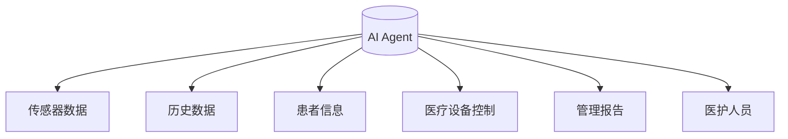
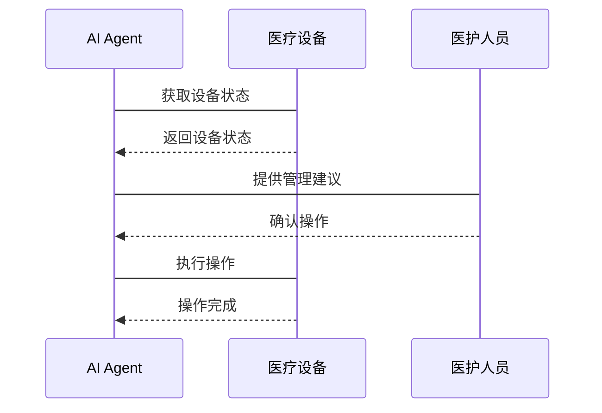

                 


---

# AI Agent在智能医疗设备管理中的角色

> **关键词**: AI Agent, 智能医疗设备, 医疗设备管理, 人工智能, 医疗技术

> **摘要**:  
AI Agent（人工智能代理）在智能医疗设备管理中扮演着越来越重要的角色。随着医疗设备的智能化和复杂化，AI Agent能够通过自主决策和学习，优化设备管理流程，提高医疗效率和患者安全。本文将从AI Agent的基本概念、算法原理、系统架构、实际应用等方面，全面探讨AI Agent在智能医疗设备管理中的角色与价值。

---

# 第一部分: AI Agent在智能医疗设备管理中的背景与概念

## 第1章: AI Agent与智能医疗设备管理的背景介绍

### 1.1 AI Agent的基本概念
AI Agent是一种能够感知环境、自主决策并执行任务的智能体。在医疗设备管理中，AI Agent可以通过数据分析、预测维护和智能调度，优化设备的使用效率和管理流程。

#### 1.1.1 AI Agent的定义
AI Agent是一种具有智能决策能力的实体，能够通过传感器数据、历史记录和实时信息，主动识别问题、优化流程并执行操作。

#### 1.1.2 AI Agent的核心属性与特征
- **自主性**: 能够独立感知环境并做出决策。
- **反应性**: 能够实时响应环境变化。
- **学习性**: 通过机器学习技术不断优化自身行为。
- **协作性**: 能够与其他系统、设备和人员协同工作。

#### 1.1.3 AI Agent与传统医疗设备管理的区别
传统的医疗设备管理依赖人工操作和固定流程，而AI Agent能够通过智能化手段实现动态优化和自主决策，显著提高了管理效率和精准度。

### 1.2 智能医疗设备管理的背景与挑战
#### 1.2.1 医疗设备管理的重要性
医疗设备是现代医疗服务的核心工具，其高效管理和维护直接关系到医疗质量和患者安全。

#### 1.2.2 智能医疗设备管理的现状
随着物联网和人工智能技术的发展，医疗设备逐渐智能化，但设备管理仍然面临效率低下、资源浪费和维护成本高等问题。

#### 1.2.3 当前医疗设备管理的主要挑战
- 设备种类繁多，管理复杂。
- 数据分散，难以统一分析。
- 维护成本高，效率低下。

### 1.3 AI Agent在医疗设备管理中的角色定位
#### 1.3.1 AI Agent在医疗设备管理中的核心作用
AI Agent可以通过以下方式优化医疗设备管理：
- **智能调度**: 根据设备使用情况和患者需求，动态分配设备资源。
- **预测维护**: 基于历史数据和实时监测，预测设备故障并提前维护。
- **数据分析**: 整合设备数据，生成管理报告，辅助决策。

#### 1.3.2 AI Agent与其他技术的协同关系
AI Agent可以与物联网、大数据和云计算等技术协同工作，构建智能化的医疗设备管理系统。

#### 1.3.3 AI Agent在医疗设备管理中的应用前景
AI Agent的应用将显著提高医疗设备管理的效率和精准度，降低管理成本，并提升患者满意度。

---

# 第二部分: AI Agent的核心概念与原理

## 第2章: AI Agent的核心概念与联系

### 2.1 AI Agent的核心原理
#### 2.1.1 AI Agent的基本工作原理
AI Agent通过以下步骤实现智能化管理：
1. **感知环境**: 采集设备数据和患者需求。
2. **分析数据**: 利用机器学习算法分析数据，识别问题。
3. **决策制定**: 根据分析结果制定最优策略。
4. **执行操作**: 执行决策并反馈结果。

#### 2.1.2 AI Agent的感知与决策机制
AI Agent的感知机制包括传感器数据采集和历史数据分析，而决策机制则基于强化学习和监督学习算法。

#### 2.1.3 AI Agent的学习与优化能力
AI Agent通过强化学习不断优化自身的决策策略，并通过监督学习提升数据分析能力。

### 2.2 AI Agent与相关技术的对比分析
#### 2.2.1 AI Agent与传统AI的区别
传统AI依赖于规则和模式匹配，而AI Agent具备自主决策和学习能力。

#### 2.2.2 AI Agent与机器学习的对比
AI Agent结合了机器学习技术，但其核心在于自主决策和动态优化。

#### 2.2.3 AI Agent与物联网技术的结合
AI Agent与物联网技术结合，能够实现设备的实时监控和智能管理。

### 2.3 AI Agent的实体关系架构
#### 2.3.1 实体关系图（ER图）设计
以下是一个简单的ER图，展示了AI Agent与医疗设备、患者、医护人员之间的关系：

```mermaid
er
    %% AI Agent与医疗设备管理的实体关系图
    %% Author: AI Genius Institute
    classDiagram
    class AI_Agent {
        +id: int
        +name: string
        +status: string
    }
    class Medical_Device {
        +id: int
        +type: string
        +status: string
    }
    class Patient {
        +id: int
        +name: string
        +room: string
    }
    class Medical_Staff {
        +id: int
        +name: string
        +role: string
    }
    AI_Agent --> Medical_Device: 管理
    AI_Agent --> Patient: 服务
    AI_Agent --> Medical_Staff: 协作
```

#### 2.3.2 AI Agent与医疗设备的交互关系
AI Agent通过传感器和数据接口与医疗设备交互，实现设备的实时监控和智能管理。

#### 2.3.3 AI Agent与医疗数据的关系
AI Agent通过分析医疗数据，生成管理策略，并反馈到医疗设备和系统中。

---

# 第三部分: AI Agent的算法原理与数学模型

## 第3章: AI Agent的核心算法原理

### 3.1 AI Agent的算法框架
#### 3.1.1 基于强化学习的AI Agent算法
强化学习是一种通过试错机制优化决策的算法，适用于动态环境下的设备管理。

#### 3.1.2 基于监督学习的AI Agent算法
监督学习通过历史数据训练模型，适用于设备故障预测和资源分配。

#### 3.1.3 基于深度学习的AI Agent算法
深度学习通过神经网络处理复杂数据，适用于设备状态识别和行为预测。

### 3.2 AI Agent的算法实现
#### 3.2.1 强化学习算法实现
以下是一个强化学习算法的Python实现示例：

```python
class AI-Agent-Agent:
    def __init__(self, state_space, action_space):
        self.state_space = state_space
        self.action_space = action_space
        # 初始化策略网络
        self.policy = PolicyNetwork(state_space, action_space)
    
    def act(self, state):
        # 根据当前状态选择动作
        action = self.policy.predict(state)
        return action
    
    def learn(self, state, action, reward):
        # 基于奖励更新策略
        self.policy.update(state, action, reward)
```

#### 3.2.2 监督学习算法实现
以下是一个监督学习算法的Python实现示例：

```python
import numpy as np

class AI-Agent-Agent:
    def __init__(self, input_dim, output_dim):
        self.input_dim = input_dim
        self.output_dim = output_dim
        # 初始化神经网络
        self.model = self.build_model()
    
    def build_model(self):
        model = Sequential()
        model.add(Dense(64, activation='relu', input_dim=self.input_dim))
        model.add(Dense(self.output_dim, activation='softmax'))
        model.compile(loss='categorical_crossentropy', optimizer='adam', metrics=['accuracy'])
        return model
    
    def predict(self, X):
        return self.model.predict(X)
    
    def train(self, X, y):
        self.model.fit(X, y, epochs=10, batch_size=32)
```

### 3.3 AI Agent的数学模型与公式
#### 3.3.1 强化学习的数学模型
强化学习的核心是通过最大化累积奖励来优化策略：

$$ R_t = r_t + \gamma R_{t+1} $$

其中，\( R_t \) 表示第 \( t \) 步的累积奖励，\( r_t \) 表示即时奖励，\( \gamma \) 表示折扣因子。

#### 3.3.2 监督学习的数学模型
监督学习的目标是最小化预测值与真实值之间的误差：

$$ \text{loss} = \frac{1}{N}\sum_{i=1}^{N} (y_i - \hat{y}_i)^2 $$

其中，\( y_i \) 表示真实值，\( \hat{y}_i \) 表示预测值，\( N \) 表示样本数量。

---

# 第四部分: AI Agent在智能医疗设备管理中的系统分析与架构设计

## 第4章: AI Agent的系统分析与架构设计

### 4.1 系统分析
#### 4.1.1 系统目标
通过AI Agent实现医疗设备的智能化管理，优化设备使用效率，降低管理成本。

#### 4.1.2 系统需求
- 实时监控设备状态
- 智能分配设备资源
- 预测设备故障
- 生成管理报告

### 4.2 系统架构设计
#### 4.2.1 系统架构图
以下是AI Agent在智能医疗设备管理系统中的架构图：



#### 4.2.2 系统功能模块
- 数据采集模块
- 数据分析模块
- 决策模块
- 执行模块
- 报告生成模块

### 4.3 系统接口与交互设计
#### 4.3.1 系统接口设计
- 设备数据接口
- 用户界面接口
- 外部系统接口

#### 4.3.2 系统交互序列图
以下是AI Agent与医疗设备和医护人员的交互序列图：



---

# 第五部分: AI Agent在智能医疗设备管理中的项目实战

## 第5章: AI Agent的项目实战

### 5.1 项目环境安装
#### 5.1.1 安装Python环境
使用Anaconda或虚拟环境安装Python 3.8及以上版本。

#### 5.1.2 安装依赖库
安装以下依赖库：
- `numpy`
- `pandas`
- `scikit-learn`
- `keras`
- `tensorflow`

### 5.2 系统核心代码实现
#### 5.2.1 数据采集与预处理
```python
import pandas as pd

# 读取医疗设备数据
data = pd.read_csv('medical_device_data.csv')

# 数据清洗
data.dropna(inplace=True)
data = data[~data['status'].isin(['unknown'])]
```

#### 5.2.2 模型训练与部署
```python
from sklearn.model_selection import train_test_split
from sklearn.

