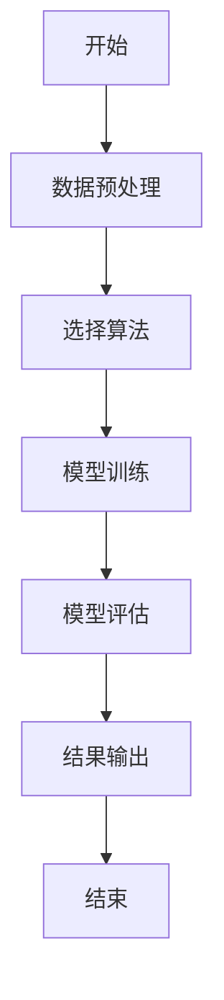
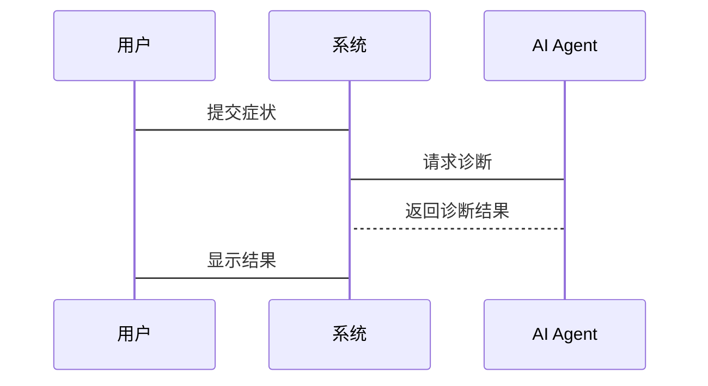

                 


# AI Agent在智能医疗诊断系统中的角色

## 关键词：AI Agent, 智能医疗诊断系统, 机器学习, 自然语言处理, 医疗数据分析

## 摘要：AI Agent在智能医疗诊断系统中扮演着越来越重要的角色。随着人工智能技术的快速发展，AI Agent能够通过机器学习和自然语言处理等技术，辅助医生进行高效、准确的诊断。本文从AI Agent的基本概念入手，分析其在智能医疗诊断系统中的核心作用，探讨其算法原理和系统架构设计，结合实际案例进行详细讲解，最后总结最佳实践和未来发展方向。

---

## 第1章 AI Agent与智能医疗诊断系统的概述

### 1.1 AI Agent的基本概念
AI Agent（人工智能代理）是指能够感知环境、自主决策并执行任务的智能实体。其核心特征包括自主性、反应性、目标导向性和学习能力。AI Agent能够通过传感器或数据接口获取信息，利用内部算法进行分析和推理，并根据结果采取相应行动。

### 1.2 智能医疗诊断系统的背景
智能医疗诊断系统是一种结合了人工智能技术的医疗诊断工具，旨在通过自动化的方式提高诊断的准确性和效率。传统的医疗诊断依赖于医生的经验和知识，而智能医疗诊断系统通过整合大量的医疗数据和先进的算法，辅助医生进行更精准的诊断。

### 1.3 AI Agent在智能医疗诊断中的角色
AI Agent在智能医疗诊断系统中主要承担数据处理、诊断推理和决策支持的角色。它能够从电子健康记录（EHR）、医学影像和其他医疗数据中提取关键信息，利用机器学习和自然语言处理技术进行分析，并为医生提供诊断建议。

---

## 第2章 AI Agent与智能医疗诊断的核心概念

### 2.1 AI Agent的属性与特征
- **知识表示**：AI Agent需要能够理解和表示医疗领域的知识，包括疾病症状、诊断标准和治疗方案等。
- **推理机制**：通过逻辑推理或机器学习模型，AI Agent能够从症状推断可能的疾病。
- **学习能力**：AI Agent能够通过监督学习、无监督学习或强化学习不断优化其诊断能力。

### 2.2 智能医疗诊断系统的属性与特征
- **数据来源**：包括电子健康记录、医学影像、实验室结果等。
- **系统功能**：提供症状分析、疾病预测、治疗方案推荐等功能。
- **诊断准确性**：依赖于算法的精度和数据的质量。

### 2.3 AI Agent与智能医疗诊断系统的对比分析
| 对比维度 | AI Agent | 智能医疗诊断系统 |
|----------|-----------|------------------|
| 核心功能 | 数据处理、推理、决策支持 | 症状分析、疾病预测、治疗方案推荐 |
| 技术基础 | 机器学习、自然语言处理 | 数据挖掘、图像处理 |
| 应用场景 | 辅助诊断、健康管理 | 诊断支持、个性化治疗 |

### 2.4 AI Agent与智能医疗诊断系统的ER实体关系图
```mermaid
er
    actor: 医生
    entity: 病人
    entity: 症状
    entity: 疾病
    entity: 治疗方案
    relation: 医生-病人
    relation: 症状-疾病
    relation: 疾病-治疗方案
    relation: AI Agent-症状
    relation: AI Agent-疾病
```

---

## 第3章 AI Agent的算法原理

### 3.1 常见算法及其流程
AI Agent在医疗诊断中的算法主要包括基于规则的推理、机器学习和深度学习。

#### 3.1.1 基于规则的推理
基于规则的推理是一种通过预定义的医学知识库进行诊断的方法。例如，如果症状A和症状B同时出现，可能是疾病C。

#### 3.1.2 机器学习算法
- **决策树**：通过特征选择构建树状结构，用于分类。
- **随机森林**：通过集成多个决策树提高准确性和鲁棒性。
- **支持向量机（SVM）**：适用于高维数据的分类问题。

#### 3.1.3 深度学习算法
- **卷积神经网络（CNN）**：常用于医学影像分析。
- **循环神经网络（RNN）**：适用于时间序列数据的分析。

### 3.2 算法流程图


### 3.3 代码实现示例
以下是一个基于决策树的分类器实现：
```python
from sklearn.tree import DecisionTreeClassifier
from sklearn.model_selection import train_test_split
from sklearn.metrics import accuracy_score

# 加载数据
data = [...]  # 数据集
target = [...]  # 标签

# 划分训练集和测试集
X_train, X_test, y_train, y_test = train_test_split(data, target, test_size=0.2)

# 初始化模型
model = DecisionTreeClassifier()

# 训练模型
model.fit(X_train, y_train)

# 预测
y_pred = model.predict(X_test)

# 计算准确率
accuracy = accuracy_score(y_test, y_pred)
print(f'准确率: {accuracy}')
```

### 3.4 数学模型
以下是逻辑回归的数学模型：
$$ P(y=1|x) = \frac{1}{1 + e^{-(\beta_0 + \beta_1 x)}} $$
其中，$\beta_0$ 和 $\beta_1$ 是模型的参数，$x$ 是输入特征。

---

## 第4章 智能医疗诊断系统的分析与架构设计

### 4.1 问题场景介绍
智能医疗诊断系统需要解决的问题包括：提高诊断效率、降低误诊率、优化治疗方案等。

### 4.2 系统功能设计
- **症状分析**：根据患者症状进行初步诊断。
- **疾病预测**：基于历史数据预测可能的疾病。
- **治疗方案推荐**：提供个性化的治疗建议。

### 4.3 系统架构设计


### 4.4 系统接口设计
- **输入接口**：接收患者的症状数据。
- **输出接口**：返回诊断结果和治疗建议。

### 4.5 交互流程图


---

## 第5章 项目实战：基于AI Agent的糖尿病诊断系统

### 5.1 环境配置
- **Python**：3.8+
- **库**：scikit-learn、TensorFlow、Flask

### 5.2 核心代码实现
```python
from flask import Flask, request, jsonify
import joblib

# 加载模型
model = joblib.load('diabetes_model.pkl')

app = Flask(__name__)

@app.route('/predict', methods=['POST'])
def predict():
    data = request.json
    prediction = model.predict([[data['age'], data['weight'], data['blood_pressure']]])
    return jsonify({'prediction': str(prediction[0])})

if __name__ == '__main__':
    app.run(debug=True)
```

### 5.3 测试与结果分析
通过POST请求发送数据到API，系统返回预测结果：
```bash
curl -X POST -H "Content-Type: application/json" -d '{"age":30,"weight":70,"blood_pressure":120}' http://localhost:5000/predict
```

---

## 第6章 最佳实践与展望

### 6.1 最佳实践
- 数据隐私保护：确保患者数据的安全性和隐私性。
- 模型泛化能力：通过数据增强和交叉验证提高模型的泛化能力。
- 可解释性：提供可解释的诊断结果，增强医生和患者的信任。

### 6.2 小结
AI Agent在智能医疗诊断系统中的应用前景广阔。通过不断优化算法和系统架构，AI Agent能够为医疗行业带来更高的效率和准确性。

### 6.3 注意事项
- 数据质量问题：确保数据的准确性和完整性。
- 模型更新：定期更新模型以应对新的医疗知识和数据变化。

### 6.4 拓展阅读
- 《Deep Learning for Medical Imaging》
- 《Machine Learning in Healthcare》

---

## 作者：AI天才研究院 & 禅与计算机程序设计艺术

---

这篇文章详细介绍了AI Agent在智能医疗诊断系统中的角色，从基础概念到实际应用，为读者提供了全面的视角。

