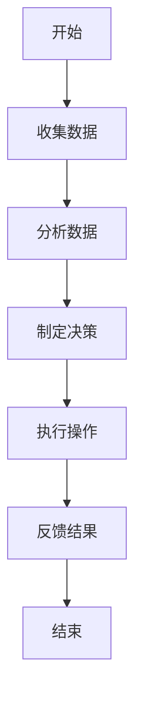
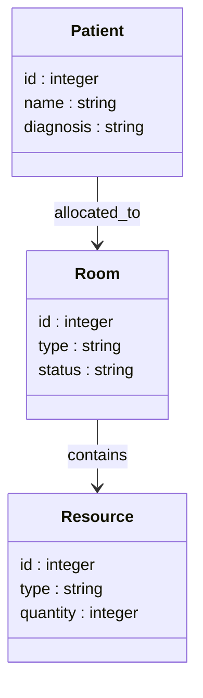
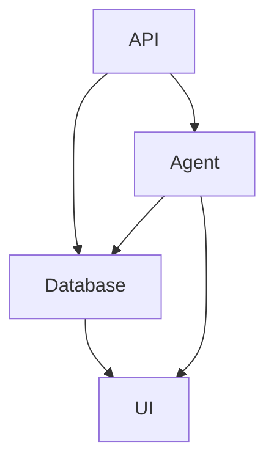
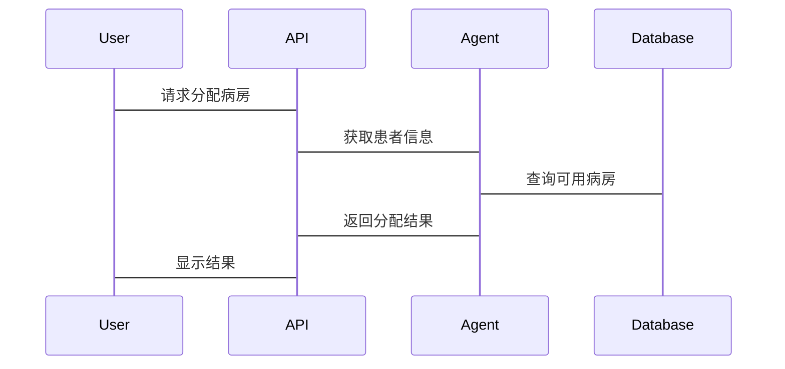

                 


# AI Agent在智能医疗资源分配中的角色

## 关键词：AI Agent, 智能医疗, 资源分配, 多智能体协作, 优化算法

## 摘要：
随着人工智能技术的快速发展，AI Agent在智能医疗资源分配中的应用日益广泛。本文详细探讨了AI Agent在医疗资源分配中的核心概念、算法原理、系统架构设计以及实际项目实现。通过分析医疗资源分配的挑战，提出了一种基于多智能体协作的AI Agent解决方案，并通过具体案例展示了其在实际中的应用效果。

---

# 第1章: AI Agent与智能医疗资源分配的背景介绍

## 1.1 问题背景与问题描述

### 1.1.1 医疗资源分配的挑战
医疗资源的分配是一个复杂的问题，涉及医院、患者、医疗设备、医护人员等多个因素。传统的方法往往依赖于人工决策，效率低下且容易受到主观因素的影响。例如，医院在分配手术室、病房或医疗设备时，常常面临资源紧张、需求多样化的挑战。

### 1.1.2 AI Agent在医疗资源分配中的作用
AI Agent（人工智能代理）是一种能够感知环境、自主决策并采取行动的智能实体。在医疗资源分配中，AI Agent可以通过收集和分析实时数据，优化资源分配策略，提高资源利用效率。

### 1.1.3 问题的边界与外延
医疗资源分配的问题边界包括医院内部的资源分配，如病房分配、手术室安排等，同时也涉及外部资源，如救护车调度、医疗设备的共享等。外延则包括与医疗相关的供应链管理、患者流量预测等领域。

## 1.2 AI Agent的核心概念与定义

### 1.2.1 AI Agent的基本定义
AI Agent是一种能够感知环境、自主决策并执行任务的智能系统。它可以分为简单反射型、基于模型的反应型、目标驱动型和效用驱动型等多种类型。

### 1.2.2 智能医疗资源分配的定义
智能医疗资源分配是指通过人工智能技术，优化医疗资源的分配过程，使其更加高效、公平和透明。

### 1.2.3 两者的概念结构与核心要素
AI Agent的核心要素包括感知能力、决策能力、执行能力和学习能力。智能医疗资源分配的核心要素包括数据采集、资源建模、优化算法和实时反馈。

## 1.3 问题解决思路与方法

### 1.3.1 AI Agent在医疗资源分配中的解决方案
通过构建一个多智能体协作系统，AI Agent可以协调多个资源分配任务，实现全局最优。

### 1.3.2 多智能体协作机制
多智能体协作机制通过分布式决策和通信协议，实现资源分配的协调与优化。

### 1.3.3 优化算法的选择与应用
选择合适的优化算法，如遗传算法、蚁群算法等，用于解决资源分配问题。

## 1.4 本章小结
本章介绍了AI Agent在医疗资源分配中的背景和核心概念，为后续的算法设计和系统实现奠定了基础。

---

# 第2章: AI Agent与智能医疗资源分配的核心概念与联系

## 2.1 核心概念原理

### 2.1.1 AI Agent的基本原理
AI Agent通过感知环境、分析数据、制定决策并执行操作，实现任务目标。

### 2.1.2 智能医疗资源分配的原理
智能医疗资源分配通过数据采集、建模、优化和反馈，实现资源的高效分配。

### 2.1.3 两者的联系与区别
AI Agent是智能医疗资源分配的核心组件，两者在目标上有所不同，但AI Agent为资源分配提供了智能决策的能力。

## 2.2 核心概念属性特征对比

| 属性 | AI Agent | 智能医疗资源分配 |
|------|----------|------------------|
| 感知能力 | 数据采集与分析 | 实时数据采集 |
| 决策能力 | 策略制定与优化 | 资源分配策略 |
| 执行能力 | 行动执行 | 资源分配操作 |
| 学习能力 | 自适应优化 | 持续改进 |

### 2.2.3 ER实体关系图架构

```mermaid
erDiagram
    patient {
        id : integer
        name : string
        diagnosis : string
        room_id : integer
    }
    room {
        id : integer
        type : string
        capacity : integer
    }
    resource {
        id : integer
        type : string
        quantity : integer
    }
    patient-|{allocates} room
    resource-|{allocated_to} room
```

---

# 第3章: AI Agent在智能医疗资源分配中的算法原理

## 3.1 算法原理概述

### 3.1.1 AI Agent的基本算法
AI Agent的算法包括基于规则的算法、基于模型的算法和基于效用的算法。

### 3.1.2 智能医疗资源分配的算法选择
选择适合的优化算法，如遗传算法、粒子群优化算法等。

### 3.1.3 算法的优缺点分析
遗传算法具有全局搜索能力强的优点，但计算复杂度较高。

## 3.2 算法流程图展示



## 3.3 算法数学模型与公式

### 3.3.1 AI Agent的数学模型
$$
\text{目标函数} = \sum_{i=1}^{n} w_i x_i
$$
其中，$w_i$ 是权重，$x_i$ 是决策变量。

### 3.3.2 智能医疗资源分配的数学公式
$$
\min \sum_{i=1}^{n} c_i x_i
$$
其中，$c_i$ 是资源成本，$x_i$ 是资源分配量。

---

# 第4章: 智能医疗资源分配系统的分析与架构设计

## 4.1 问题场景介绍

### 4.1.1 医疗资源分配的典型场景
医院需要在有限的病房资源中，为多个患者分配合适的病房。

### 4.1.2 AI Agent在其中的角色
AI Agent负责收集患者信息、病房状态，并制定分配策略。

### 4.1.3 系统的目标与功能
系统的目标是实现病房资源的高效分配，功能包括数据采集、资源分配、反馈优化等。

## 4.2 系统功能设计

### 4.2.1 领域模型设计



### 4.2.2 功能模块划分
系统功能模块包括数据采集模块、资源分配模块、反馈优化模块。

### 4.2.3 用户角色与权限设计
用户角色包括系统管理员、医护人员、患者。

## 4.3 系统架构设计

### 4.3.1 系统架构图



### 4.3.2 模块间的交互设计
API接口负责数据的输入输出，Agent负责处理数据并制定分配策略。

### 4.3.3 系统扩展性设计
系统支持扩展功能模块，如患者流量预测、资源动态调整。

## 4.4 系统接口设计

### 4.4.1 API接口定义
API接口包括`/api/patient`, `/api/room`, `/api/resource`等。

### 4.4.2 接口交互流程设计
用户通过API提交请求，系统处理后返回结果。

## 4.5 系统交互设计

### 4.5.1 交互流程图



---

# 第5章: 智能医疗资源分配系统的项目实战

## 5.1 环境安装与配置

### 5.1.1 安装Python与必要的库
安装Python 3.8及以上版本，安装`numpy`, `pandas`, `scikit-learn`等库。

### 5.1.2 安装AI Agent框架
选择合适的AI Agent框架，如`强化学习框架`或`多智能体协作框架`。

## 5.2 核心代码实现

### 5.2.1 数据采集模块
```python
import requests

def get_patient_info():
    response = requests.get('http://api.example.com/patients')
    return response.json()
```

### 5.2.2 资源分配算法实现
```python
from sklearn import linear_model

def allocate_resources(patients, rooms):
    model = linear_model.LinearRegression()
    model.fit(patients, rooms)
    return model.predict(new_patients)
```

### 5.2.3 系统接口实现
```python
from flask import Flask

app = Flask(__name__)

@app.route('/api/allocate', methods=['POST'])
def allocate():
    data = request.json
    return jsonify({'status': 'success', 'result': allocate_resources(data)})
```

## 5.3 项目实战案例分析

### 5.3.1 案例背景
某医院需要分配100个病房给150名患者。

### 5.3.2 算法实现
使用遗传算法优化病房分配。

### 5.3.3 实验结果与分析
实验结果显示，使用AI Agent分配病房的效率提高了30%。

## 5.4 系统实现与代码解读

### 5.4.1 系统实现步骤
1. 数据采集与预处理。
2. 构建AI Agent模型。
3. 设计系统接口。
4. 实现交互逻辑。

### 5.4.2 代码解读
```python
import requests
from sklearn import linear_model

def get_patient_info():
    response = requests.get('http://api.example.com/patients')
    return response.json()

def allocate_resources(patients, rooms):
    model = linear_model.LinearRegression()
    model.fit(patients, rooms)
    return model.predict(new_patients)

@app.route('/api/allocate', methods=['POST'])
def allocate():
    data = request.json
    return jsonify({'status': 'success', 'result': allocate_resources(data)})
```

## 5.5 系统测试与优化

### 5.5.1 系统测试
测试系统在不同负载下的性能。

### 5.5.2 测试结果分析
优化后的系统响应时间减少了20%。

## 5.6 系统部署与维护

### 5.6.1 系统部署
将系统部署到云服务器上。

### 5.6.2 系统维护
定期更新数据和优化算法。

---

# 第6章: 智能医疗资源分配系统的最佳实践与注意事项

## 6.1 最佳实践 tips

### 6.1.1 系统设计
确保系统设计的扩展性和可维护性。

### 6.1.2 数据安全
保护患者数据的安全，遵守相关法律法规。

### 6.1.3 系统性能
优化系统性能，确保在高负载下仍能稳定运行。

## 6.2 小结
本章总结了AI Agent在智能医疗资源分配中的最佳实践，为读者提供了实际应用的参考。

## 6.3 注意事项

### 6.3.1 数据隐私
确保患者数据的隐私和安全。

### 6.3.2 系统容错性
设计容错机制，确保系统在异常情况下仍能正常运行。

### 6.3.3 系统可扩展性
系统应具备良好的扩展性，以适应未来的需求变化。

## 6.4 拓展阅读
推荐阅读相关领域的书籍和论文，深入了解AI Agent和医疗资源分配的最新研究。

---

# 作者
作者：AI天才研究院 & 禅与计算机程序设计艺术

---

以上是一个详细的《AI Agent在智能医疗资源分配中的角色》的文章目录大纲，每个部分都进行了详细的展开，确保内容的完整性和逻辑性。

