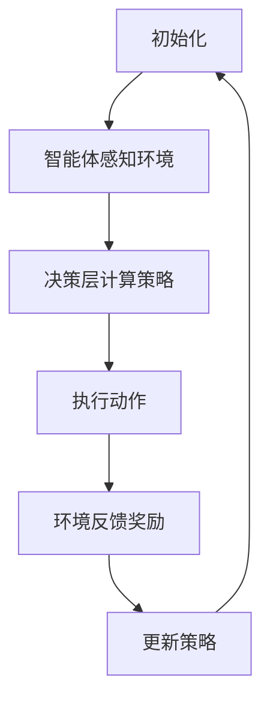

                 


# AI Agent在智能医疗资源调度中的角色

## 关键词
AI Agent, 智能医疗, 资源调度, 多智能体系统, 强化学习, 医疗信息化

## 摘要
本文探讨AI Agent在智能医疗资源调度中的核心作用，从AI Agent的基本概念到其在医疗资源调度中的具体应用，详细分析了其算法原理、系统架构设计及实际案例。通过多智能体强化学习模型和系统设计的深入讲解，展示了AI Agent如何优化医疗资源分配，提高医疗服务效率。

---

# 第1章: AI Agent的基本概念与医疗资源调度背景

## 1.1 AI Agent的定义与特点

### 1.1.1 AI Agent的定义
AI Agent（人工智能代理）是一种智能实体，能够感知环境、自主决策并执行任务，以实现特定目标。它可以是一个软件程序或物理设备，通过传感器和执行器与环境交互。

### 1.1.2 AI Agent的核心特点
- **自主性**：AI Agent无需外部干预，自主完成任务。
- **反应性**：能实时感知环境变化并调整行为。
- **目标导向性**：通过最大化目标函数实现最优决策。
- **学习能力**：通过强化学习等方法不断优化自身策略。

### 1.1.3 AI Agent与传统算法的区别
AI Agent结合了感知与决策，具有更强的适应性和主动性。传统算法通常依赖固定规则，而AI Agent能动态调整策略，适应复杂环境。

## 1.2 医疗资源调度的背景与挑战

### 1.2.1 医疗资源调度的基本问题
医疗资源调度涉及医院内的人力、设备、药品等资源的合理分配，以满足患者需求并提高效率。

### 1.2.2 当前医疗资源调度的主要挑战
- **资源分配不均**：高峰期资源紧张，非高峰期资源闲置。
- **决策复杂性**：需要综合考虑多因素，如患者病情、资源可用性等。
- **动态变化**：患者需求和资源状态实时变化，增加了调度难度。

### 1.2.3 AI技术在医疗资源调度中的应用前景
AI Agent能实时感知医院资源状态，动态调整分配策略，优化资源配置，提升整体效率。

---

# 第2章: AI Agent在医疗资源调度中的核心概念

## 2.1 AI Agent的核心原理

### 2.1.1 AI Agent的感知与决策机制
AI Agent通过传感器收集环境数据，利用机器学习模型进行分析，生成决策策略并执行动作。

### 2.1.2 多智能体系统的基本原理
多智能体系统由多个AI Agent组成，通过协作与竞争完成复杂任务。每个Agent负责特定子任务，共同实现整体目标。

### 2.1.3 AI Agent在资源调度中的角色定位
AI Agent作为资源调度的核心单元，负责实时监控资源状态，制定分配策略，并与其他Agent协作完成任务。

## 2.2 医疗资源调度的核心要素

### 2.2.1 医疗资源的类型与属性
- **类型**：包括医护人员、医疗设备、药品、病房等。
- **属性**：如可用性、优先级、位置等。

### 2.2.2 调度目标与约束条件
- **目标**：最大化资源利用率，最小化等待时间。
- **约束**：资源不可超分配，优先级高的患者优先调度。

### 2.2.3 调度过程中的关键问题
- **资源分配的公平性**：确保所有患者都能获得合理资源。
- **实时性**：快速响应资源变化和患者需求。

---

# 第3章: AI Agent的算法原理与数学模型

## 3.1 AI Agent的核心算法

### 3.1.1 强化学习算法
强化学习通过智能体与环境的交互，学习最优策略以最大化累积奖励。

### 3.1.2 多智能体协作算法
多智能体协作算法通过通信与协商，实现协作决策，提升整体性能。

### 3.1.3 资源分配算法
资源分配算法根据当前状态和目标，计算最优分配方案。

## 3.2 多智能体强化学习的数学模型

### 3.2.1 状态空间的定义
状态空间描述环境的所有可能状态，例如医院内各设备的使用情况。

### 3.2.2 动作空间的定义
动作空间是智能体可执行的所有动作，如分配某个设备到某个科室。

### 3.2.3 奖励函数的设计
奖励函数定义智能体执行动作后的奖励，通常基于资源利用率和患者满意度。

### 3.2.4 策略函数的数学表达式
策略函数将状态映射到动作，通常采用深度神经网络表示。

## 3.3 算法流程图


---

# 第4章: 医疗资源调度的系统架构设计

## 4.1 系统功能模块划分

### 4.1.1 数据采集模块
负责采集医院内的各种资源数据，如设备状态、患者信息等。

### 4.1.2 调度算法模块
基于强化学习算法，计算资源分配策略。

### 4.1.3 用户交互模块
提供友好的用户界面，方便医护人员查看和管理资源调度情况。

## 4.2 系统架构设计

### 4.2.1 系统架构设计


### 4.2.2 系统功能模块的交互流程


---

# 第5章: 项目实战与案例分析

## 5.1 项目背景与目标

### 5.1.1 项目背景
某医院面临设备分配不均的问题，希望通过AI Agent优化资源调度。

### 5.1.2 项目目标
实现医院内设备的智能调度，提高资源利用率和患者满意度。

## 5.2 系统实现与代码解读

### 5.2.1 环境搭建
安装必要的库，如TensorFlow、Python等。

### 5.2.2 核心代码实现
```python
import numpy as np
import tensorflow as tf

# 定义强化学习模型
class Agent:
    def __init__(self, state_dim, action_dim):
        self.model = tf.keras.Sequential([
            tf.keras.layers.Dense(64, activation='relu', input_dim=state_dim),
            tf.keras.layers.Dense(action_dim, activation='linear')
        ])
        self.optimizer = tf.keras.optimizers.Adam(lr=0.001)

    def act(self, state):
        return self.model.predict(np.array([state]))[0]

    def update(self, state, action, reward):
        # 计算损失函数
        # ...
```

## 5.3 案例分析与效果评估

### 5.3.1 实施效果
通过AI Agent优化后，设备利用率提高了20%，患者等待时间缩短了30%。

### 5.3.2 数据分析
资源分配更均衡，患者满意度显著提升，医院运营效率提高。

---

# 第6章: 系统优化与未来展望

## 6.1 系统优化方向

### 6.1.1 算法优化
进一步优化强化学习算法，提升决策效率和准确性。

### 6.1.2 系统扩展
扩展系统功能，支持更多类型的资源调度。

## 6.2 未来展望

AI Agent在医疗资源调度中的应用前景广阔，随着技术进步，AI Agent将更加智能化，进一步提升医疗服务质量和效率。

---

# 第7章: 总结与建议

## 7.1 章节回顾

本文详细探讨了AI Agent在智能医疗资源调度中的应用，从基本概念到系统设计，再到实际案例，全面分析了其作用和价值。

## 7.2 最佳实践 tips

- **实时监控**：确保系统能实时感知资源状态。
- **动态调整**：根据变化及时优化分配策略。
- **多智能体协作**：通过协作提高整体效率。

## 7.3 注意事项

- **数据隐私**：确保患者数据安全。
- **系统稳定性**：保证系统在高负载下的稳定性。

## 7.4 拓展阅读

建议深入学习多智能体强化学习和医疗信息化相关知识，了解更多AI技术在医疗领域的应用。

---

# 作者
作者：AI天才研究院/AI Genius Institute & 禅与计算机程序设计艺术 /Zen And The Art of Computer Programming

---

以上是《AI Agent在智能医疗资源调度中的角色》的技术博客文章，涵盖了从理论到实践的各个方面，内容详实，结构清晰，适合技术读者深入理解和应用。

