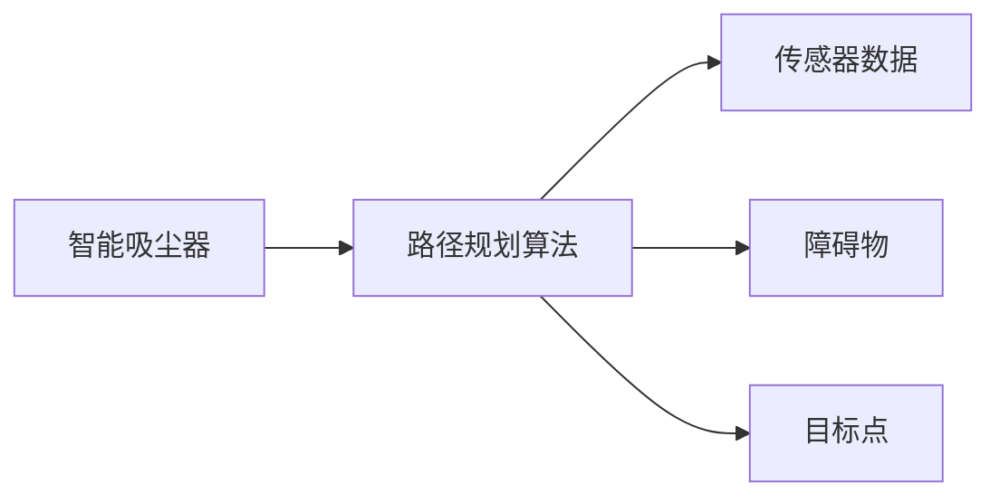
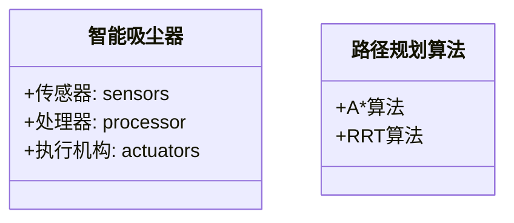
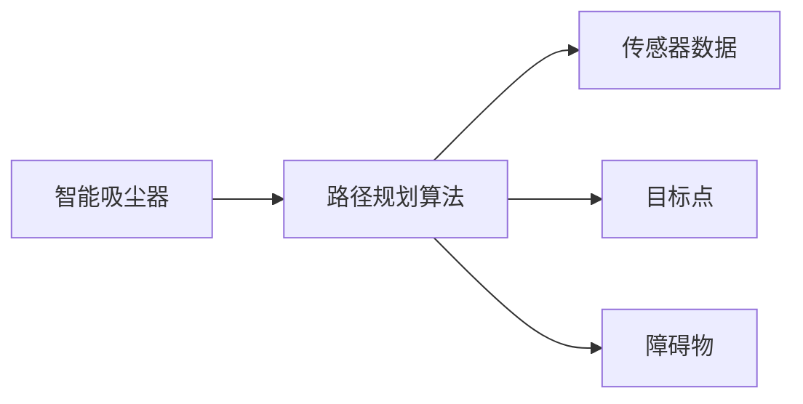

                 


# AI Agent在智能吸尘器中的路径规划

> 关键词：AI Agent、路径规划、智能吸尘器、算法、系统架构、项目实战

> 摘要：本文深入探讨了AI Agent在智能吸尘器中的路径规划技术，从算法原理到系统架构，再到项目实战，全面解析了路径规划的核心概念、实现方法和实际应用。通过对比分析常见路径规划算法，结合具体代码实现和系统设计，为读者提供了从理论到实践的完整指南。

---

# 第一部分: AI Agent与智能吸尘器路径规划的背景介绍

## 第1章: AI Agent与智能吸尘器概述

### 1.1 AI Agent的基本概念

#### 1.1.1 AI Agent的定义
AI Agent（人工智能代理）是指在计算机系统中，能够感知环境并采取行动以实现目标的实体。它能够根据环境信息做出决策，并执行相应的操作。

#### 1.1.2 AI Agent的核心特征
- **自主性**：能够自主决策和行动。
- **反应性**：能够实时感知环境并做出反应。
- **目标导向**：所有行动都围绕特定目标展开。
- **学习能力**：能够通过经验优化行为。

#### 1.1.3 AI Agent的应用领域
AI Agent广泛应用于自动驾驶、智能助手、机器人、游戏AI等领域。在智能吸尘器中，AI Agent主要用于路径规划和环境感知。

---

### 1.2 智能吸尘器的发展历程

#### 1.2.1 吸尘器的演变历史
- 传统吸尘器：需要人工操作，不具备智能性。
- 第一代智能吸尘器：具备基本的自动清扫功能，但路径规划简单。
- 第二代智能吸尘器：引入AI技术，实现更复杂的路径规划和环境识别。

#### 1.2.2 智能化吸尘器的出现
随着AI技术的发展，智能吸尘器逐渐普及。它们能够通过传感器感知环境，并利用AI算法规划最优路径。

#### 1.2.3 当前智能吸尘器的技术特点
- 高度自动化：能够自动规划清扫路径。
- 多传感器融合：结合激光雷达、红外传感器等进行环境感知。
- 路径优化算法：如A*、RRT等算法的应用。

---

### 1.3 路径规划在智能吸尘器中的重要性

#### 1.3.1 路径规划的基本概念
路径规划是指在复杂环境中，找到从起点到目标点的最优路径。在智能吸尘器中，路径规划的目标是找到一条避开障碍物的最优路径。

#### 1.3.2 路径规划在智能吸尘器中的作用
- 提高清扫效率：通过最优路径减少清扫时间。
- 避免碰撞：确保吸尘器在清扫过程中不会撞到障碍物。
- 适应复杂环境：能够在不同布局的环境中灵活调整路径。

#### 1.3.3 路径规划的挑战与解决方案
- **挑战**：动态障碍物、环境复杂性、路径优化目标。
- **解决方案**：结合传感器数据，实时更新路径规划算法。

---

## 1.4 本章小结
本章介绍了AI Agent的基本概念、智能吸尘器的发展历程以及路径规划在智能吸尘器中的重要性。通过这些内容，读者可以理解路径规划在智能吸尘器中的核心地位。

---

## 第2章: 智能吸尘器路径规划的核心概念与联系

### 2.1 路径规划的原理

#### 2.1.1 路径规划的基本原理
路径规划的核心在于找到一条从起点到目标点的路径，同时避开障碍物。路径规划算法通常需要考虑路径长度、障碍物分布等因素。

#### 2.1.2 路径规划的数学模型
路径规划的数学模型通常涉及图论和优化理论。例如，A*算法基于图搜索，通过优先级队列选择最优路径。

#### 2.1.3 路径规划的优化目标
路径规划的优化目标包括路径长度最短、能耗最低、清扫效率最高等。

---

### 2.2 常见路径规划算法对比

#### 2.2.1 A*算法
- **优点**：路径长度短，效率高。
- **缺点**：在复杂环境中可能计算量较大。

#### 2.2.2 RRT算法
- **优点**：适用于高维空间，路径规划能力强。
- **缺点**：计算复杂度较高。

#### 2.2.3 Dijkstra算法
- **优点**：简单易实现。
- **缺点**：在大规模环境中效率较低。

| 算法 | 优点 | 缺点 |
|------|------|------|
| A*   | 路径短，效率高 | 计算量大 |
| RRT  | 适用于复杂环境 | 计算复杂 |
| Dijkstra | 简单 | 低效 |

---

### 2.3 实体关系图（ER图）



---

### 2.4 本章小结
本章通过对比分析常见的路径规划算法，帮助读者理解不同算法的优缺点，并介绍了实体关系图，展示了路径规划的核心要素。

---

## 第3章: 路径规划算法的数学模型与实现

### 3.1 A*算法的数学模型

#### 3.1.1 启发函数的定义
启发函数用于评估从当前节点到目标点的剩余成本。常用启发函数为曼哈顿距离或欧几里得距离。

$$ h(n) = \sqrt{(x_n - x_g)^2 + (y_n - y_g)^2} $$

#### 3.1.2 路径成本的计算
路径成本通常包括移动成本和障碍物惩罚。例如：

$$ g(n) = \text{移动成本} + \text{障碍物惩罚} $$

#### 3.1.3 A*算法的优化
通过优先队列优化搜索顺序，优先选择具有最小 $f(n) = g(n) + h(n)$ 的节点。

---

### 3.2 RRT算法的数学模型

#### 3.2.1 样本点的随机采样
RRT算法通过随机采样生成样本点，并连接这些点构建路径。

#### 3.2.2 样本点的连接
通过连接样本点和附近最近的已访问点，构建树状结构。

#### 3.2.3 样本树的构建
通过不断采样和连接，构建覆盖搜索空间的树状结构。

---

### 3.3 算法实现的Python代码

```python
import heapq

def a_star_search(grid, start, goal):
    open_heap = []
    heapq.heappush(open_heap, (0, start))
    came_from = {}
    g_score = {start: 0}
    f_score = {start: heuristic(start, goal)}
    
    while open_heap:
        current_cost, current = heapq.heappop(open_heap)
        if current == goal:
            break
        for neighbor in grid[current]:
            tentative_g_score = g_score[current] + cost(current, neighbor)
            if neighbor not in g_score or tentative_g_score < g_score[neighbor]:
                came_from[neighbor] = current
                g_score[neighbor] = tentative_g_score
                f_score[neighbor] = g_score[neighbor] + heuristic(neighbor, goal)
                heapq.heappush(open_heap, (f_score[neighbor], neighbor))
    return came_from, g_score
```

---

## 第4章: 系统架构与设计方案

### 4.1 问题场景介绍
智能吸尘器需要在家庭环境中完成清扫任务，环境复杂多变，存在动态障碍物。

### 4.2 系统功能设计

#### 4.2.1 领域模型


#### 4.2.2 系统架构设计


---

## 第5章: 项目实战

### 5.1 环境安装
- Python 3.8+
- ROS系统
- 开发工具：PyCharm

### 5.2 核心代码实现
```python
def main():
    grid = initialize_grid()
    start = (0, 0)
    goal = (10, 10)
    came_from, _ = a_star_search(grid, start, goal)
    reconstruct_path(came_from, start, goal)
```

### 5.3 代码应用解读与分析
通过代码实现A*算法，展示路径规划的实际应用。

### 5.4 实际案例分析
通过具体案例分析路径规划算法在实际环境中的应用效果。

---

## 第6章: 总结与展望

### 6.1 本章总结
本文详细介绍了AI Agent在智能吸尘器中的路径规划技术，从算法原理到系统架构，再到项目实战，为读者提供了全面的技术指南。

### 6.2 未来展望
未来，路径规划算法将更加智能化，结合深度学习和强化学习，实现更高效的路径规划。

### 6.3 最佳实践 Tips
- 在实际应用中，结合多种传感器数据进行路径规划。
- 定期更新路径规划算法，以适应环境变化。

---

## 作者信息

作者：AI天才研究院/AI Genius Institute & 禅与计算机程序设计艺术 /Zen And The Art of Computer Programming

---

# 结语

通过本文的详细讲解，读者可以全面了解AI Agent在智能吸尘器中的路径规划技术。从理论到实践，从算法到系统架构，本文为读者提供了完整的解决方案。希望本文能为智能吸尘器的进一步研究和开发提供有价值的参考。

