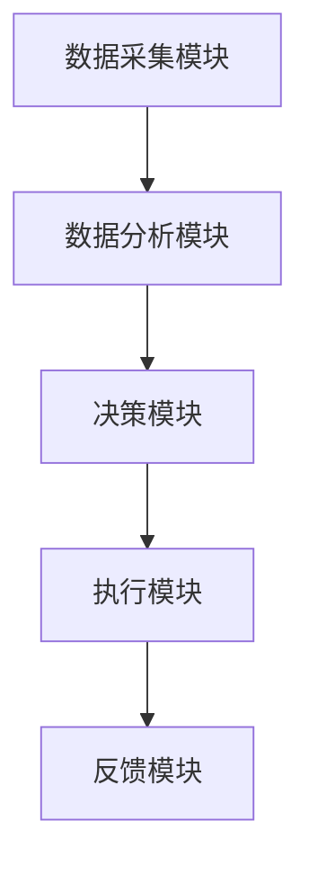

                 


# AI Agent在智能品牌管理中的应用

> 关键词：AI Agent, 智能品牌管理, 数据分析, 机器学习, 人工智能

> 摘要：随着人工智能技术的快速发展，AI Agent（人工智能代理）在品牌管理中的应用日益广泛。本文将从AI Agent的核心概念出发，深入探讨其在智能品牌管理中的应用场景、算法原理、系统架构以及项目实战，结合实际案例分析，为读者提供全面而深入的见解。本文旨在帮助品牌管理者和技术开发者更好地理解AI Agent在智能品牌管理中的潜力和挑战。

---

# 第一部分: AI Agent在智能品牌管理中的应用概述

## 第1章: AI Agent与智能品牌管理的背景

### 1.1 AI Agent的基本概念

AI Agent，即人工智能代理，是指能够感知环境并采取行动以实现目标的智能实体。它可以是一个软件程序、一个机器人，或者任何能够执行复杂任务的自动化系统。AI Agent的核心特征包括自主性、反应性、目标导向和学习能力。

- **自主性**：AI Agent能够在没有人工干预的情况下独立执行任务。
- **反应性**：AI Agent能够实时感知环境变化并做出反应。
- **目标导向**：AI Agent的行为以实现特定目标为导向。
- **学习能力**：AI Agent能够通过数据和经验不断优化自身的决策能力。

### 1.2 智能品牌管理的背景

传统品牌管理依赖于人工分析和经验判断，效率较低且难以应对复杂多变的市场环境。随着大数据和人工智能技术的普及，智能品牌管理逐渐成为品牌竞争的核心优势。AI Agent在品牌管理中的应用，能够显著提升品牌决策的效率和准确性。

#### 1.2.1 品牌管理的传统模式

传统品牌管理主要依赖以下几种方式：

- **人工分析**：通过市场调研、消费者反馈等方式进行分析。
- **经验判断**：依赖品牌管理者的经验进行决策。
- **工具辅助**：使用简单的数据分析工具进行辅助。

#### 1.2.2 数字化品牌管理的兴起

随着互联网和大数据技术的发展，品牌管理逐渐从传统模式向数字化模式转型。数字化品牌管理的核心在于利用数据驱动的决策，通过收集和分析海量数据来优化品牌策略。

#### 1.2.3 AI技术在品牌管理中的潜力

AI技术的应用为品牌管理带来了前所未有的机遇。通过AI Agent，品牌管理者可以实时监控市场动态、预测消费者行为、优化品牌传播策略，从而实现更加精准和高效的管理。

### 1.3 AI Agent在品牌管理中的应用价值

AI Agent在品牌管理中的应用价值主要体现在以下几个方面：

- **提高品牌决策的效率**：通过自动化分析和实时监控，AI Agent能够快速提供决策支持。
- **实现品牌数据的深度分析**：利用机器学习算法，AI Agent可以从海量数据中提取有价值的信息。
- **优化品牌与消费者互动的方式**：通过个性化推荐和实时响应，AI Agent能够提升消费者的品牌体验。

---

## 第2章: AI Agent在品牌管理中的核心问题

### 2.1 品牌管理中的数据挑战

在品牌管理中，数据是AI Agent的核心资源。然而，数据的多样性和复杂性给品牌管理带来了诸多挑战。

#### 2.1.1 数据的多样性与复杂性

品牌管理涉及的数据来源广泛，包括社交媒体数据、销售数据、消费者反馈数据等。这些数据格式多样、结构复杂，给数据处理带来了困难。

#### 2.1.2 数据隐私与安全问题

品牌管理涉及大量的消费者数据，数据隐私和安全问题尤为重要。如何在保护数据隐私的前提下进行有效的数据分析，是品牌管理中亟待解决的问题。

#### 2.1.3 数据的实时性要求

品牌管理需要实时监控市场动态和消费者行为，这对数据的实时性提出了更高的要求。AI Agent需要能够快速处理和分析实时数据，以提供及时的决策支持。

### 2.2 AI Agent在品牌管理中的应用场景

AI Agent在品牌管理中的应用场景广泛，主要包括以下几个方面：

#### 2.2.1 品牌形象监控

通过AI Agent实时监控品牌在社交媒体和新闻媒体中的形象，及时发现并处理负面舆情，维护品牌形象。

#### 2.2.2 消费者行为预测

通过分析消费者的购买行为和偏好，AI Agent能够预测未来的消费趋势，帮助品牌制定精准的营销策略。

#### 2.2.3 品牌传播优化

通过优化品牌传播渠道和内容，AI Agent能够帮助品牌实现更高效的传播效果。

### 2.3 AI Agent在品牌管理中的关键问题

尽管AI Agent在品牌管理中具有巨大的潜力，但其应用也面临一些关键问题。

#### 2.3.1 数据处理的准确性

数据的准确性直接影响AI Agent的决策结果。如何提高数据处理的准确性是品牌管理中的一个重要问题。

#### 2.3.2 模型的可解释性

AI Agent的决策过程往往缺乏透明性，这使得品牌管理者难以理解和信任AI Agent的决策。

#### 2.3.3 系统的实时响应能力

品牌管理需要实时监控和响应市场变化，这对AI Agent的实时响应能力提出了更高的要求。

---

# 第二部分: AI Agent的核心概念与原理

## 第3章: AI Agent的核心概念与联系

### 3.1 AI Agent的工作原理

AI Agent的工作原理可以分为三个主要模块：感知、决策和执行。

#### 3.1.1 感知模块

感知模块负责从环境中获取信息，包括数据采集和数据预处理。例如，AI Agent可以通过社交媒体API获取消费者评论数据，并对其进行清洗和特征提取。

#### 3.1.2 决策模块

决策模块负责根据感知到的信息做出决策，包括特征提取、模型训练和预测。例如，AI Agent可以通过训练好的机器学习模型预测消费者的购买倾向。

#### 3.1.3 执行模块

执行模块负责根据决策结果采取行动，包括策略优化、结果反馈和日志记录。例如，AI Agent可以根据预测结果优化品牌传播策略，并记录执行结果以供后续分析。

### 3.2 AI Agent与品牌管理的联系

通过AI Agent，品牌管理者可以实现以下目标：

- **实时监控市场动态**：通过实时数据采集和分析，品牌管理者可以快速发现市场变化。
- **精准预测消费者行为**：通过机器学习模型，品牌管理者可以预测消费者的购买倾向。
- **优化品牌传播策略**：通过自动化决策，品牌管理者可以实现更高效的传播效果。

---

## 第4章: AI Agent的算法原理

### 4.1 常见的AI Agent算法

常用的AI Agent算法包括基于规则的AI Agent、基于Q-learning的AI Agent和基于神经网络的AI Agent。

#### 4.1.1 基于规则的AI Agent

基于规则的AI Agent通过预定义的规则进行决策，适用于规则明确且变化较小的场景。

#### 4.1.2 基于Q-learning的AI Agent

基于Q-learning的AI Agent通过强化学习不断优化决策策略，适用于复杂动态的环境。

#### 4.1.3 基于神经网络的AI Agent

基于神经网络的AI Agent通过深度学习模型进行决策，适用于数据量大且复杂的场景。

### 4.2 算法实现

以下是基于Q-learning的AI Agent算法实现示例：

```python
import numpy as np
import random

class QLearningAgent:
    def __init__(self, state_space_size, action_space_size, learning_rate=0.1, gamma=0.9):
        self.q_table = np.zeros([state_space_size, action_space_size])
        self.learning_rate = learning_rate
        self.gamma = gamma

    def take_action(self, state):
        return random.randint(0, action_space_size - 1)

    def update_q_table(self, state, action, reward, next_state):
        self.q_table[state, action] = self.q_table[state, action] * (1 - self.learning_rate) + self.learning_rate * (reward + self.gamma * np.max(self.q_table[next_state]))
```

### 4.3 算法优缺点

- **优点**：能够处理复杂动态的环境，具有较强的适应性。
- **缺点**：需要大量的训练数据，且模型的可解释性较差。

---

## 第5章: AI Agent的系统架构

### 5.1 系统功能设计

AI Agent在品牌管理中的系统功能设计包括数据采集、数据分析、决策制定和执行反馈。

#### 5.1.1 数据采集模块

通过社交媒体API、销售数据系统等渠道采集品牌相关的数据。

#### 5.1.2 数据分析模块

利用机器学习算法对数据进行分析，提取有价值的信息。

#### 5.1.3 决策模块

根据分析结果制定决策，并通过执行模块采取行动。

#### 5.1.4 执行反馈模块

记录执行结果，并根据反馈优化决策策略。

### 5.2 系统架构设计

以下是AI Agent的系统架构设计图：



---

## 第6章: 项目实战

### 6.1 项目介绍

本项目旨在通过AI Agent实现品牌传播策略的优化。我们将在社交媒体平台上实时监控品牌声誉，并根据消费者反馈优化品牌传播策略。

### 6.2 核心代码实现

以下是核心代码实现：

```python
import tweepy
from textblob import TextBlob

class BrandMgmtAI:
    def __init__(self, api_key, api_secret_key, access_token, access_token_secret):
        self.auth = tweepy.OAuthHandler(api_key, api_secret_key)
        self.auth.set_access_token(access_token, access_token_secret)
        self.api = tweepy.API(self.auth)

    def monitor_brand(self, brand_name):
        public_tweets = self.api.search(brand_name)
        sentiment_scores = []
        for tweet in public_tweets:
            analysis = TextBlob(tweet.text)
            sentiment_scores.append(analysis.sentiment.polarity)
        return sentiment_scores

    def optimize_strategy(self, sentiment_scores):
        # 简单的策略优化示例
        if np.mean(sentiment_scores) > 0.2:
            return "Increase marketing budget"
        else:
            return "Address negative feedback"

# 示例用法
api_key = "..."
api_secret_key = "..."
access_token = "..."
access_token_secret = "..."
agent = BrandMgmtAI(api_key, api_secret_key, access_token, access_token_secret)
scores = agent.monitor_brand("YourBrandName")
result = agent.optimize_strategy(scores)
print(result)
```

### 6.3 项目总结

通过本项目，我们展示了AI Agent在品牌管理中的应用潜力。然而，实际应用中还需要考虑数据隐私、模型优化和系统性能等问题。

---

## 第7章: 最佳实践与小结

### 7.1 小结

AI Agent在智能品牌管理中的应用前景广阔。通过实时监控、数据分析和自动化决策，AI Agent能够显著提升品牌管理的效率和准确性。

### 7.2 注意事项

- 数据隐私和安全问题是品牌管理中需要重点关注的问题。
- 模型的可解释性是品牌管理者信任AI Agent的重要因素。
- 系统的实时响应能力是品牌管理中的关键要求。

### 7.3 拓展阅读

- 《机器学习实战》
- 《人工智能：一种现代方法》
- 《数据驱动的品牌管理》

---

# 作者

作者：AI天才研究院/AI Genius Institute & 禅与计算机程序设计艺术/Zen And The Art of Computer Programming

---

通过以上内容，我们全面探讨了AI Agent在智能品牌管理中的应用，从核心概念到算法实现，从系统架构到项目实战，为读者提供了丰富的理论和实践指导。希望本文能够为品牌管理者和技术开发者提供有价值的参考和启发。

