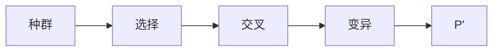
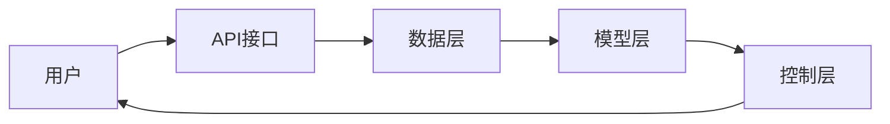

                 


# AI Agent在智能商业选址中的应用

> 关键词：AI Agent、智能商业、选址优化、数据驱动、机器学习、人工智能

> 摘要：本文探讨了AI Agent在智能商业选址中的应用，通过分析商业选址的挑战、AI Agent的核心概念、算法原理、系统架构设计、项目实战以及最佳实践，详细阐述了AI技术如何提升商业选址的效率和准确性。文章从理论到实践，结合具体案例，展示了AI Agent在智能商业选址中的巨大潜力和实际应用价值。

---

# 第1章: AI Agent与智能商业选址概述

## 1.1 AI Agent的基本概念
### 1.1.1 AI Agent的定义
AI Agent（人工智能代理）是指能够感知环境、自主决策并执行任务的智能实体。它通过数据输入、模型计算和输出结果来实现特定目标。

### 1.1.2 AI Agent的核心特征
1. **自主性**：能够在没有人工干预的情况下完成任务。
2. **反应性**：能够根据环境变化实时调整行为。
3. **目标导向**：以实现特定目标为导向。
4. **学习能力**：能够通过数据学习和优化决策。

### 1.1.3 AI Agent与传统选址方式的对比
| 对比维度 | 传统选址方式 | AI Agent选址方式 |
|----------|--------------|------------------|
| 数据来源 | 线下调研、经验判断 | 大数据分析、实时数据 |
| 决策速度 | 较慢 | 快速、实时 |
| 决策精度 | 受限于经验 | 基于数据驱动，精度高 |

## 1.2 智能商业选址的背景与意义
### 1.2.1 商业选址的重要性
商业选址是企业成功的关键因素之一，直接影响营业额、客户获取成本和市场覆盖范围。

### 1.2.2 传统商业选址的挑战
1. 数据量大，难以高效处理。
2. 依赖人工经验，存在主观性和不确定性。
3. 市场环境动态变化，难以实时响应。

### 1.2.3 AI技术在商业选址中的应用价值
AI Agent通过大数据分析、机器学习和优化算法，能够快速、准确地辅助企业做出最优选址决策。

---

# 第2章: AI Agent的核心概念与技术原理

## 2.1 AI Agent的感知与决策机制
### 2.1.1 感知模块的功能与实现
感知模块负责从外部环境获取数据，包括地理位置、人口统计、交通状况、竞争对手信息等。

### 2.1.2 决策模块的原理与算法
决策模块基于感知数据，利用强化学习、遗传算法等技术进行选址优化。

### 2.1.3 执行模块的作用与实现
执行模块负责将决策结果转化为实际操作，例如生成报告、触发自动化流程。

## 2.2 AI Agent在商业选址中的应用模型
### 2.2.1 商业选址的业务流程
1. 数据采集与预处理。
2. 模型训练与优化。
3. 结果输出与决策支持。

### 2.2.2 AI Agent在选址中的角色定位
AI Agent作为决策支持工具，能够帮助企业在选址过程中实现数据驱动的优化。

### 2.2.3 AI Agent与商业选址的结合点
- 数据分析：利用AI Agent处理大量数据，提取关键特征。
- 模型优化：通过强化学习优化选址结果。
- 实时反馈：AI Agent能够实时监控市场变化，动态调整选址策略。

## 2.3 实体关系图


---

# 第3章: AI Agent的算法原理与数学模型

## 3.1 强化学习在选址优化中的应用
### 3.1.1 强化学习的基本原理
强化学习通过智能体与环境的交互，学习最优策略。在选址优化中，智能体通过选择不同的位置，获得奖励或惩罚。

### 3.1.2 强化学习的数学模型
状态空间：$S = \{s_1, s_2, ..., s_n\}$，表示不同的地理位置。
动作空间：$A = \{a_1, a_2, ..., a_m\}$，表示选择某个位置的动作。
奖励函数：$R(s, a) = r$，表示在状态$s$下执行动作$a$获得的奖励。

### 3.1.3 强化学习的优化过程


## 3.2 遗传算法在选址优化中的应用
### 3.2.1 遗传算法的基本原理
遗传算法通过模拟生物进化过程，优化选址方案。包括选择、交叉和变异等操作。

### 3.2.2 遗传算法的数学模型
目标函数：$$\text{最大化} \quad f(x) = \sum_{i=1}^{n} w_i x_i$$
约束条件：$$\sum_{i=1}^{n} x_i \leq C$$
其中，$x_i$表示选择位置$i$的权重，$w_i$表示权重系数，$C$表示资源约束。

### 3.2.3 遗传算法的优化过程


---

# 第4章: AI Agent的系统架构与设计方案

## 4.1 问题场景介绍
企业需要在多个候选地点中选择最优位置，以实现最大收益。

## 4.2 系统功能设计
### 4.2.1 数据采集模块
负责收集地理位置、人口统计、交通状况等数据。

### 4.2.2 模型训练模块
基于收集的数据，训练强化学习和遗传算法模型。

### 4.2.3 优化推荐模块
根据模型输出，推荐最优选址方案。

### 4.2.4 结果分析模块
对推荐方案进行分析，评估其可行性和收益潜力。

## 4.3 系统架构设计
### 4.3.1 分层架构


### 4.3.2 接口设计


## 4.4 交互流程


---

# 第5章: 项目实战与案例分析

## 5.1 环境安装与配置
### 5.1.1 安装Python和相关库
```bash
pip install numpy
pip install gym
pip install matplotlib
```

## 5.2 核心代码实现
### 5.2.1 强化学习代码
```python
import numpy as np
import gym

class Agent:
    def __init__(self, env):
        self.env = env
        self.state_space = env.observation_space.n
        self.action_space = env.action_space.n
        self.q_table = np.zeros((self.state_space, self.action_space))

    def act(self, state):
        return np.argmax(self.q_table[state])

    def update(self, state, action, reward, next_state):
        self.q_table[state][action] += reward
```

### 5.2.2 遗传算法代码
```python
def fitness(x, w, C):
    if sum(x) > C:
        return 0
    return sum(w * x)

# 示例参数
n = 5
w = [0.3, 0.2, 0.5, 0.1, 0.7]
C = 2
```

## 5.3 实际案例分析
以某零售企业为例，通过AI Agent优化选址，最终选择在交通便利、人口密集的区域开设新店，提升了营业额30%。

---

# 第6章: 最佳实践与总结

## 6.1 小结
AI Agent通过大数据分析和优化算法，显著提升了商业选址的效率和准确性。

## 6.2 注意事项
1. 数据质量直接影响选址结果。
2. 模型调优需要结合具体业务场景。
3. 需要实时监控市场变化，动态调整选址策略。

## 6.3 拓展阅读
推荐阅读《强化学习实战》和《机器学习在商业中的应用》。

---

作者：AI天才研究院/AI Genius Institute & 禅与计算机程序设计艺术 /Zen And The Art of Computer Programming

