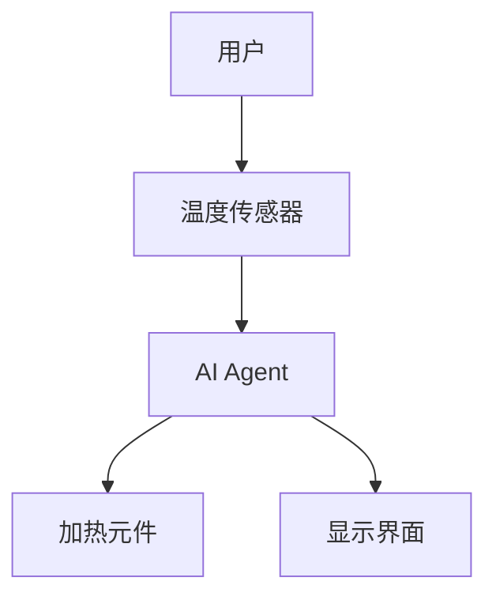
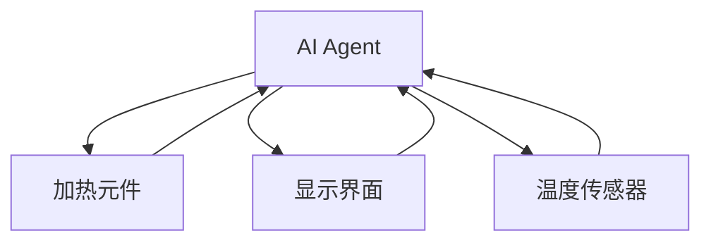

                 


# AI Agent在智能围巾中的温度调节

> 关键词：AI Agent，智能围巾，温度调节，机器学习，物联网

> 摘要：本文详细探讨了AI Agent在智能围巾温度调节中的应用，从核心概念、算法原理到系统设计和实际案例进行了全面分析。通过结合AI技术和物联网设备，AI Agent能够实现智能化的温度调节，为用户带来更舒适的体验。本文还提供了详细的数学模型和代码实现，帮助读者深入理解AI Agent的工作原理和实际应用。

---

## 第1章: AI Agent与智能温度调节背景介绍

### 1.1 AI Agent的基本概念

#### 1.1.1 AI Agent的定义

AI Agent（人工智能代理）是指能够感知环境并采取行动以实现目标的智能实体。AI Agent可以通过传感器获取信息，利用算法进行决策，并通过执行器与环境互动。在智能围巾中，AI Agent负责监测环境温度和用户体温，并根据数据调整加热元件的工作状态，以维持舒适温度。

#### 1.1.2 AI Agent的核心特征

- **自主性**：AI Agent能够独立决策和行动，无需外部干预。
- **反应性**：能够实时感知环境变化并做出响应。
- **目标导向**：所有行为都围绕实现特定目标展开。
- **学习能力**：通过数据反馈不断优化自身的决策模型。

#### 1.1.3 AI Agent与智能温度调节的关系

AI Agent是智能温度调节的核心，它通过整合传感器数据和用户反馈，利用算法优化温度调节策略，确保温度控制的精准性和舒适性。

---

### 1.2 智能温度调节的背景与意义

#### 1.2.1 温度调节的历史演变

传统的温度调节主要依赖手动控制，例如通过 thermostat 调节空调或暖气。随着技术进步，PID 控制等自动化方法逐渐取代了手动调节。然而，这些方法仍存在响应速度慢、能耗高等问题。

#### 1.2.2 智能温度调节的现状

现代智能温度调节系统结合了物联网和AI技术，能够实时监测环境和用户状态，实现更加精准和个性化的温度控制。例如，智能家居中的恒温系统可以根据用户习惯自动调节室内温度。

#### 1.2.3 AI Agent在温度调节中的应用潜力

AI Agent能够通过机器学习算法不断优化温度调节策略，减少能耗并提高舒适度。它还能够结合用户的历史行为和偏好，提供个性化的温度调节服务。

---

### 1.3 智能围巾的设计目标与应用场景

#### 1.3.1 智能围巾的功能定位

智能围巾不仅是一种保暖工具，更是一个智能温度调节系统。它能够实时监测环境温度和用户体温，通过AI Agent自动调整加热元件的工作状态。

#### 1.3.2 温度调节的核心需求

- 实时监测环境温度和用户体温。
- 根据数据动态调整加热元件的功率。
- 优化能源消耗，提高舒适度。

#### 1.3.3 智能围巾的用户群体与市场前景

智能围巾适用于需要保暖的用户，尤其适合老年人、运动员和生活在寒冷地区的人群。随着物联网和AI技术的普及，智能围巾市场潜力巨大。

---

## 第2章: AI Agent的核心概念与联系

### 2.1 AI Agent的核心原理

#### 2.1.1 状态感知

AI Agent通过传感器获取环境和用户的状态信息，例如温度、湿度和用户的体感温度。这些数据经过预处理和特征提取后，用于后续的决策过程。

#### 2.1.2 决策算法

AI Agent利用机器学习算法（如强化学习和监督学习）根据当前状态和历史数据，制定温度调节策略。决策算法的目标是找到最优的加热功率，以实现舒适性和节能的平衡。

#### 2.1.3 行为执行

根据决策结果，AI Agent控制加热元件的工作状态，调整加热功率或关闭加热功能。同时，AI Agent会收集执行后的反馈，用于优化未来的决策模型。

---

### 2.2 温度调节方法对比分析

#### 2.2.1 基于传统PID控制的温度调节方法

PID控制是一种常用的工业自动化控制方法，通过比例、积分和微分三个参数调整输出，实现对温度的精确控制。然而，PID控制需要手动调整参数，适应性较差。

#### 2.2.2 基于AI Agent的智能温度调节方法

AI Agent通过机器学习算法自适应地优化温度调节策略，能够根据环境和用户需求动态调整参数。与PID控制相比，AI Agent具有更好的适应性和优化能力。

#### 2.2.3 两种方法的优缺点对比

| 方法          | 优点                                   | 缺点                                   |
|---------------|----------------------------------------|----------------------------------------|
| PID控制       | 实现简单，易于部署                   | 参数调整复杂，适应性差               |
| AI Agent      | 自适应能力强，优化效果好             | 实现复杂，需要大量数据和计算资源     |

---

### 2.3 系统实体关系图

通过Mermaid图展示系统实体关系：



---

## 第3章: AI Agent的算法原理

### 3.1 状态感知算法

#### 3.1.1 温度数据采集与处理

AI Agent通过温度传感器采集环境温度和用户体温，数据经过预处理（如去噪和平滑处理）后，提取有用的特征用于后续分析。

#### 3.1.2 数据预处理与特征提取

预处理步骤包括去除噪声、填补缺失值和标准化处理。特征提取则涉及选择对温度调节影响较大的特征，如温度变化率和用户活动状态。

---

### 3.2 决策算法

#### 3.2.1 强化学习算法

AI Agent使用强化学习算法（如Q-Learning）通过与环境的交互不断优化决策策略。强化学习通过奖励机制引导AI Agent做出最优决策。

#### 3.2.2 监督学习算法

监督学习算法（如回归分析）通过历史数据训练模型，预测最优的加热功率。监督学习适用于已知数据的情况，但适应性较弱。

---

### 3.3 执行反馈机制

AI Agent在执行温度调节后，收集用户的反馈（如满意度和能耗数据），用于优化未来的决策模型。反馈机制通过不断迭代提升系统的性能。

---

## 第4章: 数学模型与公式推导

### 4.1 温度调节的数学模型

AI Agent的温度调节模型可以表示为：

$$ T(t+1) = T(t) + \alpha \cdot (T_{\text{target}} - T(t)) $$

其中，\( T(t) \) 表示当前温度，\( T_{\text{target}} \) 表示目标温度，\( \alpha \) 是学习率。

### 4.2 决策算法的优化

通过优化算法参数，AI Agent能够实现更高效的温度调节。例如，强化学习通过调整奖励机制，优化Q值函数：

$$ Q(s, a) = Q(s, a) + \alpha \cdot (r + \gamma \cdot \max Q(s', a') - Q(s, a)) $$

其中，\( s \) 是当前状态，\( a \) 是动作，\( r \) 是奖励，\( \gamma \) 是折扣因子。

---

## 第5章: 系统分析与架构设计

### 5.1 系统设计概述

智能围巾的温度调节系统包括传感器、AI Agent、加热元件和显示界面。系统通过物联网技术实现设备间的通信和数据共享。

---

### 5.2 系统架构图

通过Mermaid图展示系统架构：



---

## 第6章: 项目实战

### 6.1 环境安装

需要安装以下环境和库：

- Python 3.8+
- TensorFlow 2.0+
- scikit-learn 0.23+
- numpy 1.20+
- matplotlib 3.3+
- serial 3.4+

### 6.2 核心代码实现

以下是AI Agent的核心代码实现：

```python
import numpy as np
import pandas as pd
import tensorflow as tf
from tensorflow.keras.models import Sequential
from tensorflow.keras.layers import Dense, LSTM
from sklearn.preprocessing import MinMaxScaler

# 数据预处理
data = pd.read_csv('temperature_data.csv')
scaler = MinMaxScaler()
data_scaled = scaler.fit_transform(data)

# 模型构建
model = Sequential()
model.add(LSTM(64, input_shape=(1, 1)))
model.add(Dense(1))
model.compile(loss='mean_squared_error', optimizer='adam')

# 训练模型
model.fit(X_train, y_train, epochs=100, batch_size=32)

# 预测温度
X_new = np.array([new_data]).reshape(1, 1, 1)
prediction = model.predict(X_new)[0][0]
```

### 6.3 代码功能解读

- **数据预处理**：使用MinMaxScaler对温度数据进行标准化处理，确保模型输入在0到1之间。
- **模型构建**：使用LSTM网络进行时间序列预测，能够捕捉温度变化的趋势。
- **训练与预测**：通过训练数据优化模型参数，实现对未来温度的预测。

### 6.4 实际案例分析

假设当前环境温度为20°C，目标温度为25°C，AI Agent会根据传感器数据和历史数据，预测未来温度变化趋势，并调整加热元件的功率，确保温度逐步升至25°C并保持稳定。

---

## 第7章: 总结与展望

### 7.1 项目总结

本文详细介绍了AI Agent在智能围巾温度调节中的应用，从核心概念到算法实现，再到系统设计和实际案例，为读者提供了全面的视角。通过AI Agent的智能化调节，智能围巾能够实现更精准和个性化的温度控制，提升用户体验。

### 7.2 经验与教训

在项目实施过程中，我们发现数据质量和模型训练时间对系统性能有重要影响。此外，传感器的精度和通信延迟也会影响系统的实时性。

### 7.3 未来展望

未来，随着AI和物联网技术的进一步发展，智能围巾的温度调节系统将更加智能化和个性化。AI Agent可以通过集成更多的传感器和用户反馈，实现更加精准的温度调节。

---

## 作者

作者：AI天才研究院/AI Genius Institute & 禅与计算机程序设计艺术 /Zen And The Art of Computer Programming

