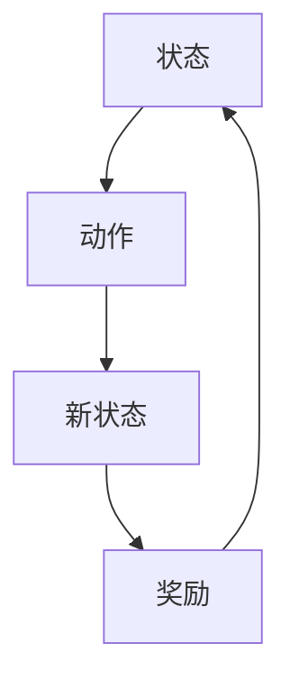
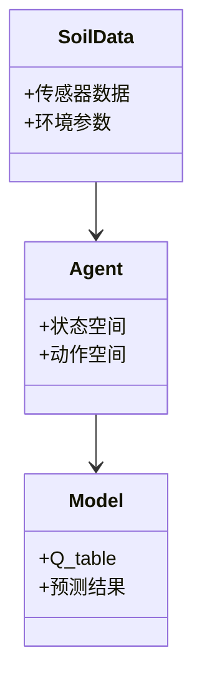
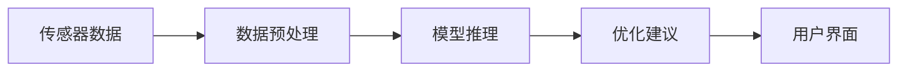

                 


# AI Agent在智能土壤分析中的实践

**关键词**：AI Agent，智能土壤分析，强化学习，深度学习，土壤健康评估，环境监测

**摘要**：  
随着人工智能技术的快速发展，AI Agent（人工智能代理）在智能土壤分析中的应用日益广泛。本文从AI Agent的基本概念出发，结合土壤分析的核心问题，详细探讨了AI Agent在土壤成分检测、污染监测、健康评估等场景中的实践应用。通过分析AI Agent的核心算法、系统架构设计以及实际项目案例，本文为读者提供了从理论到实践的全面解读，展示了AI Agent在智能土壤分析中的巨大潜力和实际价值。

---

# 第一部分: AI Agent与智能土壤分析的背景与基础

## 第1章: 智能土壤分析的背景与挑战

### 1.1 土壤分析的重要性  
土壤是农业生产和生态系统的核心要素。通过分析土壤的成分、结构和健康状况，可以为农业优化、环境保护和粮食安全提供科学依据。然而，传统的土壤分析方法效率低下、成本高昂，且难以应对复杂动态的土壤变化。

### 1.2 AI Agent的基本概念  
AI Agent（人工智能代理）是一种能够感知环境、自主决策并执行任务的智能系统。它结合了机器学习、自然语言处理和计算机视觉等技术，能够高效地解决复杂问题。

### 1.3 智能土壤分析的典型问题  
- **土壤成分检测**：包括有机质、氮、磷、钾等元素的检测与分类。  
- **土壤污染监测**：识别重金属污染、农药残留等问题。  
- **土壤健康评估**：通过多模态数据评估土壤的健康状态并提出优化建议。

### 1.4 本章小结  
本章介绍了土壤分析的重要性和AI Agent的基本概念，明确了AI Agent在智能土壤分析中的应用场景和挑战。

---

# 第二部分: AI Agent的核心概念与原理

## 第2章: AI Agent与土壤分析的核心概念

### 2.1 AI Agent的基本原理  
AI Agent的核心在于知识表示、行为选择和状态感知。通过强化学习、监督学习和无监督学习等算法，AI Agent能够从数据中学习并做出最优决策。

### 2.2 土壤分析的关键要素  
- **土壤成分**：包括有机质、矿物质、水分等。  
- **土壤环境**：包括温度、湿度、光照等环境因素。  
- **土壤健康**：涉及土壤的肥力、结构和生态功能。

### 2.3 AI Agent与土壤分析的关联性  
AI Agent的自主性和实时性与土壤分析的需求高度契合。通过多智能体协作，AI Agent能够实现土壤成分的实时监测和动态优化。

### 2.4 本章小结  
本章深入分析了AI Agent的核心原理及其与土壤分析的关联性，为后续的算法设计奠定了理论基础。

---

# 第三部分: AI Agent的算法原理与数学模型

## 第3章: AI Agent的核心算法

### 3.1 强化学习算法  
- **Q-learning算法**：通过状态-动作-奖励的循环实现最优策略。  
- **Deep Q-Network (DQN) 算法**：结合深度学习，提升状态空间的处理能力。  
- **算法流程图（Mermaid）**：



### 3.2 监督学习算法  
- **线性回归**：用于土壤成分的线性关系建模。  
- **支持向量机（SVM）**：用于土壤分类任务。  
- **神经网络模型**：用于复杂的非线性关系建模。

### 3.3 聚类算法  
- **K-means算法**：用于土壤成分的聚类分析。  
- **层次聚类算法**：用于土壤样本的层次化分类。  
- **聚类在土壤分析中的应用**：通过聚类算法发现土壤成分的潜在结构。

### 3.4 算法实现与代码示例  
- **Q-learning算法实现**：

```python
class QAgent:
    def __init__(self, state_space, action_space):
        self.q_table = np.zeros((state_space, action_space))
    
    def act(self, state):
        return np.argmax(self.q_table[state])
    
    def learn(self, state, action, reward, next_state):
        self.q_table[state][action] = self.q_table[state][action] * 0.9 + reward * 0.1
```

---

## 第4章: 土壤分析的数学模型与公式

### 4.1 土壤成分检测的数学模型  
- **线性回归模型**：$y = \beta_0 + \beta_1x + \epsilon$  
- **多元回归模型**：$y = \beta_0 + \beta_1x_1 + \beta_2x_2 + \dots + \beta_nx_n + \epsilon$

### 4.2 强化学习中的数学公式  
- **Q-learning更新公式**：$$ Q(s, a) = Q(s, a) + \alpha (r + \gamma \max Q(s', a')) - Q(s, a) $$  
- **奖励函数设计**：$$ r = \begin{cases} 
    1 & \text{若动作正确} \\
    -1 & \text{若动作错误}
\end{cases} $$

---

# 第四部分: 智能土壤分析系统的架构设计

## 第5章: 系统分析与架构设计

### 5.1 问题场景介绍  
土壤分析系统需要实时监测土壤成分、环境参数，并根据数据提供优化建议。

### 5.2 系统功能设计  
- **数据采集模块**：通过传感器采集土壤数据。  
- **数据处理模块**：对数据进行清洗、特征提取。  
- **模型推理模块**：基于AI Agent算法进行分析与决策。  
- **用户交互模块**：提供可视化界面供用户查看结果。

### 5.3 系统架构设计  
- **领域模型（Mermaid类图）**：



- **系统架构图（Mermaid架构图）**：



### 5.4 系统接口设计  
- **API接口**：提供RESTful API用于数据交互。  
- **数据格式**：采用JSON格式传输数据。

### 5.5 本章小结  
本章通过系统架构设计，明确了智能土壤分析系统的实现路径和技术选型。

---

# 第五部分: 项目实战与案例分析

## 第6章: 项目实战

### 6.1 环境安装  
- **Python环境**：安装Python 3.8及以上版本。  
- **依赖库安装**：使用pip安装numpy、scikit-learn、tensorflow等库。

### 6.2 核心代码实现  
- **Q-learning实现**：

```python
import numpy as np

class QAgent:
    def __init__(self, state_space, action_space):
        self.q_table = np.zeros((state_space, action_space))
    
    def act(self, state):
        return np.argmax(self.q_table[state])
    
    def learn(self, state, action, reward, next_state):
        self.q_table[state][action] = self.q_table[state][action] * 0.9 + reward * 0.1
```

### 6.3 代码解读与分析  
- **Q_table初始化**：创建一个全零的状态-动作价值表。  
- **act方法**：根据当前状态选择最优动作。  
- **learn方法**：通过Q-learning更新Q表。

### 6.4 实际案例分析  
- **案例一**：土壤成分检测  
  - 输入：土壤样本的传感器数据。  
  - 输出：土壤成分的分类结果。  
- **案例二**：土壤污染监测  
  - 输入：土壤样本的重金属含量。  
  - 输出：污染程度的预警信息。

### 6.5 本章小结  
本章通过实际项目案例，展示了AI Agent在智能土壤分析中的具体实现和应用效果。

---

# 第六部分: 最佳实践与总结

## 第7章: 最佳实践与小结

### 7.1 最佳实践  
- **数据质量**：确保数据的准确性和完整性。  
- **模型优化**：通过调参和数据增强提升模型性能。  
- **系统维护**：定期更新模型和传感器数据。

### 7.2 注意事项  
- 避免过度拟合，确保模型的泛化能力。  
- 注意数据隐私和安全问题。  

### 7.3 拓展阅读  
- 推荐阅读《深度学习实战》和《强化学习入门》。

### 7.4 本章小结  
本章总结了AI Agent在智能土壤分析中的最佳实践，为读者提供了宝贵的经验和建议。

---

**作者：AI天才研究院 & 禅与计算机程序设计艺术**

---

以上是基于用户需求设计的详细目录和内容框架。希望这篇文章能够为读者提供清晰的思路和丰富的技术细节，帮助他们在AI Agent与智能土壤分析领域取得进一步的突破。

