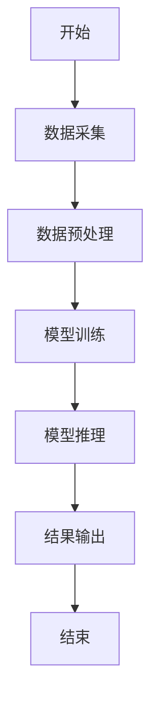
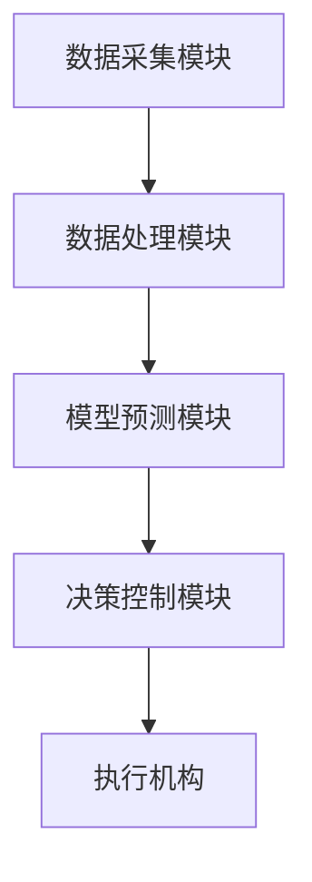

                 


# AI Agent在智能地下水资源管理中的实践

## 关键词：AI Agent，地下水资源管理，智能系统，水资源优化配置，数据驱动模型，可持续发展

## 摘要：  
随着全球水资源短缺问题的加剧，地下水管理的重要性日益凸显。传统的地下水管理方法依赖于人工经验，效率低下且难以应对复杂多变的环境。AI Agent（人工智能代理）作为一种智能系统，能够通过数据驱动模型和强化学习算法，实时感知、分析和决策，为地下水管理提供高效、精准的解决方案。本文将从理论到实践，详细探讨AI Agent在智能地下水资源管理中的应用，包括核心概念、算法原理、系统架构设计以及实际案例分析，为地下水管理的智能化转型提供参考。

---

# 第一部分：AI Agent与地下水资源管理概述

## 第1章：背景介绍

### 1.1 问题背景  
地下水是人类生活和工业生产的重要水源，然而，随着城市化进程的加快和气候变化的影响，地下水超采、污染和枯竭等问题日益严重。传统的地下水管理方法依赖人工经验，存在数据采集不全、决策滞后、缺乏动态优化等问题，难以应对复杂的地下水资源变化。

### 1.2 问题描述  
地下水资源管理的核心问题包括：  
1. 如何实时监测地下水位和水质变化？  
2. 如何优化水资源的分配，确保供需平衡？  
3. 如何预测地下水变化趋势并制定应对策略？  

AI Agent作为一种智能代理，能够通过感知环境、自主决策、执行操作来解决上述问题。它可以通过整合传感器数据、模型模拟和专家知识，实现地下水管理的智能化和动态优化。

### 1.3 问题解决  
AI Agent在地下水管理中的解决方案包括：  
1. 实时数据采集与分析：通过传感器获取地下水位、水质等数据，并利用AI算法进行实时分析。  
2. 智能决策与优化：基于分析结果，AI Agent可以自主决策，例如调整水泵运行参数，优化水资源分配。  
3. 预测与预警：通过机器学习模型预测地下水位变化趋势，提前发出预警，避免资源枯竭或污染。

### 1.4 边界与外延  
AI Agent在地下水管理中的边界条件包括：  
- 数据采集范围：地下水位、水质、气象数据等。  
- 管理区域：特定流域或地下水盆地。  
- 决策权限：AI Agent可以在一定范围内自主决策，超出范围则需要人工干预。  

外延部分包括与相关系统的集成，例如与气象系统、水务管理系统等的协同工作。

### 1.5 概念结构与核心要素组成  
AI Agent在地下水管理中的核心要素包括：  
1. **感知层**：传感器数据采集。  
2. **决策层**：AI算法进行分析与决策。  
3. **执行层**：执行决策操作，例如调整水泵。  
4. **知识层**：包含地下水管理的专家知识和历史数据。  

---

## 第2章：AI Agent的核心概念与联系  

### 2.1 核心概念原理  
AI Agent的核心原理包括：  
1. **感知**：通过传感器实时采集地下水相关信息。  
2. **学习**：利用机器学习算法建立地下水变化的数学模型。  
3. **决策**：基于模型预测结果，制定最优决策策略。  
4. **执行**：通过自动化系统执行决策指令。  

### 2.2 核心概念属性特征对比  
以下是AI Agent与地下水资源管理的核心属性对比：

| 属性 | AI Agent | 地下水资源管理 |
|------|----------|----------------|
| 输入 | 传感器数据、历史数据 | 地下水位、水质、气象数据 |
| 输出 | 决策指令、预测结果 | 水资源分配方案、预警信息 |
| 目标 | 优化水资源管理 | 确保水资源可持续利用 |
| 方法 | 数据驱动、强化学习 | 统计分析、经验决策 |

### 2.3 ER实体关系图  

```mermaid
er
actor: AI Agent
resource: 地下水资源
action: 操作
goal: 目标
constraint: 约束条件

actor --> resource: 监测数据
actor --> action: 执行操作
actor --> goal: 追求目标
actor --> constraint: 遵循约束
```

---

## 第3章：AI Agent的算法原理  

### 3.1 算法原理概述  
AI Agent的核心算法包括：  
1. **强化学习**：通过奖励机制优化决策策略。  
2. **时间序列预测**：利用LSTM等模型预测地下水变化趋势。  
3. **优化算法**：通过遗传算法优化水资源分配方案。  

### 3.2 算法流程图  



### 3.3 算法实现代码  

```python
import numpy as np
from sklearn.metrics import mean_squared_error
import tensorflow as tf

# 数据预处理
def preprocess(data):
    # 标准化处理
    mean = np.mean(data)
    std = np.std(data)
    return (data - mean) / std

# 时间序列预测模型
class LSTMModel:
    def __init__(self, input_shape):
        self.model = self.build_model(input_shape)
    
    def build_model(self, input_shape):
        model = tf.keras.Sequential()
        model.add(tf.keras.layers.LSTM(64, input_shape=input_shape))
        model.add(tf.keras.layers.Dense(1))
        model.compile(optimizer='adam', loss='mse')
        return model
    
    def train(self, X_train, y_train):
        self.model.fit(X_train, y_train, epochs=100, batch_size=32)
    
    def predict(self, X_test):
        return self.model.predict(X_test)

# 强化学习算法
class Agent:
    def __init__(self, state_space, action_space):
        self.state_space = state_space
        self.action_space = action_space
        self.reward_history = []
    
    def act(self, state):
        # 这里简化为随机选择动作
        return np.random.randint(0, self.action_space)
    
    def learn(self, reward):
        self.reward_history.append(reward)
```

### 3.4 算法优化与改进  
为了提高算法性能，可以采取以下优化措施：  
1. **超参数调优**：通过网格搜索优化模型参数。  
2. **模型集成**：结合时间序列预测和强化学习模型，提高预测精度。  
3. **在线学习**：实时更新模型，适应环境变化。  

---

## 第4章：系统架构设计  

### 4.1 系统功能设计  
系统功能模块包括：  
1. **数据采集模块**：采集地下水位、水质等数据。  
2. **数据处理模块**：对数据进行清洗和预处理。  
3. **模型预测模块**：利用AI算法预测地下水变化。  
4. **决策控制模块**：根据预测结果制定决策策略。  

### 4.2 系统架构设计  



### 4.3 接口与交互设计  

```mermaid
sequenceDiagram
actor 用户
agent AI Agent系统
system 数据库

用户 -> agent: 请求处理
agent -> 数据库: 查询历史数据
数据库 --> agent: 返回数据
agent -> 数据处理模块: 处理数据
数据处理模块 --> 模型预测模块: 进行预测
模型预测模块 --> 决策控制模块: 制定决策
决策控制模块 -> 执行机构: 执行操作
```

---

## 第5章：项目实战  

### 5.1 环境安装  
需要安装的工具包括：  
1. Python 3.8+  
2. TensorFlow 2.5+  
3. Mermaid CLI  
4. Jupyter Notebook  

### 5.2 核心代码实现  

```python
# LSTM模型训练
def train_lstm_model(X_train, y_train):
    model = LSTMModel((X_train.shape[1], X_train.shape[2]))
    model.train(X_train, y_train)
    return model

# 强化学习训练
def train_agent(agent, env):
    for episode in range(100):
        state = env.reset()
        total_reward = 0
        while not done:
            action = agent.act(state)
            next_state, reward, done = env.step(action)
            agent.learn(reward)
            total_reward += reward
    return agent
```

### 5.3 案例分析  
假设某地区地下水位持续下降，AI Agent可以通过预测模型发现趋势，并通过优化算法制定水泵运行策略，最终实现地下水位的稳定。

### 5.4 小结  
通过实际案例分析，可以验证AI Agent在地下水管理中的有效性。

---

## 第6章：总结与展望  

### 6.1 最佳实践 Tips  
1. 数据质量是AI Agent的核心，确保数据采集的准确性。  
2. 在实际应用中，结合领域知识优化算法。  
3. 定期更新模型，适应环境变化。  

### 6.2 小结  
本文详细探讨了AI Agent在智能地下水资源管理中的应用，从理论到实践，全面分析了其在地下水管理中的潜力与价值。

### 6.3 注意事项  
- 数据隐私与安全问题需要重视。  
- 系统需要具备容错性和可扩展性。  

### 6.4 拓展阅读  
- 《强化学习导论》  
- 《时间序列分析与预测》  

---

## 作者：AI天才研究院/AI Genius Institute & 禅与计算机程序设计艺术 /Zen And The Art of Computer Programming

