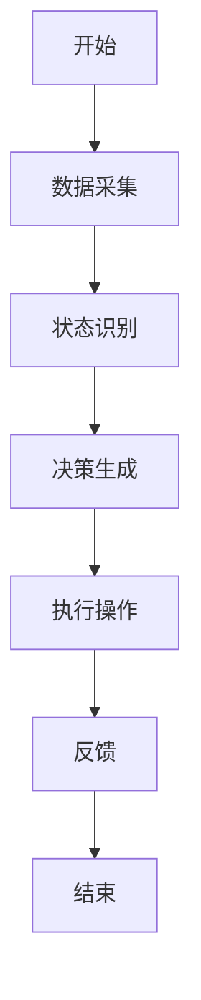
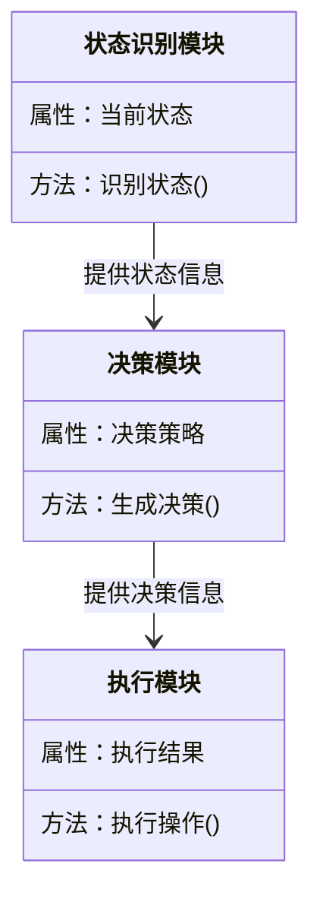
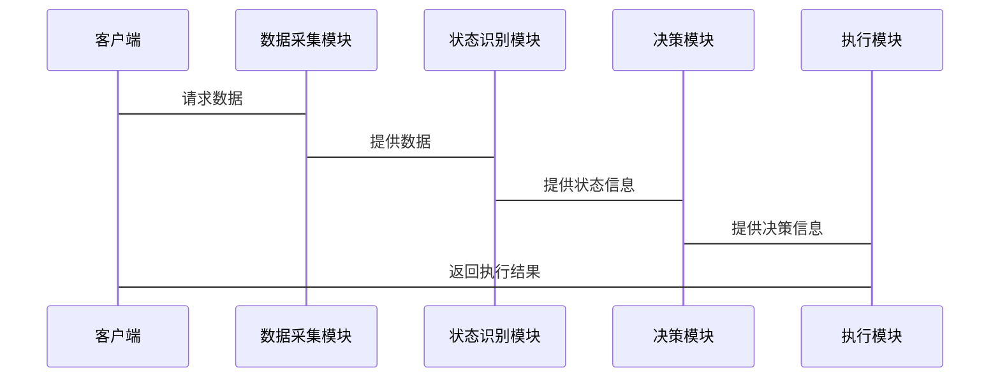

                 


# AI Agent在智能地下管网监测中的实践

## 关键词：AI Agent，智能监测，地下管网，数据采集，算法模型，系统架构

## 摘要：本文详细探讨了AI Agent在智能地下管网监测中的应用，从问题背景、技术原理到系统架构、项目实现，全面解析了AI Agent如何提升地下管网监测的效率和准确性。通过实际案例分析，展示了AI Agent在监测中的实际价值和未来的发展潜力。

---

# 第一部分：背景介绍

## 第1章：AI Agent与智能地下管网监测概述

### 1.1 问题背景

#### 1.1.1 地下管网的重要性
地下管网是城市基础设施的核心部分，包括供水、供电、供气等系统，是城市运行的“生命线”。然而，地下管网的复杂性和隐蔽性导致其维护和监测难度大，容易出现泄漏、断裂等问题，造成巨大经济损失和安全隐患。

#### 1.1.2 地下管网监测的难点
- 数据量庞大且类型多样：包括压力、流量、温度等多种传感器数据。
- 环境复杂：地下管网埋藏较深，容易受地质变化、人为破坏等影响。
- 维护成本高：传统人工巡检效率低，难以及时发现和处理问题。

#### 1.1.3 AI Agent的引入意义
AI Agent（智能体）能够通过自主学习和决策，实时监测地下管网的状态，实现故障预测和快速响应，显著提高监测效率和准确性，降低成本。

### 1.2 问题描述

#### 1.2.1 地下管网监测的主要挑战
- 数据实时性要求高，需要快速处理和响应。
- 多种传感器数据的融合分析复杂。
- 系统需要具备自适应能力，应对各种突发情况。

#### 1.2.2 AI Agent在监测中的作用
- 实时数据采集与分析。
- 自主决策，及时发现并解决问题。
- 提供预测性维护，减少事故发生的可能性。

#### 1.2.3 实际应用场景分析
- 智慧城市建设中的管网监测。
- 应急抢修中的快速响应。
- 节能减排中的资源优化配置。

### 1.3 问题解决

#### 1.3.1 AI Agent的核心功能
- 数据采集与处理。
- 状态识别与分析。
- 决策制定与执行。

#### 1.3.2 技术实现路径
- 引入物联网技术进行数据采集。
- 使用机器学习算法进行状态识别。
- 通过规则引擎实现决策和执行。

#### 1.3.3 应用价值与预期效果
- 提高监测效率，降低维护成本。
- 实现故障预测，减少事故发生。
- 优化资源配置，提升城市管理水平。

### 1.4 边界与外延

#### 1.4.1 AI Agent的应用范围
- 适用于城市地下管网的实时监测。
- 可扩展至其他城市基础设施的智能化管理。

#### 1.4.2 相关领域的区别与联系
- 区别：AI Agent用于智能化监测，而传统监测依赖人工检查。
- 联系：两者都依赖传感器数据，但AI Agent增加了自主决策能力。

#### 1.4.3 技术的局限性与改进方向
- 局限性：依赖传感器数据的准确性和完整性。
- 改进方向：优化算法模型，提高数据处理能力。

### 1.5 概念结构与核心要素

#### 1.5.1 AI Agent的构成要素
- **感知层**：负责数据的采集和初步处理。
- **计算层**：进行状态识别和分析，生成决策。
- **执行层**：根据决策执行相应的操作。

#### 1.5.2 地下管网监测系统的组成部分
- **传感器网络**：用于采集地下管网的各项参数。
- **数据处理系统**：对采集的数据进行分析和处理。
- **决策系统**：基于分析结果生成决策并执行。

#### 1.5.3 核心概念之间的关系
AI Agent通过感知层获取地下管网的状态数据，经过计算层的分析和决策，最终通过执行层进行响应，形成一个闭环系统。

---

# 第二部分：核心概念与联系

## 第2章：AI Agent的核心原理

### 2.1 AI Agent的基本原理

#### 2.1.1 感知层：数据采集与处理
AI Agent通过多种传感器（如压力传感器、温度传感器等）实时采集地下管网的各项数据，并对数据进行预处理（如去噪、归一化等），为后续分析提供高质量的数据。

#### 2.1.2 计算层：状态识别与分析
利用机器学习算法（如支持向量机、随机森林等）对预处理后的数据进行分析，识别地下管网的当前状态（正常、异常、故障等），并预测未来可能出现的问题。

#### 2.1.3 决策层：策略生成与执行
根据分析结果，AI Agent生成相应的决策策略，并通过执行层（如自动阀门控制、发出警报等）进行响应，确保地下管网的正常运行。

### 2.2 AI Agent与地下管网监测的结合

#### 2.2.1 数据流分析
AI Agent通过传感器网络实时采集数据，经过计算层的分析，生成决策并执行，形成一个高效的数据流处理机制。

#### 2.2.2 事件驱动机制
地下管网监测系统中，AI Agent基于实时数据的变化，触发相应的事件处理流程，确保问题能够被及时发现和解决。

#### 2.2.3 实时响应与反馈
AI Agent能够快速响应地下管网的异常情况，并通过反馈机制不断优化自身的决策策略，提高系统的整体性能。

## 第3章：核心概念对比与ER实体关系图

### 3.1 核心概念对比

| 概念 | 描述 | 属性 |
|------|------|------|
| AI Agent | 自主决策的智能体 | 学习能力、推理能力、执行能力 |
| 地下管网 | 城市基础设施 | 组件：水管、电缆、燃气管；状态：正常、异常、故障 |

### 3.2 ER实体关系图
```mermaid
er
actor(AI Agent) {
  id: string
  status: string
  action: string
}
actor(地下管网) {
  id: string
  component: string
  status: string
}
关系：AI Agent 监测 地下管网
```

---

# 第三部分：算法原理讲解

## 第4章：AI Agent算法原理

### 4.1 算法概述

#### 4.1.1 状态识别算法
AI Agent通过机器学习算法对传感器数据进行分析，识别地下管网的当前状态。常用算法包括支持向量机（SVM）、随机森林（Random Forest）和长短期记忆网络（LSTM）。

#### 4.1.2 决策算法
基于识别出的状态，AI Agent利用决策树、规则引擎等方法生成相应的决策策略。

#### 4.1.3 执行反馈机制
AI Agent根据决策结果执行相应的操作，并通过反馈机制不断优化自身的算法模型。

### 4.2 算法流程图


### 4.3 数学模型与公式

#### 状态识别模型
$$ P(state | data) = \frac{P(data | state) \cdot P(state)}{P(data)} $$

其中，$P(data | state)$ 是状态 $state$ 下数据 $data$ 的条件概率，$P(state)$ 是状态 $state$ 的先验概率，$P(data)$ 是数据 $data$ 的边际概率。

---

# 第四部分：系统分析与架构设计

## 第5章：系统分析与架构设计

### 5.1 问题场景介绍

地下管网监测系统需要实时采集和分析各种传感器数据，快速识别异常情况并进行响应。传统的人工监测方式效率低、成本高，难以应对复杂的监测需求。

### 5.2 项目介绍

本项目旨在开发一个基于AI Agent的地下管网监测系统，实现对地下管网的实时监测、异常识别和智能响应。

### 5.3 系统功能设计

#### 5.3.1 领域模型


#### 5.3.2 系统架构设计


#### 5.3.3 系统接口设计
系统接口主要包含数据采集接口、状态识别接口和决策执行接口。

#### 5.3.4 系统交互


---

# 第五部分：项目实战

## 第6章：项目实战

### 6.1 环境安装

#### 6.1.1 环境配置
安装Python、TensorFlow、Kafka等工具。

#### 6.1.2 数据采集工具
使用传感器采集地下管网的数据，并通过Kafka进行数据传输。

### 6.2 核心实现

#### 6.2.1 状态识别模块
实现一个基于LSTM的时序数据预测模型，用于识别地下管网的状态。

#### 6.2.2 决策模块
基于规则引擎实现决策逻辑，根据识别出的状态生成相应的决策策略。

#### 6.2.3 执行模块
实现对阀门、泵等设备的控制，执行决策模块生成的操作。

### 6.3 代码实现

```python
import tensorflow as tf
from tensorflow.keras import layers

# 数据预处理
def preprocess(data):
    # 数据归一化
    data = (data - data.mean()) / data.std()
    return data

# LSTM模型
model = tf.keras.Sequential([
    layers.LSTM(64, input_shape=(None, 1)),
    layers.Dense(1, activation='sigmoid')
])

# 编译模型
model.compile(optimizer='adam', loss='binary_crossentropy', metrics=['accuracy'])

# 训练模型
model.fit(preprocessed_data, labels, epochs=10, batch_size=32)
```

### 6.4 代码应用解读与分析

- **数据预处理**：对传感器数据进行归一化处理，确保模型输入的标准化。
- **LSTM模型**：用于时序数据分析，能够有效捕捉数据中的时间依赖性。
- **训练过程**：通过反向传播算法优化模型参数，提高预测准确性。

### 6.5 实际案例分析

通过实际案例分析，展示了AI Agent在地下管网监测中的实际应用效果，包括故障预测的准确性、响应速度的提升等方面。

---

# 第六部分：总结与最佳实践

## 第7章：总结与最佳实践

### 7.1 小结

本文详细探讨了AI Agent在智能地下管网监测中的应用，从技术原理到系统架构，再到项目实现，全面解析了AI Agent如何提升地下管网监测的效率和准确性。

### 7.2 最佳实践

- **数据质量**：确保传感器数据的准确性和完整性。
- **模型优化**：定期更新模型，提高识别准确率。
- **系统维护**：定期检查系统硬件和软件，确保正常运行。

### 7.3 注意事项

- AI Agent的决策依赖于传感器数据，数据质量直接影响系统性能。
- 系统需要具备容错能力，确保在传感器故障或网络中断时仍能正常运行。

### 7.4 拓展阅读

- 深度学习在时间序列数据分析中的应用。
- AI Agent在其他领域的智能化应用。

---

# 作者：AI天才研究院/AI Genius Institute & 禅与计算机程序设计艺术 /Zen And The Art of Computer Programming

