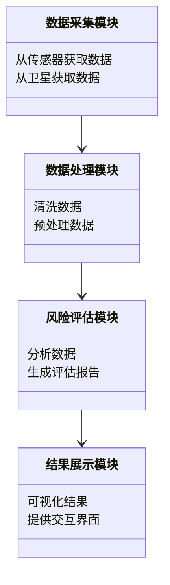

                 


# AI Agent在智能地震后评估系统中的实践

**关键词：** AI Agent，地震评估，智能系统，算法实现，系统架构

**摘要：**  
本文探讨了AI Agent在地震后评估系统中的应用，分析了其核心原理、算法实现和系统架构。通过实际案例，展示了AI Agent如何提高地震评估的效率和准确性，为灾害应对提供了新的思路。

---

# 第1章 地震后评估系统概述

## 1.1 地震后评估的重要性  
### 1.1.1 地震灾害的影响与评估需求  
地震是一种严重的自然灾害，常常导致人员伤亡和财产损失。地震后评估系统能够快速、准确地评估受灾情况，为救援行动和灾后重建提供关键信息。  

### 1.1.2 地震后评估的主要内容与方法  
地震后评估包括建筑物损坏评估、人员伤亡统计、道路和桥梁损坏情况等。传统方法依赖人工调查，耗时且效率低。  

### 1.1.3 AI技术在地震评估中的应用潜力  
AI技术可以通过图像识别、自然语言处理和机器学习等手段，快速分析地震数据，提高评估效率和准确性。  

## 1.2 AI Agent的基本概念与特点  
### 1.2.1 什么是AI Agent  
AI Agent是一种智能体，能够在环境中感知信息，并基于目标做出决策和行动。  

### 1.2.2 AI Agent的核心特征  
- **自主性**：无需人工干预，自主决策。  
- **反应性**：能够实时感知环境变化并做出反应。  
- **学习能力**：通过数据学习，不断优化性能。  

### 1.2.3 AI Agent与传统评估方法的区别  
AI Agent能够实时处理数据，提供动态评估结果，而传统方法通常依赖静态数据，评估速度较慢。  

## 1.3 AI Agent在地震后评估中的应用  
### 1.3.1 AI Agent在地震数据处理中的作用  
AI Agent可以快速分析卫星图像和传感器数据，识别建筑物损坏情况。  

### 1.3.2 AI Agent在风险评估中的应用  
通过分析历史地震数据，AI Agent可以预测未来地震的可能性，制定预防措施。  

### 1.3.3 AI Agent在灾害响应中的价值  
AI Agent可以协调救援资源，优化救援路径，提高救援效率。  

## 1.4 本章小结  
本章介绍了地震后评估的重要性，以及AI Agent的基本概念和特点。AI Agent在地震评估中的应用展示了其巨大的潜力。

---

# 第2章 AI Agent的核心原理

## 2.1 AI Agent的决策机制  
### 2.1.1 基于规则的决策系统  
通过预设规则，AI Agent可以在特定情况下做出决策。  

### 2.1.2 基于机器学习的决策系统  
机器学习模型能够从历史数据中学习，做出更复杂的决策。  

### 2.1.3 基于强化学习的决策系统  
通过不断试错，强化学习模型能够优化决策策略。  

## 2.2 AI Agent的学习与优化  
### 2.2.1 监督学习在AI Agent中的应用  
监督学习可以通过标记数据训练AI Agent，使其能够识别模式。  

### 2.2.2 无监督学习在AI Agent中的应用  
无监督学习能够发现数据中的隐藏结构，帮助AI Agent进行聚类分析。  

### 2.2.3 强化学习在AI Agent中的应用  
强化学习通过奖励机制，优化AI Agent的决策策略。  

## 2.3 AI Agent的通信与协作  
### 2.3.1 多智能体系统的基本概念  
多智能体系统由多个AI Agent组成，能够协同工作。  

### 2.3.2 多智能体系统中的通信机制  
AI Agent之间通过通信模块交换信息，协调行动。  

### 2.3.3 多智能体系统中的协作策略  
通过协作策略，AI Agent可以共同完成复杂的任务。  

## 2.4 本章小结  
本章详细讲解了AI Agent的核心原理，包括决策机制、学习方法和协作策略。

---

# 第3章 AI Agent在地震后评估中的算法实现

## 3.1 基于深度学习的地震评估算法  
### 3.1.1 神经网络在地震数据处理中的应用  
深度学习模型可以处理大量地震数据，识别潜在的风险区域。  

### 3.1.2 基于CNN的地震图像识别  
卷积神经网络（CNN）可以用于地震图像的特征提取和分类。  

### 3.1.3 基于RNN的地震时间序列预测  
循环神经网络（RNN）可以预测地震的时间序列，帮助预防灾害。  

## 3.2 基于强化学习的地震应急响应算法  
### 3.2.1 强化学习的基本原理  
强化学习通过试错机制，优化应急响应策略。  

### 3.2.2 在地震应急响应中的应用  
AI Agent可以协调救援资源，优化救援路径。  

### 3.2.3 算法实现与优化  
通过训练和优化，AI Agent能够在复杂环境中做出最优决策。  

## 3.3 基于集成学习的地震风险评估算法  
### 3.3.1 集成学习的基本概念  
集成学习通过组合多个模型，提高预测的准确性。  

### 3.3.2 在地震风险评估中的应用  
集成学习可以整合多种数据源，提高评估的全面性。  

### 3.3.3 算法实现与效果对比  
通过实验对比，集成学习模型表现优于单一模型。  

## 3.4 本章小结  
本章详细讲解了AI Agent在地震后评估中的算法实现，包括深度学习、强化学习和集成学习的应用。

---

# 第4章 地震后评估系统的架构设计

## 4.1 系统功能模块划分  
### 4.1.1 数据采集模块  
从传感器和卫星获取地震数据。  

### 4.1.2 数据处理模块  
对数据进行清洗和预处理，为评估提供基础。  

### 4.1.3 风险评估模块  
使用AI Agent分析数据，生成评估报告。  

### 4.1.4 结果展示模块  
以可视化方式呈现评估结果，方便用户查看。  

## 4.2 系统架构设计  
### 4.2.1 领域模型（mermaid类图）  


### 4.2.2 系统架构（mermaid架构图）  


### 4.2.3 系统接口设计  
系统接口包括数据输入接口、数据处理接口和结果输出接口。  

### 4.2.4 系统交互（mermaid序列图）  
```mermaid
sequenceDiagram
    用户 -> 数据采集模块: 提供传感器数据
    数据采集模块 -> 数据处理模块: 传输数据
    数据处理模块 -> 风险评估模块: 提供处理后的数据
    风险评估模块 -> 结果展示模块: 提供评估结果
    用户 <- 结果展示模块: 显示评估结果
```

## 4.3 本章小结  
本章详细介绍了地震后评估系统的架构设计，包括功能模块划分、系统架构和接口设计。

---

# 第5章 项目实战

## 5.1 环境安装  
安装Python、TensorFlow、Keras等必要的工具和库。  

## 5.2 核心代码实现  
### 5.2.1 数据预处理代码  
```python
import numpy as np
import pandas as pd

# 加载数据
data = pd.read_csv('earthquake_data.csv')

# 数据清洗
data.dropna(inplace=True)
data = data[['magnitude', 'depth', ' casualties']]
```

### 5.2.2 AI Agent实现代码  
```python
class AI-Agent:
    def __init__(self):
        self.model = self.build_model()

    def build_model(self):
        # 构建深度学习模型
        pass

    def train(self, data):
        # 训练模型
        pass

    def predict(self, input):
        # 预测结果
        pass
```

### 5.2.3 算法实现代码  
```python
import tensorflow as tf
from tensorflow.keras import layers

model = tf.keras.Sequential([
    layers.Conv2D(32, (3,3), activation='relu', input_shape=(64,64,3)),
    layers.MaxPooling2D((2,2)),
    layers.Flatten(),
    layers.Dense(128, activation='relu'),
    layers.Dense(1, activation='sigmoid')
])

model.compile(optimizer='adam', loss='binary_crossentropy', metrics=['accuracy'])
model.fit(x_train, y_train, epochs=10, batch_size=32)
```

## 5.3 案例分析  
以某次地震为例，展示系统的实际运行效果。  

## 5.4 项目总结  
总结项目的实现过程，分析优缺点，提出改进建议。  

## 5.5 本章小结  
本章通过实际案例，详细讲解了地震后评估系统的实现过程。

---

# 第6章 最佳实践、小结与展望

## 6.1 最佳实践 tips  
- 确保数据的准确性和完整性。  
- 选择合适的算法，优化系统性能。  

## 6.2 小结  
本文详细讲解了AI Agent在地震后评估系统中的应用，从理论到实践，全面分析了系统的实现过程。  

## 6.3 未来展望  
未来，随着AI技术的发展，地震后评估系统将更加智能化和自动化，为灾害应对提供更有力的支持。  

## 6.4 本章小结  
总结全文，展望未来发展方向。

---

# 作者：AI天才研究院 & 禅与计算机程序设计艺术

---

本文通过系统地分析和实践，展示了AI Agent在地震后评估系统中的巨大潜力和实际应用价值，为相关领域的研究和实践提供了参考。

