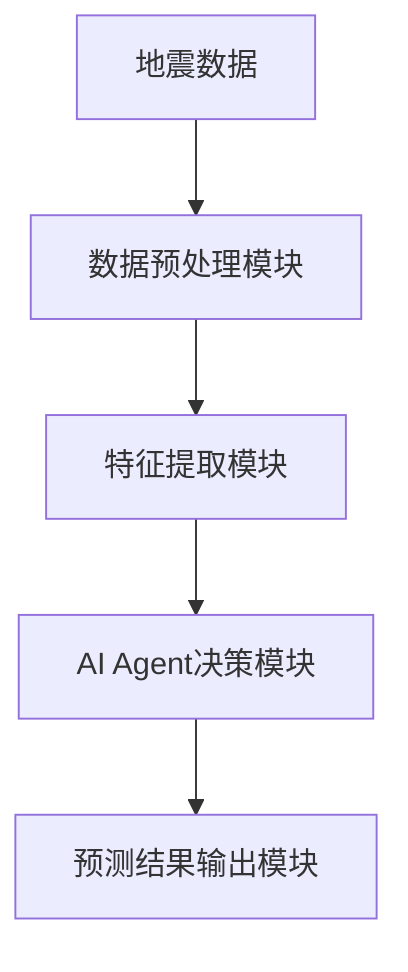

                 


# AI Agent在智能地震预测系统中的实践

## 关键词：AI Agent, 地震预测, 机器学习, 时间序列分析, 系统架构

## 摘要：  
本文深入探讨了AI Agent在智能地震预测系统中的实践应用。从地震预测的重要性与挑战出发，结合AI Agent的核心概念与原理，详细分析了AI Agent在地震预测系统中的算法原理、系统架构设计以及实际项目案例。文章通过理论与实践相结合的方式，为读者提供了清晰的思路和方法，帮助读者理解如何利用AI Agent技术提升地震预测的准确性与实时性。

---

# 第1章: 地震预测与AI Agent的背景介绍

## 1.1 地震预测的重要性与挑战

### 1.1.1 地震预测的基本概念  
地震预测是指通过科学手段，预测地震发生的时间、地点和震级。它是自然灾害预防的重要组成部分，能够有效减少地震带来的人员伤亡和财产损失。然而，地震预测的难度极大，主要表现在以下几个方面：  
1. 地震的发生受到多种复杂因素的影响，如地壳运动、岩石应力变化等。  
2. 地震数据的采集和处理需要极高的精度和实时性。  
3. 地震预测模型的复杂性和不确定性使得传统方法难以取得突破。  

### 1.1.2 地震预测的难点与局限性  
传统地震预测方法主要依赖统计分析和物理模型，但存在以下局限性：  
1. **数据不足**：地震数据的稀疏性和不完整性使得传统方法难以建立准确的预测模型。  
2. **模型复杂性**：地震预测涉及多个物理过程，传统模型难以全面捕捉这些复杂关系。  
3. **实时性差**：传统方法计算复杂，难以实现实时预测。  

### 1.1.3 AI技术在地震预测中的潜力  
AI技术的快速发展为地震预测带来了新的可能性。AI Agent（智能代理）作为一种能够自主感知、决策和执行的智能体，具有以下优势：  
1. **数据处理能力强**：AI Agent能够快速处理海量地震数据，提取关键特征。  
2. **自适应性**：AI Agent可以根据实时数据动态调整预测模型。  
3. **实时性**：AI Agent能够实现快速预测和实时反馈，为地震预警提供支持。  

---

## 1.2 AI Agent的基本概念与特点

### 1.2.1 AI Agent的定义  
AI Agent是一种智能代理，能够感知环境、自主决策并执行任务。它通常由感知模块、决策模块和执行模块组成。AI Agent的核心特点包括：  
1. **自主性**：能够在无外部干预的情况下独立运行。  
2. **反应性**：能够实时感知环境变化并做出反应。  
3. **目标导向**：具有明确的目标，并根据目标优化决策。  

### 1.2.2 AI Agent与传统算法的区别  
AI Agent与传统算法的主要区别在于其自主性和适应性。传统算法通常需要人工干预和参数调整，而AI Agent能够根据环境反馈自动优化自身行为。  

### 1.2.3 AI Agent在地震预测中的优势  
在地震预测中，AI Agent的优势体现在以下几个方面：  
1. **实时性**：能够快速处理实时地震数据，实现快速预测。  
2. **自适应性**：可以根据历史数据动态调整预测模型。  
3. **高效性**：通过并行计算和分布式处理，提高预测效率。  

---

## 1.3 AI Agent在地震预测中的应用前景

### 1.3.1 地震预测的潜在应用领域  
AI Agent可以应用于地震监测、地震预警、地震风险评估等多个领域。通过实时监测地震前兆，AI Agent能够帮助科学家更好地理解地震规律，提高预测准确性。  

### 1.3.2 AI Agent在地震预测中的优势  
AI Agent的优势在于其强大的数据处理能力和自主决策能力。通过整合多源数据，AI Agent可以发现传统方法难以察觉的地震前兆。  

### 1.3.3 AI Agent应用的挑战与机遇  
尽管AI Agent在地震预测中具有巨大潜力，但其应用也面临诸多挑战：  
1. **数据质量问题**：地震数据的稀疏性和不完整性对模型的准确性提出更高要求。  
2. **模型解释性**：复杂的AI模型往往缺乏可解释性，影响其在地震预测中的实际应用。  
3. **计算资源需求**：AI Agent的运行需要强大的计算资源支持。  

---

## 1.4 本章小结  
本章从地震预测的重要性与挑战出发，介绍了AI Agent的基本概念与特点，并探讨了AI Agent在地震预测中的应用前景。通过对比传统算法与AI Agent的优势，为后续章节的深入分析奠定了基础。

---

# 第2章: AI Agent与地震预测系统的核心概念

## 2.1 AI Agent的原理与地震预测系统的关联  

### 2.1.1 AI Agent的原理  
AI Agent的核心原理包括感知、决策和执行三个步骤：  
1. **感知**：通过传感器或数据源获取环境信息。  
2. **决策**：基于感知信息，利用算法生成决策。  
3. **执行**：根据决策输出结果或触发相应动作。  

### 2.1.2 地震预测系统的原理  
地震预测系统通常包括数据采集、数据处理、模型预测和结果输出四个步骤。AI Agent可以通过整合这些步骤，实现系统的智能化。  

### 2.1.3 两者的关联与区别  
AI Agent与地震预测系统的关联在于，AI Agent可以作为地震预测系统的核心模块，实现数据处理、模型预测和结果输出的自动化。两者的区别在于，AI Agent具有更强的自主性和适应性。  

---

## 2.2 AI Agent与地震预测系统的核心要素对比  

### 2.2.1 核心要素对比表格  
| 核心要素 | AI Agent | 地震预测系统 |  
|----------|-----------|--------------|  
| 数据源   | 多源数据   | 地震数据      |  
| 处理方式 | 自主决策   | 程序化处理    |  
| 输出结果 | 实时反馈   | 预测结果      |  

### 2.2.2 ER实体关系图架构  


---

## 2.3 算法原理讲解  

### 2.3.1 时间序列分析算法  
时间序列分析是一种常用的数据处理方法，适用于地震数据的分析。其基本步骤如下：  
1. **数据预处理**：去除噪声，提取有用特征。  
2. **模型训练**：利用历史数据训练模型。  
3. **预测输出**：基于训练好的模型，预测未来地震趋势。  

#### 示例代码  
```python
import numpy as np
from sklearn.model_selection import train_test_split
from sklearn.metrics import mean_squared_error

# 示例数据
data = np.random.rand(100, 1)
X_train, X_test = train_test_split(data, test_size=0.2)
```

---

## 2.4 本章小结  
本章详细讲解了AI Agent的核心原理及其与地震预测系统的关联，通过对比分析和算法示例，帮助读者更好地理解AI Agent在地震预测中的应用。

---

接下来，我会按照目录继续撰写后续章节的内容，涵盖算法原理、系统架构设计、项目实战等部分。通过逐步分析，确保文章逻辑清晰、内容详实，为读者提供有价值的参考。

