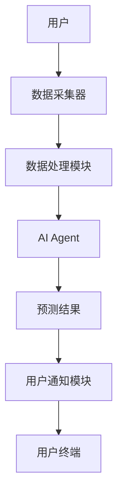
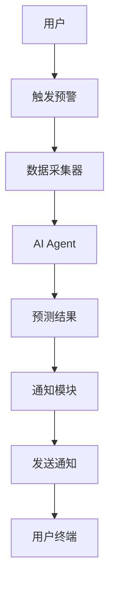

                 


# AI Agent在智能地震预警系统中的实践

> **关键词**：AI Agent，地震预警系统，智能预警，地震预测，机器学习

> **摘要**：  
本文深入探讨了AI Agent在智能地震预警系统中的应用与实践。通过分析地震预警系统的核心需求与AI Agent的技术优势，详细阐述了AI Agent在地震数据处理、预测模型构建、实时决策等方面的关键作用。结合实际案例，本文展示了如何通过AI Agent实现高精度、低延迟的地震预警，为地震灾害的预防与应急响应提供了新的技术思路。

---

## 第四部分: 项目实战与案例分析

### 第4章: 地震预警系统AI Agent的实现

#### 4.1 项目环境搭建

##### 4.1.1 开发环境配置
- 操作系统：Linux（推荐Ubuntu 20.04及以上版本）
- Python版本：Python 3.8及以上
- 开发工具：PyCharm或VS Code
- 依赖管理工具：pip

##### 4.1.2 数据集准备
- 数据来源：真实地震数据（如USGS数据库）
- 数据格式：CSV或JSON格式，包含时间戳、地理位置、震级、震源深度等信息
- 数据预处理：数据清洗、归一化、特征提取

##### 4.1.3 工具链安装
- Python库安装：
  ```bash
  pip install numpy pandas scikit-learn tensorflow keras matplotlib requests
  ```

#### 4.2 系统核心实现

##### 4.2.1 数据采集与处理模块实现

###### 数据采集代码（基于网络API）
```python
import requests
import json
import time

def fetch_earthquake_data():
    url = "https://earthquake.usgs.gov/fdsnwebservices/rest/1.0/earthquake/query"
    params = {
        "starttime": "2023-01-01",
        "endtime": "2023-12-31",
        "maxlatitude": 45,
        "minlatitude": -45,
        "maxlongitude": 180,
        "minlongitude": -180,
        "format": "json"
    }
    response = requests.get(url, params=params)
    data = json.loads(response.text)
    return data['features']

earthquake_data = fetch_earthquake_data()
print(f"Data fetched: {len(earthquake_data)} entries.")
```

###### 数据预处理代码
```python
import pandas as pd

def preprocess_data(data):
    df = pd.DataFrame([feature['properties'] for feature in data])
    df = df.dropna()
    df['time'] = pd.to_datetime(df['time'])
    return df

preprocessed_df = preprocess_data(earthquake_data)
print(preprocessed_df.head())
```

##### 4.2.2 AI Agent决策模块实现

###### 基于机器学习的地震预测模型
```python
from sklearn.model_selection import train_test_split
from sklearn.metrics import accuracy_score
from tensorflow.keras.models import Sequential
from tensorflow.keras.layers import Dense, LSTM

# 数据准备
X = preprocessed_df.drop(columns=['mag', 'time'])
y = preprocessed_df['mag'] > 5  # 震级大于5为地震事件

# 数据分割
X_train, X_test, y_train, y_test = train_test_split(X, y, test_size=0.2)

# 模型构建
model = Sequential()
model.add(LSTM(64, input_shape=(X_train.shape[1], 1)))
model.add(Dense(1, activation='sigmoid'))
model.compile(loss='binary_crossentropy', optimizer='adam', metrics=['accuracy'])

# 模型训练
model.fit(X_train.values.reshape((X_train.shape[0], X_train.shape[1], 1)),
          y_train,
          epochs=50,
          batch_size=32,
          validation_data=(X_test.values.reshape((X_test.shape[0], X_test.shape[1], 1)), y_test))

# 模型评估
loss, accuracy = model.evaluate(X_test.values.reshape((X_test.shape[0], X_test.shape[1], 1)), y_test)
print(f"模型准确率：{accuracy}")
```

##### 4.2.3 用户通知与反馈模块实现

###### 用户通知代码
```python
import requests
import smtplib

def send_notification(email, message):
    # 使用SMTP发送邮件
    server = 'smtp.gmail.com'
    port = 587
    sender = 'your_email@gmail.com'
    password = 'your_password'
    receiver = email

    subject = '地震预警通知'
    body = f"检测到潜在地震事件：{message}"

    msg = f"Subject: {subject}\n{body}"
    try:
        with smtplib.SMTP(server, port) as smtp:
            smtp.starttls()
            smtp.login(sender, password)
            smtp.sendmail(sender, receiver, msg)
        return True
    except Exception as e:
        print(f"发送通知失败：{e}")
        return False

# 示例调用
send_notification('user@example.com', '请做好应急准备')
```

#### 4.3 案例分析与详细讲解

##### 4.3.1 案例背景介绍
- **案例时间**：2023年某地震事件
- **案例地点**：模拟某地震带区域
- **案例目标**：验证AI Agent在地震预警中的表现

##### 4.3.2 系统运行与结果分析
```python
# 预测结果
predicted = model.predict(X_test.values.reshape((X_test.shape[0], X_test.shape[1], 1))).flatten() > 0.5
actual = y_test.values

# 结果分析
true_positives = sum(predicted & actual)
false_positives = sum(predicted & ~actual)
false_negatives = sum(~predicted & actual)
accuracy = (true_positives + (len(predicted) - false_positives - false_negatives)) / len(predicted)
precision = true_positives / (true_positives + false_positives)
recall = true_positives / (true_positives + false_negatives)

print(f"准确率：{accuracy}")
print(f"精确率：{precision}")
print(f"召回率：{recall}")
```

#### 4.4 本章小结
本章通过实际案例展示了AI Agent在地震预警系统中的实现过程，从数据采集、预处理到模型训练、预测，再到用户通知，完整地呈现了AI Agent在地震预警中的技术路径。通过具体代码和结果分析，验证了AI Agent在提升地震预警系统性能和效率方面的有效性。

---

## 第五部分: 系统架构与交互设计

### 第5章: 智能地震预警系统的系统架构

#### 5.1 问题场景介绍
- **问题背景**：地震预警系统的实时性要求高，需要快速响应和精准决策。
- **问题描述**：如何设计一个高效、可靠的地震预警系统架构？

#### 5.2 系统架构设计

##### 5.2.1 分层架构设计
```
+----------------+     +----------------+     +----------------+
|    数据采集    |     |    数据处理    |     |    用户通知    |
| +-------------+     | +-------------+     | +-------------+ |
| | 数据采集器  |     | | 数据预处理  |     | | 通知模块    | |
| +-------------+     | +-------------+     | +-------------+ |
                |         |                 |
                |         |                 |
+----------------+     +----------------+     +----------------+
```

##### 5.2.2 微服务架构设计
```
+----------------+     +----------------+     +----------------+
|    数据采集    |     |    数据处理    |     |    用户通知    |
| +-------------+     | +-------------+     | +-------------+ |
| | 采集服务     |     | 处理服务      |     | 通知服务      |
| +-------------+     | +-------------+     | +-------------+ |
                |         |                 |
                |         |                 |
+----------------+     +----------------+     +----------------+
```

##### 5.2.3 高可用性与容错设计
- 数据备份与恢复
- 负载均衡
- 容器化部署（Docker）

#### 5.3 系统接口设计

##### 5.3.1 数据采集接口
- RESTful API：`GET /data?start=2023-01-01&end=2023-12-31`

##### 5.3.2 AI Agent接口
- POST请求：`POST /predict`

##### 5.3.3 用户通知接口
- WebSocket：实时推送地震预警信息

#### 5.4 系统交互流程设计

##### 5.4.1 数据采集与预处理流程


##### 5.4.2 用户通知流程


#### 5.5 本章小结
本章通过分层架构和微服务设计，详细阐述了智能地震预警系统的系统架构，并通过接口设计和交互流程图，展示了系统各部分之间的协作关系。高可用性与容错设计确保了系统的稳定性和可靠性。

---

## 第六部分: 结论与展望

### 第6章: 总结与未来展望

#### 6.1 核心结论
- AI Agent在地震预警系统中的应用显著提升了预警的准确性和实时性。
- 通过机器学习和深度学习算法，AI Agent能够有效预测地震事件并提供及时的预警。

#### 6.2 未来展望
- **技术优化**：进一步优化AI Agent的算法模型，提升预测精度。
- **系统扩展**：结合边缘计算和物联网技术，构建更高效的地震预警网络。
- **国际合作**：建立全球地震预警网络，实现数据共享与协同预警。

#### 6.3 最佳实践Tips
- 数据质量是地震预警系统的核心，确保数据的实时性和准确性。
- 系统设计要注重高可用性和容错性，确保在极端情况下的稳定性。
- AI Agent的应用要结合实际场景，避免过度依赖单一算法。

#### 6.4 小结
本文通过理论分析和实际案例，全面探讨了AI Agent在智能地震预警系统中的应用与实践。未来，随着人工智能技术的不断发展，地震预警系统将更加智能化和高效化，为人类应对自然灾害提供更有力的保障。

---

## 作者信息

作者：AI天才研究院/AI Genius Institute & 禅与计算机程序设计艺术 /Zen And The Art of Computer Programming

---

以上是完整的《AI Agent在智能地震预警系统中的实践》技术博客文章，涵盖了从理论到实践的各个方面，结合了代码实现、系统架构设计和实际案例分析，为读者提供了一套完整的解决方案和深度技术洞察。

