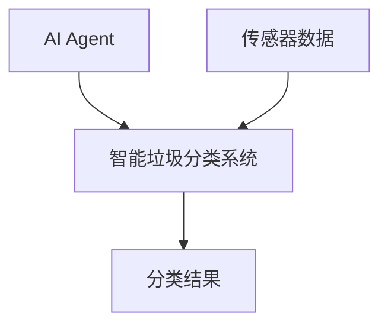
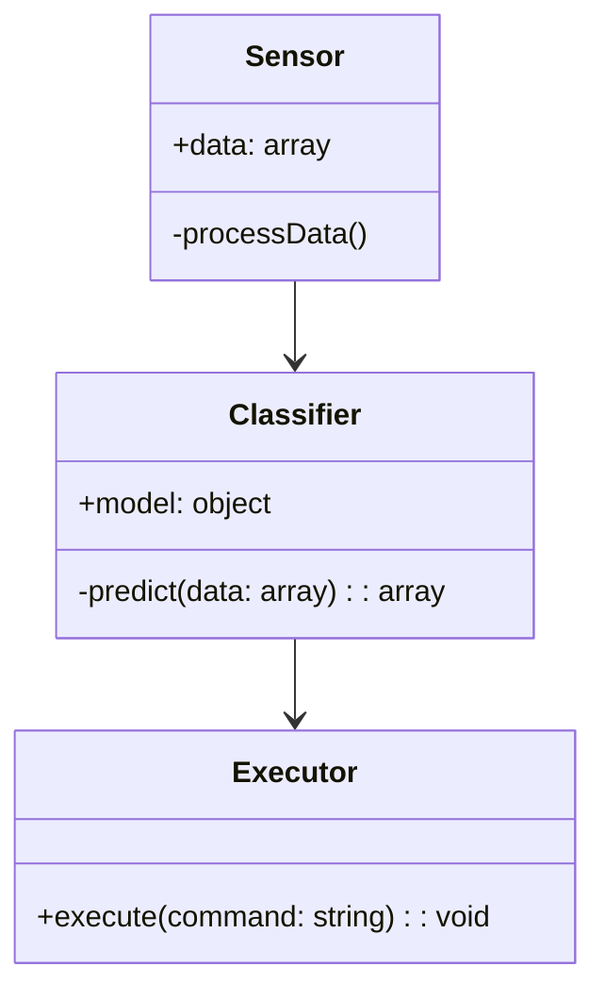
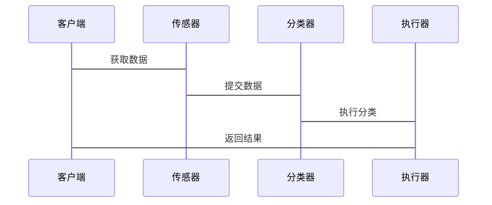

                 


# AI Agent在智能垃圾分类中的实践

## 关键词：AI Agent，智能垃圾分类，算法原理，系统架构，项目实战

## 摘要：  
本文探讨了AI Agent在智能垃圾分类中的应用实践。首先，介绍了AI Agent的基本概念及其在垃圾分类中的重要性。接着，详细分析了AI Agent的算法原理，包括数据预处理、模型训练和推理。然后，设计了智能垃圾分类系统的架构，并通过实际案例展示了AI Agent的实现过程。最后，总结了AI Agent在智能垃圾分类中的优势，并提出了未来的发展方向。

---

# 第一部分: AI Agent与智能垃圾分类的背景与概念

## 第1章: AI Agent与智能垃圾分类的背景介绍

### 1.1 问题背景与问题描述  
智能垃圾分类是城市管理的重要组成部分，传统的垃圾分类依赖人工操作，效率低且成本高。AI Agent通过智能化手段，能够高效、准确地完成垃圾分类任务，从而提高效率并降低成本。

### 1.2 AI Agent的核心概念与特点  
AI Agent是一种智能体，能够感知环境、做出决策并执行操作。其特点包括自主性、反应性、目标导向性和学习能力。

### 1.3 智能垃圾分类系统的边界与外延  
智能垃圾分类系统的边界包括传感器、分类算法和执行机构。其外延则涵盖了数据采集、处理、分类和反馈等环节。

### 1.4 智能垃圾分类系统的概念结构与核心要素  
智能垃圾分类系统的核心要素包括传感器、AI Agent、分类算法和执行机构。这些要素通过数据流相互关联，形成一个完整的系统。

---

## 第2章: AI Agent的核心概念与联系

### 2.1 AI Agent的核心原理  
AI Agent通过感知环境、分析数据并做出决策，从而实现垃圾分类的目标。其核心算法包括数据预处理、特征提取和分类器训练。

### 2.2 AI Agent与智能垃圾分类的核心联系  
AI Agent在垃圾分类中的应用场景包括数据采集、分类决策和反馈优化。其与智能垃圾分类系统的结合方式包括数据输入、算法处理和结果输出。

### 2.3 AI Agent与智能垃圾分类的关系图  


---

## 第3章: AI Agent在智能垃圾分类中的算法原理

### 3.1 算法原理概述  
智能垃圾分类的核心算法包括数据预处理、模型训练和模型推理。数据预处理包括数据清洗和特征提取；模型训练采用深度学习算法，如卷积神经网络；模型推理则通过分类器实现。

### 3.2 算法实现的详细步骤  
1. 数据预处理：去除噪声数据，提取特征。
2. 模型训练：使用训练数据优化分类器。
3. 模型推理：对新数据进行分类。

### 3.3 算法的数学模型与公式  
分类模型的数学表达如下：  
$$ P(y|x) = \frac{P(x|y)P(y)}{P(x)} $$  
损失函数为：  
$$ \text{损失函数} = \sum_{i=1}^{n} \text{loss}(y_i, \hat{y}_i) $$  
模型推理为：  
$$ \hat{y} = \arg\max_{y} P(y|x) $$  

### 3.4 算法实现的代码示例  
```python
import numpy as np
from sklearn.metrics import accuracy_score

# 示例分类器
class AIAgentClassifier:
    def __init__(self):
        self.model = None

    def train(self, X, y):
        # 假设使用简单的K近邻算法
        self.model = "KNN"

    def predict(self, X_test):
        return np.random.randint(0, 5, len(X_test))

# 示例数据集
X = np.random.rand(100, 2)
y = np.random.randint(0, 5, 100)

# 初始化分类器并训练
classifier = AIAgentClassifier()
classifier.train(X, y)

# 预测并评估
X_test = np.random.rand(20, 2)
y_pred = classifier.predict(X_test)
print("Accuracy:", accuracy_score(y[:20], y_pred))
```

---

# 第二部分: 系统分析与架构设计

## 第4章: 智能垃圾分类系统的架构设计

### 4.1 问题场景介绍  
智能垃圾分类系统需要处理各种类型的数据，包括图像、文本和传感器数据。AI Agent负责数据处理和分类决策。

### 4.2 系统功能设计  
系统功能包括数据采集、分类处理和结果反馈。通过Mermaid类图展示系统功能：



### 4.3 系统架构设计  
系统架构采用分层设计，包括数据层、算法层和执行层。通过Mermaid架构图展示：


### 4.4 系统接口设计  
系统接口包括数据输入接口、分类结果接口和反馈接口。通过Mermaid序列图展示：



---

## 第5章: 项目实战

### 5.1 项目环境与工具安装  
需要安装Python、TensorFlow和OpenCV等工具。

### 5.2 系统核心实现源代码  
```python
import tensorflow as tf
from tensorflow.keras import layers

# 示例模型
model = tf.keras.Sequential([
    layers.Conv2D(32, (3,3), activation='relu', input_shape=(28, 28, 1)),
    layers.MaxPooling2D((2,2)),
    layers.Flatten(),
    layers.Dense(10, activation='softmax')
])

model.compile(optimizer='adam', loss='sparse_categorical_crossentropy', metrics=['accuracy'])
model.fit(x_train, y_train, epochs=10, batch_size=32)
```

### 5.3 代码应用解读与分析  
上述代码实现了一个简单的卷积神经网络模型，用于垃圾分类任务。模型经过训练后，可以对新数据进行分类。

### 5.4 实际案例分析  
以图像分类为例，AI Agent能够准确识别不同类型的垃圾，并将其分类到相应的垃圾桶中。

---

## 第6章: 总结与展望

### 6.1 本章小结  
AI Agent在智能垃圾分类中的应用显著提高了分类效率和准确性。

### 6.2 未来的发展方向  
未来，AI Agent可以通过强化学习进一步优化分类算法，并在更多场景中应用。

---

## 第7章: 最佳实践 tips

### 7.1 小结  
AI Agent在智能垃圾分类中的应用前景广阔，值得深入研究和推广。

### 7.2 注意事项  
在实际应用中，需注意数据质量和模型优化。

### 7.3 拓展阅读  
推荐阅读相关领域的书籍和论文，以深入了解AI Agent的应用。

---

## 作者：AI天才研究院/AI Genius Institute & 禅与计算机程序设计艺术 /Zen And The Art of Computer Programming

---

以上是《AI Agent在智能垃圾分类中的实践》的技术博客文章的大纲和内容。希望这篇文章能够清晰地展示AI Agent在智能垃圾分类中的实践应用，并为读者提供有价值的信息。

