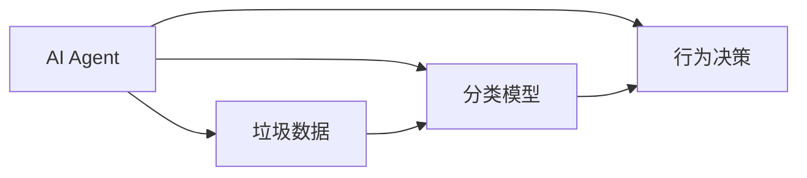
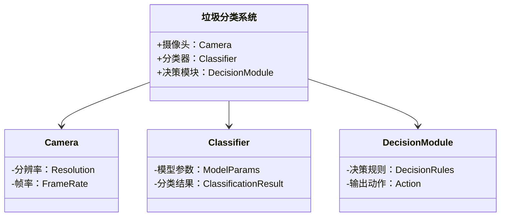
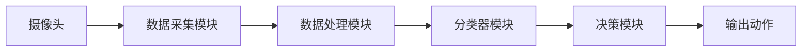
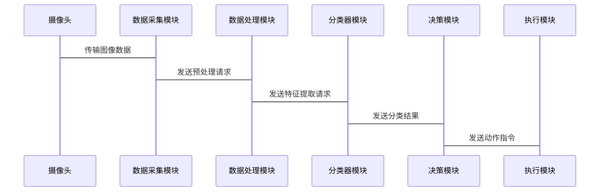

                 


# AI Agent在智能垃圾分类识别中的实践

> 关键词：AI Agent, 智能垃圾分类, 图像识别, 机器学习, 智能系统

> 摘要：  
本文探讨了AI Agent在智能垃圾分类识别中的应用，从AI Agent的基本概念、核心原理到具体实现方案，详细分析了其在垃圾分类中的实践价值。通过结合图像识别、深度学习等技术，构建了一个基于AI Agent的智能垃圾分类系统，并通过实际案例展示了系统的实现过程和效果。本文还总结了AI Agent在垃圾分类中的优势，并提出了进一步优化的方向。

---

# 第1章: AI Agent与智能垃圾分类识别概述

## 1.1 AI Agent的基本概念

### 1.1.1 AI Agent的定义  
AI Agent（人工智能代理）是指能够感知环境、自主决策并执行任务的智能实体。它具备学习、推理、规划和自适应能力，能够在复杂环境中完成特定目标。

### 1.1.2 AI Agent的核心特征  
- **自主性**：能够自主决策，无需外部干预。  
- **反应性**：能够实时感知环境并做出反应。  
- **学习能力**：通过数据和经验不断优化性能。  
- **协作性**：能够与其他系统或人类协同工作。  

### 1.1.3 AI Agent与传统自动化的区别  
AI Agent的核心区别在于其具备智能性和适应性，能够处理复杂、动态的环境，而传统自动化系统通常基于固定的规则。

## 1.2 智能垃圾分类识别的背景与问题

### 1.2.1 垃圾分类的重要性  
垃圾分类是资源回收、环境保护的重要手段，能够减少环境污染、提高资源利用率。然而，传统的人工分类效率低、成本高。

### 1.2.2 当前垃圾分类的痛点与挑战  
- **效率低**：人工分类效率低下，容易出错。  
- **成本高**：需要大量人力投入。  
- **准确性差**：分类标准复杂，人工难以准确执行。  

### 1.2.3 AI Agent在垃圾分类中的应用价值  
AI Agent能够通过图像识别、深度学习等技术实现自动化的垃圾分类，显著提高了效率和准确性，降低了成本。

## 1.3 本章小结  
本章介绍了AI Agent的基本概念和核心特征，并分析了智能垃圾分类识别的背景和挑战，最后探讨了AI Agent在垃圾分类中的应用价值。

---

# 第2章: AI Agent在垃圾分类中的核心概念

## 2.1 AI Agent的核心原理

### 2.1.1 知识表示与推理  
AI Agent通过知识表示（如语义网络）和推理规则来理解和处理问题。例如，通过图像识别技术，AI Agent能够识别垃圾类型并根据分类规则进行推理。

### 2.1.2 行为决策机制  
AI Agent通过感知环境信息（如图像数据）和内部知识库，结合决策算法（如随机森林、支持向量机）做出分类决策。

### 2.1.3 与环境的交互方式  
AI Agent通过摄像头、传感器等设备与环境交互，获取数据并执行分类任务。

## 2.2 垃圾分类识别的关键技术

### 2.2.1 图像识别技术  
图像识别是垃圾分类的核心技术之一，通过深度学习模型（如CNN）实现垃圾图像的分类。

### 2.2.2 自然语言处理  
在复杂场景中，AI Agent可能需要理解文本信息（如垃圾分类规则），自然语言处理技术可以帮助其完成任务。

### 2.2.3 数据驱动的分类模型  
基于大量标注数据，训练深度学习模型实现高精度的垃圾分类。

## 2.3 AI Agent与垃圾分类系统的实体关系图



## 2.4 本章小结  
本章详细讲解了AI Agent的核心原理和垃圾分类识别的关键技术，通过实体关系图展示了AI Agent与垃圾分类系统的交互关系。

---

# 第3章: 垃圾分类识别的算法原理

## 3.1 垃圾分类的常用算法

### 3.1.1 支持向量机（SVM）
SVM是一种监督学习算法，适用于小规模数据集的分类任务。

### 3.1.2 卷积神经网络（CNN）
CNN通过多层卷积操作提取图像特征，适用于大规模图像分类任务。

### 3.1.3 随机森林（Random Forest）
随机森林是一种基于树的集成学习算法，适用于高维数据的分类任务。

## 3.2 基于CNN的垃圾分类算法流程


## 3.3 算法实现的数学模型

### 3.3.1 CNN的数学模型  
$$ y = f(Wx + b) $$  
其中，$W$ 是权重矩阵，$x$ 是输入数据，$b$ 是偏置。

### 3.3.2 分类器的损失函数  
$$ L = -\frac{1}{n}\sum_{i=1}^{n} y_i \log(p_i) + (1 - y_i)\log(1 - p_i) $$

## 3.4 本章小结  
本章详细介绍了垃圾分类的常用算法及其数学模型，并通过流程图展示了基于CNN的垃圾分类算法流程。

---

# 第4章: 垃圾分类识别系统的架构设计

## 4.1 系统功能模块划分

### 4.1.1 数据采集模块  
通过摄像头采集垃圾图像数据。

### 4.1.2 数据处理模块  
对图像数据进行预处理，提取特征。

### 4.1.3 分类器模块  
基于训练好的深度学习模型进行垃圾分类。

### 4.1.4 决策模块  
根据分类结果做出行为决策。

## 4.2 系统功能设计

### 4.2.1 领域模型设计  


### 4.2.2 系统架构设计  


### 4.2.3 接口设计  
- **摄像头接口**：与摄像头设备交互，获取图像数据。  
- **分类器接口**：与分类器模块交互，获取分类结果。  
- **决策模块接口**：与外部系统或设备交互，执行分类结果对应的动作。

### 4.2.4 交互流程设计  


## 4.3 本章小结  
本章详细设计了垃圾分类识别系统的架构，包括功能模块划分、领域模型设计、系统架构图和交互流程图。

---

# 第5章: 垃圾分类识别系统的项目实战

## 5.1 环境搭建

### 5.1.1 硬件环境  
- 摄像头：用于采集垃圾图像。  
- 计算机：用于运行分类系统。  
- 显示屏：用于显示分类结果。  

### 5.1.2 软件环境  
- 操作系统：Windows 10或更高版本。  
- 开发工具：Python 3.8及以上，PyTorch 1.7及以上。  
- 数据集：公开的垃圾图像数据集（如公开数据集）。  

## 5.2 系统核心实现

### 5.2.1 数据采集与预处理  
```python
import cv2
def capture_image():
    camera = cv2.VideoCapture(0)
    ret, frame = camera.read()
    if ret:
        cv2.imwrite("input.jpg", frame)
    camera.release()
```

### 5.2.2 特征提取与分类  
```python
import torch
class GarbageClassifier(torch.nn.Module):
    def __init__(self):
        super(GarbageClassifier, self).__init__()
        self.conv1 = torch.nn.Conv2d(3, 6, kernel_size=3, stride=1, padding=1)
        self.pool = torch.nn.MaxPool2d(kernel_size=2, stride=2)
        self.conv2 = torch.nn.Conv2d(6, 16, kernel_size=3, stride=1, padding=1)
        self.fc = torch.nn.Linear(16 * 5 * 5, 120)
        self.output = torch.nn.Linear(120, 5)
        
    def forward(self, x):
        x = self.pool(torch.relu(self.conv1(x)))
        x = self.pool(torch.relu(self.conv2(x)))
        x = x.view(-1, 16 * 5 * 5)
        x = torch.relu(self.fc(x))
        x = self.output(x)
        return x
```

### 5.2.3 系统交互设计  
```python
def main():
    import cv2
    import torch
    model = GarbageClassifier()
    model.load_state_dict(torch.load("model.pth"))
    camera = cv2.VideoCapture(0)
    while True:
        ret, frame = camera.read()
        cv2.imshow("Camera", frame)
        if cv2.waitKey(1) & 0xFF == ord('q'):
            break
    camera.release()
    cv2.destroyAllWindows()
```

## 5.3 实际案例分析

### 5.3.1 数据集选择与标注  
选择公开的垃圾图像数据集，标注每张图像的类别（如可回收物、厨余垃圾等）。

### 5.3.2 模型训练与优化  
通过数据增强、学习率调整等方法优化模型性能，最终实现高精度的垃圾分类。

### 5.3.3 系统测试与验证  
在实际场景中测试系统的分类准确率和运行效率，验证系统的可行性和稳定性。

## 5.4 本章小结  
本章通过实际案例展示了垃圾分类识别系统的实现过程，包括环境搭建、核心代码实现和系统测试。

---

# 第6章: 总结与展望

## 6.1 本章总结  
本文详细探讨了AI Agent在智能垃圾分类识别中的应用，从算法原理到系统架构，再到实际实现，全面分析了其技术价值和应用前景。

## 6.2 未来展望  
随着AI技术的不断发展，AI Agent在垃圾分类中的应用将更加智能化和高效化，未来的优化方向包括：  
- 提高模型的泛化能力。  
- 优化系统的实时性和稳定性。  
- 探索更高效的算法和架构设计。  

## 6.3 注意事项  
- 数据质量对分类性能影响较大，需要确保数据的多样性和代表性。  
- 系统部署时需考虑硬件性能和环境适应性。  
- 需要定期更新模型以应对新的垃圾类型和分类标准。  

## 6.4 拓展阅读  
- 《Deep Learning》——Ian Goodfellow  
- 《机器学习实战》——周志华  
- 《Python机器学习》——Andreas Müller

---

# 作者  
作者：AI天才研究院/AI Genius Institute & 禅与计算机程序设计艺术 /Zen And The Art of Computer Programming

