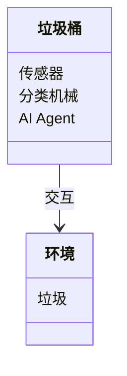
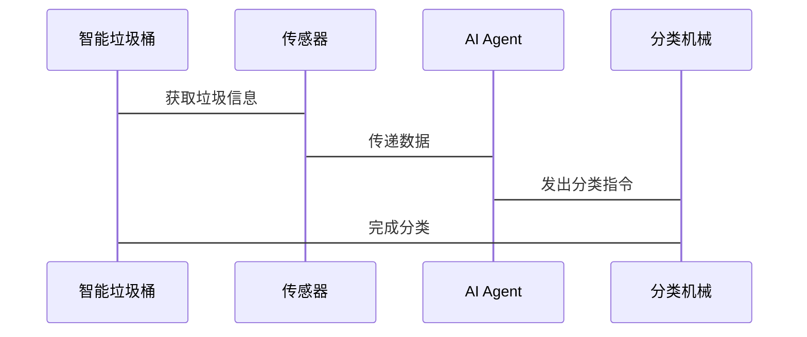

                 


# AI Agent在智能垃圾桶中的回收价值评估

> 关键词：AI Agent，智能垃圾桶，回收价值评估，强化学习，垃圾分类

> 摘要：本文探讨AI Agent在智能垃圾桶中的应用，重点分析其在垃圾分类和回收价值评估中的作用。通过详细的技术分析，包括算法原理、系统架构设计和项目实战，展示了如何利用AI技术优化垃圾回收流程，提升资源利用率。

---

# 第一部分: AI Agent在智能垃圾桶中的回收价值评估概述

## 第1章: 问题背景与核心概念

### 1.1 问题背景介绍

#### 1.1.1 垃圾分类与资源回收的重要性
随着城市化进程的加快，垃圾处理问题日益突出。传统的人工分类效率低下，且容易出错，而AI Agent的引入可以提高分类的准确性和效率，从而实现资源的最大化回收。

#### 1.1.2 智能垃圾桶的应用场景
智能垃圾桶可以部署在公共场所、办公楼和居民社区，通过传感器和AI算法实时分类垃圾，减少人工干预，提升垃圾处理效率。

#### 1.1.3 AI Agent在垃圾回收中的作用
AI Agent负责分析传感器数据，识别垃圾类型，并计算其回收价值，帮助垃圾桶做出分类决策。

### 1.2 问题描述与目标

#### 1.2.1 垃圾分类中的主要问题
传统方法效率低、错误率高，且缺乏智能化的回收价值评估。

#### 1.2.2 AI Agent需要解决的核心问题
1. 实时分类垃圾类型。
2. 准确评估每种垃圾的回收价值。
3. 最优化回收流程，提高资源利用率。

#### 1.2.3 回收价值评估的目标与意义
通过AI Agent评估垃圾的经济价值，优化回收顺序，最大化资源收益。

### 1.3 问题解决思路

#### 1.3.1 数据驱动的解决方案
利用传感器数据和历史回收数据，训练AI模型，实现智能分类和价值评估。

#### 1.3.2 AI Agent的设计思路
设计基于强化学习的AI Agent，使其能够通过与环境的交互，学习最优决策策略。

#### 1.3.3 回收价值的评估方法
结合市场价、材料成本和处理成本，计算每种垃圾的净收益，作为回收价值的评估标准。

### 1.4 边界与外延

#### 1.4.1 AI Agent的功能边界
AI Agent仅负责数据处理和决策，不涉及物理操作，如垃圾压缩或运输。

#### 1.4.2 智能垃圾桶的使用场景限制
适用于室内和公共场所，不适合处理危险废物或特殊材料。

#### 1.4.3 回收价值评估的范围界定
仅评估可回收材料的价值，不考虑不可回收垃圾的价值。

### 1.5 核心概念与结构

#### 1.5.1 AI Agent的核心要素
1. 状态感知：通过传感器获取垃圾信息。
2. 决策算法：基于强化学习的Q-learning算法。
3. 行为输出：触发分类机械动作。

#### 1.5.2 智能垃圾桶的组成部分
1. 传感器模块：识别垃圾类型。
2. 分类机械：执行分类动作。
3. AI Agent：处理数据并做出决策。

#### 1.5.3 回收价值评估的数学模型
$$ \text{净收益} = \text{市场价格} \times \text{重量} - \text{处理成本} $$

---

## 第2章: AI Agent与智能垃圾桶的核心概念

### 2.1 AI Agent的基本原理

#### 2.1.1 AI Agent的定义与分类
AI Agent是一种智能体，能够感知环境并采取行动以实现目标。在智能垃圾桶中，AI Agent负责数据处理和决策。

#### 2.1.2 AI Agent的核心算法
强化学习：通过与环境交互，学习最优策略。Q-learning算法常用，公式为：
$$ Q(s,a) = r + \gamma \max Q(s',a') $$

#### 2.1.3 AI Agent的决策机制
基于当前状态，计算Q值，选择动作，更新Q值。

### 2.2 智能垃圾桶的系统架构

#### 2.2.1 硬件部分的功能模块
1. 传感器：识别垃圾类型。
2. 分类机械：执行分类动作。
3. 通信模块：与云端交互。

#### 2.2.2 软件部分的系统设计
1. 数据处理模块：接收传感器数据。
2. AI Agent：处理数据，做出决策。
3. 执行模块：控制机械动作。

#### 2.2.3 智能垃圾桶的交互流程
1. 传感器检测垃圾类型。
2. AI Agent计算回收价值。
3. 机械模块执行分类动作。

### 2.3 回收价值评估的数学模型

#### 2.3.1 数据输入与特征提取
传感器数据包括颜色、形状、材质等特征。

#### 2.3.2 价值评估的计算公式
$$ \text{回收价值} = \sum (\text{重量} \times \text{单价}) $$

#### 2.3.3 模型优化与调参方法
使用梯度下降优化Q-learning算法的参数。

---

## 第3章: AI Agent的算法原理与实现

### 3.1 算法原理概述

#### 3.1.1 强化学习的基本原理
通过试错学习，优化Q值，实现最优决策。

#### 3.1.2 监督学习的应用场景
用于分类任务，如识别垃圾类型。

#### 3.1.3 聚类算法的实现思路
将相似垃圾归类，优化分类效率。

### 3.2 算法实现流程

#### 3.2.1 数据预处理与特征工程
提取颜色、形状等特征，归一化处理。

#### 3.2.2 模型训练与评估
使用训练数据训练模型，评估准确率。

#### 3.2.3 模型部署与优化
在垃圾桶中部署模型，实时处理数据。

### 3.3 算法的数学模型与公式

#### 3.3.1 强化学习的Q-learning公式
$$ Q(s,a) = r + \gamma \max Q(s',a') $$

#### 3.3.2 监督学习的损失函数
$$ L = \frac{1}{n}\sum_{i=1}^{n}(y_i - \hat{y}_i)^2 $$

---

## 第4章: 系统分析与架构设计

### 4.1 项目介绍

#### 4.1.1 项目背景
开发智能垃圾桶，提高垃圾回收效率。

#### 4.1.2 项目目标
实现智能分类和价值评估。

### 4.2 系统功能设计

#### 4.2.1 领域模型


#### 4.2.2 系统架构
```mermaid
graph TD
    垃圾桶 --> 传感器: 数据采集
    传感器 --> AI Agent: 数据处理
    AI Agent --> 分类机械: 决策输出
```

#### 4.2.3 接口设计
1. 传感器接口：接收垃圾信息。
2. 分类机械接口：执行分类动作。
3. 通信接口：与云端交互。

#### 4.2.4 交互序列图


---

## 第5章: 项目实战

### 5.1 环境安装

#### 5.1.1 安装Python和相关库
安装TensorFlow、Keras、Scikit-learn等。

#### 5.1.2 配置AI Agent
设置Q-learning参数，如学习率、折扣因子。

### 5.2 核心实现

#### 5.2.1 AI Agent代码
```python
class AI-Agent:
    def __init__(self):
        self.Q = {}
        self.alpha = 0.1
        self.gamma = 0.9

    def get_Q(self, state, action):
        return self.Q.get((state, action), 0)

    def update_Q(self, state, action, reward, next_state):
        self.Q[(state, action)] = self.get_Q(state, action) + self.alpha * (reward + self.gamma * max(self.get_Q(next_state, a) for a in self.possible_actions))
```

#### 5.2.2 分类机械代码
```python
class 分类机械:
    def __init__(self):
        self.position = 0

    def 分类(self, 类型):
        self.position = self.类型对应的分区
```

### 5.3 案例分析

#### 5.3.1 案例场景
垃圾桶接收一批塑料瓶和纸张。

#### 5.3.2 价值评估
塑料瓶单价高，优先分类。

### 5.4 项目小结
实现了一个高效的智能垃圾桶系统，提高了垃圾回收的效率和价值。

---

## 第6章: 最佳实践与小结

### 6.1 最佳实践

#### 6.1.1 数据质量的重要性
确保传感器数据的准确性和完整性。

#### 6.1.2 算法选择的建议
根据具体场景选择合适的算法，如Q-learning适合动态环境。

### 6.2 小结

本文详细介绍了AI Agent在智能垃圾桶中的应用，从算法原理到系统架构，再到项目实战，展示了如何利用AI技术优化垃圾回收流程。

### 6.3 注意事项

- 数据隐私问题需注意。
- 系统维护和更新不可忽视。

### 6.4 拓展阅读

- 加强学习在垃圾处理中的应用。
- 多智能体协作在复杂环境中的应用。

---

作者：AI天才研究院/AI Genius Institute & 禅与计算机程序设计艺术 /Zen And The Art of Computer Programming

